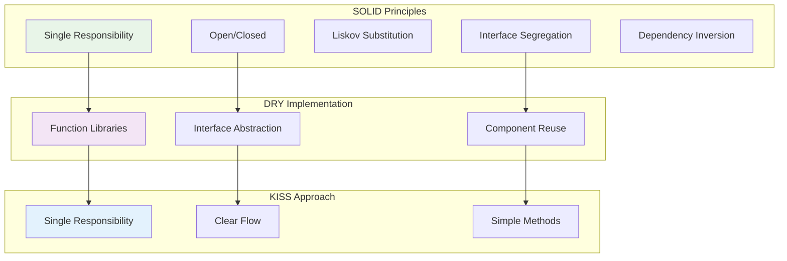

# Blueprint Design Patterns & Clean Code

## 🎯 **Overview**

Modern Blueprint development requires disciplined patterns and clean code principles. This guide covers industry-standard approaches for creating maintainable, scalable Blueprint systems using DRY, KISS, and SOLID principles adapted for visual scripting.

### **Clean Code Architecture Flow**



---

## 🧱 **Core Design Principles**

### **DRY (Don't Repeat Yourself)**
Eliminate duplication through smart Blueprint architecture.

#### **Function Libraries Pattern**
```
🔹 Create Blueprint Function Libraries for:
  • Math utilities (distance calculations, interpolations)
  • String formatting and validation
  • Array/Map manipulation helpers
  • Common gameplay calculations
  • UI state management functions
```

#### **Interface-Based Abstraction**
```
🔹 Blueprint Interface: IInteractable
  • Function: Interact(Actor Instigator)
  • Function: GetInteractionText() -> Text
  • Function: CanInteract(Actor Instigator) -> Bool

🔹 Implementation across multiple actors:
  • BP_Door implements IInteractable
  • BP_Chest implements IInteractable
  • BP_NPC implements IInteractable
```

#### **Component-Based Reusability**
```
🔹 Create reusable components:
  • AC_Health (health management)
  • AC_Inventory (item storage)
  • AC_Interaction (interaction handling)
  • AC_AudioManager (sound effects)
```

### **KISS (Keep It Simple, Stupid)**
Favor clarity over cleverness in Blueprint design.

#### **Single Responsibility Principle**
```
❌ Bad: One massive Blueprint handling:
  • Player movement
  • Combat system
  • Inventory management
  • UI updates
  • Audio management

✅ Good: Separate focused Blueprints:
  • BP_PlayerMovement
  • BP_CombatSystem
  • BP_InventoryComponent
  • BP_UIManager
  • BP_AudioComponent
```

#### **Clear Node Flow**
```
✅ Linear execution flow:
  Input → Validation → Core Logic → Output → Cleanup

❌ Avoid:
  • Excessive branching
  • Nested sequence chains
  • Complex multi-cast delegates
```

### **SOLID Principles for Blueprints**

#### **Single Responsibility**
Each Blueprint should have one reason to change.
```
🔹 BP_WeaponBase
  • Handles: Damage calculation, ammo management
  • Does NOT handle: Player input, UI updates, inventory

🔹 BP_PlayerController
  • Handles: Input processing, camera control
  • Does NOT handle: Health management, inventory logic
```

#### **Open/Closed Principle**
Blueprints should be open for extension, closed for modification.
```
🔹 Create BP_WeaponBase with virtual functions:
  • FireWeapon() [Virtual]
  • ReloadWeapon() [Virtual]
  • GetDamage() [Virtual]

🔹 Extend with specific weapons:
  • BP_Rifle extends BP_WeaponBase
  • BP_Pistol extends BP_WeaponBase
  • Override virtual functions as needed
```

---

## 🏗️ **Architectural Patterns**

### **MVC Pattern for Blueprints**

#### **Model Layer**
```
🔹 Data-only Blueprints:
  • BP_GameData (pure data container)
  • BP_PlayerStats (statistics tracking)
  • BP_WorldSettings (configuration data)

🔹 Characteristics:
  • No visual components
  • No input handling
  • Pure data structures and validation
```

#### **View Layer**
```
🔹 UI and Presentation:
  • BP_HUD (heads-up display)
  • BP_MainMenu (menu interface)
  • BP_InventoryWidget (inventory display)

🔹 Characteristics:
  • Handles display only
  • Receives data from controllers
  • No direct game logic
```

#### **Controller Layer**
```
🔹 Logic Coordination:
  • BP_GameController (game flow management)
  • BP_PlayerController (player input coordination)
  • BP_UIController (UI state management)

🔹 Characteristics:
  • Coordinates between Model and View
  • Handles business logic
  • Manages state transitions
```

### **Observer Pattern**
Implement loose coupling through event-driven architecture.

#### **Event Dispatcher System**
```
🔹 BP_EventManager:
  • OnPlayerHealthChanged(float NewHealth)
  • OnInventoryUpdated(TArray<FItemData> Items)
  • OnLevelComplete(int32 Score)

🔹 Subscribers bind to relevant events:
  • UI elements listen to data changes
  • Audio systems respond to game events
  • Analytics track player actions
```

#### **Gameplay Tag Events**
```
🔹 Use Gameplay Tags for loose coupling:
  • GameplayTag: "Event.Player.LevelUp"
  • GameplayTag: "Event.Combat.WeaponSwitch"
  • GameplayTag: "Event.UI.MenuOpen"

🔹 Components listen for specific tags
🔹 Easy to add/remove listeners without code changes
```

### **Factory Pattern**
Centralized object creation with consistent initialization.

#### **Actor Factory System**
```
🔹 BP_ActorFactory:
  • CreateEnemy(EnemyType Type) -> BP_EnemyBase
  • CreateWeapon(WeaponData Data) -> BP_WeaponBase
  • CreatePickup(ItemData Item) -> BP_PickupBase

🔹 Benefits:
  • Consistent initialization
  • Easy to modify creation logic
  • Supports object pooling
  • Centralized spawn logic
```

---

## 🎨 **Visual Organization Patterns**

### **Node Grouping Standards**

#### **Color Coding System**
```
🔹 Input Handling: Light Blue
🔹 Core Logic: Default (White/Gray)
🔹 Validation: Yellow
🔹 Output/Results: Green
🔹 Error Handling: Red
🔹 Debug/Temporary: Purple
```

#### **Comment Block Structure**
```
🔹 Header Comments:
  ╔══════════════════════════════════════╗
  ║              INITIALIZATION          ║
  ║  Setup all components and variables  ║
  ╚══════════════════════════════════════╝

🔹 Section Comments:
  ┌─ INPUT VALIDATION ─────────────────┐
  │ Check all inputs before processing │
  └───────────────────────────────────┘

🔹 Function Comments:
  // Calculate damage with armor reduction
```

#### **Execution Flow Layout**
```
🔹 Left-to-Right Flow:
  Input → Processing → Validation → Output

🔹 Vertical Grouping:
  • Main execution path: Center
  • Error handling: Below main flow
  • Helper functions: Above main flow
  • Debug outputs: Right side
```

### **Blueprint Organization Hierarchy**

#### **Folder Structure**
```
📁 Blueprints/
├── 📁 Core/               (Base classes, interfaces)
│   ├── BP_GameModeBase
│   ├── BPI_Interactable
│   └── BP_ActorBase
├── 📁 Player/             (Player-specific)
│   ├── BP_Player
│   ├── BP_PlayerController
│   └── BP_PlayerState
├── 📁 Gameplay/           (Game mechanics)
│   ├── 📁 Combat/
│   ├── 📁 Inventory/
│   └── 📁 Interaction/
├── 📁 UI/                 (User interface)
│   ├── 📁 HUD/
│   ├── 📁 Menus/
│   └── 📁 Widgets/
├── 📁 Environment/        (World objects)
│   ├── 📁 Interactables/
│   ├── 📁 Hazards/
│   └── 📁 Props/
└── 📁 Utilities/          (Helper functions)
    ├── BP_MathLibrary
    ├── BP_StringUtils
    └── BP_ArrayHelpers
```

#### **Naming Conventions**
```
🔹 Classes:
  • BP_ClassName (main Blueprint)
  • AC_ComponentName (Actor Component)
  • BPI_InterfaceName (Blueprint Interface)
  • E_EnumName (Enumerations)
  • S_StructName (Structures)

🔹 Variables:
  • bIsValid (boolean)
  • iPlayerCount (integer)
  • fMovementSpeed (float)
  • sPlayerName (string)
  • aInventoryItems (array)

🔹 Functions:
  • GetHealthPercentage()
  • SetPlayerState()
  • CalculateDamage()
  • OnPlayerDeath()
```

---

## 🔧 **Implementation Patterns**

### **Validation Patterns**

#### **Input Validation Chain**
```
🔹 Standard validation sequence:
  1. Null checks (IsValid nodes)
  2. Range validation (clamp values)
  3. State validation (check prerequisites)
  4. Permission validation (can perform action)
  5. Resource validation (sufficient resources)

🔹 Early return on validation failure
🔹 Clear error messages for debugging
```

#### **Defensive Programming**
```
✅ Always validate:
  • Object references before use
  • Array indices before access
  • Division by zero scenarios
  • Network authority before replication
  • Component existence before calling functions
```

### **Error Handling Patterns**

#### **Graceful Degradation**
```
🔹 Example: Weapon System
  • Primary fire fails → Switch to secondary
  • No ammo → Play empty click sound
  • Invalid target → Clear target and continue
  • Component missing → Use default behavior
```

#### **Error Recovery System**
```
🔹 BP_ErrorHandler:
  • LogError(String Message, ESeverity Level)
  • TryRecoverFromError() -> Bool
  • NotifyPlayerOfError(String UserMessage)
  • ReportToAnalytics(FErrorData Data)
```

### **Performance Patterns**

#### **Object Pooling**
```
🔹 BP_PoolManager:
  • GetFromPool(UClass ObjectClass) -> AActor
  • ReturnToPool(AActor Object)
  • PrewarmPool(UClass ObjectClass, int32 Count)

🔹 Use for:
  • Projectiles
  • Particles
  • Audio sources
  • UI elements
```

#### **Lazy Loading**
```
🔹 Delay expensive operations:
  • Load assets only when needed
  • Initialize components on first use
  • Cache calculations after first computation
  • Stream in content based on proximity
```

### **State Management Patterns**

#### **State Machine Implementation**
```
🔹 Enum-Based State Machine:
  • E_PlayerState: Idle, Moving, Attacking, Defending
  • Switch statement for state transitions
  • Validation before state changes
  • Entry/Exit actions for each state

🔹 State Component Pattern:
  • AC_StateMachine component
  • Data-driven state definitions
  • Event-driven transitions
```

#### **Command Pattern**
```
🔹 BP_Command (Base Class):
  • Execute() [Virtual]
  • Undo() [Virtual]
  • CanExecute() -> Bool [Virtual]

🔹 Specific Commands:
  • BP_MoveCommand
  • BP_AttackCommand
  • BP_InventoryCommand

🔹 Command Queue:
  • Queue commands for delayed execution
  • Support for undo/redo systems
  • Network-safe command replication
```

---

## 🚀 **Advanced Patterns**

### **Dependency Injection**
Reduce tight coupling through injection patterns.

#### **Service Locator Pattern**
```
🔹 BP_ServiceLocator:
  • RegisterService(UClass ServiceClass, UObject Service)
  • GetService(UClass ServiceClass) -> UObject
  • UnregisterService(UClass ServiceClass)

🔹 Example Services:
  • Audio Service
  • Save System Service
  • Analytics Service
  • Input Service
```

#### **Interface Injection**
```
🔹 Inject dependencies through interfaces:
  • IHealthSystem for health management
  • IInventorySystem for item handling
  • IAudioSystem for sound management

🔹 Components request interfaces, not concrete classes
🔹 Easy to swap implementations for testing
```

### **Data-Driven Design**
Use data assets for flexible, designer-friendly systems.

#### **Configuration Pattern**
```
🔹 Data Assets for Configuration:
  • DA_WeaponConfig (damage, range, fire rate)
  • DA_PlayerConfig (movement speed, health)
  • DA_LevelConfig (spawn points, objectives)

🔹 Runtime Modification:
  • Designers can tweak without Blueprint changes
  • A/B testing support
  • Mod support through data asset replacement
```

#### **Table-Driven Logic**
```
🔹 Data Tables for Complex Logic:
  • DT_DamageCalculation (armor vs weapon type)
  • DT_LootTables (item drop probabilities)
  • DT_DialogueOptions (conversation trees)

🔹 Benefits:
  • Non-programmers can modify behavior
  • Easy to balance and iterate
  • Supports localization
```

### **Network Patterns**
Clean patterns for multiplayer Blueprint development.

#### **Authority Validation**
```
🔹 Network Authority Checks:
  • Server: Authoritative logic
  • Client: Prediction and visual feedback
  • Multicast: Synchronized visual effects

🔹 Pattern:
  if (HasAuthority()) {
    // Execute authoritative logic
    MulticastVisualEffect();
  }
```

#### **Replication Patterns**
```
🔹 Replicated Variables:
  • Mark important state as replicated
  • Use RepNotify for client responses
  • Minimize replicated data size

🔹 RPC Patterns:
  • Client-to-Server: Input and requests
  • Server-to-Client: Confirmations and updates
  • Multicast: Shared visual/audio effects
```

---

## 📋 **Best Practices Checklist**

### **Before Creating New Blueprint**
- [ ] Check if existing Blueprint can be extended
- [ ] Identify single responsibility for the Blueprint
- [ ] Plan interface requirements
- [ ] Consider component-based approach

### **During Development**
- [ ] Use descriptive names for all nodes
- [ ] Group related nodes with comments
- [ ] Validate all inputs before processing
- [ ] Implement error handling paths
- [ ] Add debug output nodes for testing

### **Code Review Checklist**
- [ ] DRY: No repeated logic across Blueprints
- [ ] KISS: Complex flows are broken into functions
- [ ] Clear execution flow (left-to-right)
- [ ] Proper error handling
- [ ] Performance considerations addressed
- [ ] Network authority properly handled
- [ ] Memory management considered

### **Refactoring Indicators**
- [ ] Blueprint has more than 50 nodes
- [ ] Similar logic exists in multiple places
- [ ] Complex nested branches (>3 levels)
- [ ] Difficult to understand execution flow
- [ ] Performance issues during profiling

---

## 🎯 **Common Anti-Patterns to Avoid**

### **The God Blueprint**
❌ **Problem**: One Blueprint handling everything
✅ **Solution**: Break into focused, single-purpose Blueprints

### **Copy-Paste Programming**
❌ **Problem**: Duplicating similar logic across Blueprints
✅ **Solution**: Create shared functions or components

### **Magic Numbers**
❌ **Problem**: Hard-coded values throughout Blueprint
✅ **Solution**: Use variables or data assets for configuration

### **Deep Nesting**
❌ **Problem**: Excessive branching and nested sequences
✅ **Solution**: Break into smaller functions, use early returns

### **Tight Coupling**
❌ **Problem**: Blueprints directly referencing specific other Blueprints
✅ **Solution**: Use interfaces, events, or dependency injection

---

This comprehensive pattern guide ensures your Blueprint code follows industry standards for maintainability, scalability, and performance. Apply these patterns consistently across your project for professional-quality results.
