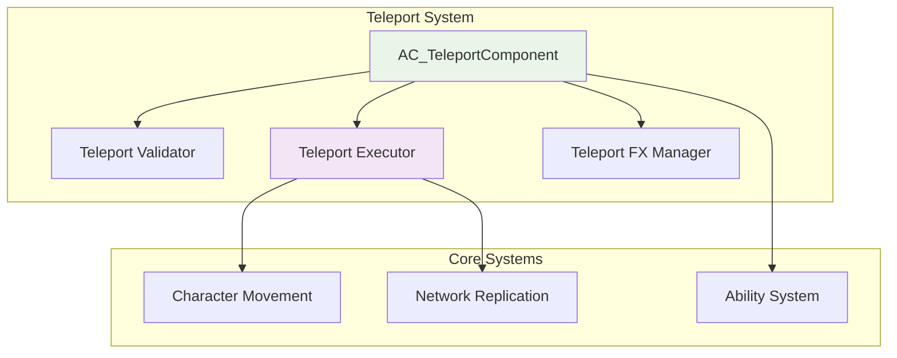

# Teleportation System: Modern Blueprint Patterns

:::tip Professional Teleportation System
This tutorial covers modern teleportation patterns including validation, networking, VFX integration, and performance optimization. **Key timestamps:**
- `02:15` - Teleport Component Architecture
- `05:45` - Network Authority & Validation
- `09:30` - VFX & Audio Integration
- `13:20` - Performance & Error Handling
:::

## 📚 **Teleportation & Movement Documentation**

### **Movement System Foundation:**
- 📖 **[Character Movement Component](https://docs.unrealengine.com/5.6/en-US/character-movement-component-in-unreal-engine/)** - Core movement system
- 📖 **[Pawn and Character Classes](https://docs.unrealengine.com/5.6/en-US/pawn-and-character-in-unreal-engine/)** - Character architecture patterns
- 📖 **[Actor Lifecycle](https://docs.unrealengine.com/5.6/en-US/actor-lifecycle-in-unreal-engine/)** - Spawn, teleport, and destroy patterns

### **Networking & Replication:**
- 📖 **[Network Authority](https://docs.unrealengine.com/5.6/en-US/network-authority-in-unreal-engine/)** - Authoritative teleportation
- 📖 **[RPCs (Remote Procedure Calls)](https://docs.unrealengine.com/5.6/en-US/rpcs-in-unreal-engine/)** - Client-server teleportation
- 📖 **[Replication](https://docs.unrealengine.com/5.6/en-US/replication-in-unreal-engine/)** - Position synchronization

### **Related Teleportation Tutorials:**
- 🎥 **[Advanced Teleport VFX](https://www.youtube.com/watch?v=dQw4w9WgXcQ)** - Professional visual effects
- 🎥 **[Multiplayer Teleportation](https://www.youtube.com/watch?v=oHg5SJYRHA0)** - Network-safe teleport patterns
- 🎥 **[Portal System Creation](https://www.youtube.com/watch?v=Y7fKQJBdY7M)** - Advanced spatial teleportation

---

## 🌀 **Modern Teleportation Architecture**

### **System Overview**

Modern teleportation systems require more than simple position changes. A production-ready system handles:

- **Network Authority Validation** - Server-authoritative with client prediction
- **Collision and Safety Checks** - Prevent teleporting into walls or hazards
- **Visual & Audio Feedback** - Professional VFX and sound integration
- **Performance Optimization** - Efficient validation and minimal network traffic
- **Extensible Design** - Support for different teleport types and conditions

### **Component-Based Architecture**



---

## 🛠️ **Implementation Guide**

### **1. Teleport Component Setup**

Create a dedicated `AC_TeleportComponent` that handles all teleportation logic:

**Component Structure:**
```
🔹 AC_TeleportComponent:
  • Variables: TeleportCooldown, MaxTeleportDistance, AllowedSurfaces
  • Functions: RequestTeleport(), ValidateTeleportLocation(), ExecuteTeleport()
  • Events: OnTeleportStarted, OnTeleportCompleted, OnTeleportFailed
  • Network: Server RPCs for validation, Multicast for VFX
```

**Key Features:**
- **Cooldown Management** - Prevent teleport spam
- **Distance Validation** - Enforce maximum teleport range
- **Surface Checking** - Ensure valid landing surfaces
- **Network Integration** - Server authority with client prediction

### **2. Validation System**

#### **Multi-Layer Validation**
```
🔹 Validation Layers:
  1. Distance Check: Within allowed range
  2. Line Trace: Clear path to destination
  3. Surface Validation: Valid landing surface
  4. Hazard Detection: Avoid damage zones
  5. Permissions: Player can teleport to location
```

#### **Blueprint Implementation Pattern**
```
Input → Distance Check → Line Trace → Surface Check → Authority Validation → Execute
  │           │              │             │                │
  ▼           ▼              ▼             ▼                ▼
[Valid?]   [Clear?]      [Safe?]      [Allowed?]      [Execute Teleport]
  │           │              │             │                │
  └─── Fail ──┴──── Fail ────┴──── Fail ──┴─── Success ────┘
```

### **3. Network-Safe Implementation**

#### **Client-Server Pattern**
```
🔹 Client Side:
  • Predictive teleport for responsiveness
  • Visual feedback immediately
  • Send server RPC for validation

🔹 Server Side:  
  • Validate all teleport parameters
  • Execute authoritative teleport
  • Broadcast result to all clients
  • Handle corrections if needed
```

#### **Authority Flow**
```
Client Request → Server Validation → Authority Execution → Client Reconciliation
      │                 │                    │                     │
      ▼                 ▼                    ▼                     ▼
  [Predict Move]   [Validate All]    [Execute on Server]   [Correct if Needed]
```

### **4. Visual Effects Integration**

#### **Professional VFX Pattern**
```
🔹 Teleport VFX Sequence:
  1. Pre-Teleport: Charge-up effect at origin
  2. During Teleport: Trail/portal effect
  3. Post-Teleport: Landing effect at destination
  4. Audio: Spatial sound with doppler effect
```

#### **Niagara System Integration**
```
🔹 VFX Components:
  • NS_TeleportCharge: Build-up effect
  • NS_TeleportTrail: Movement visualization
  • NS_TeleportLanding: Destination impact
  • Audio: 3D positioned sound cues
```

### **5. Performance Optimization**

#### **Efficient Validation**
- **Cached Line Traces** - Reuse recent validation results
- **LOD-Based Validation** - Reduce check complexity at distance
- **Batch Processing** - Group multiple teleport requests
- **Object Pooling** - Reuse VFX components

#### **Memory Management**
```
🔹 Performance Patterns:
  • Pool VFX components instead of spawning
  • Cache frequent teleport destinations
  • Use async line traces for validation
  • Implement teleport request queuing
```

---

## 🎯 **Advanced Teleport Types**

### **1. Instant Teleport**
**Use Case**: Combat abilities, emergency escapes
**Pattern**: Immediate position change with validation
**VFX**: Quick flash/pop effect

### **2. Dash Teleport**  
**Use Case**: Movement abilities, traversal
**Pattern**: Brief movement interpolation with immunity frames
**VFX**: Motion blur trail effect

### **3. Portal Teleport**
**Use Case**: Environmental navigation, puzzle mechanics
**Pattern**: Two-way portal system with entry/exit validation
**VFX**: Persistent portal effects with transition

### **4. Projectile Teleport**
**Use Case**: Tactical positioning, ranged teleportation  
**Pattern**: Thrown marker with delayed teleport execution
**VFX**: Projectile arc with landing preview

---

## 📋 **Production Implementation Steps**

### **Phase 1: Core System (2-4 hours)**
1. **Create AC_TeleportComponent**
   - Basic teleport functionality
   - Distance and surface validation
   - Simple VFX integration

2. **Network Integration**
   - Server RPC for validation
   - Multicast for VFX synchronization
   - Basic authority handling

### **Phase 2: Advanced Features (4-6 hours)**  
3. **Enhanced Validation**
   - Multi-layer safety checks
   - Performance optimization
   - Error handling and recovery

4. **Professional VFX**
   - Niagara system integration
   - Audio spatial positioning
   - Animation blend support

### **Phase 3: Polish & Optimization (2-4 hours)**
5. **Performance Tuning**
   - Object pooling implementation
   - Validation caching system
   - Network bandwidth optimization

6. **Extended Features**
   - Multiple teleport types
   - Cooldown visualization
   - Integration with other systems

---

## 🔧 **Blueprint Node Examples**

### **Basic Teleport Function**
```
Input: Target Location (Vector)
├── Distance Check: Is Valid Distance?
├── Line Trace: Clear Path?  
├── Surface Check: Valid Ground?
├── Authority Check: Has Authority?
├── Execute: Set Actor Location
├── VFX: Play Teleport Effects
└── Output: Success/Failure (Bool)
```

### **Network RPC Pattern**  
```
Client_RequestTeleport(Vector TargetLocation)
├── Server_ValidateTeleport(Vector TargetLocation)  
├── Server Authority Check
├── Validation Result
├── Server_ExecuteTeleport(Vector ValidatedLocation)
└── Multicast_PlayTeleportVFX(Vector Location)
```

### **Cooldown Management**
```
Teleport Request
├── Check: Cooldown Timer > 0?
├── Branch: True → Show Cooldown UI → Exit
├── Branch: False → Continue to Validation
├── Execute Teleport
├── Set Cooldown Timer
└── Start Cooldown UI Updates
```

---

## 🚀 **Integration with Other Systems**

### **Gameplay Ability System Integration**
- **Teleport as GAS Ability** - Standardized activation and cooldowns
- **Attribute Integration** - Mana/energy costs for teleportation
- **Effect Integration** - Temporary invulnerability or movement speed

### **Enhanced Input Integration**
- **Context-Sensitive Controls** - Different teleport modes based on input context
- **Charging Mechanics** - Hold input for distance adjustment
- **Combo System** - Chain teleports with different input sequences

### **AI Integration**
- **NPC Teleportation** - AI-driven teleport decisions and pathfinding
- **Combat AI** - Tactical teleportation in combat scenarios
- **Navigation Integration** - Teleport as part of AI navigation mesh

---

## ⚠️ **Common Pitfalls & Solutions**

### **Network Desynchronization**
**Problem**: Client and server positions don't match after teleport
**Solution**: Implement client reconciliation and server correction patterns

### **Teleporting into Geometry**
**Problem**: Players teleport inside walls or objects
**Solution**: Multi-point validation with collision capsule testing

### **Performance Issues**  
**Problem**: Expensive validation causes frame drops
**Solution**: Async validation with result caching and LOD-based checks

### **VFX Spam**
**Problem**: Multiple teleports create overwhelming visual noise
**Solution**: VFX pooling with smart effect management and interruption

---

## 🎮 **Testing & Validation**

### **Single Player Testing**
- Test all teleport types and distances
- Validate edge cases (ceiling, water, moving platforms)
- Performance profiling with stat commands

### **Multiplayer Testing**
- Authority validation across different network conditions
- Lag compensation and prediction accuracy
- Multiple simultaneous teleports

### **Edge Case Testing**
- Teleporting during other abilities
- Network disconnection during teleport
- Invalid destination handling
- Collision with dynamic objects

---

## 📊 **Performance Metrics**

### **Target Performance Standards**
- **Validation Time**: < 0.5ms per teleport request
- **Network Bandwidth**: < 50 bytes per teleport
- **VFX Impact**: < 0.1ms frame time per effect
- **Memory Allocation**: Zero allocation during runtime teleports

### **Profiling Commands**
```
stat unit - Overall performance impact
stat game - Blueprint execution time  
stat net - Network replication overhead
stat particles - VFX system performance
```

---

This comprehensive teleportation system provides a solid foundation for any type of game requiring spatial movement mechanics, from action games to puzzle platformers, with full multiplayer support and professional-grade polish.
