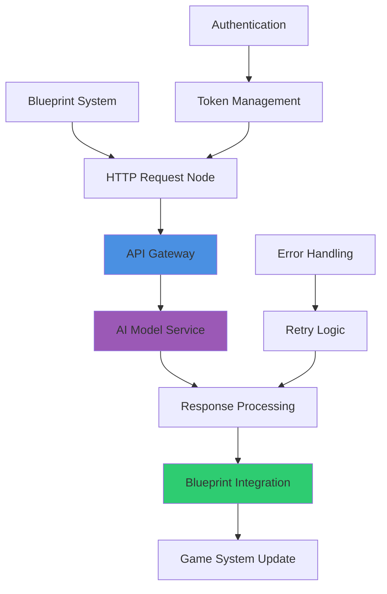
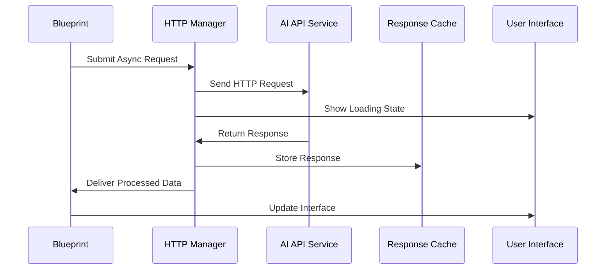
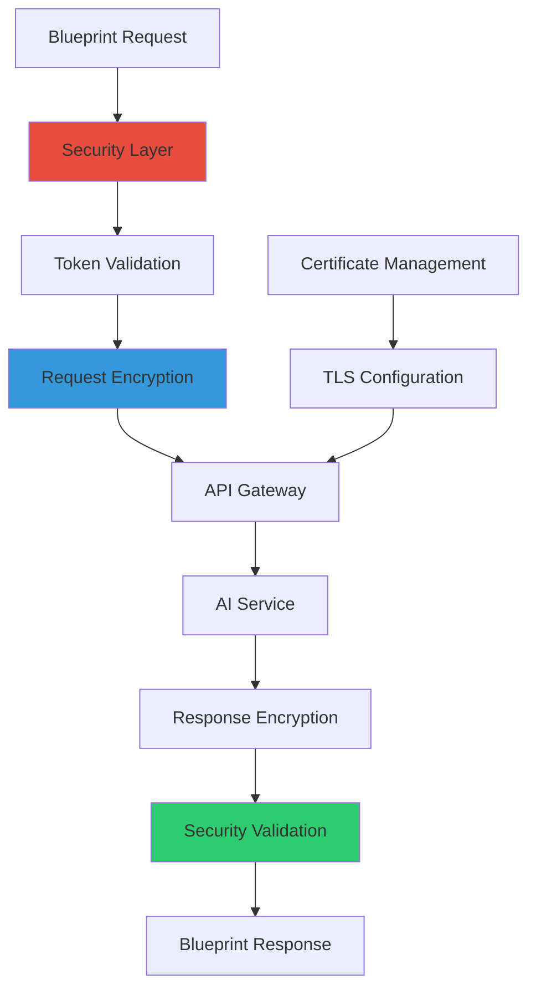
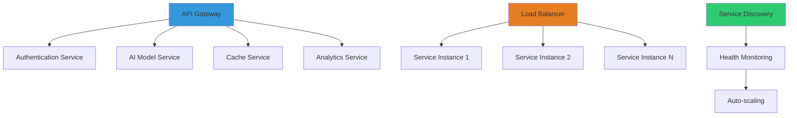
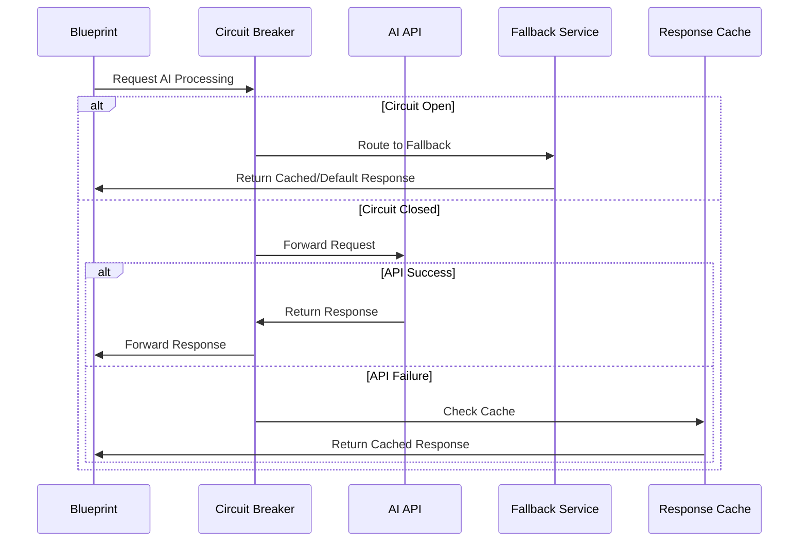

# API Integration Patterns

## Overview
Comprehensive patterns for integrating AI APIs with UE5.6 Blueprint development workflows. This guide covers REST API integration, real-time AI assistance, secure authentication, and scalable architecture patterns that enable seamless AI-powered development tools within Blueprint systems.

## REST API Integration Fundamentals

### Blueprint HTTP Integration


### Professional API Architecture

#### HTTP Request System Design
```
Create robust HTTP API integration for [AI_SERVICE_TYPE]:

Request Configuration:
- Base URL configuration: [API_ENDPOINT] with environment-based switching
- HTTP method selection: GET, POST, PUT, DELETE with appropriate usage
- Header management: Content-Type, Authorization, Custom headers
- Query parameter handling: URL encoding and parameter serialization
- Request body formatting: JSON, Form-data, or custom format support

Authentication Strategy:
- API key management with [SECURITY_LEVEL] security implementation
- OAuth 2.0 flow with [TOKEN_LIFECYCLE] token refresh management
- JWT token handling with [EXPIRATION_STRATEGY] expiration handling
- Rate limiting compliance with [RATE_LIMIT] requests per time period
- Error authentication with [RETRY_COUNT] retry attempts and backoff strategy

Response Processing:
- JSON parsing with [PARSING_PERFORMANCE] efficient deserialization
- Error code handling with [ERROR_CODE_COUNT] comprehensive error coverage
- Data validation ensuring [VALIDATION_COMPLETENESS] response data integrity
- Type conversion for Blueprint-compatible data types
- Caching strategy with [CACHE_DURATION] intelligent response caching
```

#### Asynchronous Request Handling


**Async Implementation Features:**
- **Non-blocking requests**: Prevent game thread blocking during API calls
- **Progress callbacks**: Real-time progress updates for long-running operations
- **Cancellation support**: User-initiated request cancellation capabilities
- **Queue management**: Prioritized request queue with intelligent scheduling
- **Bandwidth management**: Network usage optimization and throttling

### Advanced Request Patterns

#### Batch Processing Integration
```
Implement efficient batch API processing:

Batch Configuration:
- Request batching with [BATCH_SIZE] optimal batch size
- Timeout management with [TIMEOUT_DURATION] request timeout limits
- Parallel processing with [THREAD_COUNT] concurrent request threads
- Memory management preventing [MEMORY_LIMIT] memory overflow
- Progress tracking with [PROGRESS_GRANULARITY] update granularity

Processing Strategy:
- Intelligent batching grouping similar requests for efficiency
- Priority queuing with [PRIORITY_LEVELS] request priority levels
- Load balancing across [ENDPOINT_COUNT] available API endpoints
- Fallback handling with [FALLBACK_STRATEGY] graceful degradation
- Result aggregation with [AGGREGATION_RULES] intelligent result combination

Performance Optimization:
- Connection pooling with [POOL_SIZE] reusable connections
- Compression support with [COMPRESSION_RATIO] request/response compression
- Caching layer with [CACHE_HIT_RATE]% intelligent cache utilization
- Retry logic with [EXPONENTIAL_BACKOFF] exponential backoff strategy
- Monitoring integration with [MONITORING_METRICS] performance tracking
```

## Real-Time AI Integration

### WebSocket Implementation


#### Streaming AI Integration
```
Create real-time streaming AI system:

WebSocket Configuration:
- Connection management with [CONNECTION_POOL] persistent connections
- Heartbeat implementation with [HEARTBEAT_INTERVAL] second intervals
- Automatic reconnection with [RECONNECT_STRATEGY] intelligent reconnection
- Message queuing with [QUEUE_SIZE] message buffer capacity
- Protocol handling supporting [PROTOCOL_COUNT] WebSocket subprotocols

Real-time Features:
- Streaming text generation with [STREAMING_SPEED] character per second delivery
- Progressive image generation with [GENERATION_STEPS] intermediate result delivery
- Live code completion with [COMPLETION_LATENCY] millisecond response time
- Interactive debugging with [DEBUG_UPDATE_RATE] real-time state updates
- Collaborative editing with [COLLABORATION_FEATURES] multi-user support

Performance Management:
- Bandwidth optimization with [COMPRESSION_ENABLED] message compression
- Message prioritization with [PRIORITY_QUEUE] high/medium/low priority handling
- Buffer management preventing [BUFFER_OVERFLOW] message loss
- Connection health monitoring with [HEALTH_CHECK_FREQUENCY] status checks
- Graceful degradation with [FALLBACK_MODE] offline capability maintenance
```

### Event-Driven Architecture
```
Design event-driven AI integration system:

Event System Design:
- Event dispatcher with [EVENT_TYPE_COUNT] AI-related event types
- Subscription management with [SUBSCRIBER_LIMIT] concurrent subscribers
- Event filtering with [FILTER_CRITERIA] intelligent event routing
- Priority handling with [EVENT_PRIORITY_LEVELS] execution priority levels
- Event persistence with [PERSISTENCE_STRATEGY] reliable event delivery

Integration Patterns:
- Publisher-subscriber pattern for [PUBLISHER_COUNT] AI service integration
- Observer pattern for [OBSERVER_COUNT] system state change notifications
- Command pattern for [COMMAND_TYPE_COUNT] AI operation encapsulation
- Mediator pattern for [COMPONENT_COUNT] loose coupling between components
- Strategy pattern for [STRATEGY_COUNT] different AI service provider support

Scalability Features:
- Event partitioning with [PARTITION_COUNT] parallel processing partitions
- Load balancing with [BALANCER_ALGORITHM] intelligent load distribution
- Circuit breaker with [FAILURE_THRESHOLD] failure tolerance limits
- Bulkhead isolation preventing [ISOLATION_BOUNDARIES] cascade failures
- Monitoring integration with [TELEMETRY_POINTS] comprehensive observability
```

## Security & Authentication

### Secure API Communication


#### Authentication Implementation
```
Implement comprehensive security for AI API integration:

Authentication Methods:
- API key authentication with [KEY_ROTATION_FREQUENCY] regular key rotation
- OAuth 2.0 implementation with [OAUTH_FLOW_TYPE] appropriate flow selection
- JWT token management with [TOKEN_SECURITY] secure token handling
- Certificate-based authentication for [CERTIFICATE_SECURITY] high-security scenarios
- Multi-factor authentication with [MFA_METHODS] additional security factors

Security Measures:
- Request signing with [SIGNING_ALGORITHM] cryptographic signing
- Timestamp validation preventing [REPLAY_ATTACK_WINDOW] replay attacks
- Rate limiting with [SECURITY_RATE_LIMIT] abuse prevention limits
- IP whitelisting with [ALLOWED_IP_COUNT] authorized IP addresses
- Request validation with [VALIDATION_RULES] comprehensive input sanitization

Encryption Standards:
- TLS 1.3 encryption with [CIPHER_SUITE] strong cipher suite selection
- End-to-end encryption with [E2E_KEY_SIZE] bit encryption keys
- Data masking with [MASKING_RULES] sensitive data protection
- Secure storage with [STORAGE_ENCRYPTION] encrypted credential storage
- Key management with [KEY_MANAGEMENT_SYSTEM] enterprise key management
```

### Privacy & Compliance
```
Ensure privacy compliance in AI API integration:

Data Protection:
- Data minimization with [DATA_SCOPE_LIMIT] minimal data collection
- Anonymization techniques with [ANONYMIZATION_LEVEL] identity protection
- Consent management with [CONSENT_GRANULARITY] granular user consent
- Data retention policies with [RETENTION_PERIOD] automatic data deletion
- Cross-border transfer compliance with [TRANSFER_MECHANISMS] legal transfer mechanisms

Compliance Framework:
- GDPR compliance with [GDPR_CONTROLS] comprehensive privacy controls
- CCPA compliance with [CCPA_RIGHTS] consumer privacy rights implementation
- Industry standards adherence with [STANDARD_COUNT] relevant security standards
- Audit trail maintenance with [AUDIT_COMPLETENESS] comprehensive activity logging
- Data breach response with [BREACH_RESPONSE_TIME] rapid incident response

Privacy by Design:
- Default privacy settings with [PRIVACY_DEFAULT] privacy-first configuration
- Transparency reporting with [TRANSPARENCY_METRICS] clear data usage reporting
- User control mechanisms with [CONTROL_OPTIONS] comprehensive user control options
- Privacy impact assessment with [PIA_FREQUENCY] regular privacy evaluation
- Third-party risk management with [VENDOR_ASSESSMENT] thorough vendor evaluation
```

## Scalable Integration Patterns

### Microservices Architecture


#### Service-Oriented Design
```
Design scalable microservices for AI integration:

Service Architecture:
- API Gateway with [GATEWAY_FEATURES] comprehensive gateway functionality
- Service mesh with [MESH_FEATURES] inter-service communication management
- Container orchestration with [ORCHESTRATION_PLATFORM] scalable deployment
- Service discovery with [DISCOVERY_MECHANISM] automatic service registration
- Load balancing with [LB_ALGORITHM] intelligent traffic distribution

Scaling Strategy:
- Horizontal scaling with [SCALING_TRIGGERS] automatic scaling triggers
- Vertical scaling with [RESOURCE_OPTIMIZATION] resource optimization
- Auto-scaling policies with [SCALING_METRICS] performance-based scaling
- Circuit breaker implementation with [BREAKER_THRESHOLDS] fault tolerance
- Health checks with [HEALTH_CHECK_ENDPOINTS] comprehensive service monitoring

Integration Patterns:
- API versioning with [VERSION_STRATEGY] backward compatibility maintenance
- Service contracts with [CONTRACT_TESTING] interface validation
- Event sourcing with [EVENT_STORE] reliable event processing
- CQRS implementation with [CQRS_BENEFITS] command/query separation
- Saga pattern with [SAGA_ORCHESTRATION] distributed transaction management
```

### Caching & Performance Optimization
```
Implement intelligent caching for AI API responses:

Caching Strategy:
- Multi-level caching with [CACHE_LAYERS] layered cache architecture
- Cache invalidation with [INVALIDATION_STRATEGY] intelligent cache management
- Distributed caching with [CACHE_DISTRIBUTION] cross-instance cache sharing
- Cache warming with [WARMING_STRATEGY] proactive cache population
- Cache monitoring with [CACHE_METRICS] performance optimization metrics

Performance Features:
- Response compression with [COMPRESSION_ALGORITHM] bandwidth optimization
- Content delivery network with [CDN_INTEGRATION] global response caching
- Database connection pooling with [POOL_OPTIMIZATION] connection efficiency
- Query optimization with [QUERY_PERFORMANCE] database performance tuning
- Resource prefetching with [PREFETCH_STRATEGY] predictive resource loading

Monitoring & Analytics:
- Performance metrics with [METRIC_COLLECTION] comprehensive performance tracking
- Error tracking with [ERROR_ANALYSIS] intelligent error categorization
- Usage analytics with [ANALYTICS_DASHBOARD] business intelligence integration
- Capacity planning with [CAPACITY_FORECASTING] predictive scaling analysis
- Cost optimization with [COST_TRACKING] resource usage optimization
```

## Error Handling & Resilience

### Fault Tolerance Patterns


#### Resilience Implementation
```
Build resilient AI API integration system:

Circuit Breaker Pattern:
- Failure threshold with [FAILURE_THRESHOLD] consecutive failure limit
- Timeout configuration with [TIMEOUT_SETTINGS] request timeout management
- Recovery testing with [RECOVERY_INTERVAL] service recovery verification
- Half-open state with [HALF_OPEN_REQUESTS] limited request testing
- Metrics collection with [CB_METRICS] circuit breaker performance tracking

Retry Mechanisms:
- Exponential backoff with [BACKOFF_MULTIPLIER] intelligent retry spacing
- Jitter implementation with [JITTER_RANGE] retry randomization
- Max retry limits with [MAX_RETRIES] retry attempt boundaries
- Retry conditions with [RETRY_CONDITIONS] intelligent retry decision logic
- Dead letter queue with [DLQ_PROCESSING] failed request handling

Fallback Strategies:
- Cached response fallback with [CACHE_STALENESS] acceptable cache age
- Default response with [DEFAULT_QUALITY] quality-appropriate defaults
- Simplified processing with [SIMPLIFIED_MODE] reduced functionality mode
- User notification with [NOTIFICATION_STRATEGY] transparent error communication
- Graceful degradation with [DEGRADATION_LEVELS] progressive feature reduction
```

This comprehensive API integration pattern guide ensures robust, secure, and scalable integration of AI services with UE5.6 Blueprint development workflows while maintaining professional quality standards and optimal performance characteristics.
