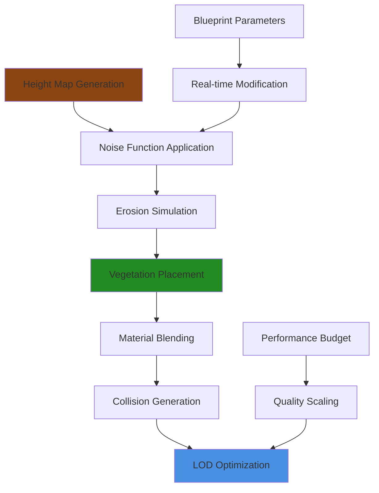
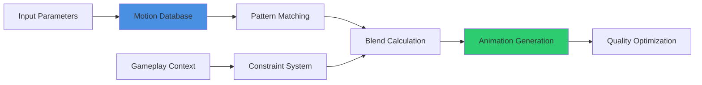
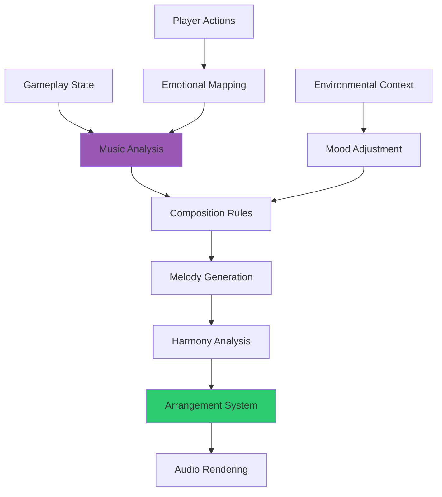
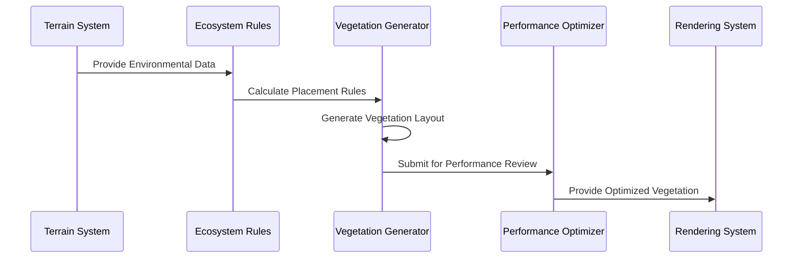

# Asset Generation Prompts

## Overview
AI prompts for procedural asset generation and content creation within UE5.6 Blueprint workflows. These prompts focus on generating game assets, procedural content, and artistic elements that integrate seamlessly with Blueprint systems while maintaining professional quality standards.

## Procedural Mesh Generation

### Dynamic Geometry Creation
```
Generate procedural mesh system for [MESH_TYPE] with Blueprint control:

Mesh Requirements:
- Vertex count range: [MIN_VERTICES] to [MAX_VERTICES]
- UV mapping with [TEXTURE_CHANNELS] texture coordinate sets
- Vertex colors for [VERTEX_COLOR_USAGE]
- Normal generation with [SMOOTHING_METHOD] smoothing
- Collision mesh generation for physics interaction

Blueprint Integration:
- Real-time mesh modification through Blueprint parameters
- Component-based mesh generation with modular pieces
- Performance-optimized mesh updates using chunked generation
- Integration with UE5.6 Nanite for automatic LOD generation
- Material slot assignment with parameter-driven material instances

Technical Specifications:
- Generation time: <[GENERATION_TIME]ms for [COMPLEXITY_LEVEL] complexity
- Memory efficiency: <[MEMORY_OVERHEAD]MB overhead per mesh
- Update performance: [UPDATE_RATE] modifications per second
- Platform compatibility: [TARGET_PLATFORMS] with native optimization
```

### Terrain & Landscape Generation


```
Create comprehensive terrain generation system:

Terrain Features:
- Multi-octave noise generation with [OCTAVE_COUNT] octaves
- Hydraulic erosion simulation for realistic terrain features
- Biome-based material blending with [BIOME_COUNT] distinct biomes
- Procedural vegetation placement using [VEGETATION_RULES]
- Cave system generation with [CAVE_COMPLEXITY] complexity levels

Blueprint Control System:
- Runtime terrain modification for gameplay interaction
- Streaming integration with World Partition for large worlds
- Performance-scaled generation based on player proximity
- Save/load system for persistent terrain modifications
- Integration with existing level design workflows

Optimization Features:
- Chunked terrain generation for streaming performance
- LOD system integration with automatic quality scaling
- Memory-efficient storage using compressed heightmaps
- GPU-accelerated generation where supported
- Platform-specific optimization profiles
```

## Texture & Material Generation

### Procedural Texture Creation
```
Generate dynamic texture system for [TEXTURE_PURPOSE]:

Texture Specifications:
- Resolution range: [MIN_RESOLUTION] to [MAX_RESOLUTION]
- Format optimization: [TEXTURE_FORMATS] for different platforms
- Mipmap generation with custom filtering
- Compression settings for [COMPRESSION_TARGETS]
- Color space management for [COLOR_SPACES]

Generation Features:
- Noise-based pattern generation with [PATTERN_TYPES]
- Layered texture composition with blend modes
- Real-time parameter adjustment via Blueprint interfaces
- UV-independent procedural generation
- Integration with existing texture streaming systems

Blueprint Integration:
- Component-based texture management with automatic updates
- Performance-budgeted generation to maintain frame rate
- Texture atlas generation for optimized draw calls
- Material parameter driving for dynamic appearance changes
- Integration with UE5.6's material layer system for flexibility
```

### Smart Material Systems
```mermaid
sequenceDiagram
    participant BP as Blueprint System
    participant MG as Material Generator
    participant TE as Texture Engine
    participant OPT as Optimizer
    participant GPU as GPU Renderer
    
    BP->>MG: Request Material Variation
    MG->>TE: Generate Required Textures
    TE->>MG: Return Optimized Textures
    MG->>OPT: Optimize Material Graph
    OPT->>GPU: Submit Optimized Shader
    GPU->>BP: Return Rendered Result
```

```
Create intelligent material generation system:

Material Features:
- Procedural material graph creation based on [MATERIAL_TYPE]
- Automatic parameter exposure for Blueprint control
- Performance optimization with instruction count monitoring
- Multi-platform shader compilation with fallback options
- Integration with UE5.6 Lumen for accurate lighting response

Advanced Capabilities:
- Material variation generation from base templates
- Automatic texture coordinate optimization
- Blend mask generation for complex material layering
- Weather and environmental state integration
- Real-time material property animation support

Quality Assurance:
- Shader complexity validation against performance budgets
- Platform-specific optimization with quality scaling
- Memory usage monitoring for texture allocations
- Integration with existing art pipeline and style guides
- Automated testing for visual consistency
```

## Animation Asset Generation

### Procedural Animation Systems
```
Generate animation system for [CHARACTER_TYPE] with Blueprint control:

Animation Requirements:
- Bone count support: [MIN_BONES] to [MAX_BONES]
- Animation compression with [COMPRESSION_RATIO] efficiency
- Blend space generation with [BLEND_DIMENSIONS] parameters
- State machine integration with [STATE_COUNT] states
- Root motion support for gameplay movement integration

Procedural Features:
- Physics-based animation generation for realistic movement
- Inverse kinematics integration for environmental adaptation
- Facial animation generation with [EXPRESSION_COUNT] expressions
- Cloth and hair simulation integration with performance scaling
- Animation retargeting for multiple character rigs

Blueprint Integration:
- Real-time animation parameter control from gameplay systems
- Event-driven animation triggers with smooth blending
- Performance-optimized animation updates with LOD support
- Integration with Enhanced Input for responsive character control
- Animation Blueprint optimization for consistent frame rates
```

### Motion Synthesis


```
Implement motion synthesis system for dynamic character animation:

Motion Database:
- Capture data processing with [DATA_POINTS] motion samples
- Feature extraction for motion pattern recognition
- Compression optimization reducing storage by [COMPRESSION_PERCENTAGE]%
- Search acceleration using spatial data structures
- Runtime motion query with <[QUERY_TIME]ms response time

Synthesis Engine:
- Smooth motion blending with physics-based interpolation
- Constraint satisfaction for environmental adaptation
- Style preservation during motion transition
- Real-time generation maintaining [TARGET_FPS] performance
- Integration with existing animation Blueprint workflows

Quality Control:
- Motion artifact detection and correction
- Energy preservation for realistic character movement
- Foot placement optimization for ground contact accuracy
- Performance profiling with frame time budgeting
- Visual debugging tools for motion analysis
```

## Audio Asset Generation

### Procedural Audio Systems
```
Create dynamic audio generation system for [AUDIO_TYPE]:

Audio Specifications:
- Sample rate: [SAMPLE_RATE] Hz with [BIT_DEPTH] bit depth
- Channel configuration: [CHANNEL_CONFIG] for spatial audio
- Compression: [COMPRESSION_FORMAT] with [QUALITY_SETTING] quality
- Latency target: <[LATENCY_MS]ms for real-time generation
- Platform optimization for [TARGET_PLATFORMS]

Generation Features:
- Synthesized sound effects based on [SYNTHESIS_METHOD]
- Layered audio composition with [LAYER_COUNT] maximum layers
- Real-time parameter modulation via Blueprint interfaces
- Environmental audio adaptation using [REVERB_SYSTEM]
- Music generation using [COMPOSITION_ALGORITHM] algorithms

Integration Requirements:
- UE5.6 MetaSound integration for modular audio processing
- Spatial audio positioning with Unreal Audio Engine
- Performance budgeting for [CONCURRENT_SOURCES] concurrent sounds
- Memory streaming for large audio assets
- Cross-platform audio format optimization
```

### Adaptive Music Generation


```
Design adaptive music system that responds to gameplay:

Music Generation:
- Procedural melody creation using [SCALE_SYSTEM] musical scales
- Harmonic progression generation with [CHORD_COMPLEXITY] sophistication
- Rhythm pattern adaptation based on [TEMPO_TRIGGERS]
- Orchestration system with [INSTRUMENT_COUNT] virtual instruments
- Dynamic arrangement modification for gameplay intensity

Adaptive Features:
- Real-time tempo adjustment based on player heart rate or action intensity
- Emotional state detection from gameplay events
- Seamless transition system between musical sections
- Layer-based composition allowing dynamic instrument addition/removal
- Memory-efficient streaming of generated musical content

Blueprint Integration:
- GameState-driven music parameter control
- Event system integration for music trigger points
- Performance optimization maintaining audio thread stability
- Integration with existing audio design workflows
- Real-time visualization for debugging musical generation
```

## Environmental Asset Generation

### Weather & Atmospheric Effects
```
Generate comprehensive weather system with visual and audio components:

Weather Features:
- Particle system generation for [WEATHER_TYPES]
- Atmospheric scattering calculation for realistic sky rendering
- Dynamic cloud generation with [CLOUD_COMPLEXITY] detail levels
- Precipitation effects with physics-based collision
- Wind system affecting vegetation and particle behavior

Visual Integration:
- Post-process volume adjustment for weather conditions
- Dynamic lighting changes based on weather state
- Material parameter driving for wet/dry surface states
- Visibility modification for fog and precipitation effects
- Integration with UE5.6 Lumen for accurate lighting response

Performance Optimization:
- LOD system for weather effects based on player distance
- Performance scaling maintaining [TARGET_FPS] during weather events
- Memory management for large particle systems
- GPU utilization monitoring with automatic quality adjustment
- Platform-specific optimization profiles for different hardware
```

### Vegetation & Ecosystem Generation


```
Create intelligent vegetation generation system:

Ecosystem Simulation:
- Biome-based plant selection using [BIOME_DEFINITIONS]
- Growth simulation with [GROWTH_FACTORS] environmental variables
- Species interaction modeling for realistic plant communities
- Seasonal variation support with [SEASON_COUNT] distinct seasons
- Fire propagation simulation for dynamic ecosystem changes

Technical Implementation:
- Hierarchical Instanced Static Mesh (HISM) for performance
- Wind animation integration with UE5.6's foliage system
- LOD generation for vegetation density optimization
- Culling system for off-screen vegetation management
- Integration with World Partition for large-world streaming

Quality Features:
- Procedural variation generation for visual diversity
- Terrain adaptation ensuring proper ground placement
- Material variation for seasonal and health states
- Integration with lighting systems for proper shadow casting
- Memory optimization for large vegetation populations
```

## Integration & Workflow

### Asset Pipeline Integration
```
Design seamless asset generation pipeline integration:

Pipeline Features:
- Batch processing support for multiple asset generation
- Version control integration with automatic asset tracking
- Quality validation pipeline with [QA_CHECKPOINTS]
- Platform-specific asset optimization during generation
- Integration with existing art production workflows

Automation Features:
- Trigger-based generation from gameplay events or designer input
- Dependency management ensuring required assets are generated
- Error handling with graceful fallback to default assets
- Performance profiling integration for generation time optimization
- Documentation generation for created assets

Team Collaboration:
- Multi-user generation coordination preventing conflicts
- Asset sharing system with version synchronization
- Review workflow integration for art director approval
- Knowledge base development documenting generation techniques
- Training system for team members to effectively use generation tools
```

This comprehensive asset generation approach ensures that AI-generated content maintains professional quality standards while integrating seamlessly with UE5.6 Blueprint workflows and production pipelines.
