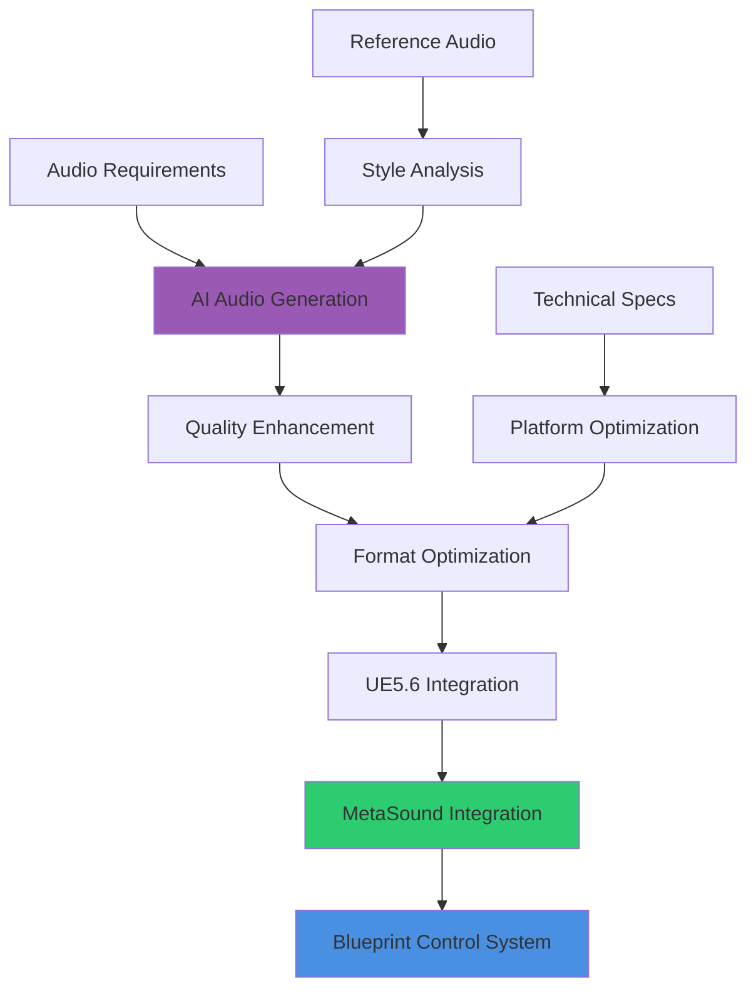
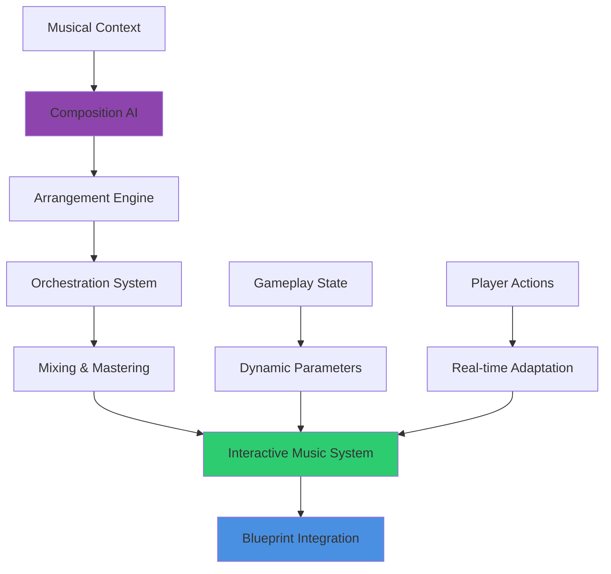
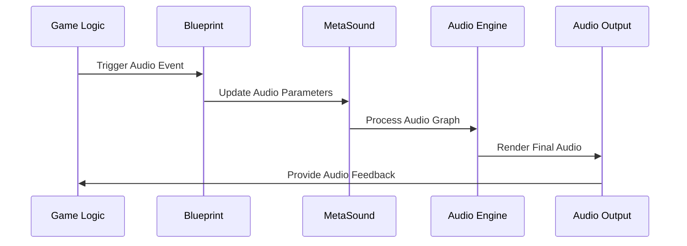
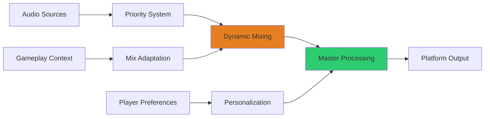
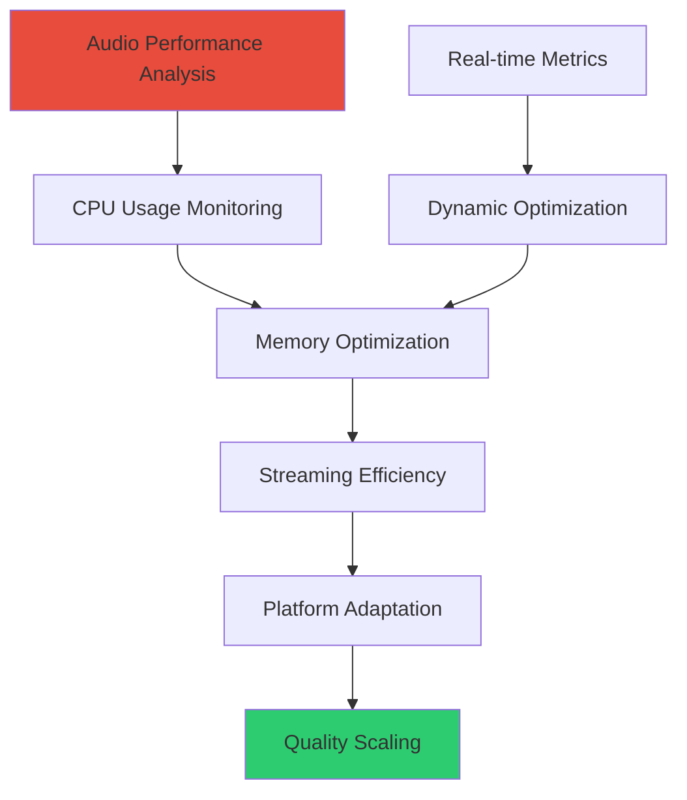

# Audio & Sound Generation

## Overview
AI-powered audio and sound generation for UE5.6 Blueprint integration. This guide covers procedural audio creation, intelligent music systems, and automated sound design workflows that produce high-quality audio assets optimized for interactive gameplay and seamless Blueprint control.

## Procedural Audio Generation

### AI-Driven Sound Creation


### Professional Audio Generation Pipeline

#### AudioCraft Integration for Game Audio
```
Generate high-quality game audio for [AUDIO_TYPE]:

Audio Specifications:
- Sample rate: [SAMPLE_RATE] Hz (48kHz standard for games)
- Bit depth: [BIT_DEPTH] bit (24-bit for source, 16-bit for compressed)
- Channel configuration: [CHANNELS] (Mono for SFX, Stereo/Surround for music)
- Duration: [MIN_DURATION] to [MAX_DURATION] seconds
- Dynamic range: [DYNAMIC_RANGE] dB for proper game audio mixing

Generation Parameters:
- Style reference: [AUDIO_STYLE] with [GENRE_INFLUENCE] genre characteristics
- Emotional context: [EMOTION_TARGET] for appropriate mood and energy level
- Interactive elements: [INTERACTION_POINTS] for gameplay-responsive audio
- Loop compatibility: [LOOP_REQUIREMENTS] for seamless audio cycling
- Layering support: [LAYER_COUNT] simultaneous audio layers for complex soundscapes

Quality Standards:
- Professional mastering with game-appropriate loudness standards
- Frequency response optimization for game audio reproduction systems
- Phase coherence maintenance for multi-channel and surround sound formats
- Noise floor management ensuring clean audio in interactive environments
- Platform-specific optimization for console and mobile audio systems
```

#### Advanced Audio Processing
```mermaid
sequenceDiagram
    participant Gen as AI Generator
    participant Proc as Audio Processor
    participant Opt as Optimizer
    participant Meta as MetaSound
    participant BP as Blueprint
    
    Gen->>Proc: Generate Raw Audio
    Proc->>Opt: Apply Professional Processing
    Opt->>Meta: Create MetaSound Graph
    Meta->>BP: Expose Blueprint Parameters
    BP->>BP: Integrate with Gameplay Systems
```

**Audio Processing Steps:**
1. **Noise Reduction**: Clean generated audio removing artifacts and unwanted noise
2. **EQ Processing**: Apply frequency shaping for optimal game audio balance
3. **Compression**: Dynamic range control ensuring consistent playback levels
4. **Spatial Processing**: Prepare audio for 3D positional audio in UE5.6
5. **Format Conversion**: Optimize for target platforms with appropriate compression
6. **MetaSound Integration**: Create interactive audio graphs with real-time parameter control

## Specialized Audio Generation

### Sound Effects Creation
```
Generate comprehensive SFX library for [GAME_CATEGORY]:

Environmental Audio:
- Ambient soundscapes with [LAYER_COUNT] simultaneous environmental layers
- Weather effects supporting [WEATHER_TYPES] with realistic audio characteristics
- Surface interaction sounds for [MATERIAL_TYPES] with proper physics-based audio
- Mechanical sounds for [MECHANISM_COUNT] different interactive objects
- Natural sounds with [VARIATION_COUNT] variations preventing audio repetition

Character Audio:
- Footstep library with [SURFACE_COUNT] surface materials and [WEIGHT_CLASSES] character weights
- Voice processing for [CHARACTER_COUNT] distinct character types
- Breathing and heartbeat audio with [INTENSITY_LEVELS] intensity variations
- Combat audio including [WEAPON_TYPES] weapon sounds and [IMPACT_TYPES] impact effects
- Emotional vocalizations with [EMOTION_COUNT] emotional states

Technical Implementation:
- Multi-sample generation ensuring audio variation and preventing repetition
- Velocity-sensitive audio with [VELOCITY_LAYERS] dynamic response layers
- Real-time parameter control through Blueprint interfaces
- Memory optimization with intelligent audio streaming and compression
- Platform-specific optimization for target hardware audio capabilities
```

### Music Generation Systems


#### Adaptive Music Generation
```
Create intelligent adaptive music system:

Composition Features:
- Genre-specific composition with [STYLE_COUNT] musical styles
- Emotional progression matching [NARRATIVE_BEATS] story beats
- Dynamic instrumentation with [INSTRUMENT_COUNT] virtual instruments
- Harmonic analysis ensuring professional music theory compliance
- Rhythmic variation supporting [TEMPO_RANGE] BPM range for different gameplay intensities

Interactive Elements:
- Real-time tempo adjustment based on [GAMEPLAY_METRICS] player performance metrics
- Layer activation system with [LAYER_COUNT] simultaneous musical layers
- Seamless transition system between [SECTION_COUNT] musical sections
- Player action synchronization with musical beat matching
- Emotional state detection driving musical mood and energy adjustment

Technical Implementation:
- Procedural melody generation using [SCALE_SYSTEMS] musical scale systems
- Chord progression generation with [COMPLEXITY_LEVELS] harmonic sophistication
- Arrangement automation with intelligent instrument assignment
- Real-time audio processing maintaining musical coherence during parameter changes
- Memory-efficient streaming supporting continuous musical playback
```

## MetaSound Integration

### Advanced Audio Graph Creation
```
Design comprehensive MetaSound integration system:

MetaSound Architecture:
- Modular audio graph construction with [NODE_COUNT] custom audio nodes
- Real-time parameter control with [PARAMETER_COUNT] exposed parameters
- Audio effect chain creation with [EFFECT_COUNT] simultaneous audio effects
- Multi-channel audio processing supporting [CHANNEL_CONFIG] channel configurations
- Performance optimization maintaining [AUDIO_LATENCY] millisecond audio latency

Blueprint Integration Features:
- Automatic Blueprint interface generation for MetaSound parameter control
- Event-driven audio triggers with [TRIGGER_COUNT] simultaneous audio events
- Component-based audio management with automatic 3D positioning
- Performance monitoring with CPU usage tracking and optimization
- Integration with existing gameplay systems and UI frameworks

Advanced Audio Processing:
- Real-time convolution reverb with [REVERB_PRESETS] environmental presets
- Dynamic range compression with game-appropriate response characteristics
- Spatial audio processing with HRTF and distance-based attenuation
- Audio streaming integration with UE5.6's audio streaming system
- Cross-platform compatibility ensuring consistent audio experience
```

### Procedural Audio Effects


#### Real-Time Audio Generation
```
Implement real-time audio synthesis system:

Synthesis Engines:
- Subtractive synthesis for [SYNTH_TYPES] electronic sound generation
- FM synthesis for [METALLIC_SOUNDS] metallic and bell-like audio textures
- Granular synthesis for [TEXTURE_SOUNDS] complex audio textures and atmospheres
- Physical modeling for [REALISTIC_SOUNDS] realistic instrument and environmental audio
- Wavetable synthesis for [EVOLVING_SOUNDS] evolving and morphing audio textures

Dynamic Audio Features:
- Real-time filter modulation based on [MODULATION_SOURCES] gameplay parameters
- Envelope generation with [ENVELOPE_STAGES] ADSR and complex envelope shapes
- LFO systems with [LFO_COUNT] simultaneous modulation sources
- Audio routing matrix with [ROUTING_OPTIONS] flexible signal routing options
- Performance scaling maintaining audio quality while optimizing CPU usage

Integration Capabilities:
- MIDI integration for musical input and control
- Audio analysis for real-time audio-reactive visuals
- Machine learning integration for intelligent audio parameter adjustment
- Preset management with [PRESET_COUNT] saved audio configurations
- Version control integration for audio graph development and team collaboration
```

## Interactive Audio Systems

### 3D Spatial Audio
```
Create advanced 3D spatial audio system:

Spatial Audio Features:
- HRTF processing for realistic 3D audio positioning
- Distance-based attenuation with [FALLOFF_CURVES] realistic falloff characteristics
- Occlusion and obstruction simulation with [MATERIAL_TYPES] acoustic material properties
- Environmental reverb with [ENVIRONMENT_COUNT] distinct acoustic environments
- Dynamic range adaptation based on listening environment and player preferences

Advanced Positioning:
- Multi-listener support for [PLAYER_COUNT] simultaneous players
- Moving source tracking with Doppler effect simulation
- Reflection simulation for realistic acoustic space modeling
- Directional audio sources with [DIRECTIVITY_PATTERNS] radiation patterns
- Performance optimization with distance-based audio culling and LOD systems

Blueprint Control:
- Component-based 3D audio management with automatic positioning updates
- Event-driven spatial parameter updates responding to gameplay changes
- Integration with physics system for realistic audio occlusion
- Performance monitoring with CPU usage optimization for large audio scenes
- Cross-platform compatibility ensuring consistent spatial audio experience
```

### Dynamic Audio Mixing


#### Intelligent Audio Mixing
```
Implement smart audio mixing system:

Dynamic Mixing Features:
- Automatic level balancing with [CHANNEL_COUNT] simultaneous audio channels
- Priority-based audio ducking ensuring important audio remains audible
- Frequency-based separation preventing audio masking and maintaining clarity
- Contextual mixing adaptation based on [CONTEXT_TYPES] gameplay contexts
- Real-time EQ adjustment optimizing audio for different playback systems

Advanced Processing:
- Multi-band compression for professional audio dynamics control
- Side-chain processing for responsive audio interaction between sources
- Automatic gain control maintaining consistent perceived loudness
- Spectral analysis for intelligent frequency management
- Platform-specific optimization for console, PC, and mobile audio systems

Integration Systems:
- Dialogue intelligibility enhancement with automatic background audio reduction
- Music and SFX balance management with player preference integration
- Environmental audio adaptation based on virtual acoustic spaces
- Performance scaling maintaining audio quality while optimizing processing load
- Accessibility features including hearing impairment support and audio visualization
```

## Production Integration

### Audio Asset Pipeline
```
Create comprehensive audio production pipeline:

Asset Management:
- Automated audio import with [FORMAT_COUNT] source format support
- Quality validation ensuring audio meets technical and artistic standards
- Batch processing capabilities for large audio asset libraries
- Version control integration with audio asset change tracking
- Collaborative workflow support for team-based audio development

Optimization Pipeline:
- Automatic compression optimization for [PLATFORM_COUNT] target platforms
- Quality tier generation for different hardware performance levels
- Memory usage optimization with intelligent audio streaming
- Loading time optimization through predictive audio asset caching
- Platform-specific audio format conversion with quality preservation

Quality Assurance:
- Automated audio analysis detecting technical issues and artifacts
- Loudness standard compliance verification for professional audio delivery
- Phase coherence checking for multi-channel audio compatibility
- Frequency response analysis ensuring optimal audio reproduction
- Integration testing with existing audio systems and gameplay mechanics
```

### Performance Optimization


#### Audio Performance Management
```
Optimize audio system performance:

Performance Monitoring:
- Real-time CPU usage tracking for audio processing threads
- Memory allocation monitoring with garbage collection impact analysis
- Audio streaming bandwidth monitoring and optimization
- Platform-specific performance profiling with hardware utilization tracking
- Frame time impact analysis ensuring audio doesn't affect game performance

Optimization Strategies:
- Audio LOD system reducing quality and complexity based on importance and distance
- Intelligent audio culling removing inaudible audio sources from processing
- Compression optimization balancing audio quality with memory and bandwidth usage
- Threading optimization distributing audio processing across available CPU cores
- Cache optimization improving audio data access patterns for better performance

Dynamic Scaling:
- Quality adaptation based on available processing power and memory
- Priority system ensuring critical audio maintains quality during performance constraints
- Background audio reduction during intensive gameplay sequences
- Platform-specific optimization profiles for console, PC, and mobile deployment
- User preference integration allowing players to balance quality and performance
```

This comprehensive audio and sound generation system ensures that AI-created audio assets meet professional AAA quality standards while providing the interactive features and performance optimization necessary for modern game development with seamless UE5.6 Blueprint integration.
