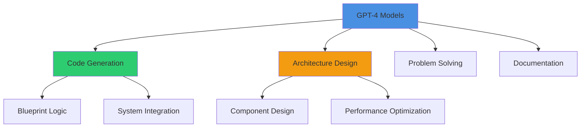
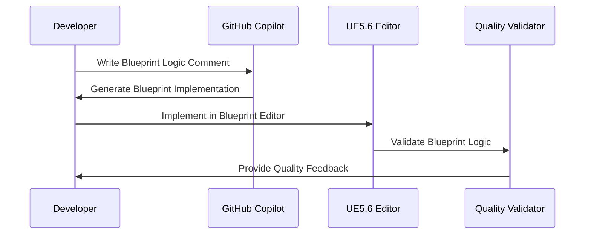
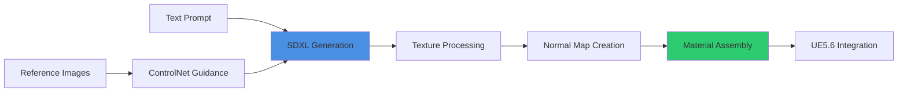
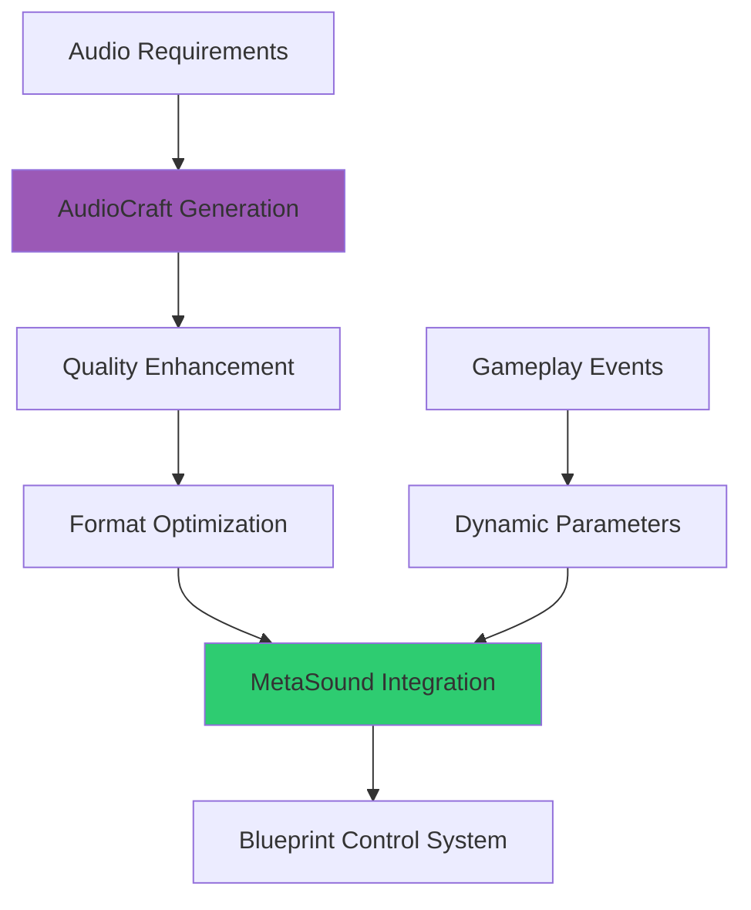
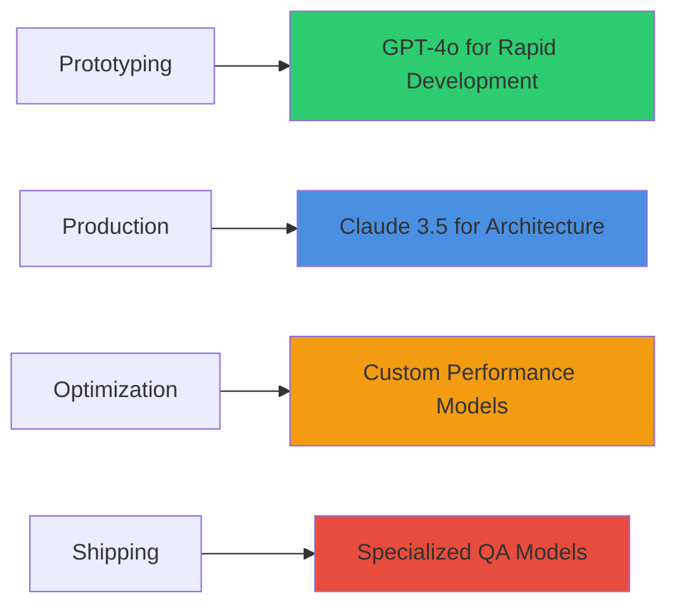

# Best Models & Assets for UE Development

## Overview
Curated collection of the most effective AI models, tools, and asset libraries for UE5.6 Blueprint development. This guide covers language models optimized for game development, specialized asset generation tools, and integration strategies that accelerate production while maintaining professional quality standards.

## Language Models for Code Generation

### General Purpose Programming Models

#### GPT-4 Turbo & GPT-4o


**Strengths:**
- Comprehensive UE5.6 knowledge including latest features
- Excellent Blueprint architecture understanding
- Strong performance optimization recommendations
- Integration with modern UE5.6 systems (GAS, Enhanced Input, MVVM)
- Professional code quality and documentation generation

**Best Use Cases:**
- Complex system architecture design
- Performance optimization strategies
- Integration planning for large-scale projects
- Documentation generation for technical specifications
- Code review and quality assurance recommendations

**Optimization Tips:**
```
Context: "You are an expert UE5.6 Blueprint developer with 15+ years AAA experience"
Focus: "Design scalable, performant systems using SOLID principles"
Constraints: "Target 60 FPS, minimize memory allocation, use event-driven architecture"
Output: "Provide Blueprint implementation with Mermaid diagrams and performance analysis"
```

#### Claude 3.5 Sonnet
**Strengths:**
- Exceptional analytical and reasoning capabilities
- Strong architectural pattern recognition
- Excellent at explaining complex concepts clearly
- Superior debugging and troubleshooting assistance
- High-quality technical writing and documentation

**Best Use Cases:**
- Complex problem analysis and solution design
- Technical documentation and knowledge base creation
- Code review with detailed improvement suggestions
- Educational content creation for team training
- Integration conflict resolution and system compatibility analysis

### Specialized Game Development Models

#### CodeT5+ for UE5
**Strengths:**
- Trained specifically on game development codebases
- Understanding of UE5 Blueprint patterns and conventions
- Optimized for code completion and generation
- Strong performance in Blueprint node connection logic
- Efficient at generating common game development patterns

**Best Use Cases:**
- Rapid prototype development
- Common gameplay pattern implementation
- Blueprint template generation
- Code completion assistance
- Refactoring existing Blueprint systems

#### GitHub Copilot for UE Development


**Strengths:**
- Real-time code suggestion during development
- Integration with development environment
- Learning from project-specific patterns
- Rapid iteration and experimentation support
- Context-aware suggestions based on existing code

**Best Use Cases:**
- Real-time development assistance
- Learning new UE5.6 features and patterns
- Rapid prototyping and iteration
- Code completion for repetitive tasks
- Exploration of different implementation approaches

## Asset Generation Models

### 3D Model Generation

#### Point-E & Shap-E (OpenAI)
**Specifications:**
- 3D point cloud generation from text descriptions
- Mesh conversion capabilities for UE5.6 import
- Texture coordinate generation for material application
- Normal map calculation for detail enhancement
- LOD generation support for performance optimization

**Integration Workflow:**
```
1. Text prompt → Point cloud generation
2. Point cloud → Mesh conversion (Blender/Maya pipeline)
3. Mesh optimization → UE5.6 import pipeline
4. Material generation → Blueprint integration
5. LOD creation → Performance validation
```

**Best Use Cases:**
- Rapid concept visualization for level blockouts
- Placeholder asset generation during prototyping
- Base mesh creation for artist refinement
- Procedural decoration and filler objects
- Environmental asset variation generation

#### DreamFusion for Game Assets
**Strengths:**
- High-quality 3D asset generation from 2D concept art
- Style consistency maintenance across asset families
- Game-ready topology generation
- UV unwrapping optimization for texture application
- Integration with standard 3D modeling pipelines

### Texture & Material Generation

#### Stable Diffusion XL for Game Textures


**Optimization Pipeline:**
- Base texture generation with proper tileable patterns
- Normal map extraction using height-to-normal conversion
- Roughness map generation for PBR material workflow
- Ambient occlusion map creation for depth enhancement
- Material parameter setup for Blueprint control

**Professional Workflow:**
```
Prompt Engineering:
- "Seamless tileable [SURFACE_TYPE] texture, 4K resolution"
- "PBR material setup, photorealistic, game-ready quality"
- "Consistent lighting, neutral color temperature"
- "High contrast detail for normal map extraction"

Post-Processing:
- Seamless tile verification and edge blending
- Color correction for consistent art direction
- Compression optimization for target platforms
- Integration testing with UE5.6 material editor
```

#### Material Maker Integration
**Features:**
- Procedural material graph generation
- Blueprint-controlled parameter exposure
- Performance optimization for real-time rendering
- Multi-platform shader compilation
- Integration with UE5.6 material layer system

### Audio Asset Generation

#### AudioCraft (Meta) for Game Audio
**Capabilities:**
- Sound effect generation from text descriptions
- Music composition with style and mood control
- Audio texture creation for environmental soundscapes
- Dynamic audio parameter generation for Blueprint control
- Integration with UE5.6 MetaSound system

**Implementation Strategy:**


**Professional Audio Pipeline:**
1. **Generation Phase**: Create base audio using descriptive prompts
2. **Enhancement Phase**: Apply professional audio processing (EQ, compression, reverb)
3. **Optimization Phase**: Format conversion and compression for target platforms
4. **Integration Phase**: MetaSound graph creation with Blueprint interfaces
5. **Testing Phase**: Audio implementation validation and performance testing

## Specialized Development Tools

### Blueprint-Specific AI Tools

#### UE5.6 Blueprint Assistant (Blueprint-Only Implementation)

Blueprint-based AI assistance workflow:
- **BP_AIAssistant**: Main Blueprint class for AI communication
- **DA_ModelConfig**: Data Asset storing AI model settings and API keys  
- **BFL_AIHelpers**: Blueprint Function Library for AI prompt processing
- **BP_PerformanceValidator**: Blueprint system for solution validation

**Blueprint Implementation Pattern:**
- Use HTTP Request nodes for AI API communication
- Parse JSON responses with Blueprint JSON utilities
- Generate Blueprint nodes through Editor Utility Widgets
- Validate performance with Blueprint profiling nodes

**Features:**
- Project-aware Blueprint generation
- Performance constraint validation
- Integration compatibility checking
- Code quality assessment
- Documentation generation

### Performance Optimization Models

#### Custom Performance Analyzer
**Capabilities:**
- Blueprint execution path analysis
- Memory allocation pattern detection
- Frame rate impact prediction
- Optimization suggestion generation
- Performance regression detection

**Integration Points:**
- Real-time development feedback
- Automated performance testing
- CI/CD pipeline integration
- Team performance tracking
- Knowledge base development

## Model Selection Guidelines

### Project Phase Optimization


### Team Skill Level Matching
- **Senior Developers**: Advanced models with architectural focus (Claude 3.5, GPT-4 Turbo)
- **Intermediate Developers**: General-purpose models with strong explanation (GPT-4o, Copilot)
- **Junior Developers**: Educational models with learning emphasis (GPT-4 with teaching prompts)
- **Technical Artists**: Visual-focused models with asset generation capabilities (SDXL, AudioCraft)

### Platform-Specific Optimization
- **PC Development**: Full-featured models with advanced optimization capabilities
- **Console Development**: Performance-focused models with platform-specific constraints
- **Mobile Development**: Memory and performance-optimized model selection
- **VR Development**: Specialized models understanding VR-specific requirements

## Cost-Benefit Analysis

### Model Usage Economics
```
High-Value Applications:
- Complex system architecture design: High cost, Very High value
- Performance optimization: Medium cost, Very High value
- Documentation generation: Low cost, High value
- Code review assistance: Low cost, High value

Moderate-Value Applications:
- Asset generation: Medium cost, Medium value
- Prototype development: Low cost, Medium value
- Learning assistance: Low cost, Medium value

Cost Optimization Strategies:
- Use lightweight models for simple tasks
- Batch processing for asset generation
- Caching common solutions and patterns
- Progressive enhancement from simple to complex models
```

### ROI Measurement
- **Development Speed**: Measure time reduction in development tasks
- **Quality Improvement**: Track bug reduction and code quality metrics
- **Team Productivity**: Monitor developer satisfaction and learning acceleration
- **Maintenance Reduction**: Assess long-term code maintainability improvements

## Integration Best Practices

### Workflow Integration
1. **Development Environment**: Seamless integration with UE5.6 editor and external tools
2. **Version Control**: AI-generated content tracking and team synchronization
3. **Quality Assurance**: Automated testing and validation of AI-generated solutions
4. **Documentation**: Automatic documentation generation and maintenance
5. **Team Training**: Onboarding processes for effective AI tool utilization

### Quality Control Framework
- **Output Validation**: Automated testing of AI-generated solutions
- **Performance Benchmarking**: Continuous monitoring of solution performance impact
- **Code Review Integration**: AI assistance for human code review processes
- **Learning Feedback**: Continuous improvement through developer feedback and iteration

This comprehensive guide ensures that teams select and integrate the most effective AI models and tools for their specific UE5.6 Blueprint development needs while maintaining professional quality standards and optimizing development efficiency.
