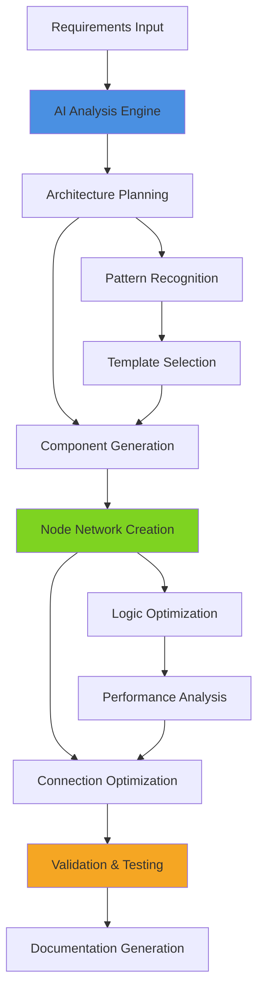
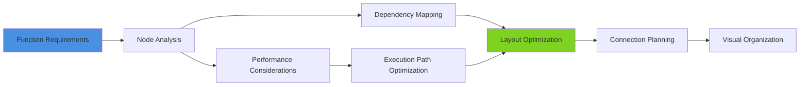
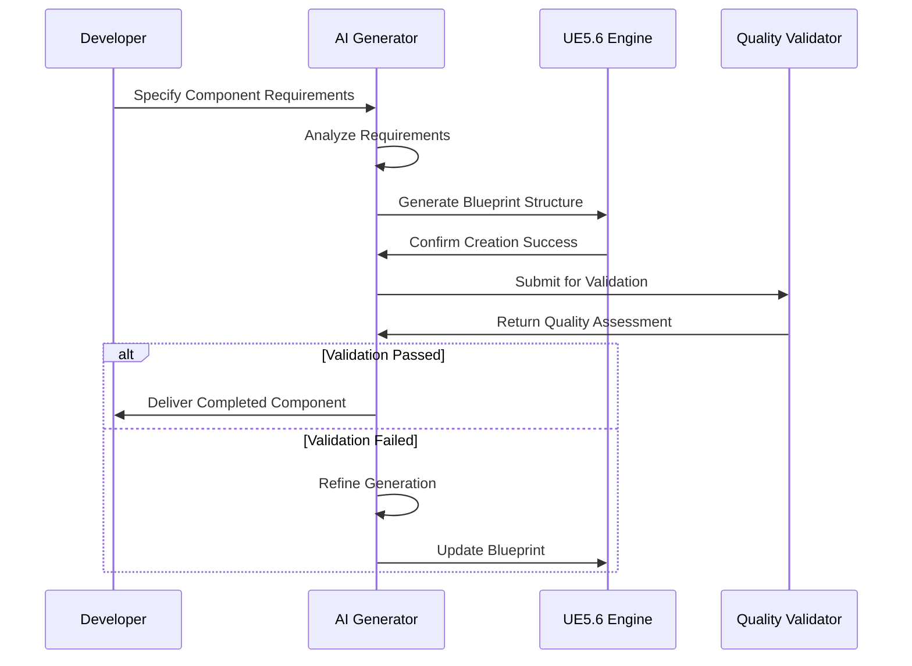
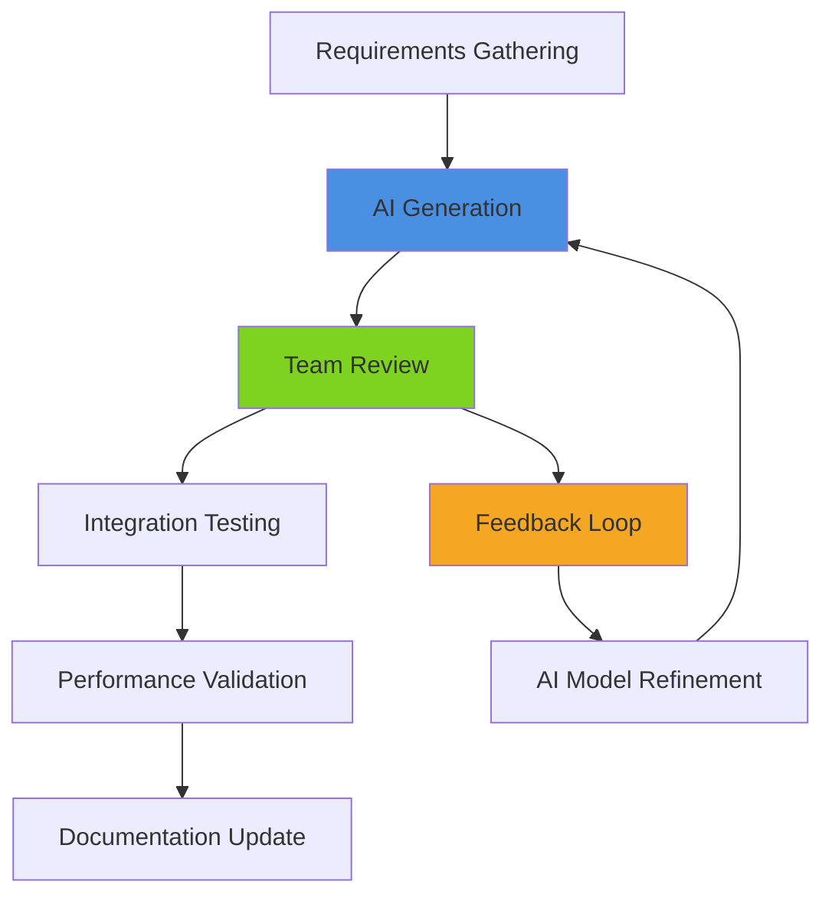

# AI Blueprint Generation

## Overview
Advanced techniques for generating UE5.6 Blueprints using AI assistance. This guide covers automated Blueprint creation, intelligent node placement, visual scripting optimization, and AI-driven architecture generation that accelerates development while maintaining professional standards and best practices.

## Blueprint Generation Fundamentals

### AI-Assisted Blueprint Creation


### Generation Approaches
- **Template-Based Generation**: AI selects and customizes proven Blueprint templates
- **Component Assembly**: Intelligent combination of Blueprint components for complex systems
- **Pattern Recognition**: AI identifies and implements common Blueprint patterns
- **Custom Architecture**: Generate unique Blueprint structures for specific requirements

## Advanced Generation Techniques

### Intelligent Node Placement


- **Automatic Layout**: AI generates clean, readable Blueprint layouts
- **Optimal Connections**: Minimize wire crossing and improve visual clarity
- **Logical Grouping**: Organize nodes by functionality and execution flow
- **Performance-Aware Placement**: Consider execution order for optimal performance

### Component Architecture Generation

#### System-Level Blueprint Generation
- **Actor Component Systems**: Generate modular component architectures
- **Interface Implementation**: Create Blueprint interfaces with proper method signatures
- **Event System Setup**: Establish event dispatchers and handlers automatically
- **Data Structure Creation**: Generate appropriate data types and structures

#### Gameplay System Templates
- **Character Controller Generation**: Complete character movement and input systems
- **Inventory System Creation**: Generate inventory management with UI integration
- **Combat System Assembly**: Create damage systems with status effects and feedback
- **Interaction Framework**: Generate proximity-based interaction systems

## Specialized Generation Patterns

### AI-Driven Component Creation


### Performance-Optimized Generation
- **Tick Function Optimization**: Minimize tick dependencies and optimize update frequency
- **Memory-Efficient Patterns**: Generate Blueprints with optimal memory usage
- **Execution Path Analysis**: Ensure efficient Blueprint execution flow
- **Event-Driven Architecture**: Prefer event-based over polling-based implementations

### UI Blueprint Generation
- **Widget Hierarchy Creation**: Generate complete UI hierarchies with proper parenting
- **Data Binding Setup**: Establish MVVM patterns with automatic data binding
- **Animation Integration**: Create UI animations with proper timing and easing
- **Responsive Layout**: Generate adaptive layouts for different screen sizes

## Quality Assurance & Validation

### Automated Quality Checks
- **Syntax Validation**: Ensure all Blueprint connections are valid and type-safe
- **Performance Analysis**: Identify potential performance bottlenecks in generated code
- **Best Practice Compliance**: Verify adherence to established Blueprint patterns
- **Integration Testing**: Test generated Blueprints with existing project systems

### Iterative Refinement Process
1. **Initial Generation**: Create base Blueprint structure from requirements
2. **Quality Assessment**: Analyze generated Blueprint for issues and improvements
3. **Optimization Pass**: Refine Blueprint for performance and maintainability
4. **Validation Testing**: Execute automated tests to verify functionality
5. **Documentation Pass**: Generate comprehensive documentation for the Blueprint

## Integration Strategies

### Project-Specific Customization
- **Style Guide Adherence**: Train AI to follow project-specific naming and organization conventions
- **Pattern Library Integration**: Incorporate project's custom Blueprint patterns and components
- **Performance Target Alignment**: Generate Blueprints that meet project performance requirements
- **Platform Optimization**: Consider target platform constraints during generation

### Team Workflow Integration


### Version Control Integration
- **Automatic Branching**: Create feature branches for generated Blueprint systems
- **Change Documentation**: Generate detailed commit messages explaining Blueprint functionality
- **Merge Conflict Prevention**: Ensure generated Blueprints integrate cleanly with existing code
- **Review Process**: Establish peer review workflows for AI-generated content

## Advanced Features

### Machine Learning Enhancement
- **Pattern Learning**: AI learns from existing project Blueprints to improve generation quality
- **Success Rate Optimization**: Continuously improve generation accuracy based on developer feedback
- **Performance Prediction**: Predict performance characteristics of generated Blueprints
- **Bug Pattern Avoidance**: Learn from past issues to avoid generating problematic patterns

### Custom Domain Specialization
- **Genre-Specific Templates**: Specialized generation for FPS, RPG, Strategy, etc.
- **Platform Optimization**: Generate Blueprints optimized for PC, Console, Mobile, VR
- **Team Size Scaling**: Adjust generation complexity based on team size and experience
- **Deadline Optimization**: Balance feature completeness with development timeline

### Collaborative Generation
- **Multi-Developer Input**: Incorporate requirements from multiple team members
- **Consensus Building**: AI mediates different approaches to find optimal solutions
- **Knowledge Sharing**: Generated Blueprints include learning opportunities for team members
- **Mentorship Integration**: AI explains generation decisions to help developers learn

## Implementation Examples

### Character Movement System
```
Input: "Create a character movement system with wall running, double jump, and dash mechanics"

AI Output:
- Character Movement Component with custom physics
- Input Action setup with Enhanced Input System
- Animation Blueprint with state machine
- Camera system with dynamic FOV and tilt
- Particle effects for movement abilities
- Audio integration for movement sounds
```

### Inventory Management System
```
Input: "Generate an inventory system with drag-and-drop, item stacking, and equipment slots"

AI Output:
- Inventory Component with slot-based storage
- Item Data Assets with properties and metadata
- UI Widgets with drag-and-drop functionality
- Equipment Manager with stat bonuses
- Save/Load integration for persistence
- Audio and visual feedback systems
```

### Combat Encounter System
```
Input: "Create a turn-based combat system with status effects and elemental interactions"

AI Output:
- Combat Manager with turn queue management
- Character stats system with modifiers
- Status effect framework with duration tracking
- Elemental damage calculations with resistances
- UI system with combat feedback
- Animation integration for attacks and reactions
```

This comprehensive approach to AI Blueprint generation transforms development from manual coding to intelligent specification, dramatically accelerating development while maintaining professional quality standards.
