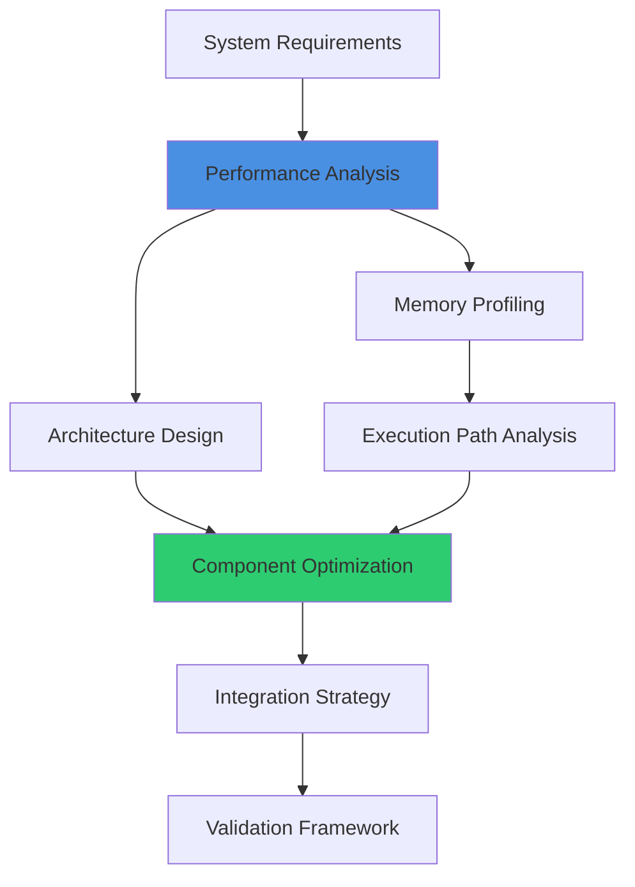
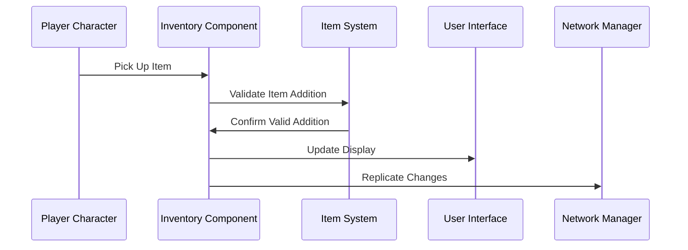
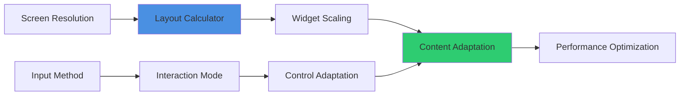
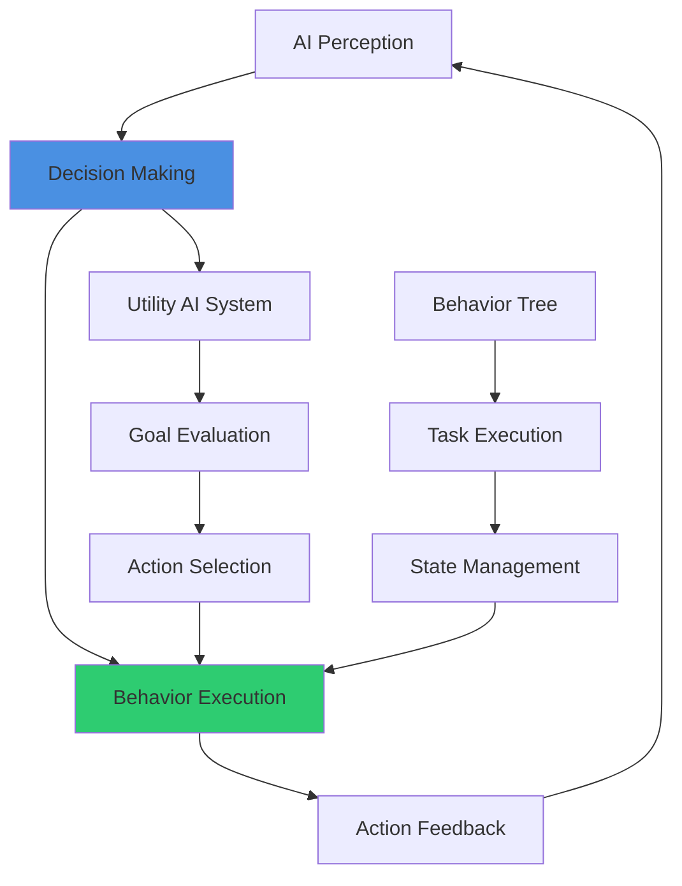
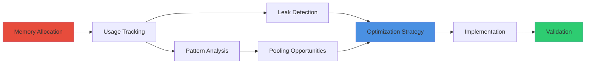

# Blueprint Development Prompts

## Overview
Comprehensive prompt library for AI-assisted UE5.6 Blueprint development. These prompts are designed to generate high-quality, production-ready Blueprint architectures that follow SOLID principles, optimize performance, and integrate seamlessly with modern UE5.6 systems.

## System Architecture Prompts

### Component System Generation
```
Create a modular component system for [SYSTEM_NAME] that:
- Implements single responsibility principle with focused components
- Uses Blueprint interfaces for loose coupling between systems
- Integrates with UE5.6 Enhanced Input System for user interaction
- Supports event-driven communication between components
- Includes built-in performance optimization and object pooling
- Provides clear debugging and monitoring capabilities

Technical Requirements:
- Target 60 FPS on [TARGET_PLATFORM]
- Memory budget of [MEMORY_LIMIT]
- Network replication support for [PLAYER_COUNT] players
- Integration with existing [RELATED_SYSTEMS]
```

### Performance-Optimized System Design


```
Design a high-performance [SYSTEM_TYPE] system that:
- Minimizes tick dependencies and uses event-driven architecture
- Implements efficient object pooling for [OBJECT_TYPES]
- Optimizes for [TARGET_FRAMERATE] FPS with consistent frame timing
- Uses Blueprint nativization opportunities where appropriate
- Integrates with UE5.6 World Partition for seamless world streaming
- Supports LOD systems for scalable complexity management

Performance Targets:
- Maximum execution time: [TIME_BUDGET] per frame
- Memory allocation: [MEMORY_BUDGET] maximum
- Network bandwidth: [BANDWIDTH_LIMIT] for multiplayer
- Scalability: Support [MIN_SCALE] to [MAX_SCALE] complexity
```

## Gameplay System Prompts

### Character System Development
```
Create a comprehensive character system with:

Core Components:
- Enhanced Input integration with context-sensitive input mapping
- Modular movement component supporting [MOVEMENT_TYPES]
- Health/stats system using Gameplay Ability System (GAS)
- Equipment system with visual and stat modifications
- Animation Blueprint integration with state machine architecture

Advanced Features:
- Network prediction for responsive multiplayer
- Save/load integration with persistent character data
- UI integration using MVVM pattern for reactive updates
- Performance optimization for [CHARACTER_COUNT] concurrent characters
- Extensible ability system for gameplay mechanics

Architecture Requirements:
- Component-based design for maximum modularity
- Interface-driven communication between systems
- Event dispatcher architecture for loose coupling
- Data-driven configuration using Data Assets
- Professional debugging and profiling integration
```

### Inventory & Item System


```
Develop a scalable inventory system featuring:

Core Functionality:
- Slot-based storage with configurable grid layouts
- Item stacking with type-based grouping rules
- Drag-and-drop UI with smooth visual feedback
- Equipment slots with stat bonus calculations
- Crafting integration with recipe system

Technical Implementation:
- Data Asset-based item definitions with extensible properties
- Component architecture for easy integration with any actor
- Network-optimized replication for multiplayer environments
- Save/load system integration with persistent storage
- MVVM UI architecture for reactive interface updates

Performance Considerations:
- Object pooling for item actors and UI elements
- Efficient search and filtering algorithms
- Memory-optimized data structures
- Frame-rate friendly UI updates
- Scalable to [MAX_ITEMS] items per inventory
```

## UI/UX System Prompts

### MVVM UI Architecture
```
Create a robust UI system using MVVM architecture:

View Model Implementation:
- Data binding with automatic UI updates
- Command pattern for user interactions
- Observable properties for reactive programming
- Validation logic for user input
- State management for complex UI flows

View Implementation:
- Widget component hierarchy with proper organization
- Animation system integration for smooth transitions
- Responsive layout supporting multiple screen resolutions
- Accessibility features for inclusive design
- Performance-optimized rendering with efficient draw calls

Integration Requirements:
- Seamless data flow from game systems to UI
- Event-driven updates minimizing UI refresh overhead
- Localization support for international audiences
- Theme system for consistent visual design
- Testing framework for UI validation
```

### Adaptive User Interface


```
Design an adaptive UI system that:
- Automatically adjusts layout for different screen sizes and aspect ratios
- Supports multiple input methods (mouse/keyboard, gamepad, touch)
- Implements accessibility features for inclusive gameplay
- Uses efficient rendering techniques for optimal performance
- Integrates with game state for contextual interface updates

Technical Features:
- Dynamic layout calculation based on screen dimensions
- Input method detection with automatic control switching
- Widget pooling for performance-critical UI elements
- Animation blending for smooth state transitions
- Localization integration with dynamic text sizing
```

## Advanced System Prompts

### Network Architecture Design
```
Develop a multiplayer-ready system with:

Network Foundation:
- Authority-based logic with proper client-server separation
- Efficient replication using UE5.6's replication graph
- Client prediction for responsive gameplay
- Rollback and correction systems for network consistency
- Anti-cheat considerations with server validation

Performance Optimization:
- Bandwidth optimization with delta compression
- Relevancy filtering for scalable player counts
- Network LOD for distance-based detail reduction
- Batched updates for efficient network utilization
- Connection quality adaptation for varying network conditions

Implementation Details:
- Blueprint-based networking with C++ performance critical paths
- Custom replication conditions for optimized data transfer
- Network debugging tools for development and testing
- Graceful handling of network errors and disconnections
- Integration with existing single-player systems
```

### AI Behavior System


```
Create an intelligent AI behavior system featuring:

Core AI Components:
- Behavior Tree integration with custom task nodes
- AI Perception system for environmental awareness
- Utility-based decision making for complex behaviors
- State machine management for behavioral consistency
- Performance-optimized thinking processes

Advanced Features:
- Dynamic goal adjustment based on game state
- Collaborative AI for multi-agent coordination
- Learning capabilities for adaptive behavior
- Debug visualization for development workflow
- Scalable architecture supporting [AI_COUNT] concurrent agents

Technical Implementation:
- Blueprint-based behavior authoring for designer accessibility
- Event-driven AI updates minimizing CPU overhead
- Memory-efficient data structures for AI state
- Network-compatible for multiplayer AI entities
- Integration with existing gameplay systems
```

## Optimization-Focused Prompts

### Performance Analysis & Enhancement
```
Analyze and optimize [SYSTEM_NAME] for production performance:

Performance Profiling:
- Identify CPU bottlenecks in Blueprint execution
- Analyze memory allocation patterns and garbage collection
- Profile network performance for multiplayer systems
- Measure draw call efficiency for rendering performance
- Validate frame time consistency and stuttering issues

Optimization Strategies:
- Convert appropriate Blueprints to C++ for critical paths
- Implement object pooling for frequently created objects
- Optimize event systems to reduce unnecessary communications
- Streamline data structures for memory efficiency
- Balance quality settings for target platform performance

Validation Framework:
- Automated performance testing with benchmarking
- Regression testing for performance degradation detection
- Platform-specific optimization for console and mobile
- Scalability testing across different hardware configurations
- Performance budgeting for sustainable development
```

### Memory Management Optimization


```
Design memory-efficient architecture for [SYSTEM_TYPE]:

Memory Optimization:
- Implement smart object pooling with automatic lifecycle management
- Optimize asset loading/unloading strategies
- Minimize garbage collection impact through efficient allocation patterns
- Use weak references where appropriate to prevent memory leaks
- Implement memory budgeting with monitoring and alerts

Technical Implementation:
- Custom memory allocators for specific use cases
- Asset streaming integration with World Partition
- Compressed data storage for large datasets
- Lazy initialization for optional system components
- Memory profiling integration for continuous monitoring

Target Specifications:
- Maximum memory usage: [MEMORY_BUDGET]
- Garbage collection frequency: [GC_FREQUENCY]
- Asset streaming efficiency: [STREAMING_TARGETS]
- Platform-specific memory optimizations
```

## Integration & Testing Prompts

### System Integration Framework
```
Create comprehensive integration strategy for [NEW_SYSTEM] with existing project:

Integration Analysis:
- Evaluate compatibility with current architecture patterns
- Identify potential conflicts with existing systems
- Plan migration strategy for legacy code integration
- Design interface contracts for system communication
- Establish integration testing procedures

Implementation Strategy:
- Phased rollout plan minimizing development disruption
- Backward compatibility maintenance for existing features
- Data migration procedures for persistent game data
- Performance impact assessment and optimization
- Documentation updates for team knowledge transfer

Quality Assurance:
- Automated testing framework for integration validation
- Performance regression testing across all affected systems
- User acceptance testing with real gameplay scenarios
- Rollback procedures for integration issues
- Monitoring and alerting for production deployment
```

These comprehensive prompts ensure that AI-generated Blueprint systems meet professional AAA development standards while integrating seamlessly with modern UE5.6 features and maintaining optimal performance characteristics.
