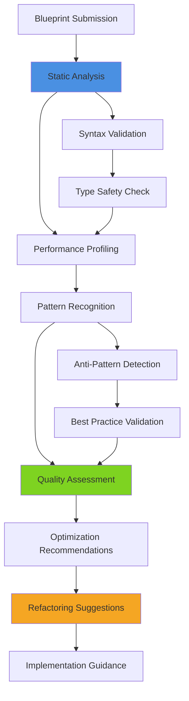
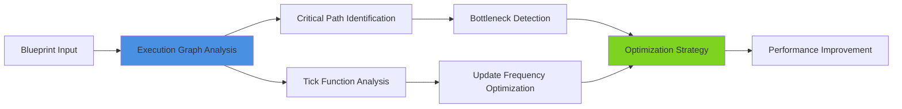
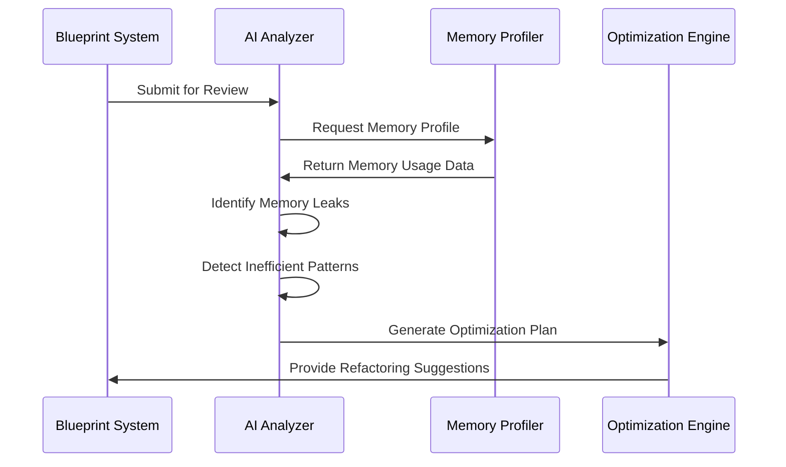
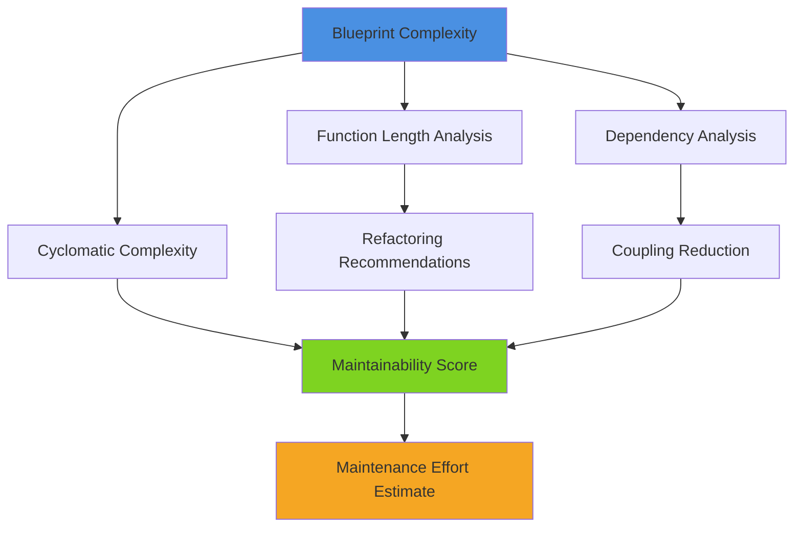
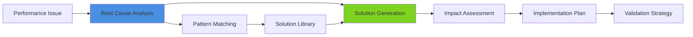
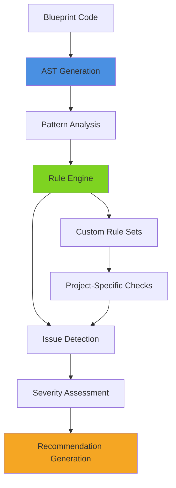
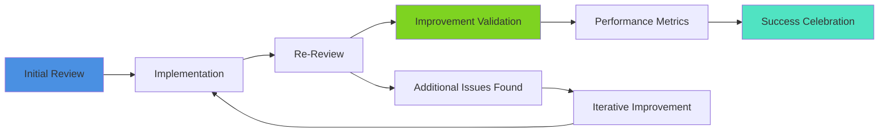

# Code Review & Optimization

## Overview
AI-powered code review and optimization for UE5.6 Blueprint development. This guide covers automated Blueprint analysis, performance optimization recommendations, code quality assessment, and intelligent refactoring suggestions that elevate Blueprint architecture to professional AAA standards.

## Blueprint Review Fundamentals

### Automated Review Process


### Review Categories
- **Performance Analysis**: Identify bottlenecks and optimization opportunities
- **Architecture Review**: Assess Blueprint structure and component organization
- **Code Quality**: Evaluate maintainability, readability, and best practices
- **Integration Assessment**: Verify compatibility with project standards and other systems

## Performance Optimization Analysis

### Execution Path Optimization


#### Performance Metrics
- **Execution Time**: Measure Blueprint function execution duration
- **Memory Usage**: Analyze memory allocation and garbage collection impact
- **Draw Call Optimization**: Identify rendering performance issues
- **Network Performance**: Evaluate replication efficiency and bandwidth usage

#### Optimization Strategies
- **Function Call Optimization**: Reduce unnecessary function calls and improve caching
- **Event-Driven Refactoring**: Convert polling-based logic to event-driven patterns
- **Object Pooling Implementation**: Suggest object pooling for frequently created/destroyed objects
- **LOD System Integration**: Recommend level-of-detail optimizations for complex systems

### Memory Management Review


## Quality Assessment Framework

### Architecture Quality Metrics
- **Component Cohesion**: Evaluate single responsibility principle adherence
- **Coupling Analysis**: Identify excessive dependencies between components
- **Interface Design**: Assess Blueprint interface clarity and usability
- **Modularity Score**: Rate Blueprint system modularity and reusability

### Code Quality Indicators
- **Naming Conventions**: Verify consistent and descriptive naming patterns
- **Documentation Coverage**: Assess comment quality and completeness
- **Error Handling**: Evaluate robustness and error recovery mechanisms
- **Testing Coverage**: Identify areas requiring additional validation

### Maintainability Assessment


## Intelligent Refactoring Suggestions

### Pattern-Based Improvements
- **Design Pattern Implementation**: Suggest appropriate design patterns for common scenarios
- **Component Extraction**: Identify code segments suitable for component extraction
- **Interface Abstraction**: Recommend interface creation for improved flexibility
- **Event System Integration**: Suggest event-driven architecture improvements

### Performance Refactoring


#### Common Refactoring Patterns
- **Tick Optimization**: Convert Tick-based logic to event-driven or timer-based systems
- **Blueprint Compilation**: Optimize Blueprint graphs for improved compilation performance
- **Asset Reference Management**: Implement efficient asset loading and unloading strategies
- **Network Optimization**: Refactor for improved replication and reduced bandwidth

### Code Organization Improvements
- **Function Decomposition**: Break large functions into smaller, focused components
- **Variable Scope Optimization**: Improve variable lifetime and memory usage
- **Blueprint Hierarchy Restructuring**: Optimize inheritance chains for better performance
- **Interface Segregation**: Split large interfaces into focused, specific interfaces

## Automated Review Features

### Static Analysis Capabilities


### Dynamic Analysis Integration
- **Runtime Performance Monitoring**: Analyze Blueprint behavior during execution
- **Memory Leak Detection**: Identify objects that aren't properly garbage collected
- **Threading Analysis**: Evaluate thread safety and concurrent access patterns
- **Resource Usage Tracking**: Monitor texture, mesh, and audio resource utilization

### Collaborative Review Features
- **Team Code Standards**: Enforce project-specific coding standards and conventions
- **Knowledge Sharing**: Generate educational content explaining optimization decisions
- **Progressive Review**: Track improvement over time and celebrate progress
- **Mentorship Integration**: Provide learning opportunities for junior developers

## Review Report Generation

### Comprehensive Analysis Reports
```
Performance Analysis:
├── Execution Time: 2.3ms (Target: <1.0ms)
├── Memory Usage: 145KB (Acceptable)
├── Tick Dependencies: 3 (Recommend: 0)
└── Network Calls: 12/frame (Optimize)

Quality Assessment:
├── Maintainability Score: 7.2/10
├── Documentation Coverage: 85%
├── Error Handling: Good
└── Test Coverage: 45% (Needs Improvement)

Optimization Opportunities:
├── Convert Tick to Timer: High Impact
├── Implement Object Pooling: Medium Impact
├── Optimize Network Replication: High Impact
└── Extract Reusable Components: Low Impact
```

### Actionable Recommendations
- **Priority-Based Improvements**: Rank optimizations by impact and effort
- **Implementation Guidance**: Provide step-by-step refactoring instructions
- **Before/After Comparisons**: Show expected performance improvements
- **Risk Assessment**: Evaluate potential issues with suggested changes

### Progress Tracking


## Integration with Development Workflow

### Continuous Integration
- **Automated Review Triggers**: Run reviews on Blueprint changes and commits
- **Quality Gates**: Prevent deployment of Blueprints that don't meet quality standards
- **Performance Regression Detection**: Identify performance degradation in new changes
- **Compliance Monitoring**: Ensure adherence to architectural guidelines

### IDE Integration
- **Real-Time Analysis**: Provide immediate feedback during Blueprint editing
- **Inline Suggestions**: Show optimization recommendations within the Blueprint editor
- **Quick Fixes**: Implement common optimizations with single-click actions
- **Learning Mode**: Explain optimization decisions to help developers improve

### Team Collaboration
- **Shared Standards**: Maintain consistent review criteria across team members
- **Knowledge Base**: Build repository of common issues and solutions
- **Peer Review Enhancement**: Augment human reviews with AI insights
- **Skill Development**: Track individual developer improvement over time

This comprehensive approach to AI-powered code review and optimization ensures that Blueprint development maintains the highest professional standards while continuously improving performance and maintainability.
