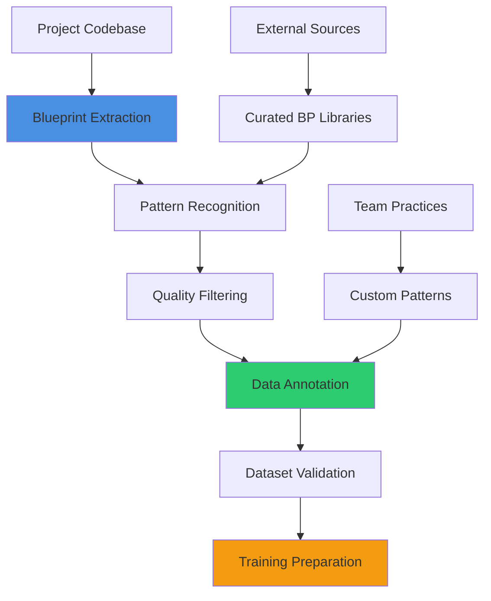
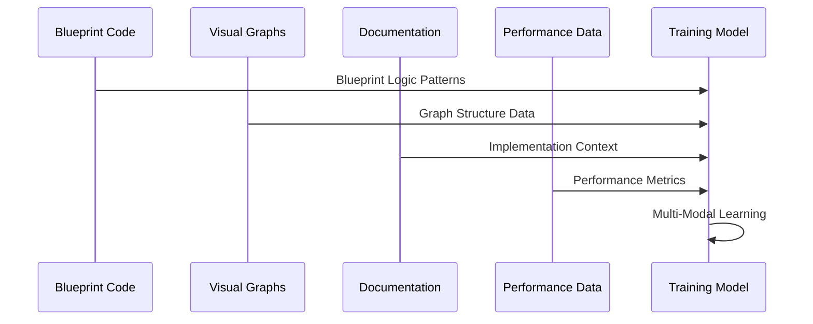
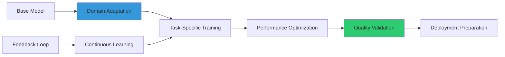
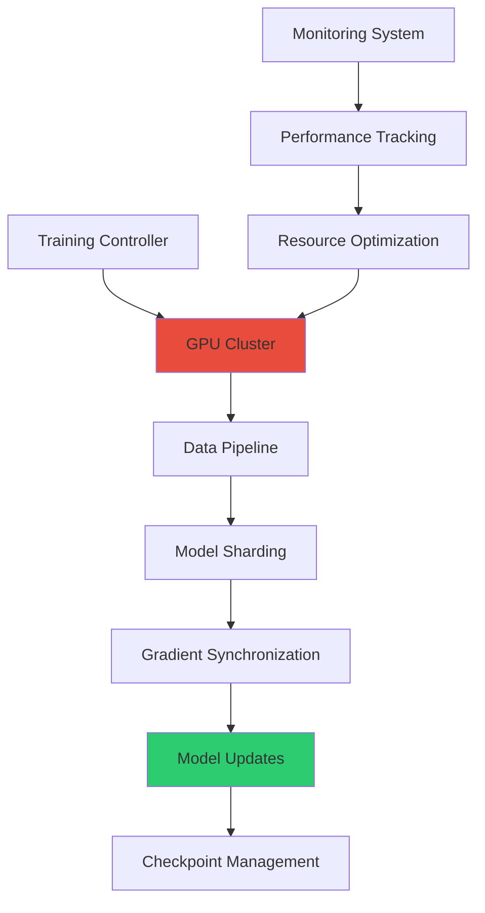
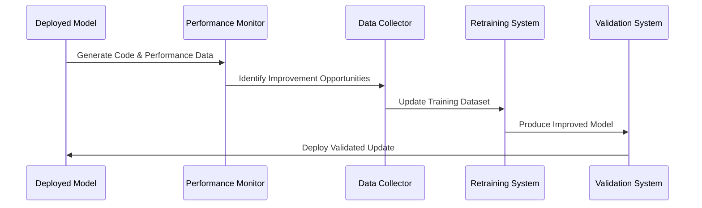
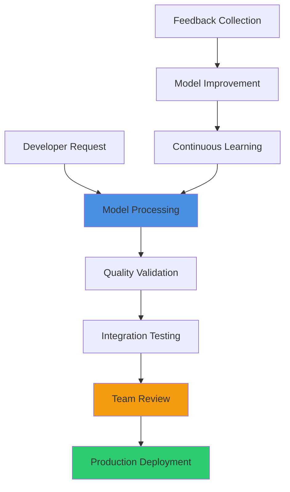

# Custom Model Training

## Overview
Advanced techniques for training custom AI models specifically for UE5.6 Blueprint development. This guide covers dataset preparation, model fine-tuning, deployment strategies, and evaluation methods that create specialized AI assistants optimized for game development workflows and team-specific requirements.

## Dataset Preparation & Curation

### Blueprint-Specific Data Collection


### Professional Data Curation Pipeline

#### Blueprint Pattern Extraction
```
Create comprehensive Blueprint dataset for [PROJECT_DOMAIN]:

Data Collection Strategy:
- Extract Blueprint logic from [PROJECT_COUNT] successful UE5.6 projects
- Collect [PATTERN_COUNT] validated architectural patterns
- Document [ANTI_PATTERN_COUNT] anti-patterns for negative training examples
- Gather performance benchmarks for [SYSTEM_COUNT] different system types
- Include [ERROR_CASE_COUNT] error cases with resolution strategies

Quality Assurance:
- Validate Blueprint logic through compilation testing
- Verify performance standards against [PERFORMANCE_TARGETS]
- Review architectural patterns with [EXPERT_COUNT] senior developers
- Test integration compatibility across [UE_VERSION_COUNT] UE5.6 versions
- Ensure code quality meets [QUALITY_STANDARD] professional standards

Data Annotation:
- Label Blueprint patterns with [CATEGORY_COUNT] architectural categories
- Tag performance characteristics with [PERFORMANCE_METRICS]
- Annotate complexity levels with [COMPLEXITY_SCALE] difficulty ratings
- Mark integration points with [INTEGRATION_TYPES] system dependencies
- Document best practices with [PRACTICE_COUNT] coding guideline references
```

#### Multi-Modal Training Data


**Data Modalities:**
- **Blueprint Graphs**: Visual node connections and execution flow patterns
- **Performance Metrics**: Frame time, memory usage, and optimization data
- **Documentation**: Comments, variable names, and architectural descriptions
- **Integration Context**: System dependencies and communication patterns
- **Error Analysis**: Common mistakes and debugging resolution strategies

### Specialized Dataset Categories

#### Domain-Specific Training Sets
```
Generate specialized training datasets:

Game Genre Specialization:
- FPS mechanics with [FPS_PATTERN_COUNT] weapon and movement patterns
- RPG systems including [RPG_SYSTEM_COUNT] character progression systems
- Strategy game AI with [STRATEGY_AI_COUNT] decision-making patterns
- Racing mechanics with [RACING_FEATURE_COUNT] physics and control systems
- Puzzle game logic with [PUZZLE_TYPE_COUNT] mechanical interaction patterns

Technical Specialization:
- Performance optimization with [OPTIMIZATION_CASE_COUNT] successful optimization examples
- Network programming with [MULTIPLAYER_PATTERN_COUNT] proven networking patterns
- UI/UX implementation with [UI_PATTERN_COUNT] responsive design patterns
- Audio integration with [AUDIO_SYSTEM_COUNT] interactive audio system examples
- Animation systems with [ANIMATION_PATTERN_COUNT] character and object animation patterns

Platform-Specific Data:
- Mobile optimization with [MOBILE_OPTIMIZATION_COUNT] performance-focused examples
- Console development with [CONSOLE_FEATURE_COUNT] platform-specific implementations
- VR systems with [VR_INTERACTION_COUNT] immersive interaction patterns
- PC optimization with [PC_FEATURE_COUNT] scalability and graphics options
- Cross-platform compatibility with [COMPATIBILITY_CASE_COUNT] multi-platform solutions
```

## Model Architecture & Fine-Tuning

### Custom Architecture Design
```
Design specialized model architecture for Blueprint generation:

Model Architecture:
- Transformer-based architecture with [LAYER_COUNT] attention layers
- Multi-head attention with [HEAD_COUNT] specialized attention mechanisms
- Context window of [CONTEXT_LENGTH] tokens for large Blueprint analysis
- Embedding dimension of [EMBEDDING_SIZE] for comprehensive code representation
- Custom tokenizer optimized for Blueprint syntax and UE5.6 terminology

Specialized Components:
- Graph neural network layers for Blueprint node relationship understanding
- Performance prediction modules for execution time and memory estimation
- Integration analysis components for system compatibility assessment
- Quality evaluation layers for code standard compliance checking
- Error detection mechanisms for common Blueprint mistakes identification

Training Configuration:
- Learning rate scheduling with [SCHEDULE_TYPE] optimization strategy
- Batch size optimization for [HARDWARE_CONFIG] training hardware
- Gradient accumulation with [ACCUMULATION_STEPS] step accumulation
- Mixed precision training for [PRECISION_BENEFIT] training efficiency improvement
- Distributed training across [GPU_COUNT] GPUs for accelerated model development
```

### Advanced Fine-Tuning Techniques


#### Progressive Training Strategy
```
Implement multi-stage fine-tuning process:

Stage 1 - Foundation Training:
- Pre-train on [CODEBASE_SIZE] general programming datasets
- Focus on syntax understanding and basic logical structure
- Establish [VOCABULARY_SIZE] vocabulary optimized for game development
- Duration: [FOUNDATION_HOURS] training hours on [FOUNDATION_HARDWARE]
- Validation against [FOUNDATION_TESTS] syntax and logic comprehension tests

Stage 2 - UE5.6 Specialization:
- Fine-tune on [UE_DATASET_SIZE] UE5.6-specific Blueprint examples
- Emphasize [UE_FEATURE_COUNT] modern UE5.6 feature integration
- Performance optimization focus with [OPTIMIZATION_EXAMPLES] examples
- Duration: [SPECIALIZATION_HOURS] hours with [SPECIALIZATION_LEARNING_RATE] learning rate
- Validation through [UE_TEST_COUNT] UE5.6-specific functionality tests

Stage 3 - Project Customization:
- Adapt to [PROJECT_STYLE_COUNT] project-specific coding styles and patterns
- Integrate [TEAM_PATTERN_COUNT] team-specific architectural preferences
- Optimize for [PERFORMANCE_TARGET] project performance requirements
- Duration: [CUSTOMIZATION_HOURS] hours with careful overfitting prevention
- Validation using [PROJECT_TEST_COUNT] project-specific quality metrics
```

### Transfer Learning Optimization
```
Leverage transfer learning for efficient model development:

Source Model Selection:
- Evaluate [BASE_MODEL_COUNT] pre-trained programming models
- Assess compatibility with Blueprint visual scripting paradigms
- Benchmark performance on [BENCHMARK_TASK_COUNT] relevant tasks
- Analyze computational requirements for [DEPLOYMENT_TARGET] deployment scenarios
- Validate licensing compatibility for [USAGE_TYPE] commercial usage

Transfer Strategy:
- Layer freezing with [FROZEN_LAYER_COUNT] preserved base layers
- Progressive unfreezing during [UNFREEZING_SCHEDULE] training schedule
- Learning rate differentiation with [LAYER_LR_RATIO] layer-specific rates
- Regularization techniques preventing catastrophic forgetting
- Validation monitoring ensuring performance maintenance on original capabilities

Adaptation Techniques:
- LoRA (Low-Rank Adaptation) for parameter-efficient fine-tuning
- Adapter layers for modular capability enhancement
- Prompt engineering optimization for task-specific performance
- In-context learning enhancement for few-shot blueprint generation
- Retrieval-augmented generation for access to project-specific knowledge base
```

## Training Infrastructure & Optimization

### Distributed Training Setup


#### High-Performance Training Pipeline
```
Optimize training infrastructure for custom model development:

Hardware Configuration:
- Multi-GPU setup with [GPU_COUNT] high-memory GPUs ([GPU_MEMORY] GB each)
- High-bandwidth interconnect with [BANDWIDTH] GB/s for efficient gradient synchronization
- NVMe storage with [STORAGE_SPEED] GB/s for fast data loading
- CPU configuration with [CPU_CORE_COUNT] cores for data preprocessing
- Memory capacity of [SYSTEM_MEMORY] GB for large dataset handling

Optimization Techniques:
- Model parallelism for [LARGE_MODEL_SIZE] parameter models
- Data parallelism with [BATCH_SIZE] effective batch size across GPUs
- Gradient accumulation preventing memory overflow during large batch training
- Mixed precision training reducing memory usage by [MEMORY_REDUCTION]%
- Dynamic loss scaling preventing gradient underflow in fp16 training

Performance Monitoring:
- Real-time GPU utilization tracking with [UTILIZATION_TARGET]% target efficiency
- Memory usage monitoring preventing out-of-memory errors
- Training loss visualization with [LOGGING_FREQUENCY] update frequency
- Learning rate scheduling with automatic adjustment based on validation metrics
- Checkpoint creation with [CHECKPOINT_FREQUENCY] saving frequency for recovery
```

### Data Pipeline Optimization
```
Create efficient data processing pipeline:

Data Loading Strategy:
- Multi-threaded data loading with [WORKER_COUNT] parallel workers
- Prefetching with [PREFETCH_BUFFER] batch buffer size
- Data augmentation with [AUGMENTATION_COUNT] code transformation techniques
- Caching strategy for [CACHE_SIZE] frequently accessed training examples
- Streaming large datasets with [STREAMING_CHUNK] chunk size optimization

Preprocessing Pipeline:
- Tokenization optimization with [TOKENIZATION_SPEED] tokens per second
- Sequence padding with efficient attention masking
- Dynamic batching grouping similar-length sequences for efficiency
- Quality filtering removing [FILTER_PERCENTAGE]% low-quality examples
- Deduplication preventing overfitting on repeated patterns

Memory Management:
- Memory mapping for efficient large dataset access
- Garbage collection optimization reducing training interruptions
- Memory pooling for consistent memory allocation patterns
- Buffer management preventing memory fragmentation
- Platform-specific optimization for [TRAINING_PLATFORM] infrastructure
```

## Model Evaluation & Validation

### Comprehensive Testing Framework
```
Design thorough model evaluation system:

Functional Testing:
- Blueprint generation accuracy with [ACCURACY_TARGET]% success rate
- Syntax correctness validation with [SYNTAX_TEST_COUNT] test cases
- Performance prediction accuracy within [PREDICTION_ERROR]% margin
- Integration compatibility testing with [INTEGRATION_TEST_COUNT] scenarios
- Error handling validation with [ERROR_CASE_COUNT] edge case tests

Quality Assessment:
- Code quality evaluation against [QUALITY_METRICS] professional standards
- Architectural pattern compliance with [PATTERN_COUNT] established patterns
- Performance optimization effectiveness with [OPTIMIZATION_METRICS]
- Documentation quality with [DOCUMENTATION_STANDARDS] completeness metrics
- Maintainability assessment through [MAINTAINABILITY_METRICS] complexity analysis

Comparative Evaluation:
- Benchmark against [BASELINE_COUNT] existing AI programming assistants
- Human expert comparison with [EXPERT_COUNT] professional developers
- Time-to-completion measurement for [TASK_COUNT] development tasks
- Quality comparison using [QUALITY_JUDGES] independent quality assessors
- User satisfaction measurement with [USER_COUNT] beta testers
```

### Continuous Improvement Pipeline


#### Iterative Model Enhancement
```
Implement continuous learning and improvement system:

Performance Monitoring:
- Real-time usage analytics tracking [USAGE_METRICS] developer interaction patterns
- Code quality assessment with automated [QUALITY_CHECK_COUNT] quality checks
- Performance impact measurement with [PERFORMANCE_MONITORING] system integration
- Error rate tracking with [ERROR_CLASSIFICATION] categorized error analysis
- User feedback collection with [FEEDBACK_CATEGORIES] structured feedback types

Adaptive Learning:
- Online learning integration for [ADAPTATION_SPEED] rapid model adaptation
- Feedback incorporation with [FEEDBACK_PROCESSING] automated feedback processing
- A/B testing framework comparing [TEST_VARIANT_COUNT] model variations
- Personalization system adapting to [USER_PREFERENCE_COUNT] individual developer preferences
- Knowledge base expansion with [KNOWLEDGE_GROWTH_RATE] continuous learning rate

Model Versioning:
- Semantic versioning with [VERSION_COMPATIBILITY] backward compatibility maintenance
- Rollback capabilities for [ROLLBACK_SCENARIOS] problematic model updates
- Feature flagging for [FEATURE_COUNT] gradual feature rollout
- Deployment pipeline with [DEPLOYMENT_STAGE_COUNT] staged deployment process
- Quality gates preventing [QUALITY_THRESHOLD] substandard model releases
```

## Deployment & Production Integration

### Production Deployment Strategy
```
Deploy custom model for production use:

Infrastructure Requirements:
- Model serving with [INFERENCE_LATENCY] millisecond response time
- Auto-scaling supporting [USER_COUNT] concurrent users
- Load balancing across [SERVER_COUNT] inference servers
- Memory optimization with [MEMORY_EFFICIENCY] efficient model loading
- Platform compatibility supporting [PLATFORM_COUNT] deployment environments

Integration Features:
- API design with [ENDPOINT_COUNT] specialized endpoints
- Authentication system supporting [AUTH_METHOD_COUNT] security methods
- Rate limiting with [RATE_LIMIT] requests per user per minute
- Caching strategy with [CACHE_HIT_RATE]% target cache hit rate
- Monitoring system with [MONITORING_METRICS] performance and health metrics

Security & Compliance:
- Code security scanning preventing [SECURITY_THREAT_COUNT] common vulnerabilities
- Data privacy compliance with [PRIVACY_STANDARDS] regulatory requirements
- Access control with [PERMISSION_LEVEL_COUNT] granular permission levels
- Audit logging with [AUDIT_DETAIL_LEVEL] comprehensive activity tracking
- Backup and disaster recovery with [RECOVERY_TIME] target recovery time
```

### Team Integration Workflow


#### Professional Workflow Integration
```
Integrate custom model with development workflow:

Development Environment:
- IDE plugin integration with [IDE_COUNT] supported development environments
- Real-time code completion with [COMPLETION_ACCURACY]% accuracy rate
- Error detection with [ERROR_DETECTION_SPEED] real-time analysis
- Code review assistance with [REVIEW_CRITERIA_COUNT] quality criteria
- Documentation generation with [DOCUMENTATION_COMPLETENESS]% automation

Team Collaboration:
- Shared model customization with [CUSTOMIZATION_SYNC] team synchronization
- Knowledge sharing with [KNOWLEDGE_BASE_SIZE] searchable solution library
- Code standard enforcement with [STANDARD_COMPLIANCE]% automatic compliance checking
- Learning acceleration with [LEARNING_RESOURCE_COUNT] educational resources
- Progress tracking with [PRODUCTIVITY_METRICS] team productivity measurement

Quality Assurance:
- Automated testing integration with [TEST_COVERAGE]% code coverage validation
- Performance regression detection with [REGRESSION_SENSITIVITY] detection sensitivity
- Code quality gates with [QUALITY_GATE_COUNT] automated quality checkpoints
- Integration testing with [INTEGRATION_TEST_COVERAGE]% system compatibility testing
- Continuous integration with [CI_PIPELINE_COUNT] automated pipeline stages
```

This comprehensive custom model training approach ensures that teams can create specialized AI assistants that understand their specific UE5.6 Blueprint development needs while maintaining professional quality standards and integrating seamlessly with existing development workflows.
