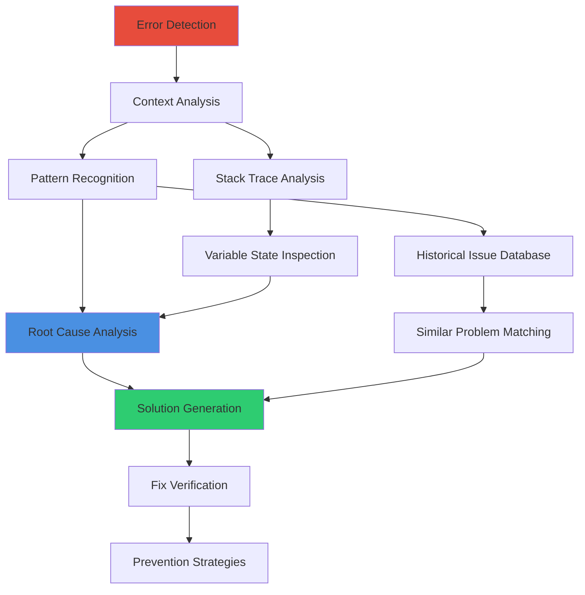
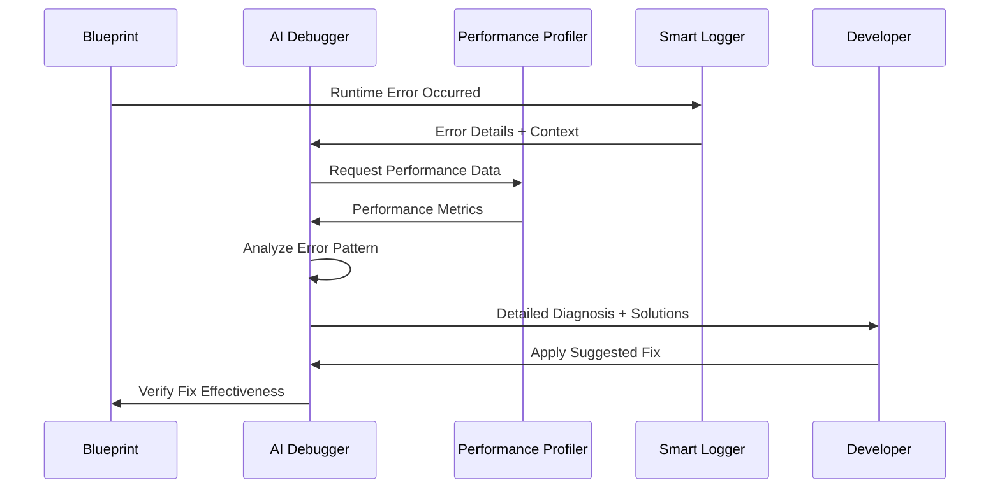
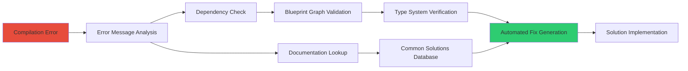
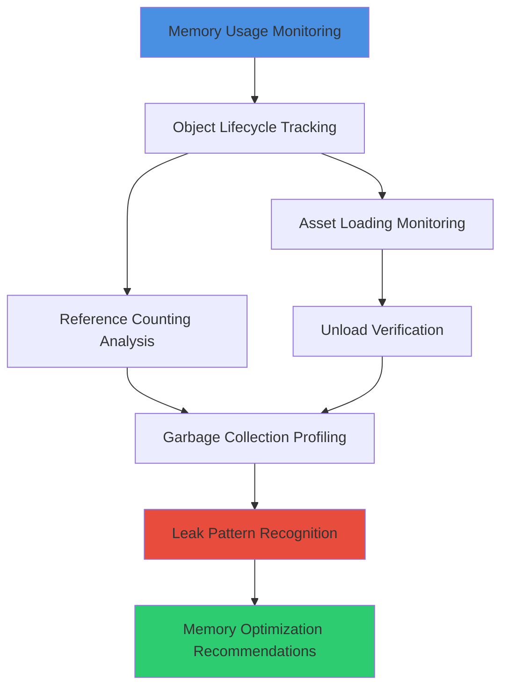
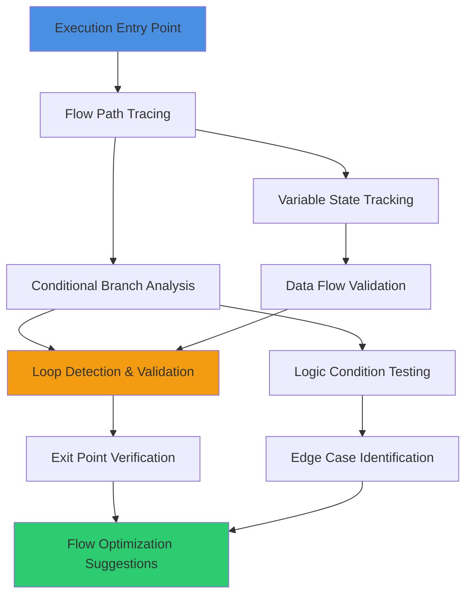
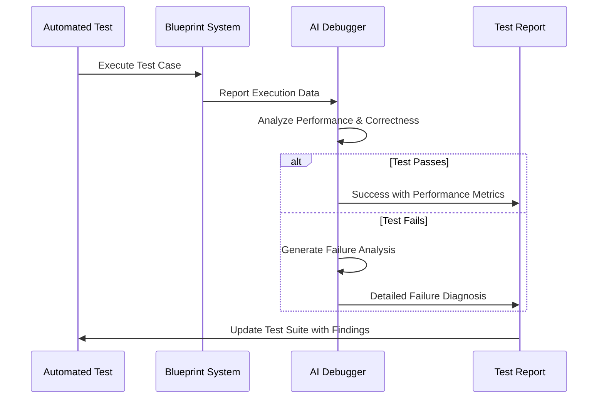
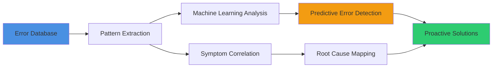
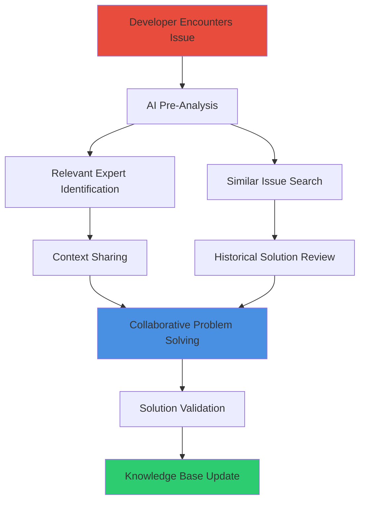

# Debugging & Troubleshooting

## Overview
AI-enhanced debugging and troubleshooting for UE5.6 Blueprint development. This guide covers intelligent error detection, automated diagnostic analysis, performance debugging, and advanced troubleshooting techniques that quickly resolve complex Blueprint issues and accelerate development.

## Intelligent Debugging Framework

### AI-Powered Error Analysis


### Debug Information Gathering
- **Automatic Context Collection**: Gather relevant Blueprint state, variable values, and execution flow
- **Dependency Mapping**: Identify all components and systems involved in the error
- **Timeline Reconstruction**: Recreate the sequence of events leading to the issue
- **Performance Impact Assessment**: Analyze how the error affects overall system performance

## Error Detection & Classification

### Runtime Error Analysis


#### Error Categories
- **Logic Errors**: Incorrect Blueprint flow, condition evaluation issues
- **Performance Errors**: Frame rate drops, memory leaks, excessive resource usage
- **Integration Errors**: Component interaction failures, event system breakdowns
- **Data Errors**: Invalid asset references, type mismatches, serialization issues

#### Severity Classification
- **Critical**: System crashes, data corruption, complete functionality breakdown
- **High**: Major feature failures, significant performance degradation
- **Medium**: Minor functionality issues, performance concerns
- **Low**: Code quality issues, potential future problems

### Compilation Error Resolution


## Performance Debugging

### Frame Rate Analysis
- **Bottleneck Identification**: Pinpoint specific Blueprint functions causing frame drops
- **Execution Time Profiling**: Measure individual node execution times and identify slowdowns
- **Memory Allocation Tracking**: Monitor memory usage patterns and garbage collection impact
- **Draw Call Optimization**: Identify rendering-related performance issues in Blueprint logic

### Memory Leak Detection


#### Memory Debugging Strategies
- **Object Pool Monitoring**: Track object reuse and pool efficiency
- **Asset Reference Auditing**: Identify unreleased asset references
- **Event Listener Cleanup**: Verify proper event unbinding and cleanup
- **Component Lifecycle Validation**: Ensure proper component destruction

### Network Debugging
- **Replication Analysis**: Debug Blueprint replication issues and synchronization problems
- **Bandwidth Optimization**: Identify network-heavy Blueprint operations
- **Authority Validation**: Verify proper client-server authority handling
- **Prediction Debugging**: Analyze client-side prediction accuracy and rollback issues

## Advanced Troubleshooting Techniques

### Blueprint Flow Analysis


### Interactive Debugging Features
- **Smart Breakpoints**: Automatically set breakpoints at critical execution points
- **Variable Watchers**: Monitor specific variables and trigger alerts on unexpected changes
- **Execution Timeline**: Visualize Blueprint execution flow with interactive timeline
- **State Comparison**: Compare Blueprint states before and after specific operations

### Automated Testing Integration


## Diagnostic Tools & Utilities

### Blueprint Health Checker
- **Structural Analysis**: Verify Blueprint organization and architecture health
- **Performance Validation**: Ensure Blueprints meet performance requirements
- **Best Practice Compliance**: Check adherence to coding standards and patterns
- **Integration Verification**: Validate proper system integration and dependencies

### Error Pattern Recognition


### Smart Logging System
- **Contextual Logging**: Automatically include relevant context with log messages
- **Severity-Based Filtering**: Intelligent log level management based on error severity
- **Performance Impact Monitoring**: Track logging overhead and optimize accordingly
- **Searchable Log History**: Advanced search and filtering capabilities for historical analysis

## Team Collaboration & Knowledge Sharing

### Issue Documentation
- **Automatic Bug Reports**: Generate comprehensive bug reports with diagnostic information
- **Solution Knowledge Base**: Build searchable database of common issues and solutions
- **Team Learning**: Share debugging insights and techniques across team members
- **Progress Tracking**: Monitor debugging efficiency and team skill development

### Collaborative Debugging


## Prevention & Quality Assurance

### Proactive Issue Detection
- **Static Analysis Integration**: Identify potential issues before runtime
- **Code Review Automation**: Automatically flag problematic patterns during development
- **Performance Regression Testing**: Detect performance degradation early in development
- **Integration Conflict Prevention**: Identify potential conflicts between Blueprint systems

### Quality Metrics & Monitoring
- **Blueprint Reliability Score**: Track Blueprint stability and error rates over time
- **Performance Benchmarking**: Establish and monitor performance baselines
- **Developer Productivity Metrics**: Measure debugging efficiency and time-to-resolution
- **System Health Dashboard**: Real-time monitoring of overall project health

## Implementation Examples

### Common Debug Scenarios

#### Character Movement Issues
```
Issue: Character getting stuck in geometry
AI Analysis: Collision detection overlap, capsule component sizing issue
Solution: Adjust collision channels, implement unstuck logic, add collision debugging
Prevention: Automated collision testing, geometry validation
```

#### Performance Bottlenecks
```
Issue: Frame rate drops during large battles
AI Analysis: Tick function overload, excessive object spawning
Solution: Convert to event-driven architecture, implement object pooling
Prevention: Performance budgeting, continuous profiling
```

#### Network Synchronization
```
Issue: Client-server state desynchronization
AI Analysis: Replication timing mismatch, prediction rollback failure
Solution: Optimize replication frequency, improve prediction accuracy
Prevention: Network simulation testing, authority validation
```

### Debugging Workflow Example
1. **Error Detection**: AI identifies performance degradation in inventory system
2. **Context Gathering**: Collect variable states, execution flow, and system interactions
3. **Pattern Matching**: Compare against known performance issues in inventory systems
4. **Solution Generation**: Suggest object pooling and event optimization
5. **Implementation Guidance**: Provide step-by-step refactoring instructions
6. **Verification**: Test solution effectiveness and monitor for regression

This comprehensive debugging and troubleshooting approach ensures rapid issue resolution while building team knowledge and preventing future problems through intelligent analysis and proactive monitoring.
