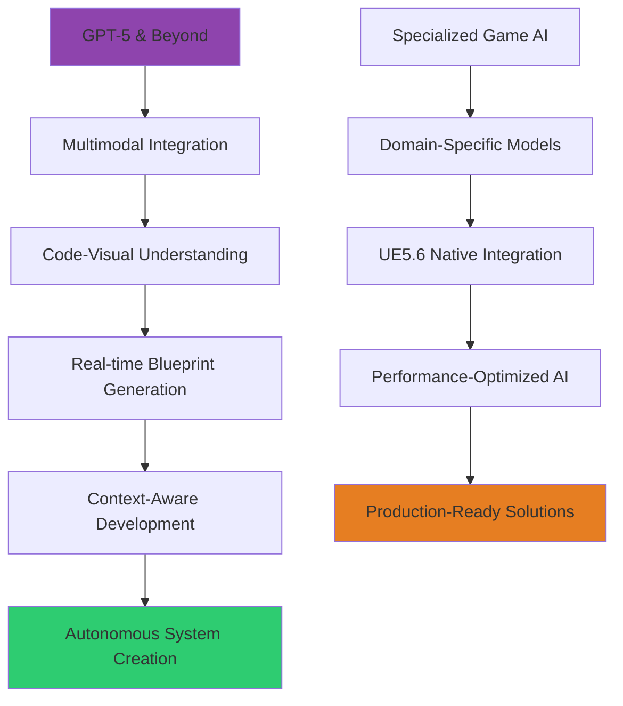
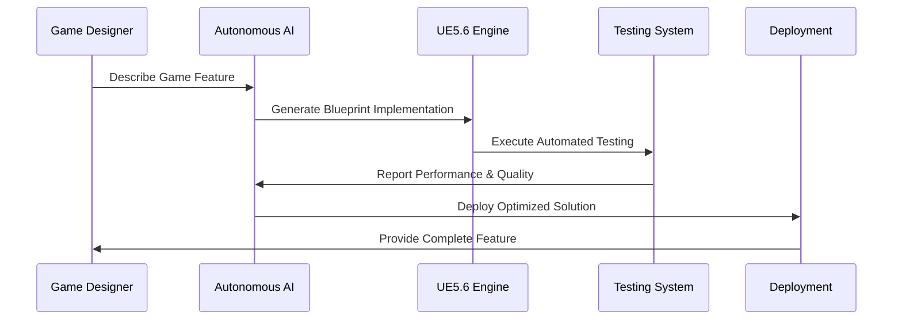
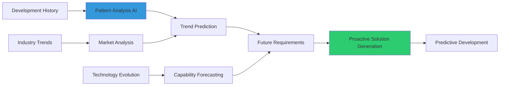
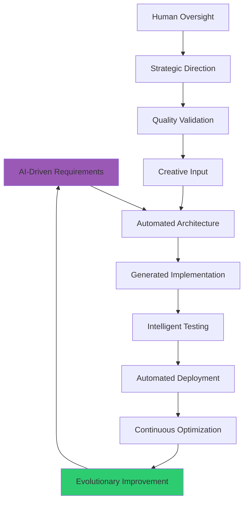
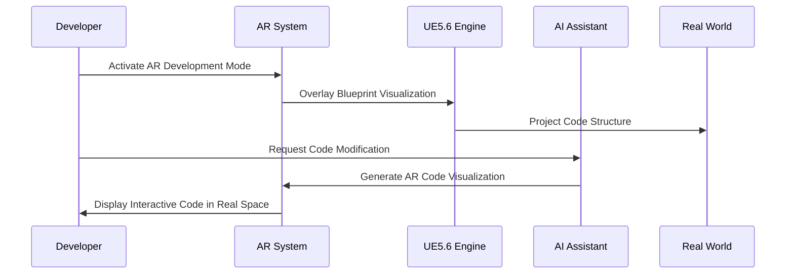

# Future Technologies

## Overview
Emerging AI technologies and future innovations that will transform UE5.6 Blueprint development. This guide explores cutting-edge AI developments, predictive development patterns, and next-generation tools that will shape the future of game development workflows and Blueprint programming methodologies.

## Emerging AI Technologies

### Next-Generation Language Models


### Advanced AI Capabilities

#### Multimodal AI Integration
```
Explore next-generation multimodal AI for Blueprint development:

Visual-Code Integration:
- Blueprint graph visual understanding with [VISUAL_ACCURACY]% node recognition accuracy
- Automatic Blueprint creation from concept sketches and wireframes
- Real-time visual debugging with AI-powered Blueprint flow visualization
- Design-to-code translation with [TRANSLATION_FIDELITY] implementation fidelity
- Cross-modal consistency checking ensuring visual and logical Blueprint alignment

Audio-Code Synthesis:
- Voice-to-Blueprint generation with [VOICE_RECOGNITION] natural language processing
- Audio debugging with spoken error explanation and solution guidance
- Collaborative voice programming with [COLLABORATION_FEATURES] multi-developer voice interaction
- Audio documentation generation with [AUDIO_QUALITY] professional narration quality
- Real-time audio feedback during Blueprint development and testing

Advanced Context Understanding:
- Project-wide context awareness spanning [CONTEXT_SCOPE] development artifacts
- Historical development pattern learning with [PATTERN_MEMORY] long-term memory capabilities
- Cross-system integration understanding with [INTEGRATION_INTELLIGENCE] comprehensive system knowledge
- Performance impact prediction with [PREDICTION_ACCURACY] execution characteristic forecasting
- Team workflow adaptation with [WORKFLOW_AI] personalized development assistance
```

#### Autonomous Development Systems


**Autonomous AI Features:**
- **Self-Improving Systems**: AI that learns from deployment outcomes and continuously optimizes generated code
- **Autonomous Testing**: AI-driven test case generation, execution, and failure analysis with automatic fixes
- **Predictive Optimization**: AI that anticipates performance bottlenecks and optimizes before issues occur
- **Adaptive Architecture**: Systems that evolve their architecture based on usage patterns and requirements changes
- **Intelligent Documentation**: Self-documenting code that maintains comprehensive, up-to-date documentation automatically

### Quantum-Enhanced AI Computing

#### Quantum AI Applications
```
Investigate quantum computing applications for game development AI:

Quantum Advantages:
- Exponential optimization for [OPTIMIZATION_PROBLEMS] complex Blueprint optimization challenges
- Quantum machine learning with [QML_SPEEDUP] acceleration over classical methods
- Parallel universe simulation for [SIMULATION_COUNT] simultaneous gameplay scenario testing
- Quantum cryptography for [SECURITY_LEVEL] ultra-secure game asset protection
- Quantum random generation for [RANDOMNESS_QUALITY] true randomness in procedural content

Development Applications:
- Quantum-enhanced pathfinding with [PATHFINDING_COMPLEXITY] exponential complexity handling
- Quantum AI training with [TRAINING_ACCELERATION] dramatically reduced training times
- Quantum simulation for [PHYSICS_ACCURACY] unprecedented physics simulation accuracy
- Quantum optimization for [RESOURCE_OPTIMIZATION] optimal resource allocation and scheduling
- Quantum cryptography for [DATA_PROTECTION] absolute game data and code security

Implementation Readiness:
- Hybrid classical-quantum systems with [HYBRID_EFFICIENCY] practical quantum advantage
- Quantum cloud services with [CLOUD_ACCESSIBILITY] developer-accessible quantum computing
- Quantum development tools with [TOOL_MATURITY] production-ready quantum programming
- Cost-benefit analysis with [ECONOMIC_VIABILITY] realistic quantum computing economics
- Timeline projections with [ADOPTION_TIMELINE] practical quantum AI deployment schedules
```

## Predictive Development Patterns

### AI-Driven Development Forecasting


#### Intelligent Development Prediction
```
Implement predictive AI for development workflow optimization:

Predictive Analytics:
- Feature demand forecasting with [PREDICTION_HORIZON] month development timeline prediction
- Performance bottleneck prediction with [BOTTLENECK_ACCURACY] early performance issue identification
- Team skill gap prediction with [SKILL_FORECASTING] future training need identification
- Technology obsolescence warning with [OBSOLESCENCE_TIMELINE] technology lifecycle management
- Integration complexity estimation with [COMPLEXITY_PREDICTION] system integration difficulty assessment

Proactive Optimization:
- Pre-emptive performance optimization with [OPTIMIZATION_TIMING] early optimization implementation
- Automatic dependency updates with [DEPENDENCY_MANAGEMENT] intelligent library version management
- Predictive bug prevention with [BUG_PREVENTION] code quality issue prevention
- Capacity planning with [CAPACITY_FORECASTING] resource requirement prediction
- Risk mitigation with [RISK_PREDICTION] project risk early warning system

Adaptive Development:
- Dynamic methodology adjustment with [METHODOLOGY_ADAPTATION] process optimization based on prediction
- Intelligent tool selection with [TOOL_RECOMMENDATION] optimal development tool suggestion
- Automated workflow evolution with [WORKFLOW_EVOLUTION] self-improving development processes
- Predictive collaboration optimization with [COLLABORATION_PREDICTION] team interaction enhancement
- Future-ready architecture with [ARCHITECTURE_EVOLUTION] adaptable system design patterns
```

### Next-Generation Development Workflows

#### Cognitive Development Assistance
```
Design cognitive AI assistance for advanced development workflows:

Cognitive Features:
- Intention understanding with [INTENTION_ACCURACY] developer goal comprehension
- Context synthesis with [CONTEXT_INTEGRATION] comprehensive project context understanding
- Creative collaboration with [CREATIVITY_ENHANCEMENT] AI-human creative partnership
- Decision support with [DECISION_AI] intelligent development decision assistance
- Learning acceleration with [LEARNING_BOOST] personalized skill development enhancement

Advanced Assistance:
- Automated code generation with [GENERATION_QUALITY] production-ready code creation
- Intelligent refactoring with [REFACTORING_INTELLIGENCE] architectural improvement suggestions
- Real-time optimization with [REAL_TIME_OPTIMIZATION] continuous performance enhancement
- Collaborative debugging with [DEBUG_COLLABORATION] AI-assisted problem solving
- Predictive maintenance with [MAINTENANCE_PREDICTION] proactive code health management

Workflow Integration:
- Seamless tool integration with [INTEGRATION_DEPTH] comprehensive development environment unity
- Natural language programming with [NLP_PROGRAMMING] conversational code development
- Visual programming enhancement with [VISUAL_ENHANCEMENT] advanced Blueprint visual programming
- Automated testing integration with [TEST_AUTOMATION] comprehensive quality assurance automation
- Continuous deployment with [CD_INTELLIGENCE] intelligent release management
```

## Revolutionary Development Paradigms

### AI-First Development Methodology


#### Paradigm Shift Features
```
Explore revolutionary AI-first development approaches:

AI-Driven Development:
- Requirements to implementation with [IMPLEMENTATION_SPEED] rapid development cycle
- Automatic architecture generation with [ARCHITECTURE_QUALITY] professional architecture creation
- Self-optimizing code with [OPTIMIZATION_INTELLIGENCE] continuous performance improvement
- Autonomous quality assurance with [QA_AUTOMATION] comprehensive testing and validation
- Intelligent deployment with [DEPLOYMENT_AI] optimal release strategy execution

Human-AI Collaboration:
- Creative partnership with [COLLABORATION_BALANCE] optimal human-AI work distribution
- Strategic oversight with [STRATEGIC_AI] high-level decision support
- Quality validation with [VALIDATION_PARTNERSHIP] human expertise and AI efficiency combination
- Innovation guidance with [INNOVATION_AI] creative solution generation and evaluation
- Team augmentation with [AUGMENTATION_EFFECTIVENESS] human capability enhancement

Revolutionary Features:
- Intention-driven programming with [INTENTION_PROGRAMMING] goal-based code generation
- Adaptive system architecture with [ADAPTIVE_ARCHITECTURE] self-evolving system design
- Predictive user experience with [UX_PREDICTION] user behavior anticipation and optimization
- Autonomous performance tuning with [PERFORMANCE_AI] self-optimizing system performance
- Evolutionary game design with [DESIGN_EVOLUTION] AI-driven gameplay refinement
```

### Immersive Development Environments

#### Virtual Reality Development Workspaces
```
Create immersive VR-based development environments:

VR Development Features:
- 3D Blueprint editing with [SPATIAL_EDITING] intuitive spatial code manipulation
- Immersive debugging with [VR_DEBUGGING] 3D visualization of code execution flow
- Collaborative virtual workspaces with [VIRTUAL_COLLABORATION] multi-developer VR environments
- Gesture-based programming with [GESTURE_PROGRAMMING] natural hand gesture code input
- Real-time world building with [VR_WORLD_BUILDING] immersive level design and development

Advanced VR Capabilities:
- Holographic code visualization with [HOLOGRAPHIC_DISPLAY] advanced code structure visualization
- Brain-computer interface integration with [BCI_INTEGRATION] direct thought-to-code translation
- Haptic feedback programming with [HAPTIC_PROGRAMMING] tactile code interaction
- Eye-tracking optimization with [EYE_TRACKING] gaze-based code navigation and selection
- Voice-controlled development with [VOICE_DEVELOPMENT] natural language development commands

Productivity Enhancement:
- Multi-dimensional debugging with [DIMENSIONAL_DEBUG] complex system state visualization
- Immersive performance profiling with [VR_PROFILING] 3D performance bottleneck identification
- Virtual team meetings with [VR_MEETINGS] immersive collaborative development sessions
- Spatial memory enhancement with [SPATIAL_MEMORY] improved code location memory and navigation
- Stress reduction with [VR_WELLNESS] comfortable and ergonomic development environments
```

### Augmented Reality Development Integration


#### AR-Enhanced Development
```
Implement augmented reality development assistance:

AR Development Features:
- Real-world Blueprint overlay with [AR_PRECISION] accurate spatial code visualization
- Contextual information display with [CONTEXT_AR] relevant development information overlay
- Interactive code manipulation with [AR_INTERACTION] gesture-based code editing
- Real-time debugging visualization with [AR_DEBUGGING] live code execution visualization in space
- Collaborative AR development with [AR_COLLABORATION] shared AR development spaces

Advanced AR Integration:
- Mixed reality testing with [MR_TESTING] real-world game testing with AR feedback
- Spatial code organization with [SPATIAL_ORGANIZATION] 3D code structure management
- AR documentation with [AR_DOCS] contextual documentation overlay
- Real-world performance monitoring with [AR_MONITORING] spatial performance visualization
- AR pair programming with [AR_PAIRING] shared AR development workspaces

Practical Applications:
- Mobile development testing with [MOBILE_AR] real device AR testing and debugging
- Level design visualization with [LEVEL_AR] AR-based level design and modification
- Asset placement optimization with [ASSET_AR] AR-guided optimal asset positioning
- User interface testing with [UI_AR] AR-based UI testing in real environments
- Performance visualization with [PERFORMANCE_AR] spatial performance bottleneck identification
```

## Technology Integration Roadmap

### Implementation Timeline & Strategy
```
Plan strategic implementation of future AI technologies:

Short-term (1-2 Years):
- Enhanced language models with [ENHANCED_LLM] improved Blueprint understanding
- Advanced code completion with [COMPLETION_AI] context-aware intelligent suggestions
- Automated testing with [TEST_AI] comprehensive AI-driven quality assurance
- Performance optimization with [OPTIMIZATION_AI] intelligent performance enhancement
- Team collaboration tools with [COLLABORATION_AI] AI-enhanced teamwork capabilities

Medium-term (3-5 Years):
- Multimodal development with [MULTIMODAL_AI] visual, audio, and text integrated development
- Autonomous code generation with [AUTONOMOUS_CODE] self-improving code generation systems
- Predictive development with [PREDICTIVE_AI] future requirement and issue prediction
- VR/AR development integration with [IMMERSIVE_DEV] spatial development environments
- Quantum-enhanced optimization with [QUANTUM_AI] early quantum computing integration

Long-term (5-10 Years):
- Full autonomous development with [FULL_AUTONOMY] complete AI-driven development cycles
- Brain-computer interface with [BCI_DEVELOPMENT] direct thought-to-code development
- Quantum AI systems with [QUANTUM_SYSTEMS] production quantum AI development tools
- Evolutionary programming with [EVOLUTIONARY_AI] self-evolving software systems
- Consciousness-level AI with [AGI_DEVELOPMENT] artificial general intelligence integration

Strategic Considerations:
- Technology readiness assessment with [READINESS_EVALUATION] practical implementation evaluation
- Cost-benefit analysis with [ECONOMIC_ANALYSIS] realistic economic impact assessment
- Risk management with [RISK_ASSESSMENT] comprehensive technology adoption risk evaluation
- Team preparation with [PREPARATION_STRATEGY] workforce development and training planning
- Integration planning with [INTEGRATION_ROADMAP] systematic technology adoption strategy
```

This comprehensive exploration of future technologies provides a roadmap for the evolution of AI-enhanced UE5.6 Blueprint development, ensuring teams are prepared for the next generation of game development tools and methodologies while maintaining focus on practical, production-ready solutions.
