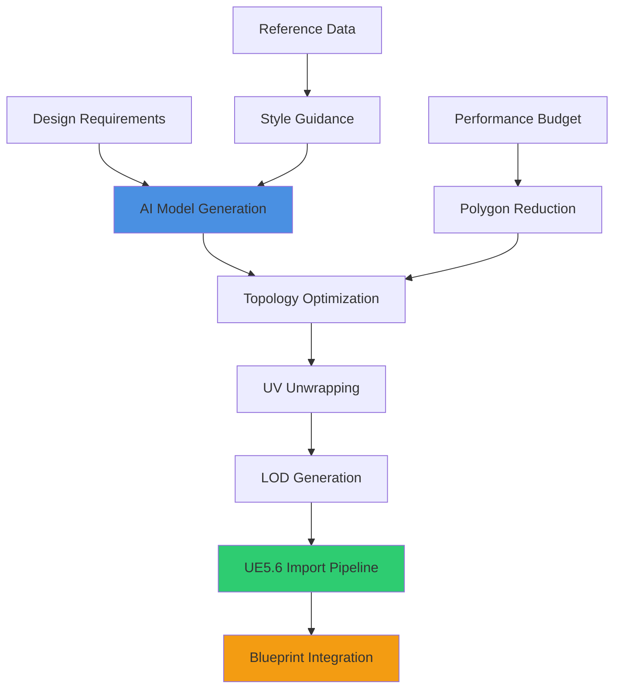
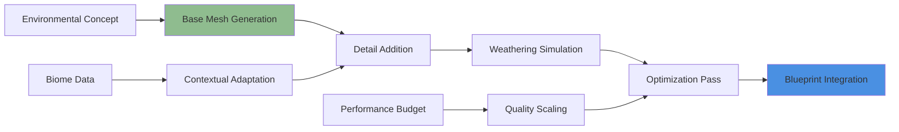
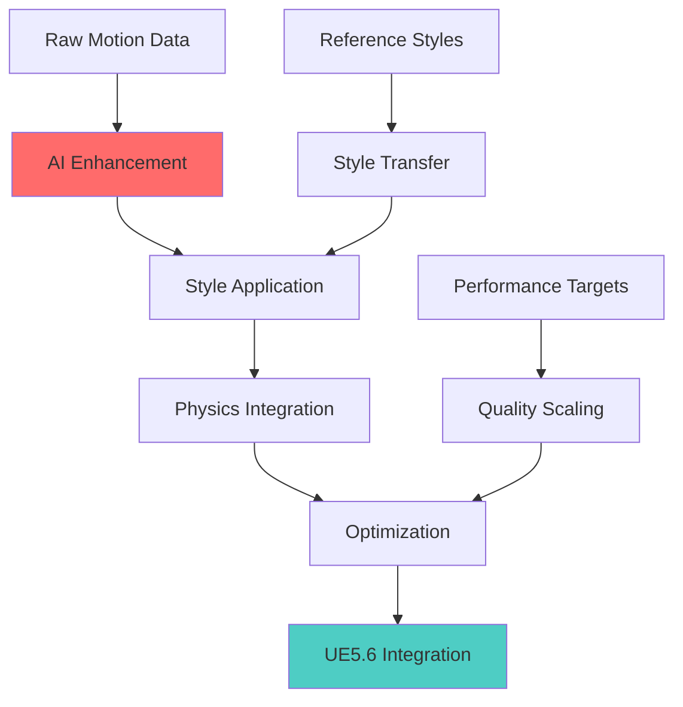
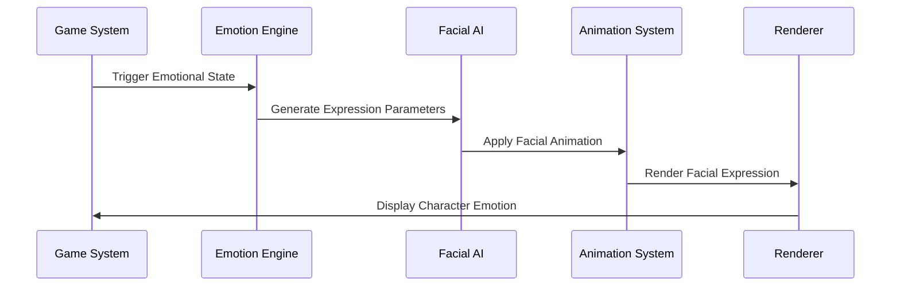
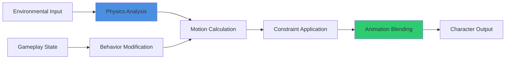
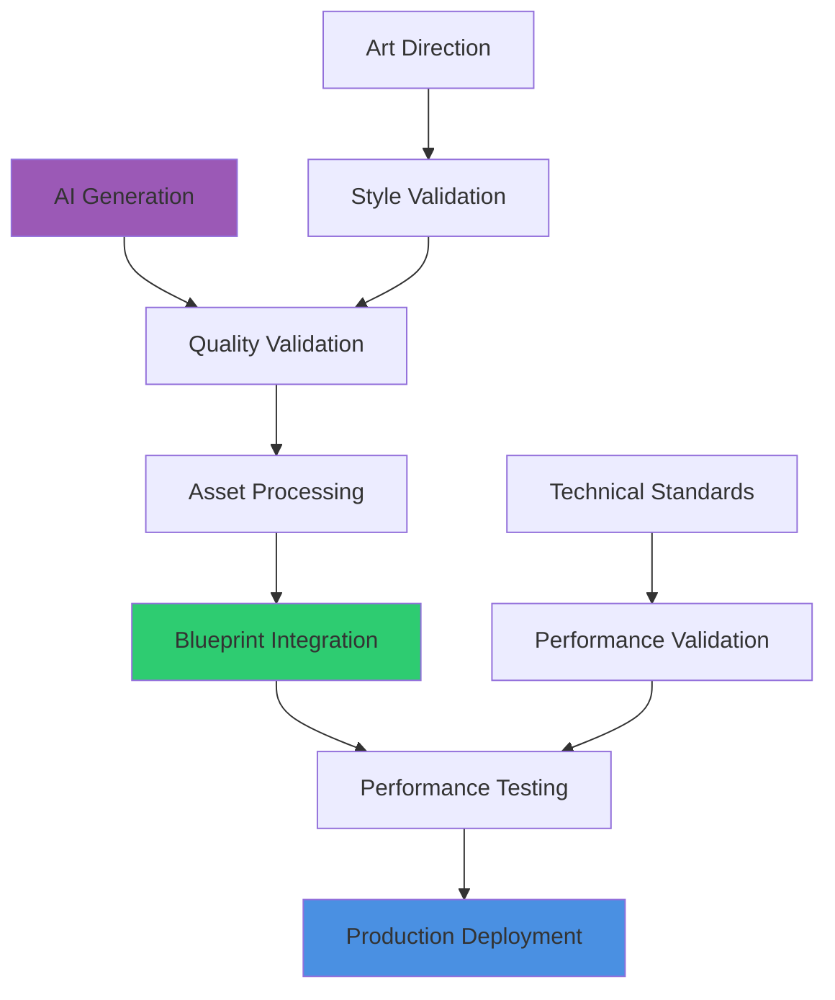

# Model & Animation AI

## Overview
AI-powered 3D model and animation generation for UE5.6 Blueprint integration. This guide covers procedural mesh creation, intelligent animation systems, and automated rigging workflows that produce game-ready assets optimized for performance and seamless Blueprint integration.

## 3D Model Generation

### Procedural Mesh Creation


### Professional Model Generation Pipeline

#### AI-Driven Asset Creation
```
Generate game-ready 3D model for [ASSET_TYPE]:

Model Specifications:
- Polygon count: [MIN_POLYS] to [MAX_POLYS] triangles
- UV mapping with [TEXEL_DENSITY] texel density consistency
- Normal map support with [SMOOTHING_GROUPS] smoothing groups
- LOD chain generation with [LOD_LEVELS] detail levels
- Collision mesh creation optimized for UE5.6 physics system

Technical Requirements:
- Manifold geometry ensuring clean mesh topology
- Optimized vertex order for GPU cache efficiency
- Proper pivot point placement for animation and physics
- Material slot organization with [MATERIAL_SLOTS] maximum slots
- Naming convention compliance with project standards

Quality Standards:
- Visual fidelity meeting [QUALITY_TARGET] quality tier
- Performance optimization for [TARGET_PLATFORM] hardware
- Art direction compliance with established style guide
- Technical validation through automated mesh analysis
- Integration testing with existing Blueprint component systems
```

#### Advanced Mesh Processing
```mermaid
sequenceDiagram
    participant AI as AI Generator
    participant Proc as Mesh Processor
    participant Opt as Optimizer
    participant Valid as Validator
    participant Engine as UE5.6
    
    AI->>Proc: Generate Base Mesh
    Proc->>Opt: Apply Topology Optimization
    Opt->>Valid: Submit Optimized Mesh
    Valid->>Engine: Import Validated Asset
    Engine->>Engine: Generate Blueprint Components
```

**Mesh Processing Steps:**
1. **Topology Analysis**: Evaluate mesh structure for game engine compatibility
2. **Edge Flow Optimization**: Improve edge loops for deformation and animation
3. **Vertex Welding**: Eliminate duplicate vertices reducing memory usage
4. **Normal Calculation**: Generate smooth normals with proper hard edge detection
5. **UV Optimization**: Maximize texture space utilization with minimal stretching
6. **LOD Generation**: Create distance-based detail reduction maintaining silhouette

### Specialized Model Types

#### Character Model Generation
```
Create character model system with AI generation:

Character Architecture:
- Modular component system supporting [CUSTOMIZATION_OPTIONS] customization levels
- Facial feature generation with [EXPRESSION_COUNT] blend shape targets
- Clothing system with [OUTFIT_VARIATIONS] interchangeable outfit options
- Accessory attachment points with proper bone weighting
- Hair system integration supporting UE5.6's strand-based hair rendering

Technical Implementation:
- Skeleton hierarchy optimized for UE5.6 animation system
- Bone weighting with [INFLUENCE_COUNT] maximum influences per vertex
- Blend shape generation for facial animation and character customization
- Texture coordinate layout optimizing for character texture atlasing
- Integration with UE5.6's MetaHuman system for high-quality character rendering

Performance Optimization:
- Level-of-detail system for character distance-based quality scaling
- Bone LOD implementation reducing animation cost at distance
- Texture streaming integration for memory-efficient character rendering
- Animation compression optimization maintaining quality with reduced memory footprint
- Platform-specific optimization profiles for different hardware targets
```

#### Environmental Asset Generation


**Environmental Asset Features:**
- **Procedural Variation**: Generate multiple variations from single base design
- **Environmental Integration**: Adapt models based on biome and lighting conditions
- **Weathering System**: Apply realistic wear patterns and environmental damage
- **Modular Design**: Create interlocking pieces for flexible level construction
- **Performance Scaling**: Dynamic quality adjustment based on importance and distance

## Animation Generation & Processing

### Procedural Animation Creation
```
Generate animation system for [CHARACTER_TYPE]:

Animation Requirements:
- Frame rate: [FRAMERATE] FPS with [COMPRESSION_RATIO] compression efficiency
- Bone count support: [MIN_BONES] to [MAX_BONES] bone hierarchy
- Animation blending with [BLEND_SAMPLES] blend space dimensions
- Root motion extraction for gameplay movement integration
- Loop optimization for seamless animation cycling

AI-Driven Features:
- Motion synthesis from reference video data
- Style transfer applying motion characteristics from reference animations
- Procedural secondary animation for cloth, hair, and accessories
- Facial animation generation synchronized with audio input
- Real-time motion adaptation based on environmental constraints

Blueprint Integration:
- Animation Blueprint setup with state machine architecture
- Event-driven animation triggers with smooth transition handling
- Parameter-based animation blending for responsive character control
- Performance optimization with animation LOD and culling systems
- Integration with Enhanced Input system for responsive character interaction
```

### Motion Capture Enhancement


#### Advanced Motion Processing
```
Motion Enhancement Pipeline:

Data Processing:
- Noise reduction while preserving motion authenticity
- Gap filling for missing motion capture data
- Foot placement correction ensuring proper ground contact
- Motion smoothing maintaining natural movement characteristics
- Timing adjustment for gameplay responsiveness requirements

Style Enhancement:
- Character personality injection through motion style modification
- Genre-specific motion adaptation (realistic vs. stylized)
- Emotional state integration affecting movement characteristics
- Cultural motion pattern application for diverse character representation
- Age and physicality simulation through motion timing and amplitude adjustment

Technical Optimization:
- Bone reduction optimization maintaining visual quality
- Compression optimization reducing animation memory footprint
- Frame rate optimization with intelligent keyframe reduction
- Platform-specific optimization for different hardware capabilities
- Integration with UE5.6's animation compression system
```

### Facial Animation Systems

#### AI-Driven Facial Animation
```
Create comprehensive facial animation system:

Facial Animation Features:
- Phoneme-based lip sync generation with [LANGUAGE_COUNT] language support
- Emotion-driven expression generation with [EMOTION_STATES] distinct emotional states
- Eye movement and blink generation with natural timing patterns
- Micro-expression generation for subtle character personality expression
- Real-time facial animation adaptation based on dialogue and emotional context

Technical Implementation:
- Blend shape optimization with [BLENDSHAPE_COUNT] facial targets
- Bone-based facial rig integration for complex facial deformation
- Audio analysis integration for automatic lip sync generation
- Performance capture integration for high-fidelity facial animation
- Real-time facial animation driven by Blueprint logic and game state

Integration Features:
- Dialogue system integration with automatic facial animation triggering
- Emotion system coordination affecting character facial expression
- Performance optimization with facial LOD reducing animation cost at distance
- Cross-platform compatibility ensuring consistent facial animation quality
- Debug visualization for facial animation development and testing
```

#### Procedural Expression Generation


## Rigging & Animation Systems

### Automated Rigging Pipeline
```
Generate intelligent rigging system for [CHARACTER_TYPE]:

Rig Architecture:
- Hierarchical bone structure with [BONE_COUNT] bones optimized for UE5.6
- Forward kinematics chain with proper parent-child relationships
- Inverse kinematics integration for foot placement and hand positioning
- Constraint system for realistic joint limitations and movement ranges
- Control rig setup for animator-friendly character manipulation

Advanced Features:
- Muscle simulation system for realistic character deformation
- Soft body dynamics integration for clothing and accessory movement
- Facial rig with comprehensive blend shape and bone-based control
- Dynamic bone system for secondary animation of hair, cloth, and accessories
- Performance scaling with bone LOD for distance-based optimization

Blueprint Integration:
- Component-based rig management with modular rig assembly
- Runtime rig modification for character customization and equipment changes
- Animation Blueprint integration with proper rig data exposure
- Performance monitoring with frame time impact analysis
- Cross-platform optimization ensuring consistent rig performance
```

### Dynamic Animation Systems


#### Procedural Animation Features
```
Dynamic Animation System Components:

Physics Integration:
- Ragdoll physics with intelligent transition to/from animated states
- Cloth simulation with wind and collision response
- Hair dynamics with realistic movement and collision detection
- Muscle simulation affecting character silhouette and movement
- Environmental physics interaction with dynamic character response

Behavioral Animation:
- AI-driven idle animation generation with personality variation
- Procedural locomotion adaptation to terrain and environmental conditions
- Dynamic gesture generation based on dialogue and emotional context
- Crowd simulation with individual character behavior variation
- Real-time animation modification based on character health and status effects

Performance Systems:
- Animation LOD with distance-based quality scaling
- Bone culling system reducing animation computation for off-screen characters
- Update frequency optimization based on character importance and visibility
- Memory management for large character populations
- Platform-specific optimization ensuring consistent performance across hardware
```

## Asset Integration & Optimization

### Blueprint Component Integration
```
Create seamless model-to-Blueprint integration:

Component Architecture:
- Modular component system with automatic mesh component setup
- Collision generation with physics material assignment
- Material instance creation with Blueprint parameter exposure
- LOD management with automatic quality scaling
- Animation component integration with state machine setup

Performance Features:
- Automatic LOD bias calculation based on object importance
- Culling system integration with frustum and occlusion culling
- Memory management with texture and mesh streaming
- Platform-specific optimization with quality scaling
- Performance monitoring with frame time impact analysis

Integration Quality:
- Automatic Blueprint interface generation for model interaction
- Event system setup for model state changes and interactions
- Documentation generation explaining model usage and limitations
- Testing framework for model performance and quality validation
- Version control integration with model update tracking
```

### Production Pipeline Integration


#### Professional Asset Pipeline
```
Complete Asset Production Integration:

Quality Assurance:
- Automated model validation with technical standard compliance checking
- Art direction consistency verification through style analysis
- Performance impact assessment with frame rate impact prediction
- Platform compatibility testing across target hardware configurations
- Integration testing with existing Blueprint systems and workflows

Version Control:
- Asset versioning with generation parameter tracking
- Collaborative development with conflict resolution for shared assets
- Change history maintenance for asset evolution tracking
- Rollback capabilities for problematic asset updates
- Team synchronization ensuring consistent asset libraries across development team

Documentation:
- Automatic asset documentation generation with usage guidelines
- Performance characteristic documentation with optimization recommendations
- Integration guide creation for Blueprint system developers
- Troubleshooting documentation for common asset-related issues
- Best practice guidelines for optimal asset utilization in game development
```

This comprehensive model and animation AI system ensures that generated assets meet professional AAA quality standards while integrating seamlessly with UE5.6 Blueprint workflows and providing the performance optimization necessary for shipping game products.
