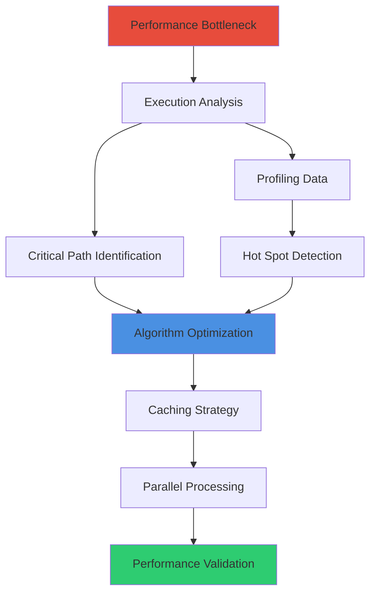
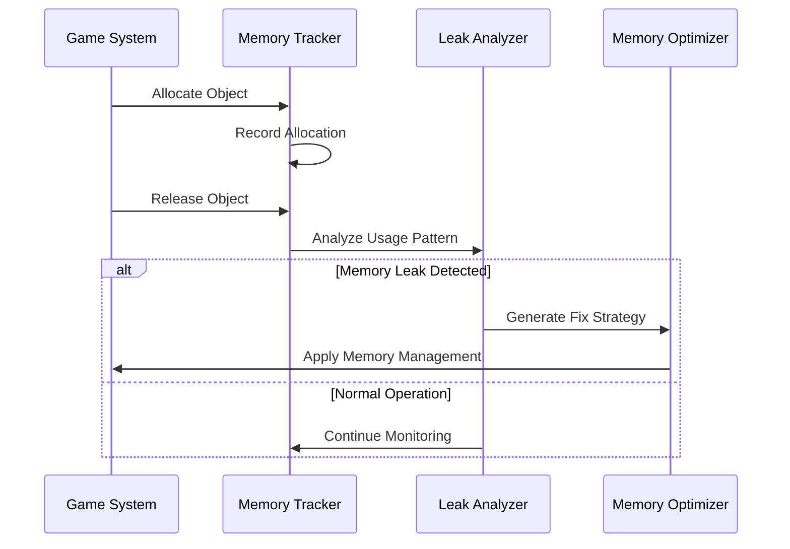
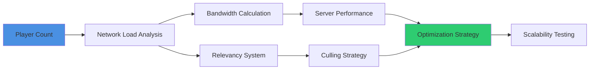
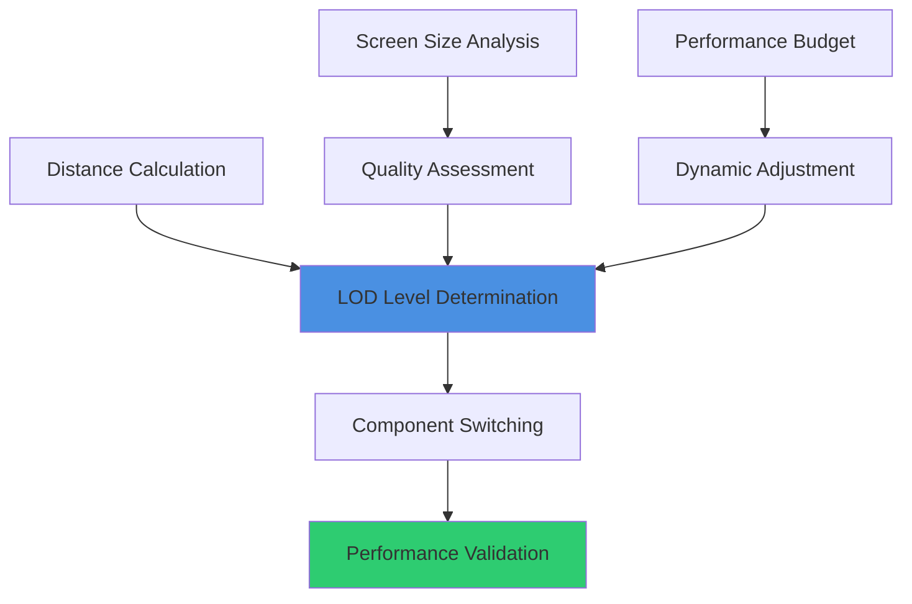
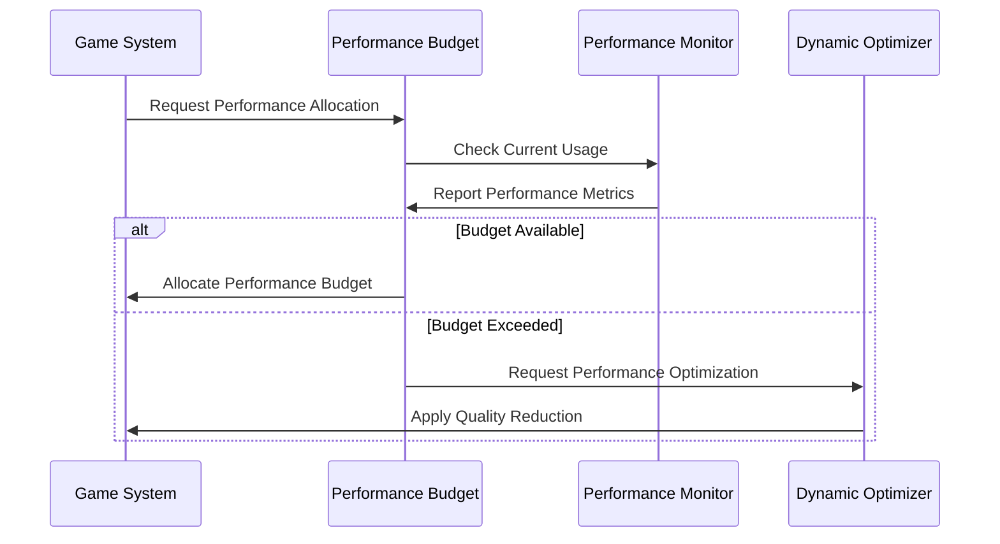

# Performance Optimization Prompts

## Overview
Specialized AI prompts for UE5.6 Blueprint performance optimization. These prompts generate solutions that achieve AAA-level performance standards while maintaining code clarity and maintainability. Focus on frame rate consistency, memory efficiency, and scalable architecture patterns.

## Frame Rate Optimization Prompts

### Tick Function Elimination
```
Optimize [SYSTEM_NAME] to eliminate Tick dependencies:

Current Performance Issues:
- [CURRENT_FRAMERATE] FPS with [TICK_COUNT] active tick functions
- Frame time spikes of [SPIKE_DURATION]ms during [SPIKE_CONDITION]
- CPU usage peaks at [CPU_PERCENTAGE]% during intensive operations

Optimization Strategy:
- Convert all Tick-based logic to event-driven architecture
- Implement timer-based updates with configurable intervals
- Use Blueprint interfaces for system communication
- Cache frequently accessed data to reduce computational overhead
- Implement state-based updates that only trigger on changes

Target Performance:
- Achieve consistent [TARGET_FRAMERATE] FPS
- Maximum frame time variance: [VARIANCE_THRESHOLD]ms
- CPU usage ceiling: [CPU_TARGET]% average
- Memory allocation reduction: [MEMORY_TARGET]% improvement
```

### Execution Path Optimization


```
Redesign [SYSTEM_NAME] execution flow for optimal performance:

Performance Analysis:
- Current execution time: [CURRENT_TIME]ms per frame
- Critical path operations: [CRITICAL_OPERATIONS]
- Data access patterns: [ACCESS_PATTERNS]
- Computational complexity: [BIG_O_NOTATION]

Optimization Targets:
- Reduce execution time to: [TARGET_TIME]ms per frame
- Implement algorithmic improvements reducing complexity to [TARGET_COMPLEXITY]
- Cache frequently accessed data with [CACHE_STRATEGY]
- Parallelize independent operations where possible
- Use Blueprint nativization for performance-critical sections

Implementation Requirements:
- Maintain existing functionality and API compatibility
- Include performance regression testing
- Provide before/after benchmarking data
- Ensure thread-safety for parallel operations
- Document optimization decisions for team knowledge
```

## Memory Management Prompts

### Object Pooling Implementation
```
Create efficient object pooling system for [OBJECT_TYPE]:

Pooling Requirements:
- Handle [MIN_OBJECTS] to [MAX_OBJECTS] concurrent instances
- Pool expansion/contraction based on usage patterns
- Thread-safe allocation for multi-threaded access
- Automatic cleanup for unused pool objects
- Memory defragmentation to prevent fragmentation

Technical Specifications:
- Initial pool size: [INITIAL_SIZE] objects
- Maximum pool growth: [MAX_GROWTH] objects
- Cleanup threshold: [CLEANUP_THRESHOLD]% unused objects
- Memory alignment requirements: [ALIGNMENT_BYTES] bytes
- Platform-specific optimization for [TARGET_PLATFORMS]

Performance Goals:
- Object allocation time: <[ALLOCATION_TIME]ms
- Memory overhead: <[OVERHEAD_PERCENTAGE]% additional memory
- Pool efficiency: >[EFFICIENCY_PERCENTAGE]% object reuse rate
- Garbage collection reduction: [GC_REDUCTION]% fewer allocations
```

### Memory Leak Prevention


```
Implement comprehensive memory leak prevention for [SYSTEM_NAME]:

Leak Detection Strategy:
- Automatic reference counting with weak reference patterns
- Event listener cleanup validation
- Asset reference lifecycle management
- Component destruction verification
- Circular reference detection and breaking

Prevention Mechanisms:
- Smart pointer equivalents for Blueprint references
- Automatic cleanup registration for temporary objects
- Resource lifecycle binding to owner components
- Debug tools for reference tracking during development
- Automated testing for memory leak regression

Monitoring Integration:
- Real-time memory usage reporting
- Leak detection alerts during development
- Performance impact assessment of memory patterns
- Historical memory usage analysis
- Platform-specific memory profiling integration
```

## Network Performance Prompts

### Replication Optimization
```
Optimize network replication for [NETWORKED_SYSTEM]:

Current Network Performance:
- Bandwidth usage: [CURRENT_BANDWIDTH] KB/s per player
- Replication frequency: [REPLICATION_RATE] updates per second
- Network stalls: [STALL_FREQUENCY] per minute
- Packet loss impact: [PACKET_LOSS_EFFECT] on gameplay

Optimization Strategy:
- Implement delta compression for state changes
- Use relevancy filtering for distance-based updates
- Batch related property changes into single updates
- Implement prediction for client-side responsiveness
- Custom replication conditions for event-driven updates

Performance Targets:
- Bandwidth reduction: [BANDWIDTH_TARGET] KB/s per player
- Update efficiency: [EFFICIENCY_TARGET]% relevant updates only
- Latency tolerance: [LATENCY_TARGET]ms maximum acceptable delay
- Packet loss resilience: [RESILIENCE_TARGET]% functionality under loss
```

### Multiplayer Scalability


```
Design scalable multiplayer architecture for [PLAYER_COUNT] concurrent players:

Scalability Requirements:
- Support [MIN_PLAYERS] to [MAX_PLAYERS] players per server
- Maintain [TARGET_FRAMERATE] FPS on server hardware
- Network bandwidth limit: [BANDWIDTH_LIMIT] MB/s total
- Region-based relevancy for large worlds
- Dynamic load balancing for uneven player distribution

Technical Implementation:
- Hierarchical relevancy system with distance and interest-based filtering
- Spatial partitioning for efficient player queries
- Network LOD with reduced update rates for distant players
- Server cluster architecture for horizontal scaling
- Client prediction with rollback correction for responsive gameplay

Performance Validation:
- Load testing with [TEST_PLAYER_COUNT] simulated players
- Bandwidth profiling under various network conditions
- Server performance monitoring with alerts and scaling triggers
- Client synchronization accuracy measurement
- Graceful degradation under network stress conditions
```

## Rendering Performance Prompts

### Blueprint-Driven Rendering Optimization
```
Optimize rendering performance for Blueprint-controlled systems:

Current Rendering Issues:
- Draw calls: [CURRENT_DRAWCALLS] per frame
- Overdraw percentage: [OVERDRAW_PERCENTAGE]%
- GPU utilization: [GPU_USAGE]% average
- Frame time distribution: [RENDER_TIME]ms rendering, [GAME_TIME]ms game logic

Blueprint Optimization Strategy:
- Implement Blueprint-controlled LOD systems
- Dynamic batching for similar objects
- Frustum culling integration with Blueprint visibility logic
- Material parameter optimization using Blueprint material instances
- Texture streaming coordination with gameplay systems

Performance Targets:
- Draw call reduction: [DRAWCALL_TARGET] maximum per frame
- GPU utilization optimization: [GPU_TARGET]% balanced usage
- Frame time improvement: [FRAMETIME_TARGET]ms total frame time
- Memory bandwidth efficiency: [BANDWIDTH_TARGET] GB/s maximum
```

### LOD System Integration


```
Create intelligent LOD system for [ASSET_TYPE] with Blueprint control:

LOD Configuration:
- Distance thresholds: [LOD0_DISTANCE], [LOD1_DISTANCE], [LOD2_DISTANCE]
- Screen size percentages: [LOD0_SCREEN]%, [LOD1_SCREEN]%, [LOD2_SCREEN]%
- Quality settings per platform: [PLATFORM_SETTINGS]
- Dynamic adjustment based on performance budget
- Smooth transitions between LOD levels

Blueprint Integration:
- Component-based LOD management with automatic switching
- Performance budget monitoring with dynamic quality adjustment
- Custom LOD rules based on gameplay importance
- Integration with UE5.6 World Partition for seamless streaming
- Debug visualization for development and testing

Performance Optimization:
- Minimize LOD switching overhead
- Batch LOD updates for multiple objects
- Predictive LOD selection based on movement patterns
- Memory-efficient LOD data storage
- Platform-specific LOD optimization profiles
```

## Advanced Performance Patterns

### Multi-Threading Integration
```
Design thread-safe Blueprint architecture for [SYSTEM_NAME]:

Threading Requirements:
- Game thread integration with [GAME_OPERATIONS]
- Render thread coordination for [RENDER_OPERATIONS]
- Worker thread utilization for [BACKGROUND_TASKS]
- Thread-safe data sharing between Blueprint and C++
- Performance monitoring across all threads

Implementation Strategy:
- Task-based parallelism using UE5.6's task system
- Thread-safe Blueprint interfaces with proper synchronization
- Asynchronous operations with callback integration
- Lock-free data structures where possible
- Memory barriers for cross-thread communication

Safety Mechanisms:
- Race condition prevention through proper synchronization
- Deadlock avoidance with timeout mechanisms
- Thread-local storage for per-thread data
- Exception handling across thread boundaries
- Debug tools for thread interaction analysis
```

### Performance Budget Management


```
Implement dynamic performance budgeting for [GAME_SYSTEM]:

Budget Categories:
- CPU budget: [CPU_BUDGET]ms per frame allocated to [SYSTEM_NAME]
- Memory budget: [MEMORY_BUDGET]MB maximum usage
- Network budget: [NETWORK_BUDGET] KB/s for replication
- GPU budget: [GPU_BUDGET]% of frame time for rendering
- Storage budget: [STORAGE_BUDGET]MB/s for streaming

Dynamic Adjustment:
- Real-time performance monitoring with threshold alerts
- Automatic quality scaling based on current performance
- Priority-based resource allocation among competing systems
- Predictive budget adjustment based on gameplay state
- Platform-specific budget profiles for optimal performance

Implementation Features:
- Blueprint-accessible budget query and allocation system
- Visual debugging tools for budget visualization
- Historical performance data for optimization insights
- Integration with UE5.6's stat system for monitoring
- Automated testing for budget compliance validation
```

These performance optimization prompts ensure that AI-generated solutions achieve the demanding performance standards required for AAA game development while maintaining the flexibility and maintainability that makes Blueprint development efficient and accessible.
