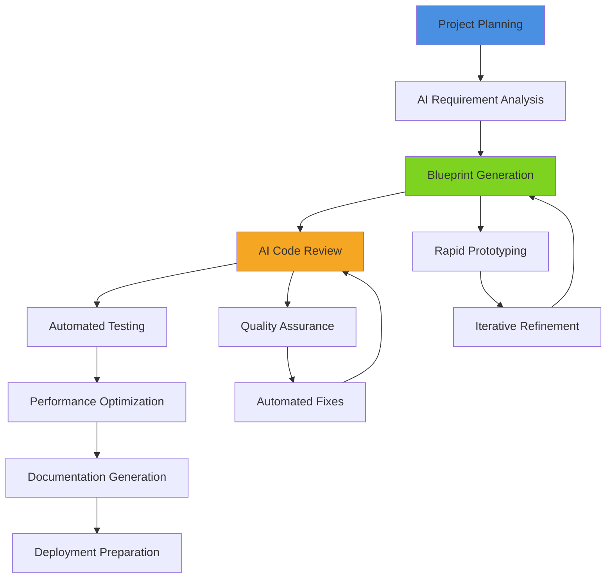
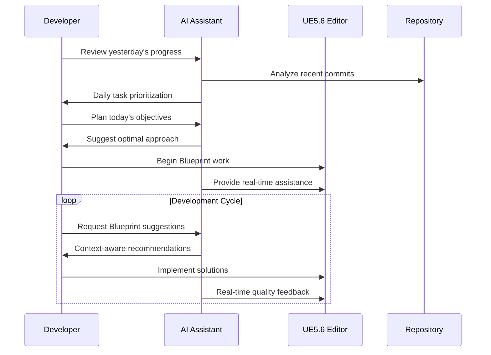
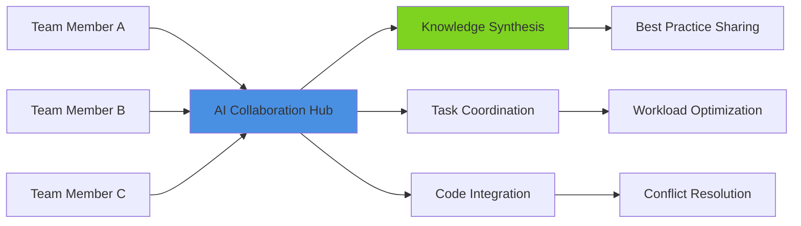

# AI-Enhanced Development Productivity & Workflows

## Overview
Advanced workflows and productivity patterns for UE5.6 Blueprint development using AI assistance. This guide covers AI integration into daily development routines, automated code generation, intelligent debugging, and collaborative AI workflows that accelerate AAA game development while maintaining code quality.

## Core AI Productivity Patterns

### AI-Driven Development Cycle

### Intelligent Blueprint Assistance
- **Context-Aware Suggestions**: AI analyzes current Blueprint context for relevant recommendations
- **Pattern Recognition**: Automatically identify and suggest proven Blueprint patterns
- **Performance Insights**: Real-time performance impact analysis during development
- **Bug Prevention**: Proactive identification of potential issues before they become problems

## Daily Workflow Integration

### Morning Development Routine

### Code Review Automation
- **Automated PR Analysis**: AI reviews Blueprint changes for patterns, performance, and best practices
- **Intelligent Feedback**: Context-sensitive suggestions with reasoning explanations
- **Learning Integration**: AI learns from team preferences and coding standards
- **Collaborative Insights**: Team knowledge sharing through AI-mediated discussions

## Advanced AI Workflows

### Blueprint Generation Pipeline
1. **Requirements Analysis**: AI processes design documents and user stories
2. **Architecture Planning**: Generates component hierarchies and system interactions
3. **Blueprint Creation**: Automated Blueprint graph generation with proper node connections
4. **Validation Testing**: AI-driven testing of generated Blueprints
5. **Documentation Generation**: Automatic creation of technical documentation

### Debugging & Problem Solving
- **Error Pattern Recognition**: AI identifies common error patterns and suggests fixes
- **Performance Bottleneck Detection**: Automated identification of performance issues
- **Solution Database**: Curated solutions from community and team experiences
- **Predictive Problem Prevention**: AI predicts potential issues before they occur

### Quality Assurance Integration
- **Automated Testing Generation**: Create comprehensive test suites from Blueprint specifications
- **Regression Detection**: AI monitors for unintended behavior changes
- **Performance Regression**: Continuous monitoring of performance impacts
- **Standards Compliance**: Ensure adherence to team and industry standards

## Team Collaboration Workflows

### AI-Mediated Collaboration

### Knowledge Management
- **Collective Intelligence**: AI aggregates team knowledge and experiences
- **Contextual Documentation**: Automatically generated documentation based on code context
- **Learning Acceleration**: New team members benefit from AI-curated onboarding
- **Institutional Memory**: Preserve and access historical project decisions and patterns

## Performance Optimization Workflows

### AI-Driven Performance Analysis
- **Real-Time Profiling**: Continuous performance monitoring during development
- **Optimization Suggestions**: AI-generated recommendations for performance improvements
- **Resource Usage Prediction**: Forecast resource requirements for different implementation approaches
- **Scalability Analysis**: Evaluate solutions for different player counts and hardware configurations

### Automated Optimization
- **Blueprint Optimization**: AI suggests more efficient Blueprint implementations
- **Asset Optimization**: Intelligent recommendations for texture, mesh, and audio optimization
- **Memory Management**: AI-assisted memory usage optimization and leak detection
- **Load Time Optimization**: Suggestions for reducing loading times and improving streaming

## Implementation Strategies

### Setting Up AI Workflows
1. **Tool Integration**: Connect AI assistants with UE5.6 Editor and development tools
2. **Customization**: Train AI models on project-specific patterns and requirements
3. **Team Onboarding**: Establish AI-assisted workflows for all team members
4. **Continuous Learning**: Implement feedback loops for AI improvement

### Best Practices
- **Human-AI Balance**: Maintain creative control while leveraging AI efficiency
- **Quality Gates**: Implement human review points in AI-automated processes
- **Privacy Considerations**: Ensure sensitive project data protection
- **Fallback Procedures**: Maintain development capability without AI assistance

### Measuring Success
- **Productivity Metrics**: Track development velocity and quality improvements
- **Error Reduction**: Monitor bug rates and resolution times
- **Learning Acceleration**: Measure skill development and knowledge transfer
- **Team Satisfaction**: Assess developer experience and workflow satisfaction

## Advanced Features

### Custom AI Model Training
- **Project-Specific Models**: Train AI on your project's codebase and patterns
- **Team Style Learning**: AI adapts to team coding preferences and standards
- **Domain Expertise**: Specialized models for specific game genres or technical areas
- **Continuous Improvement**: Models improve based on team feedback and outcomes

### Integration with External Tools
- **Version Control Integration**: AI-enhanced Git workflows and merge conflict resolution
- **Project Management**: AI-assisted task prioritization and sprint planning
- **Asset Pipeline**: Intelligent asset processing and optimization workflows
- **Testing Infrastructure**: AI-driven test case generation and execution

This comprehensive approach to AI-enhanced development transforms traditional workflows into intelligent, efficient processes that maintain high quality while dramatically increasing development velocity.
