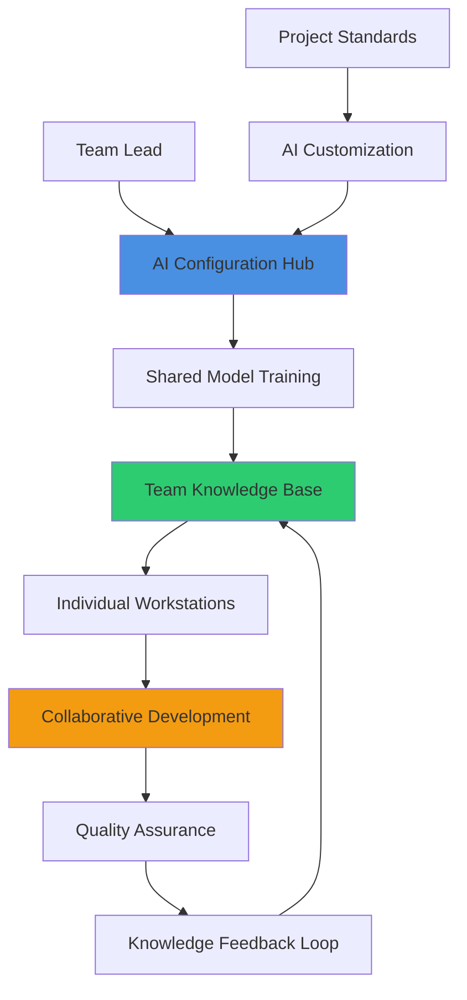
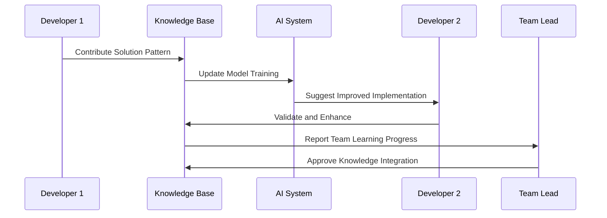
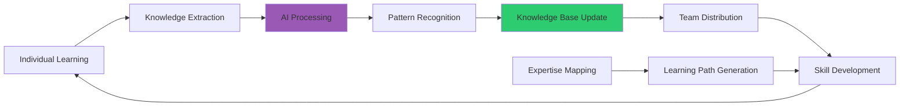
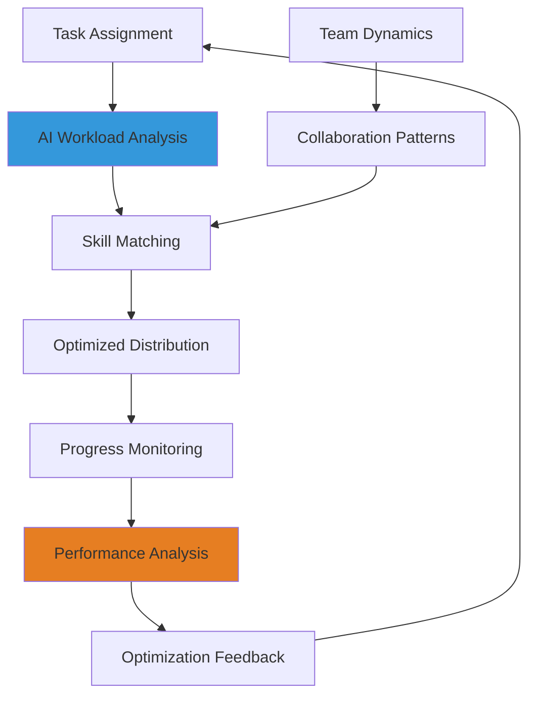
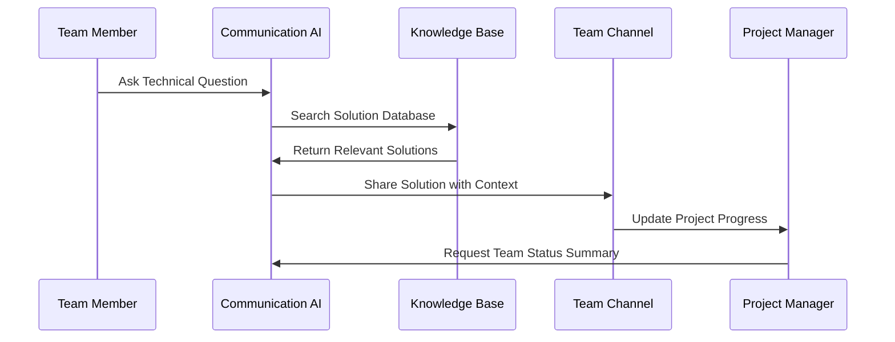
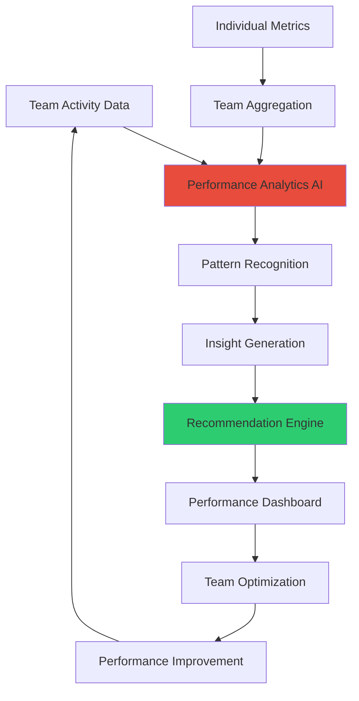

# Team Collaboration

## Overview
AI-enhanced team collaboration strategies for UE5.6 Blueprint development. This guide covers collaborative AI workflows, knowledge sharing systems, and team productivity optimization that leverages artificial intelligence to accelerate development while maintaining code quality and architectural consistency across team members.

## Collaborative AI Workflows

### Team-Shared AI Systems


### Centralized AI Management

#### Shared AI Model Configuration
```
Establish centralized AI system for [TEAM_SIZE] developers:

Team Configuration:
- Shared model training with [PROJECT_DATASET] project-specific dataset
- Consistent coding standards with [STYLE_GUIDE_COUNT] style guideline enforcement
- Team-specific patterns with [PATTERN_LIBRARY_SIZE] architectural pattern library
- Performance standards with [PERFORMANCE_BENCHMARKS] unified performance targets
- Quality gates with [QA_CHECKPOINT_COUNT] automated quality checkpoints

Model Synchronization:
- Version control integration with [SYNC_FREQUENCY] model synchronization frequency
- Configuration drift detection with [DRIFT_MONITORING] automatic inconsistency detection
- Team preference management with [PREFERENCE_CATEGORIES] customizable team preferences
- Knowledge base maintenance with [KB_UPDATE_FREQUENCY] continuous knowledge updates
- Performance tracking with [TEAM_METRICS] collaborative productivity measurements

Collaboration Features:
- Real-time model sharing with [SHARING_LATENCY] millisecond sharing latency
- Conflict resolution with [CONFLICT_RESOLUTION] intelligent merge strategies
- Team learning integration with [LEARNING_ACCELERATION] knowledge transfer acceleration
- Progress synchronization with [SYNC_GRANULARITY] fine-grained progress tracking
- Resource allocation with [RESOURCE_MANAGEMENT] fair AI resource distribution
```

#### Collaborative Knowledge Building


**Knowledge Sharing Implementation:**
- **Pattern Repository**: Centralized library of validated Blueprint patterns and solutions
- **Solution Database**: Searchable database of project-specific implementation examples
- **Error Resolution**: Shared troubleshooting knowledge with solution tracking
- **Best Practices**: Continuously updated best practice guidelines based on team experience
- **Learning Acceleration**: AI-driven identification of knowledge gaps and learning opportunities

### Team Workflow Integration

#### Synchronized Development Processes
```
Integrate AI into collaborative development workflow:

Development Synchronization:
- Branch-specific AI models with [BRANCH_MODEL_COUNT] specialized development contexts
- Merge conflict AI assistance with [CONFLICT_RESOLUTION_ACCURACY]% automated resolution
- Code review AI enhancement with [REVIEW_CRITERIA_COUNT] comprehensive review criteria
- Integration testing AI with [TEST_COVERAGE_AI] intelligent test case generation
- Documentation AI with [DOC_AUTOMATION_LEVEL] automated documentation maintenance

Team Communication:
- AI-generated progress reports with [REPORT_FREQUENCY] regular team updates
- Intelligent task assignment with [ASSIGNMENT_OPTIMIZATION] workload balancing
- Skill gap analysis with [SKILL_ASSESSMENT] team capability evaluation
- Knowledge transfer planning with [TRANSFER_EFFICIENCY] optimized knowledge sharing
- Team performance analytics with [PERFORMANCE_INSIGHTS] actionable improvement insights

Quality Coordination:
- Shared quality standards with [STANDARD_COMPLIANCE] consistent quality enforcement
- Cross-team code review with [REVIEW_DISTRIBUTION] balanced review workload
- Architecture consistency checking with [CONSISTENCY_VALIDATION] automated architecture validation
- Performance regression prevention with [REGRESSION_DETECTION] team-wide performance monitoring
- Technical debt tracking with [DEBT_MANAGEMENT] collaborative debt reduction planning
```

## Knowledge Sharing & Learning

### AI-Powered Knowledge Management


#### Intelligent Learning Systems
```
Create AI-driven learning and knowledge sharing platform:

Learning Analytics:
- Individual skill assessment with [SKILL_METRICS] comprehensive skill measurement
- Learning pace analysis with [LEARNING_VELOCITY] personalized learning speed tracking
- Knowledge gap identification with [GAP_ANALYSIS] systematic knowledge gap detection
- Progress tracking with [PROGRESS_GRANULARITY] detailed learning progress monitoring
- Team learning coordination with [COORDINATION_METRICS] collaborative learning optimization

Knowledge Curation:
- Automated content organization with [ORGANIZATION_TAXONOMY] intelligent content categorization
- Relevance scoring with [RELEVANCE_ALGORITHM] content importance ranking
- Version control for knowledge with [KNOWLEDGE_VERSIONING] systematic knowledge evolution
- Quality validation with [VALIDATION_PROCESS] peer review and AI validation
- Search optimization with [SEARCH_ACCURACY] intelligent content discovery

Personalized Learning:
- Adaptive learning paths with [PATH_CUSTOMIZATION] individual learning plan creation
- Difficulty adjustment with [DIFFICULTY_ADAPTATION] personalized challenge scaling
- Learning style adaptation with [STYLE_RECOGNITION] individual learning preference accommodation
- Mentor matching with [MENTORING_ALGORITHM] intelligent expertise pairing
- Progress celebration with [ACHIEVEMENT_SYSTEM] motivation and recognition system
```

### Cross-Team Knowledge Transfer
```
Facilitate knowledge transfer between team members:

Expertise Mapping:
- Skill inventory with [SKILL_TAXONOMY] comprehensive skill categorization
- Expertise levels with [EXPERTISE_SCALE] detailed competency measurement
- Knowledge domains with [DOMAIN_COUNT] specialized knowledge area identification
- Transfer capacity with [TRANSFER_BANDWIDTH] knowledge sharing availability tracking
- Learning preferences with [PREFERENCE_PROFILES] individual learning style documentation

Transfer Mechanisms:
- Peer programming sessions with [SESSION_EFFECTIVENESS] AI-optimized pairing
- Knowledge workshops with [WORKSHOP_FREQUENCY] regular skill sharing sessions
- Mentoring programs with [MENTORING_STRUCTURE] structured knowledge transfer programs
- Documentation collaboration with [DOC_COLLABORATION] shared documentation creation
- Code walkthrough sessions with [WALKTHROUGH_EFFICIENCY] AI-enhanced code explanation

Impact Measurement:
- Learning effectiveness with [LEARNING_METRICS] quantifiable learning outcome measurement
- Knowledge retention with [RETENTION_ANALYSIS] long-term knowledge retention tracking
- Application success with [APPLICATION_TRACKING] practical knowledge application monitoring
- Team capability growth with [CAPABILITY_METRICS] overall team skill advancement measurement
- Knowledge distribution with [DISTRIBUTION_ANALYSIS] team knowledge equity assessment
```

## Productivity Optimization

### AI-Enhanced Team Productivity


#### Intelligent Task Management
```
Implement AI-driven task management and optimization:

Task Analysis:
- Complexity assessment with [COMPLEXITY_METRICS] multi-dimensional task complexity analysis
- Skill requirement analysis with [SKILL_REQUIREMENTS] detailed competency mapping
- Time estimation with [ESTIMATION_ACCURACY]% AI-improved time prediction
- Dependency mapping with [DEPENDENCY_ANALYSIS] comprehensive task relationship identification
- Priority scoring with [PRIORITY_ALGORITHM] intelligent task prioritization

Resource Optimization:
- Workload balancing with [BALANCE_ALGORITHM] fair and efficient work distribution
- Skill utilization with [UTILIZATION_OPTIMIZATION] maximum team skill leverage
- Bottleneck identification with [BOTTLENECK_DETECTION] proactive workflow obstacle identification
- Capacity planning with [CAPACITY_FORECASTING] predictive resource requirement planning
- Performance optimization with [PERFORMANCE_TUNING] continuous workflow improvement

Team Coordination:
- Meeting optimization with [MEETING_EFFICIENCY] AI-optimized meeting scheduling and agendas
- Communication streamlining with [COMMUNICATION_OPTIMIZATION] efficient information flow
- Decision support with [DECISION_AI] data-driven decision making assistance
- Conflict resolution with [CONFLICT_MEDIATION] intelligent team conflict management
- Goal alignment with [ALIGNMENT_TRACKING] team objective synchronization monitoring
```

### Automated Quality Assurance
```
Establish AI-powered quality assurance for team collaboration:

Code Quality Management:
- Automated code review with [REVIEW_AUTOMATION] comprehensive code analysis
- Style consistency enforcement with [STYLE_ENFORCEMENT] automatic style guide compliance
- Performance validation with [PERFORMANCE_QA] automated performance standard verification
- Documentation quality with [DOC_QUALITY] intelligent documentation completeness checking
- Architecture compliance with [ARCHITECTURE_QA] design pattern adherence verification

Team Quality Metrics:
- Collaboration effectiveness with [COLLABORATION_METRICS] team interaction quality measurement
- Knowledge sharing efficiency with [SHARING_METRICS] information transfer effectiveness tracking
- Learning velocity with [LEARNING_VELOCITY] team skill development speed monitoring
- Quality improvement trends with [IMPROVEMENT_TRACKING] continuous quality enhancement measurement
- Team satisfaction with [SATISFACTION_METRICS] team morale and engagement monitoring

Continuous Improvement:
- Process optimization with [PROCESS_AI] workflow efficiency enhancement
- Best practice evolution with [PRACTICE_EVOLUTION] adaptive best practice development
- Tool effectiveness analysis with [TOOL_ANALYSIS] development tool performance evaluation
- Training need identification with [TRAINING_NEEDS] skill gap and training requirement analysis
- Success pattern recognition with [SUCCESS_PATTERNS] high-performance behavior identification
```

## Communication & Coordination

### AI-Facilitated Communication


#### Intelligent Communication Systems
```
Create AI-enhanced communication platform for development teams:

Communication Intelligence:
- Message prioritization with [PRIORITY_CLASSIFICATION] intelligent message importance ranking
- Context awareness with [CONTEXT_UNDERSTANDING] conversation context maintenance
- Language translation with [TRANSLATION_ACCURACY] multi-language team support
- Technical term clarification with [TERMINOLOGY_ASSISTANCE] automatic technical explanation
- Meeting summarization with [SUMMARY_QUALITY] AI-generated meeting summaries

Information Management:
- Knowledge routing with [ROUTING_INTELLIGENCE] intelligent information distribution
- Question answering with [QA_ACCURACY] automated technical question resolution
- Documentation linking with [LINK_INTELLIGENCE] relevant documentation suggestion
- Expertise connection with [EXPERT_MATCHING] automatic expert identification and connection
- Progress aggregation with [PROGRESS_SYNTHESIS] team progress summarization

Collaboration Enhancement:
- Decision tracking with [DECISION_LOGGING] comprehensive decision documentation
- Action item management with [ACTION_TRACKING] intelligent task follow-up
- Conflict detection with [CONFLICT_AWARENESS] early team conflict identification
- Feedback facilitation with [FEEDBACK_OPTIMIZATION] constructive feedback enhancement
- Team building with [TEAM_DYNAMICS] collaboration strength building
```

### Project Coordination
```
Implement AI-driven project coordination system:

Project Intelligence:
- Timeline optimization with [SCHEDULE_OPTIMIZATION] AI-improved project scheduling
- Risk assessment with [RISK_ANALYSIS] predictive project risk identification
- Resource allocation with [RESOURCE_AI] optimal team resource distribution
- Milestone tracking with [MILESTONE_INTELLIGENCE] intelligent progress milestone monitoring
- Scope management with [SCOPE_AI] dynamic project scope optimization

Coordination Features:
- Cross-team synchronization with [SYNC_INTELLIGENCE] multi-team coordination optimization
- Dependency management with [DEPENDENCY_AI] intelligent task dependency handling
- Progress reporting with [REPORTING_AUTOMATION] automated progress report generation
- Stakeholder communication with [STAKEHOLDER_AI] tailored stakeholder information delivery
- Change management with [CHANGE_AI] intelligent change impact analysis

Performance Tracking:
- Velocity measurement with [VELOCITY_ANALYTICS] team performance velocity tracking
- Quality metrics with [QUALITY_DASHBOARD] comprehensive quality measurement dashboard
- Productivity analysis with [PRODUCTIVITY_AI] team productivity optimization insights
- Bottleneck identification with [BOTTLENECK_AI] systematic workflow obstacle detection
- Success prediction with [SUCCESS_FORECASTING] project success probability estimation
```

## Team Performance Analytics

### AI-Driven Performance Insights


#### Comprehensive Performance Analysis
```
Create intelligent performance analytics system:

Performance Metrics:
- Code quality trends with [QUALITY_TRACKING] comprehensive code quality evolution monitoring
- Productivity measurements with [PRODUCTIVITY_METRICS] multi-dimensional productivity assessment
- Collaboration effectiveness with [COLLABORATION_ANALYSIS] team interaction quality evaluation
- Learning progress with [LEARNING_ANALYTICS] individual and team skill development tracking
- Innovation indicators with [INNOVATION_METRICS] creative problem-solving measurement

Analytics Intelligence:
- Predictive analysis with [PREDICTION_ACCURACY] future performance forecasting
- Anomaly detection with [ANOMALY_SENSITIVITY] unusual performance pattern identification
- Correlation analysis with [CORRELATION_INSIGHTS] performance factor relationship analysis
- Benchmarking with [BENCHMARK_COMPARISON] industry and historical performance comparison
- Optimization recommendations with [OPTIMIZATION_AI] data-driven improvement suggestions

Reporting Features:
- Real-time dashboards with [DASHBOARD_UPDATES] continuous performance monitoring
- Custom report generation with [REPORT_CUSTOMIZATION] tailored performance reporting
- Trend visualization with [VISUALIZATION_QUALITY] clear performance trend presentation
- Alert systems with [ALERT_INTELLIGENCE] proactive performance issue notification
- Success celebration with [ACHIEVEMENT_RECOGNITION] team accomplishment highlighting
```

This comprehensive team collaboration system leverages AI to enhance every aspect of team-based UE5.6 Blueprint development, from knowledge sharing and learning to performance optimization and project coordination, ensuring maximum team productivity while maintaining high-quality development standards.
