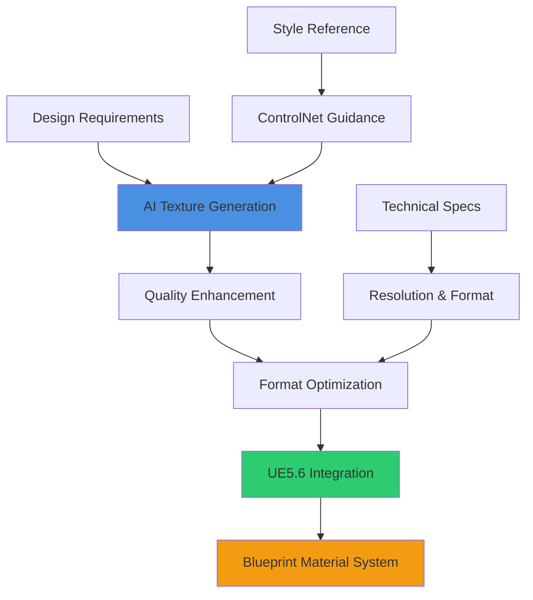
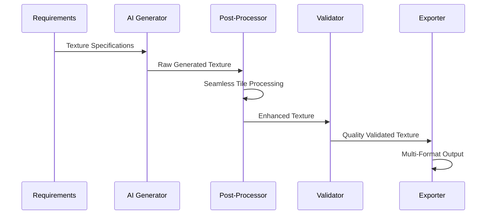
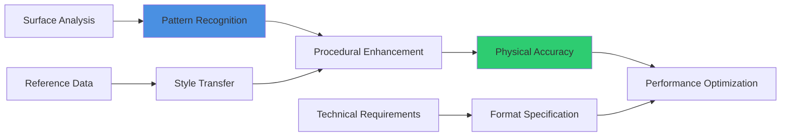
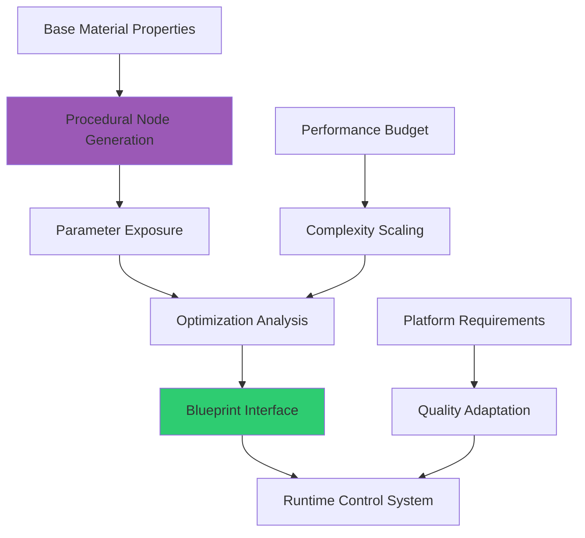
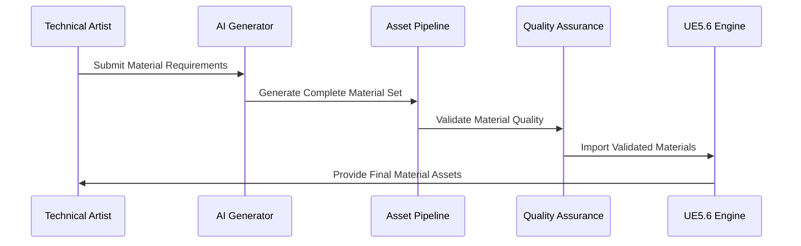
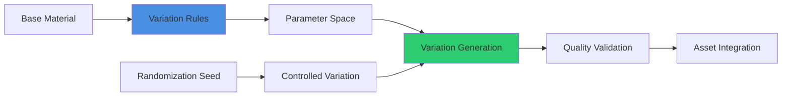
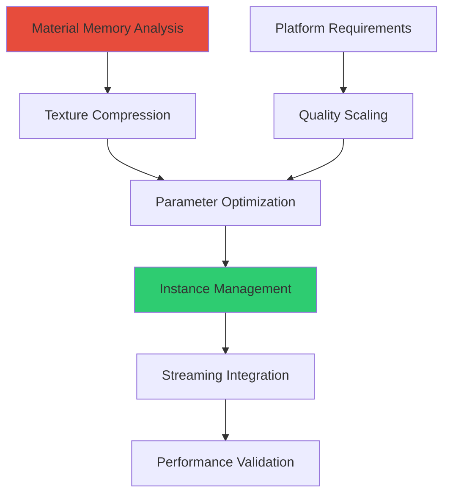

# Texture & Material Generation

## Overview
AI-powered texture and material generation for UE5.6 Blueprint integration. This guide covers procedural texture creation, intelligent material systems, and automated asset pipelines that produce game-ready materials optimized for performance and visual quality in modern game production.

## Procedural Texture Generation

### AI-Driven Texture Creation


### Professional Texture Generation Pipeline

#### Stable Diffusion XL Workflow
```
Prompt Engineering for Game Textures:
Base Template: "4K seamless tileable [MATERIAL_TYPE] texture, photorealistic PBR material, game-ready quality, neutral lighting, high detail normal map information"

Surface-Specific Prompts:
- Stone: "weathered limestone texture, natural variation, moss detail, architectural quality"
- Metal: "brushed steel surface, industrial wear patterns, rust accent details, metallic reflection"
- Fabric: "canvas weave pattern, fabric fiber detail, consistent thread density, material authenticity"
- Organic: "tree bark texture, natural aging, deep crevice detail, realistic surface variation"

Technical Parameters:
- Resolution: 4096x4096 minimum for hero assets, 2048x2048 for standard
- Aspect Ratio: Square (1:1) for optimal tiling
- Color Space: sRGB for diffuse, Linear for technical maps
- Bit Depth: 8-bit for standard textures, 16-bit for HDR workflows
```

#### Advanced Generation Techniques


**Post-Processing Pipeline:**
1. **Seamless Tile Generation**: Edge blending and pattern matching for perfect tiling
2. **Normal Map Extraction**: Height-to-normal conversion with adjustable intensity
3. **Roughness Map Creation**: Surface analysis for physically accurate roughness values
4. **Ambient Occlusion Enhancement**: Contact shadow generation for depth perception
5. **Color Correction**: Consistent art direction alignment and gamma correction

### Specialized Texture Types

#### PBR Material Generation
```
Complete PBR Material Set Generation:

Diffuse/Albedo Map:
- Color information without lighting or shadow details
- Consistent luminance values for realistic light interaction
- Surface color variation maintaining material authenticity
- Art direction compliance with project color palette

Normal Map:
- Surface detail information for lighting calculations
- Tangent space normal mapping for UE5.6 compatibility
- Intensity calibration for realistic surface depth perception
- High-frequency detail preservation for close-up viewing

Roughness Map:
- Surface smoothness variation for realistic reflection behavior
- Microsurface detail affecting light scattering
- Material property accuracy for physical light interaction
- Performance optimization balancing quality and computation cost

Metallic Map:
- Material type identification for rendering pipeline
- Binary metallic values with anti-aliased transitions
- Proper metallic workflow compliance for UE5.6 PBR system
- Integration with existing material library standards
```

#### Specialized Surface Generation


**Advanced Surface Types:**
- **Animated Textures**: Time-based texture variation for water, lava, energy effects
- **Vertex-Painted Blends**: Multi-texture blending systems for terrain and complex surfaces
- **Detail Textures**: High-frequency overlay textures for close-up surface enhancement
- **Emissive Patterns**: Self-illuminated texture elements for UI, screens, and magical effects

## Intelligent Material Systems

### Dynamic Material Generation
```
Create adaptive material system for [MATERIAL_CATEGORY]:

Material Intelligence:
- Environmental response system adapting to lighting conditions
- Weather integration with wet/dry surface state transitions
- Damage accumulation with progressive wear pattern application
- Time-based aging effects with customizable degradation rates
- Player interaction response with contact wear and usage patterns

Blueprint Integration:
- Real-time material parameter control through Blueprint interfaces
- Event-driven material state changes responding to gameplay events
- Performance-optimized parameter updates minimizing render thread impact
- Component-based material management with automatic instance creation
- Integration with UE5.6 material layer system for complex material composition

Technical Implementation:
- Material parameter collections for global material state management
- Custom material functions for reusable material logic components
- Performance monitoring with shader complexity analysis
- Platform-specific optimization with quality scaling
- Memory management for large material parameter datasets
```

### Procedural Material Graphs


#### Advanced Material Architecture
```
Material Function Libraries:
- Reusable material functions for common surface properties
- Parameterized material building blocks for rapid material creation
- Version-controlled material function updates with backward compatibility
- Performance-optimized implementations with instruction count monitoring
- Documentation integration with usage examples and parameter descriptions

Material Layer Systems:
- Multi-layer material composition with blend mode control
- Dynamic layer activation based on gameplay requirements
- Performance-scaled layer complexity for different quality settings
- Integration with World Partition for level-specific material optimization
- Asset streaming coordination for large material datasets

Custom Material Nodes:
- Blueprint-callable custom material expressions for unique effects
- Performance-optimized shader code generation
- Platform-specific implementations with fallback compatibility
- Integration with UE5.6's material graph editor for visual editing
- Version control and team collaboration features
```

## Asset Pipeline Integration

### Automated Material Creation


#### Production Pipeline Features
```
Batch Processing System:
- Multi-material generation with consistent art direction
- Variation generation for surface diversity without repetition
- Quality tier creation for different LOD requirements
- Platform-specific optimization during generation process
- Integration with existing art production workflows

Version Control Integration:
- Automatic asset versioning with generation parameter tracking
- Collaborative material development with conflict resolution
- Change history maintenance for material evolution tracking
- Rollback capabilities for problematic material updates
- Team synchronization ensuring consistent material libraries

Quality Assurance Framework:
- Automated texture quality validation with acceptance criteria
- Performance impact assessment during material creation
- Visual consistency checking against project art direction
- Platform compatibility verification for target hardware
- Integration testing with existing game systems and lighting setups
```

### Smart Asset Organization
```
Hierarchical Material Organization:
├── Base Materials/
│   ├── Master_PBR_Standard.uasset
│   ├── Master_PBR_Transparent.uasset
│   └── Master_PBR_Emissive.uasset
├── Material Instances/
│   ├── Environment/
│   │   ├── Stone_Weathered_01.uasset
│   │   └── Metal_Rusty_Industrial.uasset
│   ├── Characters/
│   │   ├── Fabric_Canvas_Clean.uasset
│   │   └── Leather_Worn_Brown.uasset
│   └── UI/
│       ├── Button_Default.uasset
│       └── Panel_Glass.uasset
└── Material Functions/
    ├── Utility/
    │   ├── UV_Tiling_Function.uasset
    │   └── Color_Variation.uasset
    └── Effects/
        ├── Damage_Overlay.uasset
        └── Weather_Blending.uasset
```

## Advanced Generation Techniques

### Style Transfer for Game Materials
```
Implement intelligent style transfer system:

Style Analysis:
- Reference material analysis for artistic direction extraction
- Pattern recognition for surface characteristic identification
- Color palette extraction maintaining visual consistency
- Surface property mapping for physically accurate material behavior
- Integration with project art bible and style guide requirements

Transfer Implementation:
- Neural style transfer adapted for PBR material workflow
- Preservation of technical material properties during style application
- Multi-scale style transfer maintaining detail at various viewing distances
- Real-time preview integration for immediate feedback during creation
- Batch processing capabilities for consistent style application across asset libraries

Quality Preservation:
- Technical accuracy maintenance during artistic style application
- Performance optimization ensuring transferred materials meet frame rate requirements
- Platform compatibility verification for style-transferred materials
- Integration testing with existing lighting and post-processing systems
- Version control for style transfer parameters and reference materials
```

### Procedural Variation Systems


#### Intelligent Variation Generation
```
Variation Parameters:
- Color shift within acceptable art direction bounds
- Surface wear patterns with realistic aging progression
- Detail intensity variation for visual diversity without repetition
- Reflection and roughness variation maintaining physical accuracy
- Dirt and weathering overlay with environmental consistency

Generation Logic:
- Seed-based variation ensuring reproducible results
- Artistic constraint satisfaction maintaining visual cohesion
- Performance impact analysis for each generated variation
- Automatic naming and organization for efficient asset management
- Integration with existing material instance workflows

Quality Control:
- Visual similarity analysis preventing excessive variation
- Performance impact validation for all generated variations
- Art direction compliance verification through automated analysis
- Platform compatibility testing for variation stability
- Team review integration for artistic approval workflow
```

## Performance Optimization

### Shader Complexity Management
```
Material Performance Analysis:
- Instruction count monitoring with platform-specific limits
- Texture sampling optimization reducing GPU memory bandwidth
- Mathematical operation minimization through algebraic simplification
- Conditional logic reduction for consistent GPU performance
- Platform-specific optimization with automatic quality scaling

Optimization Strategies:
- Material function consolidation reducing duplicate calculations
- Texture atlas utilization minimizing draw call overhead
- LOD material implementation for distance-based quality scaling
- Parameter reduction through intelligent default value usage
- Cache-friendly parameter organization for optimal GPU utilization
```

### Memory Optimization


#### Memory-Efficient Material Design
```
Compression Strategies:
- Platform-specific texture format selection optimizing memory usage
- Mipmap generation with quality preservation and memory reduction
- Normal map compression maintaining surface detail accuracy
- Roughness map optimization balancing quality and memory footprint
- Streaming texture integration for large material libraries

Instance Optimization:
- Material instance parameter sharing reducing memory duplication
- Dynamic material instance creation and destruction management
- Parameter collection utilization for global material state management
- Memory pool allocation for frequent material instance operations
- Garbage collection optimization minimizing frame rate impact
```

This comprehensive texture and material generation system ensures that AI-created assets meet the demanding quality and performance requirements of modern AAA game development while integrating seamlessly with UE5.6 Blueprint workflows and production pipelines.
