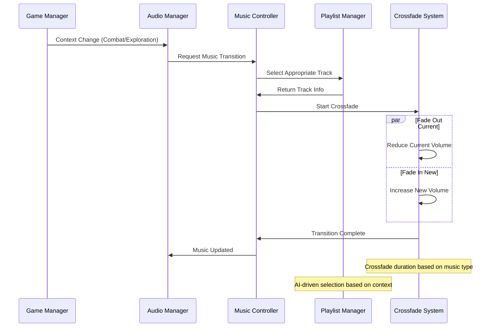
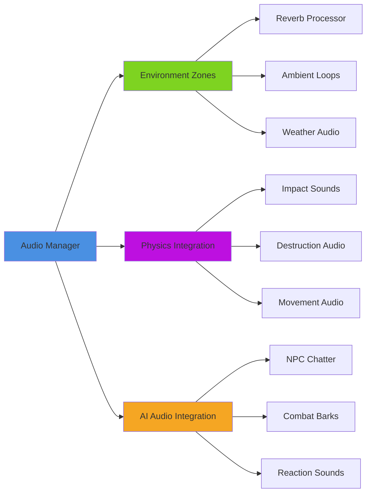
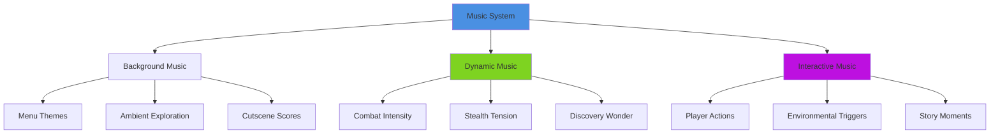

# Audio Manager System

## Overview
A comprehensive audio management system providing spatial 3D audio, dynamic mixing, music transitions, and environmental audio effects. Implements advanced audio streaming, memory optimization, and real-time audio processing while supporting multi-platform audio APIs and accessibility features.

## System Architecture

```mermaid
graph TB
    A[Audio Manager] --> B[Music Controller]
    A --> C[SFX Controller]
    A --> D[Ambient Controller]
    A --> E[Voice Controller]
    A --> F[Spatial Audio Engine]
    
    B --> G[Playlist Manager]
    B --> H[Crossfade System]
    B --> I[Dynamic Music]
    B --> J[Audio Streaming]
    
    C --> K[Sound Pool]
    C --> L[Priority System]
    C --> M[Occlusion Engine]
    
    D --> N[Environment Zones]
    D --> O[Weather Audio]
    D --> P[Reverb Controller]
    
    E --> Q[Dialog System]
    E --> R[Voice Chat]
    E --> S[Localization]
    
    F --> T[3D Positioning]
    F --> U[Distance Attenuation]
    F --> V[Doppler Effects]
    
    style A fill:#4a90e2
    style F fill:#7ed321
    style B fill:#bd10e0
    style C fill:#f5a623
    style D fill:#50e3c2
```

## Component Breakdown

### Audio Manager Component
- **Purpose**: Central orchestration of all audio systems and resource management
- **Key Features**: Global mixing, memory management, platform optimization
- **Performance**: Smart streaming with predictive loading and unloading

### Music Controller Component
- **Purpose**: Handles background music, dynamic soundtracks, and musical transitions
- **Key Features**: Seamless crossfading, tempo synchronization, adaptive music
- **Performance**: Compressed streaming with smooth transitions and minimal latency

### SFX Controller Component
- **Purpose**: Manages sound effects, UI audio, and interactive audio feedback
- **Key Features**: Priority-based playback, object pooling, spatial positioning
- **Performance**: Optimized memory usage with intelligent sound culling

## Blueprint Patterns

### Dynamic Music System Pattern

### Spatial Audio Pattern
- **3D Positioning**: Real-time audio source positioning in 3D space
- **Distance Modeling**: Realistic attenuation curves with environmental factors
- **Occlusion System**: Dynamic audio blocking based on geometry and materials

### Priority-Based Playback Pattern
- **Audio Importance Ranking**: Critical sounds override less important ones
- **Dynamic Priority**: Context-sensitive priority adjustment
- **Graceful Degradation**: Smooth transition when audio limits reached

## Performance Optimization

### Memory Management
- **Streaming System**: Load audio assets based on proximity and importance
- **Compression Optimization**: Context-appropriate compression levels
- **Memory Pooling**: Reuse audio source components efficiently

### CPU Optimization
- **LOD Audio System**: Reduce quality and effects for distant audio sources
- **Culling System**: Skip processing for inaudible or occluded sources
- **Batch Processing**: Group similar audio operations for efficiency

### Platform Optimization
- **Audio API Selection**: Optimal audio backend for each platform
- **Hardware Acceleration**: Utilize platform-specific audio processing
- **Memory Constraints**: Adapt to platform-specific memory limitations

## Integration Points

### Environmental Audio Integration

### System Integrations
- **UI System**: Button clicks, menu transitions, notification sounds
- **Combat System**: Weapon impacts, ability sounds, damage feedback
- **Environment System**: Weather audio, ambient loops, environmental transitions
- **Dialog System**: Character voices, subtitle timing, emotional context

### Gameplay Mechanics
- **Stealth Integration**: Audio masking, noise generation, detection feedback
- **Exploration Rewards**: Discovery sounds, puzzle completion audio
- **Progression Systems**: Level up sounds, achievement notifications

## Configuration System

### Audio Categories Data Asset
- **Master Mix**: Global volume controls and platform-specific limits
- **Music Tracks**: Adaptive music library with contextual triggers
- **SFX Library**: Categorized sound effects with priority and spatial settings
- **Ambient Soundscapes**: Environmental audio zones and transitions

### Spatial Audio Settings Data Asset
- **Distance Models**: Various attenuation curves for different audio types
- **Occlusion Parameters**: Material-based audio blocking coefficients
- **Reverb Zones**: Environmental acoustics with smooth transitions
- **3D Audio Settings**: HRTF, speaker configuration, spatial processing

### Performance Profiles Data Asset
- **Low-End Profile**: Reduced simultaneous sources, lower quality compression
- **Standard Profile**: Balanced quality and performance for typical hardware
- **High-End Profile**: Maximum quality with advanced spatial processing
- **VR Profile**: Optimized for VR headsets with minimal latency

## Advanced Features

### Adaptive Music System
- **Context Awareness**: Music adapts to gameplay situation and player actions
- **Layered Composition**: Multiple audio layers that blend based on intensity
- **Tempo Synchronization**: Match music tempo to gameplay rhythm
- **Emotional Scoring**: AI-driven emotional context matching

### Advanced Spatial Audio
- **HRTF Processing**: Personalized 3D audio for individual users
- **Environmental Acoustics**: Realistic reverb and echo simulation
- **Audio Occlusion**: Geometry-based audio blocking with material properties
- **Doppler Effects**: Realistic frequency shifting for moving sources

### Voice and Dialog Integration
- **Lip Sync Automation**: Automatic mouth movement generation
- **Localization Support**: Multi-language audio with seamless switching
- **Dynamic Dialog**: Context-sensitive conversation system
- **Voice Chat Integration**: Seamless in-game communication

## Audio Categories

### Music System

### SFX Categories
- **UI Sounds**: Interface feedback, menu navigation, notification alerts
- **Combat Audio**: Weapon sounds, impact effects, ability audio
- **Environmental**: Footsteps, ambient details, interaction feedback
- **Mechanical**: Doors, switches, machinery, vehicle sounds

### Ambient Audio
- **Natural Environments**: Wind, water, wildlife, weather effects
- **Urban Soundscapes**: Traffic, crowds, machinery, city ambiance
- **Interior Acoustics**: Room tone, HVAC, electronic hums
- **Transition Zones**: Smooth blending between different audio environments

## Implementation Notes

### Blueprint Excellence
- **Component Architecture**: Modular audio components for maximum flexibility
- **Event-Driven Design**: Reactive audio system responding to game events
- **Data-Driven Configuration**: External audio banks and mixing settings

### Accessibility Features
- **Visual Audio Indicators**: Screen indicators for important audio cues
- **Subtitle System**: Comprehensive subtitle support with speaker identification
- **Audio Description**: Narrative descriptions for visual elements
- **Customizable Audio**: User-adjustable frequency response and dynamic range

### Performance Monitoring
- **Real-Time Metrics**: Audio CPU usage, memory consumption, source counts
- **Automatic Quality Scaling**: Dynamic quality adjustment based on performance
- **Debug Visualization**: 3D audio source visualization and occlusion display

This audio management system provides a complete solution for all audio needs while maintaining exceptional performance and supporting modern accessibility standards across all platforms.
