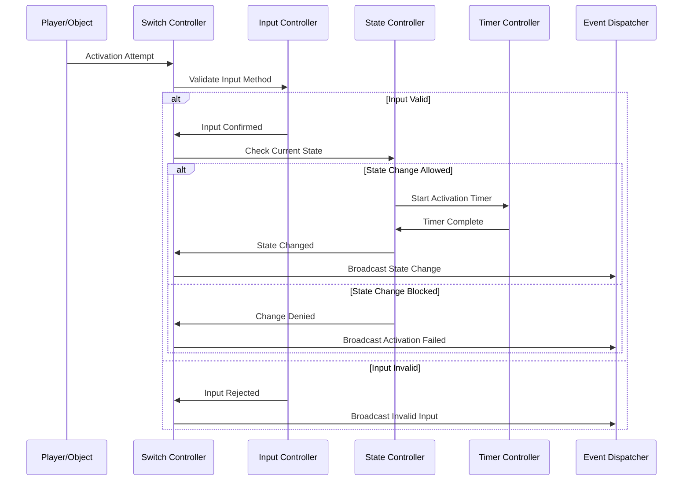
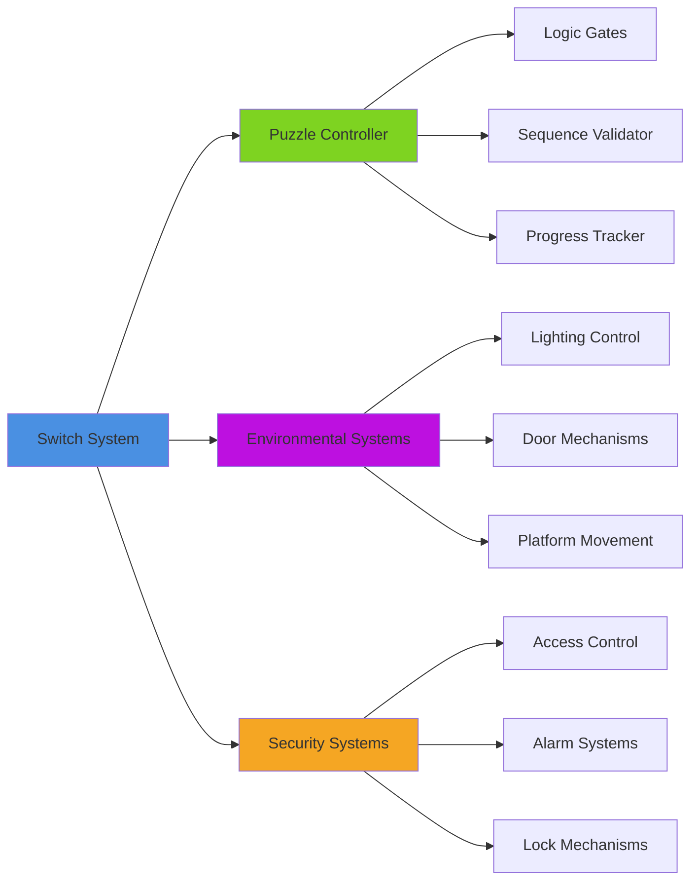
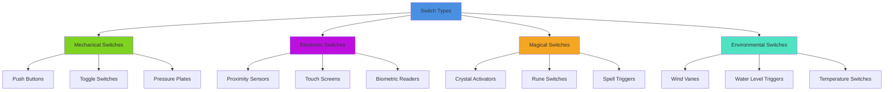

# Button & Switch System

## Overview
A versatile button and switch interaction system supporting various activation methods, timing mechanisms, and complex trigger sequences. Implements pressure plates, toggle switches, timed buttons, multi-stage activation sequences, and networked synchronization for multiplayer puzzle solving.

## System Architecture

```mermaid
graph TB
    A[Switch Manager] --> B[Input Controller]
    A --> C[State Controller]
    A --> D[Timer Controller]
    A --> E[Sequence Controller]
    A --> F[Network Controller]
    
    B --> G[Pressure Detection]
    B --> H[Touch Activation]
    B --> I[Proximity Triggers]
    B --> J[Voice Commands]
    
    C --> K[Toggle States]
    C --> L[Momentary States]
    C --> M[Multi-Position]
    C --> N[Conditional States]
    
    D --> O[Activation Timers]
    D --> P[Cooldown Timers]
    D --> Q[Sequence Timers]
    
    E --> R[Multi-Switch Logic]
    E --> S[Pattern Recognition]
    E --> T[Combination Locks]
    
    F --> U[State Replication]
    F --> V[Authority Management]
    F --> W[Sync Validation]
    
    style A fill:#4a90e2
    style E fill:#7ed321
    style D fill:#f5a623
    style C fill:#bd10e0
    style B fill:#50e3c2
```

## Component Breakdown

### Switch Manager Component
- **Purpose**: Central orchestration of switch behaviors and state management
- **Key Features**: Multi-type switch support, event coordination, network synchronization
- **Performance**: Efficient state tracking with minimal memory overhead

### Input Controller Component
- **Purpose**: Handles various activation methods and input validation
- **Key Features**: Multi-modal input support, gesture recognition, voice commands
- **Performance**: Smart input filtering with debouncing and noise reduction

### Sequence Controller Component
- **Purpose**: Manages complex multi-switch sequences and pattern matching
- **Key Features**: Temporal sequences, spatial patterns, conditional logic chains
- **Performance**: Optimized pattern matching with early termination

## Blueprint Patterns

### Switch Activation Flow

### Multi-Switch Sequence Pattern
- **Pattern Recognition**: Detect specific activation sequences across multiple switches
- **Timing Windows**: Time-sensitive sequences with configurable tolerance
- **Reset Conditions**: Automatic sequence reset on failure or timeout

### State Machine Pattern
- **Switch States**: Off, On, Transitioning, Disabled, Locked, Broken
- **Transition Rules**: Valid state changes with conditions and requirements
- **Persistent States**: Maintain switch states across game sessions

## Performance Optimization

### Input Processing
- **Debouncing**: Prevent rapid state changes from noisy inputs
- **Input Pooling**: Batch process multiple switch inputs efficiently
- **Priority System**: Critical switches get immediate processing

### State Management
- **Delta Updates**: Only process switches that have changed state
- **Spatial Optimization**: Only check switches within player proximity
- **Batch Notifications**: Group state change events for efficiency

### Sequence Processing
- **Early Termination**: Stop processing invalid sequences immediately
- **Pattern Caching**: Cache frequently used sequence patterns
- **Smart Validation**: Validate sequence steps incrementally

## Integration Points

### Puzzle System Integration

### System Integrations
- **Lighting System**: Switch-controlled ambient and task lighting
- **Audio System**: Switch activation sounds and environmental audio changes
- **Mechanical Systems**: Control moving platforms, elevators, and machinery
- **Security Systems**: Integrate with alarms, locks, and surveillance

### Gameplay Mechanics
- **Quest Integration**: Story-critical switches with narrative significance
- **Crafting Integration**: Switches that control manufacturing equipment
- **Combat Integration**: Environmental hazards and tactical advantages
- **Exploration Rewards**: Hidden switches revealing secret areas

## Configuration System

### Switch Types Data Asset
- **Push Buttons**: Momentary activation with spring-back mechanism
- **Toggle Switches**: Binary on/off states with position memory
- **Pressure Plates**: Weight-activated switches with threshold settings
- **Proximity Switches**: Motion-activated with configurable detection ranges
- **Combination Switches**: Multi-input switches requiring specific sequences

### Activation Methods Data Asset
- **Physical Contact**: Direct touch or pressure activation
- **Proximity Detection**: Motion or presence-based triggering
- **Voice Commands**: Speech recognition with customizable keywords
- **Gesture Recognition**: Hand gesture or body movement activation
- **Tool Requirements**: Switches requiring specific items or abilities

### Timing Parameters Data Asset
- **Activation Duration**: How long switch remains active after triggering
- **Cooldown Period**: Minimum time between activations
- **Sequence Timeout**: Maximum time allowed for multi-switch sequences
- **Debounce Time**: Minimum time between state changes

## Advanced Features

### Smart Switch Networks
- **Mesh Communication**: Switches communicate state changes to network
- **Dependency Chains**: Switches that enable or disable other switches
- **Load Balancing**: Distribute processing across multiple switch controllers
- **Redundant Systems**: Backup switches for critical systems

### Contextual Behavior
- **Environmental Adaptation**: Switch behavior changes based on environment
- **Player State Awareness**: Different responses based on player condition
- **Time-Based Behavior**: Switch availability based on time of day or game progress
- **Dynamic Difficulty**: Switch complexity adapts to player skill level

### Multi-Modal Interaction
- **Accessibility Support**: Multiple activation methods for different abilities
- **Cultural Adaptation**: Region-appropriate interaction metaphors
- **VR Optimization**: Natural gesture-based interactions for VR platforms
- **Mobile Integration**: Touch and tilt controls for mobile platforms

## Switch Categories

### Input Type System

### Behavior Types
- **Momentary**: Active only while being pressed or triggered
- **Latching**: Remain in activated state until explicitly reset
- **Timed**: Automatically return to default state after set duration
- **Conditional**: Activation depends on specific game conditions

### Visual Feedback
- **State Indicators**: Clear visual representation of switch state
- **Activation Feedback**: Immediate visual response to user interaction
- **Progress Indicators**: Show progress through multi-step sequences
- **Error Feedback**: Visual indication of invalid activation attempts

## Implementation Notes

### Blueprint Architecture
- **Component-Based Design**: Modular switch components for maximum flexibility
- **Event-Driven System**: Responsive switch system with efficient event handling
- **Data-Driven Configuration**: External switch definitions for easy level design

### Network Architecture
- **Client-Server Model**: Server-authoritative switch states with client prediction
- **Bandwidth Optimization**: Efficient state synchronization across network
- **Conflict Resolution**: Handle simultaneous activation attempts gracefully

### Performance Patterns
- **Spatial Partitioning**: Only process switches in active game areas
- **State Caching**: Cache frequently accessed switch states
- **Batch Processing**: Group switch operations for optimal performance

### User Experience
- **Clear Affordances**: Switches clearly communicate their interaction method
- **Consistent Behavior**: Similar switches behave predictably across the game
- **Accessible Design**: Support for players with various physical abilities
- **Satisfying Feedback**: Rewarding audio and visual responses to activation

This button and switch system provides a robust foundation for interactive environmental elements while supporting complex puzzle mechanics and ensuring smooth multiplayer functionality across all platforms.
