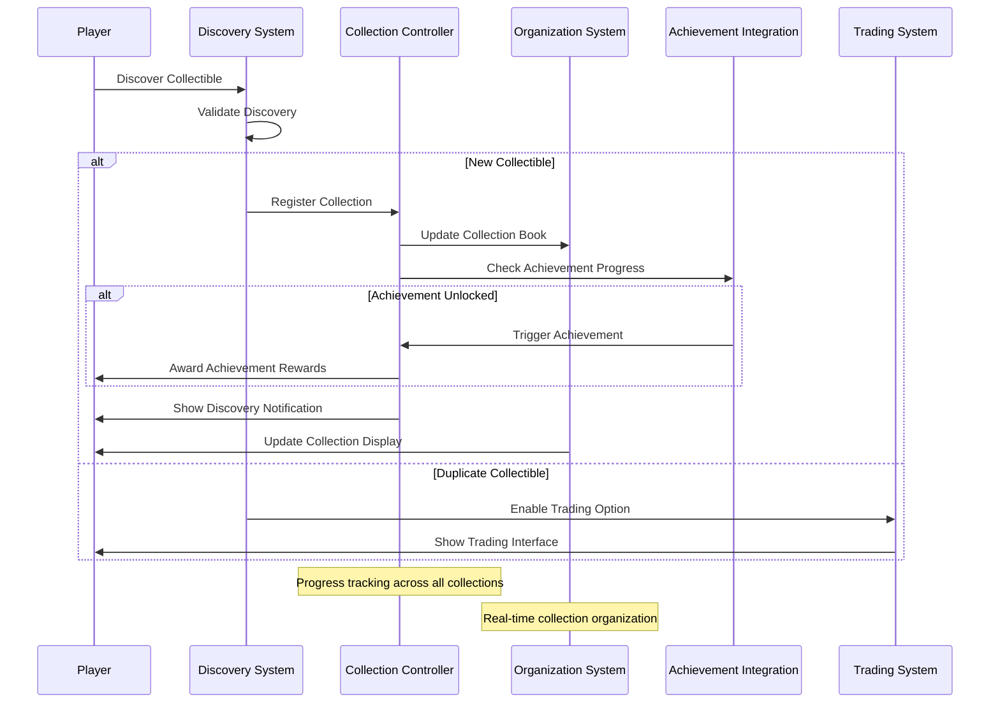
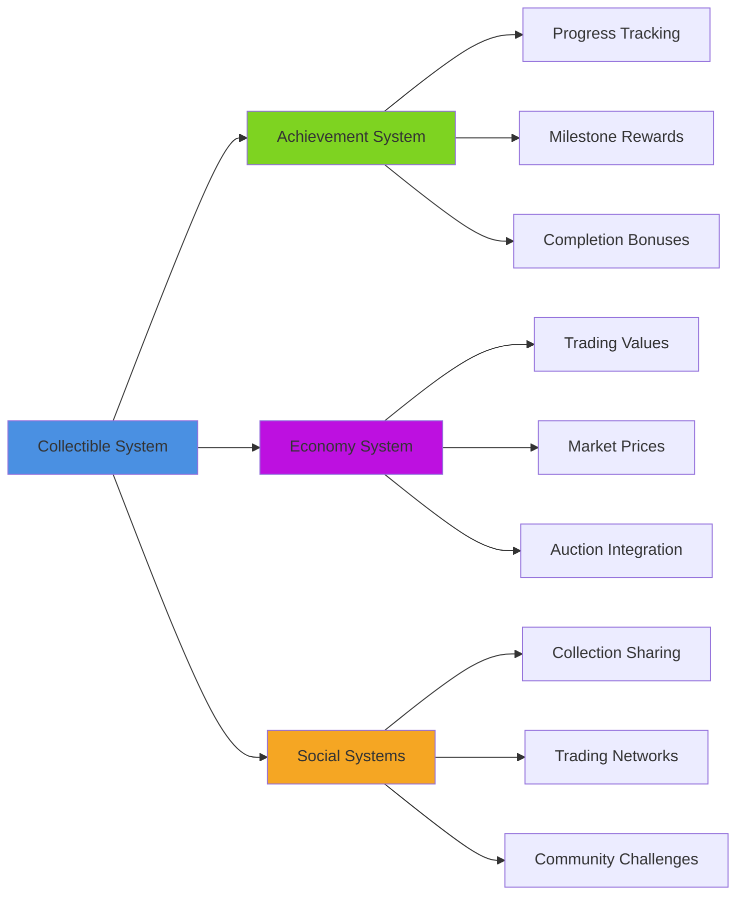

# Collectible System

## Overview
A comprehensive collectible management system supporting various collectible types, collection tracking, achievement integration, and reward systems. Implements trading cards, artifacts, specimens, and achievement tokens while providing discovery mechanics, organization tools, and social sharing features.

## System Architecture

```mermaid
graph TB
    A[Collectible Manager] --> B[Collection Controller]
    A --> C[Discovery System]
    A --> D[Organization System]
    A --> E[Achievement Integration]
    A --> F[Trading System]
    
    B --> G[Item Registration]
    B --> H[Progress Tracking]
    B --> I[Completion Detection]
    B --> J[Reward Distribution]
    
    C --> K[Spawn Management]
    C --> L[Discovery Mechanics]
    C --> M[Rarity System]
    C --> N[Location Tracking]
    
    D --> O[Collection Books]
    D --> P[Category Systems]
    D --> Q[Search Functions]
    D --> R[Display Options]
    
    E --> S[Achievement Unlocks]
    E --> T[Progress Rewards]
    E --> U[Milestone Bonuses]
    E --> V[Completion Certificates]
    
    F --> W[Player Trading]
    F --> X[Auction Systems]
    F --> Y[Gift Mechanics]
    
    style A fill:#4a90e2
    style B fill:#7ed321
    style C fill:#f5a623
    style D fill:#bd10e0
    style E fill:#50e3c2
    style F fill:#d0021b
```

## Component Breakdown

### Collectible Manager Component
- **Purpose**: Central orchestration of collectible systems and data management
- **Key Features**: Type management, global progress tracking, integration coordination
- **Performance**: Efficient collectible database with smart indexing and caching

### Collection Controller Component
- **Purpose**: Manages individual collections and completion tracking
- **Key Features**: Progress calculation, completion rewards, milestone detection
- **Performance**: Optimized collection queries with incremental updates

### Discovery System Component
- **Purpose**: Handles collectible spawning, placement, and discovery mechanics
- **Key Features**: Dynamic spawning, rarity distribution, respawn management
- **Performance**: Spatial optimization with distance-based activation

## Blueprint Patterns

### Collection Discovery Flow

### Rarity Distribution Pattern
- **Weighted Spawning**: Common, uncommon, rare, epic, legendary distribution curves
- **Location-Based Rarity**: Certain areas have higher chances for rare collectibles
- **Time-Based Availability**: Some collectibles only appear under specific conditions

### Collection Completion Pattern
- **Progressive Rewards**: Incremental rewards for collection milestones
- **Set Bonuses**: Special rewards for completing entire collectible sets
- **Master Collection**: Meta-collection rewards for completing multiple collections

## Performance Optimization

### Spawn Optimization
- **Smart Spawning**: Collectibles spawn based on player proximity and activity
- **Respawn Management**: Intelligent respawn timers based on collection progress
- **Memory Pooling**: Reuse collectible objects efficiently

### Database Optimization
- **Indexed Queries**: Fast lookup of collectible data and progress
- **Cached Statistics**: Pre-calculated collection statistics for instant display
- **Incremental Updates**: Only update changed collection data

### UI Optimization
- **Virtual Scrolling**: Efficiently display large collections
- **Lazy Loading**: Load collectible details on-demand
- **Image Caching**: Smart caching of collectible artwork and descriptions

## Integration Points

### Progression System Integration

### System Integrations
- **Map System**: Collectible locations marked on maps with discovery tracking
- **Quest System**: Special collectibles tied to story progression and side quests
- **Audio System**: Unique discovery sounds and collection completion fanfares
- **Save System**: Persistent collection progress and discovered item states

### Gameplay Mechanics
- **Exploration Rewards**: Collectibles reward thorough world exploration
- **Character Progression**: Some collectibles provide stat bonuses or abilities
- **Crafting Integration**: Collectibles used as materials for special recipes
- **Social Competition**: Leaderboards and community collection challenges

## Configuration System

### Collectible Categories Data Asset
- **Natural Specimens**: Flora samples, fauna observations, geological samples
- **Cultural Artifacts**: Historical items, art pieces, archaeological finds
- **Trading Cards**: Character cards, location cards, event commemoratives
- **Achievement Tokens**: Proof of accomplishment items and milestone markers
- **Mystery Items**: Unknown collectibles that require identification

### Rarity Tiers Data Asset
- **Common**: Easily found collectibles that appear frequently
- **Uncommon**: Moderately rare items requiring some exploration effort
- **Rare**: Difficult to find items in specific or hidden locations
- **Epic**: Very rare collectibles with special discovery requirements
- **Legendary**: Extremely rare items with complex unlock conditions

### Discovery Methods Data Asset
- **World Exploration**: Collectibles found by exploring game environments
- **Activity Rewards**: Items earned through specific gameplay activities
- **Achievement Unlocks**: Collectibles granted for achieving specific goals
- **Time-Limited Events**: Special collectibles available during limited periods
- **Social Interactions**: Items obtained through player interactions and trading

## Advanced Features

### Dynamic Collection System
- **Seasonal Collections**: Special collectibles that appear during specific seasons
- **Event Collections**: Limited-time collectibles tied to special events
- **Community Collections**: Global collection goals requiring community effort
- **Personal Collections**: Custom collections created by individual players

### Advanced Organization
- **Smart Categories**: AI-suggested organization based on collection patterns
- **Custom Filters**: Player-defined search and display filters
- **Collection Stories**: Narrative context for collectible sets and themes
- **Visual Displays**: 3D showcase rooms and virtual exhibition spaces

### Social Features
- **Collection Showcases**: Public displays of impressive collections
- **Trading Networks**: Robust trading systems with reputation tracking
- **Collection Guides**: Community-created guides for finding collectibles
- **Collaborative Collections**: Group efforts to complete large collection sets

## Collectible Categories

### Collection Types

```mermaid
graph TD
    A[Collectible Types] --> B[Natural Collections]
    A --> C[Cultural Collections]
    A --> D[Achievement Collections]
    A --> E[Social Collections]
    A --> F[Event Collections]
    
    B --> G[Wildlife Specimens]
    B --> H[Plant Samples]
    B --> I[Mineral Deposits]
    
    C --> J[Historical Artifacts]
    C --> K[Art Pieces]
    C --> L[Literature Fragments]
    
    D --> M[Skill Tokens]
    D --> N[Victory Medals]
    D --> O[Exploration Badges]
    
    E --> P[Trading Cards]
    E --> Q[Community Gifts]
    E --> R[Collaboration Tokens]
    
    F --> S[Seasonal Items]
    F --> T[Holiday Specials]
    F --> U[Limited Editions]
    
    style A fill:#4a90e2
    style B fill:#7ed321
    style C fill:#bd10e0
    style D fill:#f5a623
    style E fill:#50e3c2
    style F fill:#d0021b
```

### Discovery Mechanics
- **Passive Discovery**: Collectibles found during normal gameplay activities
- **Active Searching**: Collectibles requiring dedicated exploration and investigation
- **Skill-Based Discovery**: Items accessible only with specific skills or equipment
- **Knowledge-Based Discovery**: Collectibles found through clues and information gathering

### Reward Systems
- **Immediate Rewards**: Instant gratification upon discovering new collectibles
- **Progressive Rewards**: Increasing rewards as collection completion percentages rise
- **Set Completion Rewards**: Special bonuses for completing entire collectible sets
- **Master Collector Rewards**: Exclusive rewards for completing multiple collections

## Implementation Notes

### Blueprint Architecture
- **Modular Collection Components**: Flexible framework supporting diverse collectible types
- **Event-Driven Updates**: Efficient response system for collection changes
- **Data-Driven Content**: External collectible definitions for easy content addition

### Database Design
- **Normalized Structure**: Efficient database design minimizing redundancy
- **Indexed Access**: Fast queries for large collectible databases
- **Backup Systems**: Redundant storage preventing collection progress loss

### Performance Patterns
- **Lazy Loading**: Load collectible details only when needed
- **Smart Caching**: Cache frequently accessed collection data
- **Background Processing**: Process collection achievements without blocking gameplay

### User Experience
- **Satisfying Discovery**: Rewarding feedback for finding new collectibles
- **Clear Progress**: Visual progress indicators for all collection goals
- **Organization Tools**: Powerful tools for managing large collections
- **Social Integration**: Seamless sharing and trading of collectibles

This collectible system provides a comprehensive framework for collection-based gameplay that rewards exploration and achievement while fostering social interaction and long-term engagement across all platforms.
