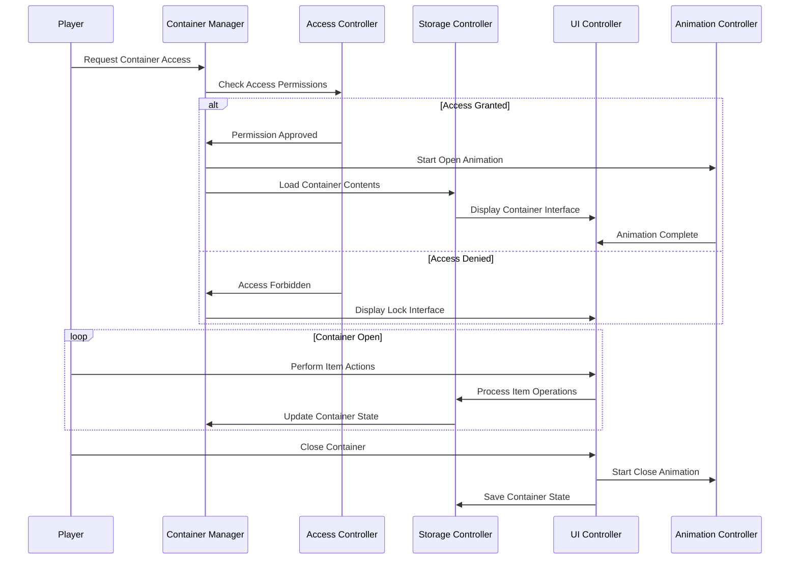
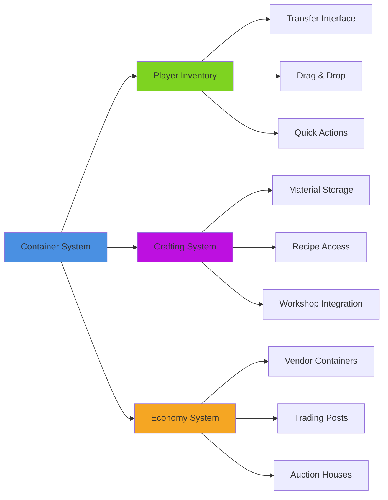
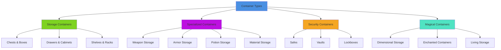

# Container System

## Overview
A comprehensive container management system supporting various container types, inventory interfaces, locking mechanisms, and persistence. Implements chests, drawers, safes, magical storage, and world containers while providing smooth opening animations, search functionality, and multiplayer synchronization.

## System Architecture

```mermaid
graph TB
    A[Container Manager] --> B[Storage Controller]
    A --> C[Access Controller]
    A --> D[Animation Controller]
    A --> E[UI Controller]
    A --> F[Network Controller]
    
    B --> G[Inventory Management]
    B --> H[Capacity System]
    B --> I[Item Filtering]
    B --> J[Sort Algorithms]
    
    C --> K[Lock Integration]
    C --> L[Permission System]
    C --> M[Security Levels]
    C --> N[Ownership Tracking]
    
    D --> O[Open/Close Animations]
    D --> P[Physics Simulation]
    D --> Q[Particle Effects]
    
    E --> R[Container Interface]
    E --> S[Search System]
    E --> T[Quick Actions]
    E --> U[Visual Feedback]
    
    F --> V[State Replication]
    F --> W[Loot Distribution]
    F --> X[Anti-Cheat]
    
    style A fill:#4a90e2
    style B fill:#7ed321
    style C fill:#f5a623
    style D fill:#bd10e0
    style E fill:#50e3c2
    style F fill:#d0021b
```

## Component Breakdown

### Container Manager Component
- **Purpose**: Central orchestration of container behaviors and lifecycle management
- **Key Features**: Multi-type support, state persistence, event coordination
- **Performance**: Efficient memory usage with smart loading and unloading

### Storage Controller Component
- **Purpose**: Manages inventory contents, capacity limits, and item organization
- **Key Features**: Dynamic capacity, item filtering, auto-sorting, search functionality
- **Performance**: Optimized item queries with indexing and caching

### Access Controller Component
- **Purpose**: Handles security, permissions, and access restrictions
- **Key Features**: Lock integration, ownership systems, theft detection
- **Performance**: Cached permission validation with minimal lookup overhead

## Blueprint Patterns

### Container Interaction Flow

### Loot Generation Pattern
- **Dynamic Generation**: Procedural loot based on container type and player level
- **Rarity Distribution**: Weighted random generation with luck modifiers
- **Context-Sensitive**: Loot appropriate to container location and story context

### Multi-Access Pattern
- **Concurrent Access**: Multiple players can access same container simultaneously
- **Action Queuing**: Queue conflicting actions for fair resolution
- **State Synchronization**: Real-time updates across all accessing players

## Performance Optimization

### Memory Management
- **Lazy Loading**: Load container contents only when accessed
- **Smart Caching**: Cache frequently accessed container data
- **Garbage Collection**: Clean up unused container instances efficiently

### UI Optimization
- **Virtual Scrolling**: Efficiently display large container inventories
- **Incremental Search**: Real-time search with minimal performance impact
- **UI Pooling**: Reuse UI elements for multiple containers

### Network Optimization
- **Delta Synchronization**: Only send changed container data
- **Priority Queuing**: Important container changes get transmission priority
- **Compression**: Compress container state data for network efficiency

## Integration Points

### Inventory System Integration

### System Integrations
- **Quest System**: Story-specific containers with unique items and triggers
- **Security System**: Alarm integration for unauthorized container access
- **Crafting System**: Workshop containers with specialized tool and material storage
- **Housing System**: Player-owned containers with decoration and customization

### World Systems
- **Save System**: Persistent container states and contents across sessions  
- **Level Streaming**: Maintain container data during level transitions
- **Time System**: Restocking containers and decay mechanics

## Configuration System

### Container Types Data Asset
- **Storage Chests**: Basic wooden, metal, and magical storage containers
- **Specialized Storage**: Weapon racks, armor stands, potion cabinets
- **Safes and Vaults**: High-security containers with complex locking mechanisms
- **Magical Storage**: Dimensional storage with enhanced capacity
- **Living Containers**: Organic storage with special properties

### Capacity Systems Data Asset
- **Weight-Based**: Physical weight limits with realistic carrying capacity
- **Slot-Based**: Fixed number of item slots with size considerations
- **Volume-Based**: 3D space simulation with Tetris-like item arrangement
- **Hybrid Systems**: Combination of multiple capacity restriction methods

### Security Levels Data Asset
- **Public Access**: Open containers available to all players
- **Restricted Access**: Containers requiring keys, codes, or permissions
- **Owner-Only**: Personal containers with strict ownership enforcement
- **Guild Storage**: Shared containers with role-based access permissions

## Advanced Features

### Smart Organization System
- **Auto-Sorting**: Intelligent item organization based on type and usage
- **Search and Filter**: Advanced search with multiple criteria and saved filters
- **Quick Actions**: One-click actions for common container operations
- **Predictive Organization**: Learn player preferences and suggest organization

### Visual Enhancement System
- **Physics Simulation**: Realistic item placement and physics interactions
- **Dynamic Lighting**: Container interiors with atmospheric lighting
- **Particle Effects**: Magical effects for enchanted containers
- **Material Visualization**: Visual representation of container materials and quality

### Security Features
- **Theft Detection**: Track unauthorized access attempts and stolen items
- **Alarm Systems**: Integration with security systems for break-in alerts
- **Forensics**: Track item movement and ownership history
- **Insurance Systems**: Item recovery and replacement for stolen goods

## Container Categories

### Container Type System

### Access Methods
- **Direct Access**: Simple open/close interaction for basic containers
- **Locked Access**: Key, combination, or biometric unlocking required
- **Conditional Access**: Access based on quest progress, skills, or items
- **Timed Access**: Containers available only at specific times or conditions

### Visual Feedback
- **State Indicators**: Visual cues showing container status and contents
- **Animation Feedback**: Smooth opening/closing animations with physics
- **UI Integration**: Clear interface showing capacity and organization options
- **Interaction Prompts**: Context-sensitive interaction hints and availability

## Implementation Notes

### Blueprint Architecture
- **Modular Components**: Flexible container components for various types and behaviors
- **Event-Driven Design**: Responsive container system with efficient state management
- **Data-Driven Content**: External container definitions for easy level design

### Security Considerations
- **Server Authority**: Server-side validation of all container operations
- **Anti-Cheat**: Robust validation to prevent item duplication and theft
- **Audit Logging**: Complete tracking of container access and modifications

### Performance Patterns
- **Object Pooling**: Efficient reuse of container UI and effect objects
- **Spatial Optimization**: Only process containers in active game areas
- **Async Operations**: Non-blocking container operations for smooth gameplay

### User Experience
- **Intuitive Interface**: Familiar drag-and-drop interactions with clear visual feedback
- **Accessibility Support**: Screen reader compatibility and alternative interaction methods
- **Customization Options**: Player control over container organization and display preferences
- **Help Integration**: Contextual help and tooltips for complex container features

This container system provides a comprehensive storage solution that enhances gameplay through organized item management while maintaining security and performance across all platforms and play styles.
