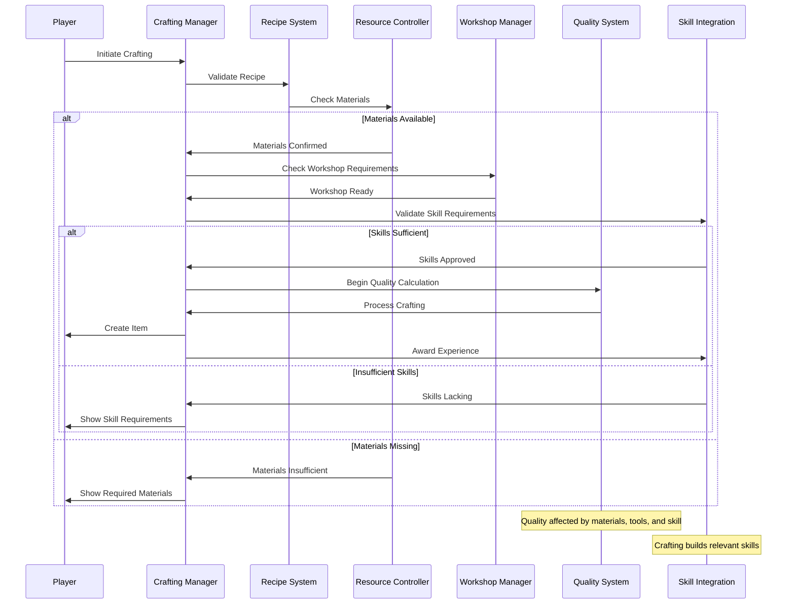
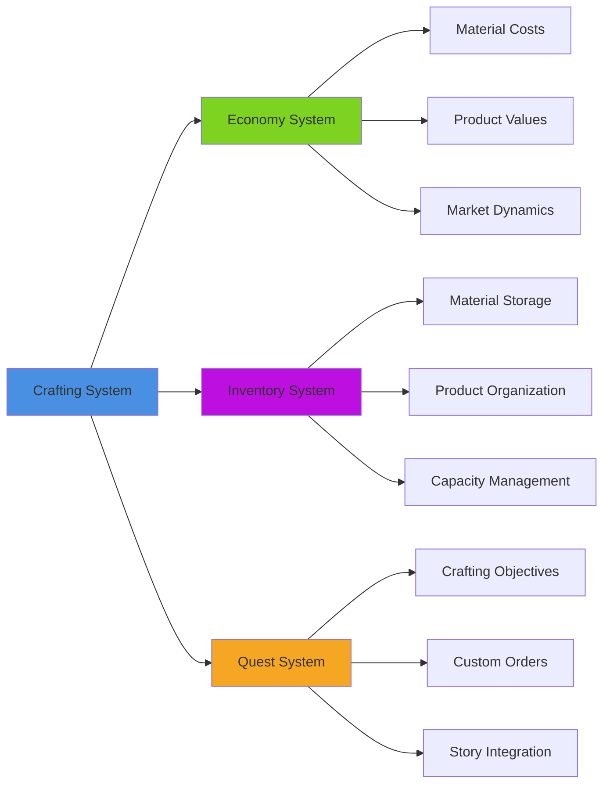
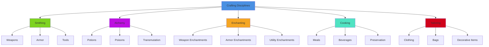

# Crafting System

## Overview
A comprehensive crafting system providing recipe-based item creation, resource management, skill progression, and quality control. Implements multi-tier crafting, experimentation mechanics, tool integration, and collaborative crafting while supporting both traditional recipes and player-driven innovation.

## System Architecture

```mermaid
graph TB
    A[Crafting Manager] --> B[Recipe System]
    A --> C[Resource Controller]
    A --> D[Workshop Manager]
    A --> E[Quality System]
    A --> F[Skill Integration]
    
    B --> G[Recipe Database]
    B --> H[Ingredient Validation]
    B --> I[Substitution Engine]
    B --> J[Discovery System]
    
    C --> K[Material Tracking]
    C --> L[Inventory Integration]
    C --> M[Resource Optimization]
    C --> N[Waste Management]
    
    D --> O[Crafting Stations]
    D --> P[Tool Requirements]
    D --> Q[Environmental Factors]
    D --> R[Collaborative Spaces]
    
    E --> S[Quality Calculation]
    E --> T[Bonus Systems]
    E --> U[Failure Handling]
    E --> V[Perfection Rewards]
    
    F --> W[Skill Requirements]
    F --> X[Experience Gain]
    F --> Y[Mastery Benefits]
    F --> Z[Specialization Paths]
    
    style A fill:#4a90e2
    style B fill:#7ed321
    style C fill:#f5a623
    style D fill:#bd10e0
    style E fill:#50e3c2
    style F fill:#d0021b
```

## Component Breakdown

### Crafting Manager Component
- **Purpose**: Central orchestration of crafting systems and process management
- **Key Features**: Process coordination, state management, system integration
- **Performance**: Efficient crafting pipeline with optimized resource allocation

### Recipe System Component
- **Purpose**: Manages crafting recipes, ingredient relationships, and discovery mechanics
- **Key Features**: Recipe database, substitution logic, progressive unlocking
- **Performance**: Fast recipe lookup with intelligent caching and indexing

### Resource Controller Component
- **Purpose**: Handles material consumption, inventory integration, and resource optimization
- **Key Features**: Smart resource allocation, waste reduction, batch processing
- **Performance**: Optimized resource queries with predictive material management

## Blueprint Patterns

### Crafting Process Flow

### Recipe Discovery Pattern
- **Experimentation**: Players discover recipes through trial and combination
- **Knowledge Acquisition**: Recipes learned from NPCs, books, or exploration
- **Progressive Unlocking**: Advanced recipes require mastery of basic ones

### Quality Determination Pattern
- **Multi-Factor Quality**: Material quality, tool condition, skill level, environment
- **Random Elements**: Some randomness prevents completely predictable outcomes
- **Mastery Consistency**: Highly skilled crafters produce more consistent results

## Performance Optimization

### Crafting Processing
- **Batch Operations**: Process multiple similar crafting operations together
- **Async Crafting**: Long crafting operations don't block gameplay
- **Result Caching**: Cache crafting results for repeated identical operations

### Recipe Management
- **Smart Indexing**: Efficient recipe database with multiple search indices
- **Lazy Loading**: Load recipe details only when needed
- **Memory Management**: Optimal storage of recipe data and player knowledge

### Resource Tracking
- **Efficient Queries**: Fast material availability and requirement checking
- **Update Batching**: Group resource updates for optimal performance
- **Predictive Loading**: Pre-load likely needed materials and recipes

## Integration Points

### Economy System Integration

### System Integrations
- **Tool System**: Crafting requires appropriate tools for different recipes
- **Skill System**: Character abilities determine crafting capabilities and quality
- **Workshop System**: Different crafting stations enable different recipe categories
- **Social System**: Collaborative crafting and knowledge sharing mechanics

### Gameplay Mechanics
- **Character Progression**: Crafting skills affect combat effectiveness and exploration
- **Economic Gameplay**: Player-driven economy through crafted goods trading
- **Problem Solving**: Custom crafting solutions for gameplay challenges
- **Creative Expression**: Player creativity through experimentation and customization

## Configuration System

### Recipe Categories Data Asset
- **Equipment Crafting**: Weapons, armor, tools, and accessories
- **Consumable Creation**: Potions, food, ammunition, and temporary items
- **Construction Materials**: Building components, furniture, and decorations
- **Magical Items**: Enchanted objects, scrolls, and alchemical products
- **Specialized Goods**: Trade goods, art objects, and unique items

### Material Properties Data Asset
- **Base Materials**: Wood, metal, stone, cloth, leather fundamentals
- **Rare Materials**: Precious metals, magical components, exotic substances
- **Quality Grades**: Common, uncommon, rare, epic, legendary material tiers
- **Special Properties**: Magical, elemental, or unique material characteristics

### Workshop Types Data Asset
- **Basic Workshops**: Simple crafting stations for fundamental recipes
- **Specialized Stations**: Advanced equipment for professional crafting
- **Magical Forges**: Enchantment and magical item creation facilities
- **Collaborative Workshops**: Multi-player crafting stations for large projects

## Advanced Features

### Dynamic Recipe System
- **Emergent Recipes**: New combinations discovered through experimentation
- **Adaptive Recipes**: Recipes that change based on available materials
- **Seasonal Variations**: Recipe availability and effects based on time/weather
- **Cultural Variations**: Different regions have unique crafting traditions

### Master Crafting System
- **Signature Items**: Master crafters create items with unique properties
- **Innovation Mechanics**: Develop entirely new categories of items
- **Apprenticeship**: Teaching and learning systems between players
- **Legendary Crafting**: Epic projects requiring community collaboration

### Quality Enhancement
- **Perfectionist Bonuses**: Exceptional results from flawless execution
- **Inspiration Systems**: Temporary bonuses from environmental or social factors
- **Critical Success**: Rare chances for extraordinary results
- **Customization Options**: Player choices that affect final product properties

## Crafting Categories

### Crafting Discipline System

### Production Methods
- **Manual Crafting**: Individual items created through personal skill
- **Batch Production**: Multiple items created simultaneously for efficiency
- **Automated Systems**: Mechanical or magical systems for mass production
- **Collaborative Creation**: Multiple players working together on large projects

### Quality Factors
- **Material Quality**: Better materials produce superior results
- **Tool Condition**: Well-maintained tools improve crafting outcomes
- **Environmental Conditions**: Optimal conditions enhance crafting quality
- **Crafter Skill**: Player expertise directly affects result quality

## Implementation Notes

### Blueprint Architecture
- **Modular Crafting Components**: Flexible framework supporting diverse crafting types
- **Event-Driven Design**: Reactive crafting system with efficient state management
- **Data-Driven Recipes**: External recipe definitions for easy content expansion

### Economic Balance
- **Resource Scarcity**: Limited materials drive player engagement and trading
- **Skill Investment**: Time and effort required for mastery creates value
- **Quality Scaling**: Better results justify higher material and time investment
- **Market Integration**: Crafted items contribute meaningfully to game economy

### Performance Patterns
- **Efficient Processing**: Optimal crafting algorithms with minimal computational overhead
- **Smart Caching**: Cache frequently used recipes and material combinations
- **Async Operations**: Background processing for complex or lengthy crafting

### User Experience
- **Intuitive Interface**: Easy-to-understand crafting interfaces and feedback
- **Progressive Complexity**: Simple recipes teach concepts for advanced crafting
- **Satisfying Results**: Rewarding crafting outcomes that justify time investment
- **Creative Freedom**: Player agency in experimentation and customization

This crafting system provides a comprehensive framework for item creation that supports both structured recipe-following and creative experimentation while maintaining economic balance and player engagement across all platforms and play styles.
