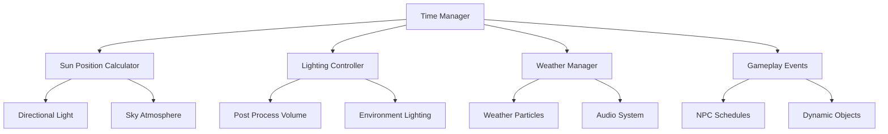

# 🌅 Day & Night Cycle System - Dynamic World Lighting

Create a **dynamic day/night cycle** that transforms your adventure game world with realistic lighting transitions, weather integration, and gameplay mechanics that respond to time of day.

## 🎯 What You'll Learn

- **Real-time sun positioning** with accurate celestial mechanics
- **Dynamic lighting transitions** for atmospheric immersion
- **Weather system integration** with time-based patterns
- **Gameplay mechanics** that respond to day/night states
- **Performance optimization** for large open worlds
- **NPC behavior scheduling** based on time of day

## 📺 Video Tutorial

🎬 **[UE5 Day Night Cycle System - Dynamic Lighting Tutorial](https://www.youtube.com/watch?v=1Cj2CrftFPI)**
- **Channel**: PrismaticaDev
- **Duration**: ~35 minutes  
- **Topics**: Time management, lighting transitions, weather integration, dynamic atmosphere

## 📚 Official Documentation & Resources

### **Epic Games Official Documentation:**
- 📖 **[Designing Visuals, Rendering, and Graphics](https://dev.epicgames.com/documentation/en-us/unreal-engine/designing-visuals-rendering-and-graphics-with-unreal-engine)** - Lighting and atmosphere systems
- 📖 **[Building Virtual Worlds](https://dev.epicgames.com/documentation/en-us/unreal-engine/building-virtual-worlds-in-unreal-engine)** - Environment and lighting design
- 📖 **[Working with Audio](https://dev.epicgames.com/documentation/en-us/unreal-engine/working-with-audio-in-unreal-engine)** - Environmental audio systems

## 🏗️ System Architecture



## 🧩 Core Components

### 1. Time Manager System
Central controller for time progression and world state.

```blueprint
// TimeManagerComponent (Actor Component)

Variables:
- CurrentTime: Float (0-24 hours)
- TimeMultiplier: Float (Default: 1.0)
- DayLength: Float (Default: 1200 seconds = 20 minutes)
- IsTimePaused: Boolean
- CurrentSeason: Enum_Season
- CurrentWeather: Enum_WeatherType
- SunriseTime: Float (Default: 6.0)
- SunsetTime: Float (Default: 18.0)
```

### 2. Sun Position Calculator
Accurate sun positioning based on time and geographic location.

```blueprint
// SunPositionCalculator

Functions:
- CalculateSunPosition(Time: Float): Rotator
- GetSunIntensity(Time: Float): Float
- GetSunColor(Time: Float): Linear Color
- IsNightTime(Time: Float): Boolean
- GetMoonPosition(Time: Float): Rotator
```

## 📝 Implementation Guide

### Step 1: Create Time Manager

1. **Create Actor Blueprint**:
   - Parent Class: `Actor`
   - Name: `BP_TimeManager`

2. **Add Core Variables**:

```blueprint
// Time Settings
CurrentTime: Float (Default: 12.0) // Start at noon
TimeMultiplier: Float (Default: 60.0) // 1 real minute = 1 game hour
DayLengthMinutes: Float (Default: 24.0) // Real time for full day
IsTimePaused: Boolean (Default: False)

// Sun Settings  
SunriseTime: Float (Default: 6.0)
SunsetTime: Float (Default: 18.0)
MaxSunIntensity: Float (Default: 3.0)
MinSunIntensity: Float (Default: 0.1)

// Component References
SunDirectionalLight: Directional Light Component
SkyAtmosphere: Sky Atmosphere Component
PostProcessVolume: Post Process Volume Component
```

3. **Create Time Progression Logic**:

```blueprint
// Event Tick
Function UpdateTime(Delta Seconds):
    If NOT IsTimePaused:
        // Calculate time progression
        TimeIncrement = (Delta Seconds * TimeMultiplier) / 3600.0
        CurrentTime += TimeIncrement
        
        // Wrap to 24-hour format
        If CurrentTime >= 24.0:
            CurrentTime -= 24.0
            OnNewDay.Broadcast()
        
        // Update all systems
        UpdateSunPosition()
        UpdateLighting()
        UpdateAtmosphere()
        UpdateGameplayEvents()
```

### Step 2: Implement Sun Position System

```blueprint
// Function: UpdateSunPosition
Function UpdateSunPosition():
    // Calculate sun angle (0-360 degrees over 24 hours)
    SunAngle = (CurrentTime / 24.0) * 360.0
    
    // Adjust for sunrise/sunset positioning
    SunPitch = Sin((CurrentTime - 6.0) / 12.0 * 180.0) * 90.0
    SunYaw = (CurrentTime / 24.0) * 360.0 - 90.0 // East to West
    
    // Set sun rotation
    SunRotation = Make Rotator(SunPitch, SunYaw, 0.0)
    SunDirectionalLight.SetWorldRotation(SunRotation)
    
    // Update sky atmosphere sun direction
    SkyAtmosphere.SetSunDirection(SunDirectionalLight.GetForwardVector())
```

### Step 3: Dynamic Lighting System

```blueprint
// Function: UpdateLighting
Function UpdateLighting():
    // Calculate sun intensity based on time
    SunIntensity = CalculateSunIntensity(CurrentTime)
    SunColor = CalculateSunColor(CurrentTime)
    
    // Update directional light
    SunDirectionalLight.SetIntensity(SunIntensity)
    SunDirectionalLight.SetLightColor(SunColor)
    
    // Update ambient lighting
    If IsNightTime():
        // Enable moon lighting
        EnableMoonLight()
        SetAmbientLighting(NightAmbientColor, NightAmbientIntensity)
    Else:
        // Disable moon lighting  
        DisableMoonLight()
        SetAmbientLighting(DayAmbientColor, DayAmbientIntensity)

// Function: CalculateSunIntensity
Function CalculateSunIntensity(Time: Float) -> Float:
    If Time >= SunriseTime AND Time <= SunsetTime:
        // Day time calculation
        TimeFromSunrise = Time - SunriseTime
        DayDuration = SunsetTime - SunriseTime
        Progress = TimeFromSunrise / DayDuration
        
        // Use sine wave for natural intensity curve
        Intensity = Sin(Progress * 180.0) * MaxSunIntensity
        Return Max(Intensity, MinSunIntensity)
    Else:
        // Night time
        Return MinSunIntensity

// Function: CalculateSunColor
Function CalculateSunColor(Time: Float) -> Linear Color:
    If Time >= 5.0 AND Time <= 7.0:
        // Sunrise colors (orange/red)
        T = (Time - 5.0) / 2.0
        Return Lerp(SunriseColor, DayColor, T)
    ElseIf Time >= 17.0 AND Time <= 19.0:
        // Sunset colors (orange/red)
        T = (Time - 17.0) / 2.0  
        Return Lerp(DayColor, SunsetColor, T)
    ElseIf Time >= 7.0 AND Time <= 17.0:
        // Day time (bright white/yellow)
        Return DayColor
    Else:
        // Night time (blue/purple)
        Return NightColor
```

### Step 4: Atmospheric Effects

```blueprint
// Function: UpdateAtmosphere
Function UpdateAtmosphere():
    // Sky atmosphere settings
    SkyAtmosphere.SetSunIntensity(CalculateSkyIntensity(CurrentTime))
    SkyAtmosphere.SetSunDiscColorScale(GetSunDiscColor(CurrentTime))
    
    // Fog settings based on time
    If IsNightTime():
        ExponentialHeightFog.SetFogDensity(NightFogDensity)
        ExponentialHeightFog.SetFogInscatteringColor(NightFogColor)
    Else:
        ExponentialHeightFog.SetFogDensity(DayFogDensity)
        ExponentialHeightFog.SetFogInscatteringColor(DayFogColor)
        
    // Star visibility
    If CurrentTime >= 20.0 OR CurrentTime <= 5.0:
        SkyAtmosphere.SetStarsIntensity(1.0)
    Else:
        SkyAtmosphere.SetStarsIntensity(0.0)
```

### Step 5: Post-Processing Effects

```blueprint
// Function: UpdatePostProcessing
Function UpdatePostProcessing():
    // Get post process settings
    PostProcessSettings = PostProcessVolume.GetSettings()
    
    // Time-based color grading
    If IsNightTime():
        // Cool blue tint for night
        PostProcessSettings.ColorGrading.Temperature = -10.0
        PostProcessSettings.ColorGrading.Tint = 5.0
        PostProcessSettings.Exposure.Bias = -0.5
    ElseIf IsSunrise() OR IsSunset():
        // Warm orange tint for golden hour
        PostProcessSettings.ColorGrading.Temperature = 20.0
        PostProcessSettings.ColorGrading.Tint = -5.0
        PostProcessSettings.Exposure.Bias = 0.2
    Else:
        // Neutral day settings
        PostProcessSettings.ColorGrading.Temperature = 0.0
        PostProcessSettings.ColorGrading.Tint = 0.0
        PostProcessSettings.Exposure.Bias = 0.0
    
    // Apply settings
    PostProcessVolume.SetSettings(PostProcessSettings)
```

## 🎮 Gameplay Integration

### 1. NPC Schedule System
```blueprint
// NPCScheduleComponent

Variables:
- DailySchedule: Map<Float, Enum_NPCActivity>
- CurrentActivity: Enum_NPCActivity
- ActivityLocation: Vector

Function UpdateNPCBehavior(CurrentTime: Float):
    NewActivity = GetScheduledActivity(CurrentTime)
    
    If NewActivity != CurrentActivity:
        CurrentActivity = NewActivity
        
        Switch CurrentActivity:
            Case Work:
                MoveToWorkLocation()
            Case Sleep:
                MoveToSleepLocation()
            Case Eat:
                MoveToEatLocation()
            Case Wander:
                StartWanderBehavior()
```

### 2. Dynamic Object Responses
```blueprint
// Street lights turn on at night
On Time Changed:
    If IsNightTime() AND NOT StreetLightsActive:
        ActivateStreetLights()
    ElseIf NOT IsNightTime() AND StreetLightsActive:
        DeactivateStreetLights()

// Shops open/close based on time
Function UpdateShopStatus(CurrentTime: Float):
    If CurrentTime >= 9.0 AND CurrentTime <= 17.0:
        SetShopOpen(True)
    Else:
        SetShopOpen(False)
```

### 3. Weather Pattern Integration
```blueprint
// Weather changes based on time of day
Function UpdateWeatherPatterns():
    // Morning fog
    If CurrentTime >= 5.0 AND CurrentTime <= 8.0:
        IncreaseWeatherChance(Weather_Fog, 0.7)
    
    // Afternoon storms  
    If CurrentTime >= 14.0 AND CurrentTime <= 16.0:
        IncreaseWeatherChance(Weather_Storm, 0.3)
        
    // Clear nights
    If IsNightTime():
        IncreaseWeatherChance(Weather_Clear, 0.8)
```

## 🚀 Advanced Features

### 1. Seasonal Variations
```blueprint
// Season-based sun path adjustments
Function GetSeasonalSunOffset(Season: Enum_Season) -> Float:
    Switch Season:
        Case Spring:
            Return 0.0
        Case Summer:
            Return 15.0  // Higher sun angle
        Case Autumn:
            Return 0.0
        Case Winter:  
            Return -15.0 // Lower sun angle
```

### 2. Geographic Location System
```blueprint
// Latitude-based day length variations
Function CalculateDayLength(Latitude: Float, DayOfYear: Integer) -> Float:
    // Simplified solar calculation
    Declination = 23.45 * Sin((360.0 * (284 + DayOfYear)) / 365.0)
    HourAngle = Acos(-Tan(Latitude) * Tan(Declination))
    DaylightHours = (2.0 * HourAngle) / 15.0
    Return DaylightHours
```

### 3. Time Acceleration Controls
```blueprint
// Player can speed up/slow down time
Function SetTimeMultiplier(NewMultiplier: Float):
    TimeMultiplier = Clamp(NewMultiplier, 0.1, 100.0)
    
    // Adjust particle systems
    For Each Particle System:
        ParticleSystem.SetTimeScale(TimeMultiplier)
        
    // Adjust animation speeds
    For Each Animated Object:
        AnimatedObject.SetPlayRate(TimeMultiplier)
```

## 🔧 Performance Optimization

### 1. LOD System for Time-Based Effects
```blueprint
// Reduce quality at distance
Function UpdateTimeLOD():
    PlayerLocation = GetPlayerLocation()
    
    For Each TimeEffectActor:
        Distance = GetDistanceTo(TimeEffectActor, PlayerLocation)
        
        If Distance > HighDetailRange:
            TimeEffectActor.SetLOD(Low)
        ElseIf Distance > MediumDetailRange:
            TimeEffectActor.SetLOD(Medium)  
        Else:
            TimeEffectActor.SetLOD(High)
```

### 2. Lighting Update Optimization
```blueprint
// Update lighting less frequently for distant areas
Function OptimizedLightingUpdate():
    // Only update lights within range
    For Each Light in Scene:
        If IsLightInPlayerRange(Light):
            Light.UpdateTimeBasedProperties()
        Else:
            Light.SetUpdateFrequency(Low)
```

## 🧪 Testing & Debug Tools

### Debug Time Controls
```blueprint
// Development-only time controls
If Development Build:
    // Keyboard shortcuts
    On Key Press '1': SetCurrentTime(6.0)  // Sunrise
    On Key Press '2': SetCurrentTime(12.0) // Noon
    On Key Press '3': SetCurrentTime(18.0) // Sunset
    On Key Press '4': SetCurrentTime(0.0)  // Midnight
    
    On Key Press '+': TimeMultiplier *= 2.0
    On Key Press '-': TimeMultiplier /= 2.0
```

## 🎯 Production Considerations

### Save/Load Integration
- **Preserve time state** across save files
- **Handle time jumps** gracefully when loading
- **Sync weather patterns** with loaded time

### Performance Monitoring
- **Frame rate impact** of lighting updates
- **Memory usage** of atmospheric effects  
- **CPU cost** of NPC schedule updates

### Player Options
- **Time acceleration** settings
- **Lighting intensity** preferences
- **Weather frequency** controls

This day/night cycle system creates a living, breathing world that changes dramatically throughout the day, providing endless atmospheric variety and gameplay opportunities for your adventure game.

<style>
.video-container {
  position: relative;
  padding-bottom: 56.25%;
  height: 0;
  overflow: hidden;
  max-width: 100%;
  margin: 2rem 0;
}

.video-container iframe {
  position: absolute;
  top: 0;
  left: 0;
  width: 100%;
  height: 100%;
  border-radius: 10px;
}
</style>
