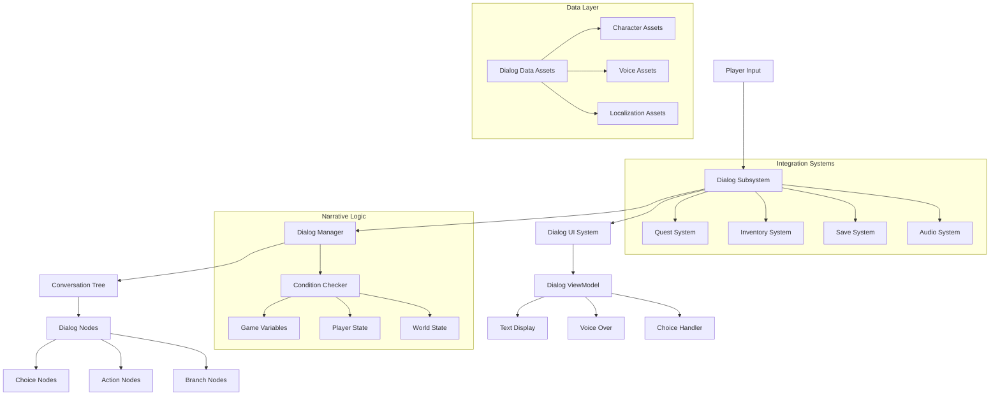

# Dialog System

Branching conversation system with voice integration, localization support, and dynamic narrative choices. Built for scalable storytelling from simple NPC interactions to complex branching narratives with player agency.

## Architecture Overview



## What & Why

Professional dialog systems must balance narrative flexibility with technical performance while supporting multiple languages and voice acting. This system provides scriptwriters and designers with powerful tools for creating engaging conversations while maintaining the clean architecture patterns that developers need for maintainable, scalable implementations.

## Prerequisites

- **Audio System** setup for voice over playback and mixing
- **Localization Framework** for multi-language text and audio support  
- **UI MVVM Patterns** for responsive dialog interface management
- **Quest System Integration** for narrative progression tracking

## Component Architecture

### Core System Components

**DialogSubsystem** (World Subsystem)
- Manages active conversations and dialog state across the game world
- Coordinates between multiple NPCs and complex multi-party conversations  
- Handles dialog history tracking and conversation resume functionality
- Service pattern: Centralized conversation management

**AC_DialogComponent** (Actor Component)
- Handles individual character's dialog capabilities and conversation data
- Manages character-specific voice sets, animations, and personality traits
- Integrates with animation system for lip sync and gesture coordination
- Component composition: Each character manages their dialog participation

**DialogManager** (Blueprint Class)
- Processes conversation trees and evaluates branching conditions
- Handles choice validation based on player state and world conditions
- Manages conversation flow control including interruptions and delays
- Algorithm encapsulation: Complex narrative logic centralized

### Data Management Strategy

**Conversation Tree Structure**
```
DA_ConversationTree (Primary Data Asset):
- Root Node: Entry point with initial conditions
- Dialog Nodes: Character speech with text, voice, and timing
- Choice Nodes: Player decisions with consequences and requirements
- Action Nodes: Game state changes, item gifts, quest updates
- Branch Nodes: Conditional story paths based on player history

Node Properties:
- Unique Node ID for save/load and debugging
- Speaker Information: Character, emotion, animation
- Display Text: Localization key with rich text formatting
- Voice Asset: Audio file with subtitle timing data
- Conditions: Requirements for node availability
- Actions: Game state modifications when node executes
```

**Character Dialog Configuration**
- Voice personality settings (pitch, speed, accent variations)
- Animation sets for different emotional states and gestures
- Relationship tracking with reputation and affinity systems
- Dialog history storage for contextual conversation references

## Implementation Methodology

### Phase 1: Foundation Architecture

**1. Dialog Data Asset System**
- Create conversation tree asset: `DA_ConversationTree`
- Define node types with consistent property interfaces
- Setup localization integration with text and audio assets
- Create dialog validation system for content verification

**2. Conversation Tree Processor**
- Build tree traversal logic with condition evaluation
- Implement choice filtering based on player state requirements
- Create conversation state management with save/resume capability
- Add debugging tools for content creators and testers

**3. Character Integration**
- Setup dialog component for NPC and player character integration
- Implement voice over playback with subtitle synchronization
- Add animation integration for lip sync and emotional expression
- Create relationship tracking with persistent character memory

### Phase 2: UI System Development

**4. MVVM Dialog Interface**
- Create dialog ViewModel with reactive data binding
- Build responsive UI that adapts to different conversation types
- Implement choice presentation with accessibility considerations
- Add dialog history and review functionality for complex narratives

**5. Advanced Dialog Features**  
- Timed choices with countdown visual feedback
- Interruption handling for dynamic conversation flow
- Multi-character conversations with proper speaker management
- Voice over controls with skip, replay, and speed adjustment

### Phase 3: System Integration

**6. Narrative System Connectivity**
- Integrate with quest system for story progression triggers
- Connect to inventory system for item-based conversation options
- Link with save system for persistent conversation state
- Coordinate with audio system for environmental audio mixing

## Performance Optimization

### Audio Management
- **Streaming Voice Over**: Load audio assets on-demand during conversations
- **Audio Compression**: Platform-specific compression for optimal quality/size ratio
- **Subtitle Timing**: Efficient text display synchronization without blocking
- **Audio Pooling**: Reuse audio components to prevent garbage collection spikes

### Memory Efficiency
- **Lazy Loading**: Load conversation trees only when NPCs become active
- **Asset Streaming**: Progressive loading of voice and animation assets  
- **Text Caching**: Localized text cached with intelligent memory management
- **Conversation Cleanup**: Automatic cleanup of completed conversation data

### UI Performance
- **Text Rendering**: Efficient rich text display with typewriter effects
- **Choice Animation**: Smooth choice appearance and selection feedback
- **Portrait Management**: Dynamic character portrait loading and caching
- **Responsive Layout**: Adaptive UI for different screen sizes and aspect ratios

## Testing & Validation

### Content Validation Tools
- [ ] Conversation tree completeness verification (no orphaned nodes)
- [ ] Localization coverage testing for all supported languages
- [ ] Voice over asset validation and timing synchronization
- [ ] Choice logic validation with all possible player state combinations
- [ ] Integration testing with quest and inventory system dependencies

### Performance Benchmarks
- **Conversation Load Time**: <500ms for complex branching conversations
- **Audio Streaming**: Seamless voice over playback without stuttering
- **UI Responsiveness**: <100ms choice selection and text display
- **Memory Usage**: <10MB for active conversation with full voice assets

### Narrative Quality Assurance
- **Branching Logic**: All conversation paths lead to valid conclusions
- **Character Consistency**: Dialog matches established personality traits
- **Player Agency**: Choices provide meaningful narrative impact
- **Accessibility**: Clear text display and audio alternatives for hearing impaired

## AI Acceleration Prompts

**Conversation Design**: "Create a branching dialog tree for an adventure game NPC that includes multiple conversation paths based on player choices and world state"

**Voice Integration**: "Build a voice over system that synchronizes audio playback with subtitle display and handles multiple languages with proper timing"

**Narrative Logic**: "Design condition evaluation system for dialog choices that considers player inventory, quest progress, and relationship status with characters"

**UI Implementation**: "Create responsive dialog interface using MVVM that handles timed choices, conversation history, and accessibility features"

**Performance Optimization**: "Optimize dialog system for mobile platforms while maintaining full voice over support and smooth conversation flow"

**Integration Architecture**: "Build seamless integration between dialog system, quest progression, and character relationship tracking while maintaining clean component boundaries"

This Dialog System showcases how complex narrative requirements can be handled through clean Blueprint architecture, providing writers and designers with powerful storytelling tools while maintaining the performance and maintainability standards required for professional game development.
