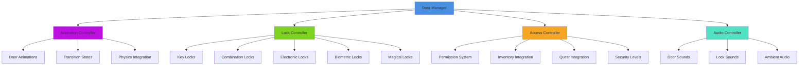
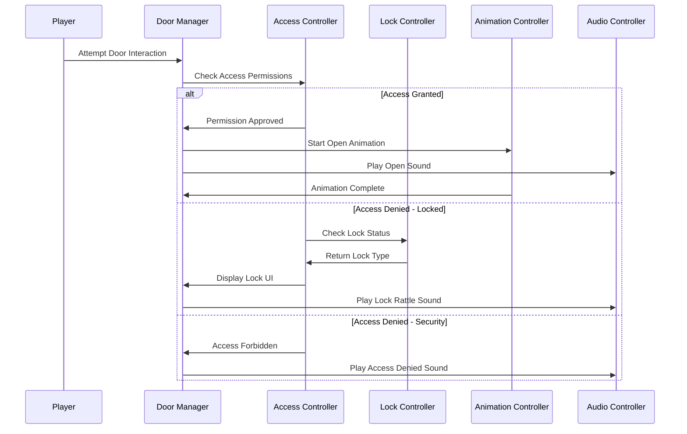
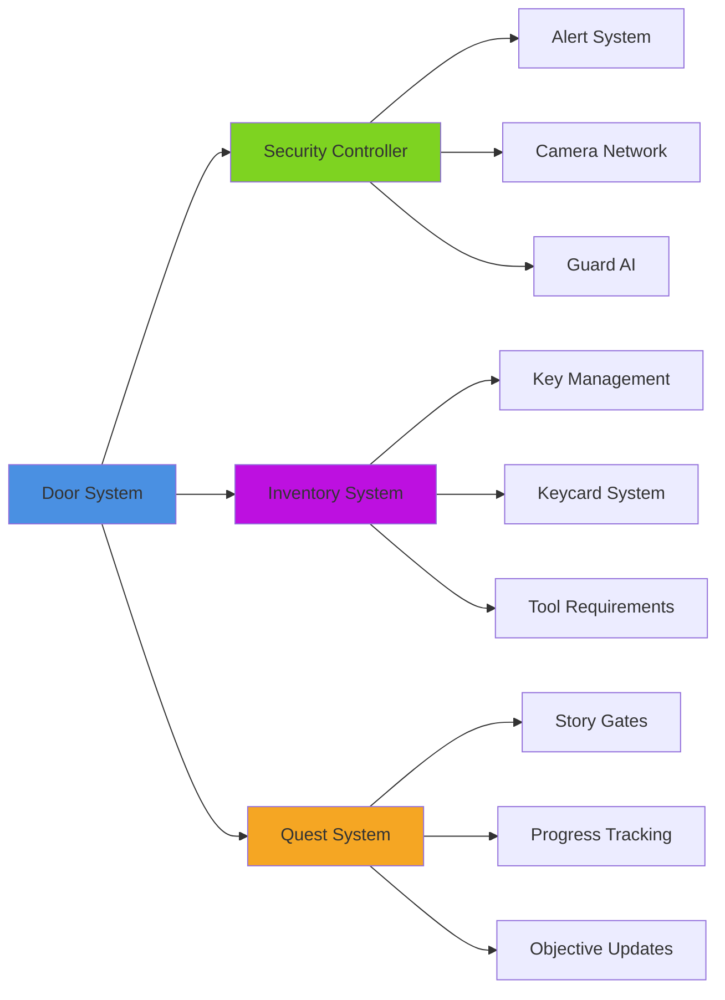
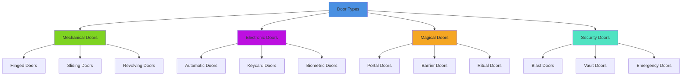

# Door & Lock System

## Overview
A comprehensive door and lock system supporting multiple door types, various locking mechanisms, access control, and smooth animations. Implements keycard systems, combination locks, biometric access, and magical barriers while providing visual and audio feedback for all interactions.

## System Architecture

## Component Breakdown

### Door Manager Component
- **Purpose**: Orchestrates door behavior, states, and interaction handling
- **Key Features**: State machine management, collision handling, network replication
- **Performance**: Efficient state transitions with animation blending

### Lock Controller Component
- **Purpose**: Manages various locking mechanisms and access validation
- **Key Features**: Multi-type lock support, attempt tracking, security protocols
- **Performance**: Optimized validation with cached access permissions

### Animation Controller Component  
- **Purpose**: Handles smooth door animations and physics interactions
- **Key Features**: Blend animations, physics simulation, collision avoidance
- **Performance**: LOD animations with distance-based quality scaling

## Blueprint Patterns

### Door Interaction Flow

### Lock Type Pattern
- **Hierarchical Locks**: Different lock types with specific requirements
- **Progressive Access**: Locks that become easier with player progression
- **Failure Consequences**: Lock attempt failures trigger security responses

### State Machine Pattern
- **Door States**: Closed, Opening, Open, Closing, Locked, Jammed, Destroyed
- **Transition Rules**: Valid state transitions with animation blending
- **State Persistence**: Maintain door states across game sessions

## Performance Optimization

### Animation Optimization
- **Distance LOD**: Reduce animation quality for distant doors
- **Occlusion Culling**: Skip animations for non-visible doors
- **Animation Pooling**: Reuse animation components efficiently

### Audio Optimization
- **Spatial Audio**: 3D positioned door sounds with realistic falloff
- **Priority System**: Important doors get full audio treatment
- **Audio Culling**: Disable audio for very distant door interactions

### State Management
- **Lazy Updates**: Only update door states when player is nearby
- **Batch Processing**: Process multiple door states efficiently
- **Memory Optimization**: Compact state representation for many doors

## Integration Points

### Security System Integration

### System Integrations
- **Combat System**: Destructible doors with damage states and breach mechanics
- **Stealth System**: Lock picking mini-games with noise generation
- **Magic System**: Magical locks requiring spells or enchanted items
- **Crafting System**: Create keys, lockpicks, and door modification items

### World Systems
- **Time System**: Time-locked doors that open at specific hours
- **Weather System**: Weather effects on outdoor doors and electronic locks
- **Power System**: Electronic doors affected by power failures

## Configuration System

### Door Types Data Asset
- **Standard Doors**: Basic hinged doors with simple open/close mechanics
- **Sliding Doors**: Horizontal and vertical sliding mechanisms
- **Rotating Doors**: Revolving doors and rotating barrier systems
- **Iris Doors**: Sci-fi style expanding/contracting portals
- **Magical Portals**: Fantasy doors with magical opening requirements

### Lock Types Data Asset
- **Physical Locks**: Traditional keys, combination locks, padlocks
- **Electronic Locks**: Keycards, keypads, biometric scanners
- **Magical Locks**: Spell requirements, magical keys, ritual unlocking
- **Puzzle Locks**: Mini-game based locks with varying difficulty
- **Time Locks**: Locks that open automatically after time conditions

### Access Control Data Asset
- **Permission Levels**: Clearance levels for different door access
- **Group Access**: Team-based access control for multiplayer
- **Conditional Access**: Quest progress, story flags, item requirements
- **Emergency Protocols**: Emergency access during specific game states

## Advanced Features

### Smart Lock System
- **Learning Locks**: Locks that adapt to player behavior and attempts
- **Dynamic Security**: Security level increases with repeated failed attempts
- **Backup Systems**: Alternative access methods when primary fails
- **Remote Control**: Doors controllable from security terminals

### Interactive Lock Mechanisms
- **Lock Picking Mini-Game**: Skill-based lock manipulation with tension feedback
- **Combination Solving**: Number/symbol sequence puzzles with hint systems
- **Biometric Challenges**: Fingerprint, retinal, or voice recognition games
- **Magical Rituals**: Gesture-based or incantation-based magical unlocking

### Environmental Integration
- **Weather Effects**: Rain affects electronic locks, frost jams mechanical ones
- **Power Dependencies**: Electronic doors fail during power outages
- **Structural Damage**: Damaged buildings affect door functionality
- **Age and Wear**: Older doors become harder to operate over time

## Door Categories

### Door Type System

### Lock Mechanisms
- **Traditional Keys**: Physical keys with unique profiles and wear states
- **Master Key Systems**: Hierarchical key systems with override capabilities
- **Combination Locks**: Number sequences with various input methods
- **Electronic Access**: Cards, codes, biometrics, and mobile device integration

### Visual Feedback
- **Lock Indicators**: Clear visual cues showing lock status and type
- **Access Feedback**: Green/red indicators for access granted/denied
- **Interaction Prompts**: Context-sensitive UI showing available actions
- **Security Warnings**: Visual alerts for security violations or failures

## Implementation Notes

### Blueprint Excellence
- **Component Architecture**: Modular door and lock components for flexibility
- **State-Driven Design**: Robust state machines handling all door conditions
- **Data-Driven Configuration**: External configuration for easy level design

### Network Considerations
- **Authority Model**: Server-authoritative door states with client prediction
- **Bandwidth Optimization**: Efficient replication of door state changes
- **Synchronization**: Consistent door states across all connected players

### Accessibility Features
- **Visual Indicators**: Clear visual feedback for all door states and interactions
- **Audio Cues**: Comprehensive audio feedback for visually impaired players
- **Alternative Inputs**: Support for various input methods and accessibility devices
- **Timing Options**: Adjustable timing for players with motor difficulties

This door and lock system provides a comprehensive solution for access control and environmental storytelling while maintaining smooth gameplay and supporting diverse accessibility needs across all platforms.
