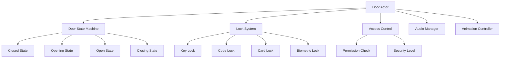

# 🚪 Door & Lock System - Secure Access Control

Create a **comprehensive door and lock system** that handles everything from simple doors to complex security mechanisms. Perfect for adventure games with exploration, puzzles, and progression-gated content.

## 🎯 What You'll Learn

- **Animated door mechanics** with smooth transitions
- **Multi-tier lock systems** (keys, codes, biometrics)
- **Security clearance levels** for progressive access
- **Audio-visual feedback** for different lock types
- **Network synchronization** for multiplayer games
- **Performance optimization** for large buildings

## 📺 Video Tutorial

🎬 **[UE5 Door System with Keys and Locks - Advanced Tutorial](https://www.youtube.com/watch?v=z4otjIf8rRo)**
- **Channel**: Ryan Laley
- **Duration**: ~25 minutes  
- **Topics**: Multi-tier security, animated doors, key systems, sound integration

## 📚 Official Documentation & Resources

### **Epic Games Official Documentation:**
- 📖 **[Blueprint Quick Start Guide](https://dev.epicgames.com/documentation/en-us/unreal-engine/blueprint-quick-start-guide-for-unreal-engine)** - Basic Blueprint implementation
- 📖 **[Gameplay Tutorials Collection](https://dev.epicgames.com/documentation/en-us/unreal-engine/gameplay-tutorials-for-unreal-engine)** - Interactive systems implementation
- 📖 **[Animating Characters and Objects](https://dev.epicgames.com/documentation/en-us/unreal-engine/animating-characters-and-objects-in-unreal-engine)** - Door animation systems

## 🏗️ System Architecture



## 🧩 Core Components

### 1. Door Base Class
Universal door system with state management.

```blueprint
// BP_DoorBase (Actor)

Variables:
- DoorState: Enum_DoorState
- LockType: Enum_LockType  
- SecurityLevel: Integer
- RequiredKey: String
- RequiredCode: String
- IsLocked: Boolean (Default: True)
- AutoCloseEnabled: Boolean (Default: True)
- AutoCloseDelay: Float (Default: 5.0)
- OpenAngle: Float (Default: 90.0)
```

### 2. Lock System Interface
Interface for different lock mechanisms.

```blueprint
// BPI_LockSystem (Blueprint Interface)

Functions:
- CanUnlock(PlayerPawn: Pawn) -> Boolean
- AttemptUnlock(PlayerPawn: Pawn) -> Boolean
- GetUnlockPrompt() -> String
- GetLockStatus() -> Enum_LockStatus
- GetSecurityLevel() -> Integer
- OnUnlockSuccess(PlayerPawn: Pawn)
- OnUnlockFailed(PlayerPawn: Pawn)
```

## 📝 Implementation Guide

### Step 1: Create Door State System

```blueprint
// Enum_DoorState
- Closed
- Opening
- Open  
- Closing
- Locked
- Jammed

// Enum_LockType
- None (Always unlocked)
- Key (Requires specific key item)
- Code (Requires numeric code)
- Card (Requires keycard/access card)
- Biometric (Requires fingerprint/retina scan)
- Timed (Unlocks at specific time)
- Quest (Unlocks when quest complete)
```

### Step 2: Implement Door Base Logic

```blueprint
// BP_DoorBase Implementation

// Event Begin Play
Function InitializeDoor():
    // Setup collision
    DoorCollision.SetCollisionEnabled(Collision Enabled)
    DoorCollision.OnComponentBeginOverlap.AddDynamic(OnPlayerApproach)
    
    // Initialize state machine
    SetDoorState(If IsLocked: Locked Else: Closed)
    
    // Setup auto-close timer
    If AutoCloseEnabled:
        GetWorldTimerManager().SetTimer(AutoCloseTimer, CloseFromTimer, AutoCloseDelay, False)

// State Machine
Function SetDoorState(NewState: Enum_DoorState):
    PreviousState = DoorState
    DoorState = NewState
    
    OnDoorStateChanged(PreviousState, NewState)
    
    Switch NewState:
        Case Closed:
            OnEnterClosedState()
        Case Opening:
            OnEnterOpeningState()
        Case Open:
            OnEnterOpenState()
        Case Closing:
            OnEnterClosingState()
        Case Locked:
            OnEnterLockedState()
        Case Jammed:
            OnEnterJammedState()

Function OnEnterOpeningState():
    // Play opening animation
    DoorMesh.PlayAnimation(DoorOpenAnimation)
    
    // Play opening sound
    AudioComponent.SetSound(DoorOpenSound)
    AudioComponent.Play()
    
    // Start opening timeline
    OpeningTimeline.PlayFromStart()

Function OnEnterClosingState():
    // Play closing animation
    DoorMesh.PlayAnimation(DoorCloseAnimation)
    
    // Play closing sound
    AudioComponent.SetSound(DoorCloseSound)
    AudioComponent.Play()
    
    // Start closing timeline
    ClosingTimeline.PlayFromStart()
```

### Step 3: Create Lock Mechanisms

#### Key Lock System
```blueprint
// BP_KeyLock (implements BPI_LockSystem)

Variables:
- RequiredKeyID: String
- MasterKeyAccepted: Boolean (Default: False)
- KeyUsageCount: Integer (How many times key can be used)

Function CanUnlock(PlayerPawn) -> Boolean:
    InventoryComponent = PlayerPawn.GetInventoryComponent()
    
    // Check for specific key
    If InventoryComponent.HasItem(RequiredKeyID):
        Return True
    
    // Check for master key
    If MasterKeyAccepted AND InventoryComponent.HasItem("MasterKey"):
        Return True
    
    Return False

Function AttemptUnlock(PlayerPawn) -> Boolean:
    If NOT CanUnlock(PlayerPawn):
        OnUnlockFailed(PlayerPawn)
        Return False
    
    InventoryComponent = PlayerPawn.GetInventoryComponent()
    
    // Consume key if single use
    If KeyUsageCount == 1:
        InventoryComponent.RemoveItem(RequiredKeyID, 1)
    ElseIf KeyUsageCount > 1:
        KeyUsageCount--
    
    OnUnlockSuccess(PlayerPawn)
    Return True

Function GetUnlockPrompt() -> String:
    Return "Use " + RequiredKeyID + " to unlock"
```

#### Code Lock System
```blueprint
// BP_CodeLock (implements BPI_LockSystem)

Variables:
- RequiredCode: String
- MaxAttempts: Integer (Default: 3)
- CurrentAttempts: Integer
- LockoutTime: Float (Default: 30.0)
- IsLockedOut: Boolean
- CodeInputWidget: Widget Reference

Function AttemptUnlock(PlayerPawn) -> Boolean:
    If IsLockedOut:
        ShowLockoutMessage()
        Return False
    
    // Show code input UI
    ShowCodeInputInterface(PlayerPawn)
    Return False // Async unlock via UI

Function OnCodeEntered(EnteredCode: String):
    If EnteredCode == RequiredCode:
        OnUnlockSuccess(GetInteractingPlayer())
        ResetAttempts()
        Return True
    Else:
        CurrentAttempts++
        
        If CurrentAttempts >= MaxAttempts:
            EnterLockoutState()
        
        OnUnlockFailed(GetInteractingPlayer())
        Return False

Function EnterLockoutState():
    IsLockedOut = True
    PlayLockoutEffects()
    
    // Start lockout timer
    GetWorldTimerManager().SetTimer(LockoutTimer, ExitLockoutState, LockoutTime, False)
```

#### Card Lock System  
```blueprint
// BP_CardLock (implements BPI_LockSystem)

Variables:
- RequiredCardType: Enum_CardType
- SecurityClearance: Integer
- CardReader: Static Mesh Component
- AccessGrantedMaterial: Material
- AccessDeniedMaterial: Material

Function CanUnlock(PlayerPawn) -> Boolean:
    InventoryComponent = PlayerPawn.GetInventoryComponent()
    
    // Check for required card type
    PlayerCards = InventoryComponent.GetItemsByType(ItemType_Keycard)
    
    For Each Card in PlayerCards:
        If Card.CardType == RequiredCardType:
            If Card.SecurityLevel >= SecurityClearance:
                Return True
    
    Return False

Function AttemptUnlock(PlayerPawn) -> Boolean:
    If CanUnlock(PlayerPawn):
        PlayCardScanAnimation()
        OnUnlockSuccess(PlayerPawn)
        Return True
    Else:
        PlayAccessDeniedAnimation()
        OnUnlockFailed(PlayerPawn)
        Return False

Function PlayCardScanAnimation():
    // Green light and beep
    CardReader.SetMaterial(0, AccessGrantedMaterial)
    AudioComponent.SetSound(AccessGrantedSound)
    AudioComponent.Play()
    
    // Reset material after delay
    GetWorldTimerManager().SetTimer(MaterialResetTimer, ResetCardReaderMaterial, 2.0, False)
```

### Step 4: Door Animation System

```blueprint
// Door Animation Controller
Variables:
- DoorMesh: Static Mesh Component
- DoorHinge: Scene Component
- OpeningCurve: Curve Float
- ClosingCurve: Curve Float
- OpeningTimeline: Timeline Component

Function SetupDoorAnimation():
    // Create opening timeline
    OpeningTimeline.AddFloatTrack(OpeningCurve, "DoorRotation")
    OpeningTimeline.SetTimelineLength(1.5) // 1.5 second animation
    
    // Bind timeline events
    OpeningTimeline.OnUpdate.AddDynamic(UpdateDoorRotation)
    OpeningTimeline.OnFinished.AddDynamic(OnOpenAnimationComplete)

Function UpdateDoorRotation(Alpha: Float):
    // Interpolate door rotation
    CurrentRotation = Lerp(0.0, OpenAngle, Alpha)
    DoorHinge.SetRelativeRotation(Make Rotator(0, CurrentRotation, 0))

Function OnOpenAnimationComplete():
    SetDoorState(Open)
    
    // Start auto-close timer if enabled
    If AutoCloseEnabled:
        GetWorldTimerManager().SetTimer(AutoCloseTimer, BeginCloseDoor, AutoCloseDelay, False)
```

### Step 5: Advanced Door Types

#### Sliding Door
```blueprint
// BP_SlidingDoor (inherits from BP_DoorBase)

Variables:
- SlideDirection: Vector (Default: Vector(0, 1, 0))
- SlideDistance: Float (Default: 200.0)
- SlideSpeed: Float (Default: 150.0)

Function UpdateDoorPosition(Alpha: Float):
    // Move door along slide direction
    TargetLocation = StartLocation + (SlideDirection * SlideDistance * Alpha)
    DoorMesh.SetRelativeLocation(TargetLocation)
```

#### Double Door System
```blueprint
// BP_DoubleDoor (inherits from BP_DoorBase)

Variables:
- LeftDoor: Static Mesh Component
- RightDoor: Static Mesh Component
- DoorGap: Float (Default: 10.0)

Function UpdateDoorRotation(Alpha: Float):
    // Open both doors symmetrically
    LeftRotation = Make Rotator(0, -OpenAngle * Alpha, 0)
    RightRotation = Make Rotator(0, OpenAngle * Alpha, 0)
    
    LeftDoor.SetRelativeRotation(LeftRotation)
    RightDoor.SetRelativeRotation(RightRotation)
```

#### Vault Door
```blueprint
// BP_VaultDoor (inherits from BP_DoorBase)

Variables:
- WheelMesh: Static Mesh Component
- BoltMechanisms: Array<Static Mesh Component>
- UnlockSequenceSteps: Integer (Default: 5)
- CurrentStep: Integer

Function AttemptUnlock(PlayerPawn) -> Boolean:
    // Multi-step unlock sequence
    If CurrentStep < UnlockSequenceSteps:
        ExecuteUnlockStep(CurrentStep)
        CurrentStep++
        
        If CurrentStep >= UnlockSequenceSteps:
            CompleteVaultUnlock()
        
        Return False // Not fully unlocked yet
    
    Return Super.AttemptUnlock(PlayerPawn)

Function ExecuteUnlockStep(StepIndex: Integer):
    // Rotate wheel
    WheelRotation = StepIndex * 72.0 // 5 steps = 72 degrees each
    WheelMesh.SetRelativeRotation(Make Rotator(0, 0, WheelRotation))
    
    // Retract corresponding bolt
    BoltMechanisms[StepIndex].SetRelativeLocation(BoltRetractedPosition)
    
    // Play mechanical sound
    PlayStepSound(StepIndex)
```

## 🎮 Advanced Features

### 1. Proximity-Based Auto-Open
```blueprint
// Automatically open doors when player approaches
Function OnPlayerApproach(OverlappedActor: Actor):
    If OverlappedActor is PlayerPawn AND DoorState == Closed:
        If NOT IsLocked OR CanUnlock(OverlappedActor):
            BeginOpenDoor()

Function OnPlayerExit(OverlappedActor: Actor):
    If OverlappedActor is PlayerPawn AND DoorState == Open:
        If AutoCloseEnabled:
            BeginCloseDoor()
```

### 2. Emergency Override System
```blueprint
// Emergency systems can override locks
Variables:
- EmergencyOverrideActive: Boolean
- OverrideSource: Enum_OverrideSource (Fire, Security, Power)

Function CheckEmergencyOverride() -> Boolean:
    GameState = GetGameStateBase()
    
    Switch OverrideSource:
        Case Fire:
            Return GameState.IsFireAlarmActive()
        Case Security:
            Return GameState.IsSecurityBreach()
        Case Power:
            Return GameState.IsPowerOutage()
    
    Return False

Function UpdateEmergencyState():
    NewOverrideState = CheckEmergencyOverride()
    
    If NewOverrideState != EmergencyOverrideActive:
        EmergencyOverrideActive = NewOverrideState
        
        If EmergencyOverrideActive:
            ForceDoorOpen()
            PlayEmergencyAlarm()
        Else:
            RestoreNormalOperation()
```

### 3. Smart Access Logging
```blueprint
// Track who accesses what doors when
Variables:
- AccessLog: Array<Struct_AccessEntry>
- MaxLogEntries: Integer (Default: 100)

Function LogAccess(PlayerPawn: Pawn, AccessGranted: Boolean):
    LogEntry = Create Struct_AccessEntry
    LogEntry.PlayerName = PlayerPawn.GetPlayerName()
    LogEntry.Timestamp = Now()
    LogEntry.AccessGranted = AccessGranted
    LogEntry.DoorID = GetDoorID()
    LogEntry.LockType = LockType
    
    AccessLog.Add(LogEntry)
    
    // Maintain log size
    If AccessLog.Length > MaxLogEntries:
        AccessLog.RemoveAt(0)
    
    // Send to security system
    SecurityManager.OnDoorAccess(LogEntry)
```

## 🔧 Performance Optimization

### 1. Door State Pooling
```blueprint
// Efficiently manage door states for large buildings
Variables:
- ActiveDoors: Array<BP_DoorBase>
- DormantDoors: Array<BP_DoorBase>
- PlayerRange: Float (Default: 1000.0)

Function UpdateDoorStates():
    PlayerLocation = GetPlayerLocation()
    
    For Each Door in ActiveDoors:
        Distance = GetDistanceTo(Door, PlayerLocation)
        
        If Distance > PlayerRange:
            // Make door dormant
            Door.SetTickEnabled(False)
            Door.SetActorHiddenInGame(True)
            DormantDoors.Add(Door)
            ActiveDoors.Remove(Door)
    
    For Each Door in DormantDoors:
        Distance = GetDistanceTo(Door, PlayerLocation)
        
        If Distance <= PlayerRange:
            // Reactivate door
            Door.SetTickEnabled(True)
            Door.SetActorHiddenInGame(False)
            ActiveDoors.Add(Door)
            DormantDoors.Remove(Door)
```

### 2. Audio Optimization
```blueprint
// Optimize door audio for performance
Function PlayDoorSound(SoundCue: Sound Cue, bForcePlay: Boolean = False):
    If NOT bForcePlay:
        // Check if player is within hearing range
        PlayerDistance = GetDistanceToPlayer()
        If PlayerDistance > MaxAudioRange:
            Return
    
    // Use 3D positioned audio
    AudioComponent.SetSound(SoundCue)
    AudioComponent.SetVolumeMultiplier(CalculateVolumeByDistance(PlayerDistance))
    AudioComponent.Play()
```

## 🧪 Testing Framework

### Door System Testing
```blueprint
// Automated testing for door functionality
Function TestDoorSystem():
    // Test basic open/close
    TestDoorOpenClose()
    
    // Test lock mechanisms
    TestKeyLock()
    TestCodeLock()
    TestCardLock()
    
    // Test edge cases
    TestDoorJamming()
    TestEmergencyOverride()
    TestNetworkSync()

Function TestKeyLock():
    // Setup test environment
    TestPlayer = SpawnTestPlayer()
    TestDoor = SpawnActor(BP_KeyLock, TestLocation)
    
    // Test without key
    Result1 = TestDoor.AttemptUnlock(TestPlayer)
    Assert(Result1 == False, "Door should not unlock without key")
    
    // Give player key and test
    TestPlayer.GetInventoryComponent().AddItem(TestDoor.RequiredKeyID)
    Result2 = TestDoor.AttemptUnlock(TestPlayer)
    Assert(Result2 == True, "Door should unlock with correct key")
```

## 🎯 Production Considerations

### User Experience
- **Clear visual indicators** for lock types and states
- **Consistent audio feedback** across all door types
- **Accessibility support** for colorblind players
- **Intuitive interaction prompts**

### Security & Balance
- **Prevent sequence breaking** with proper lock progression
- **Balanced key distribution** for exploration flow
- **Anti-exploit measures** for code locks
- **Save/load compatibility** for door states

### Performance Monitoring
- **Door state update frequency** optimization
- **Animation performance** tracking
- **Audio system efficiency** monitoring
- **Network synchronization** overhead

This door and lock system provides secure, immersive access control that enhances your adventure game's exploration and progression mechanics!

<style>
.video-container {
  position: relative;
  padding-bottom: 56.25%;
  height: 0;
  overflow: hidden;
  max-width: 100%;
  margin: 2rem 0;
}

.video-container iframe {
  position: absolute;
  top: 0;
  left: 0;
  width: 100%;
  height: 100%;
  border-radius: 10px;
}
</style>
