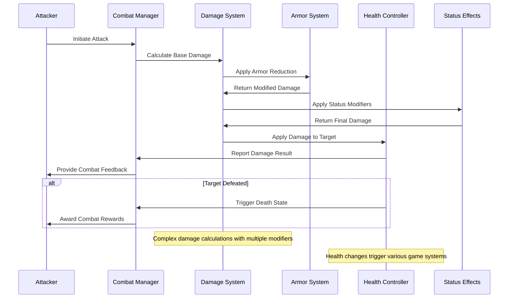
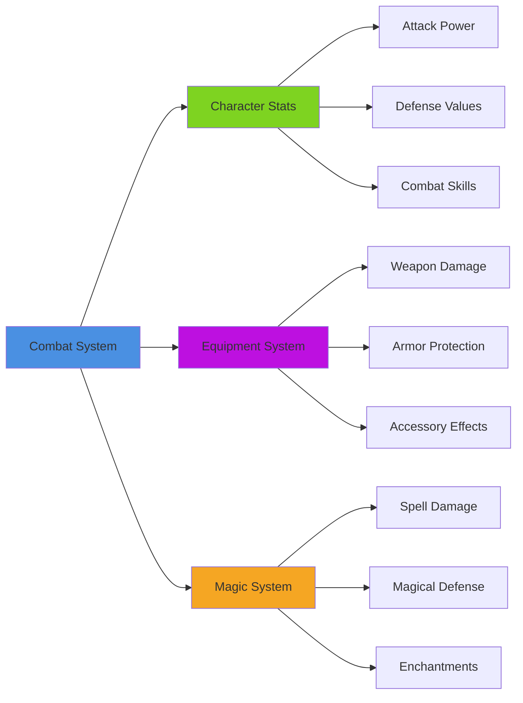
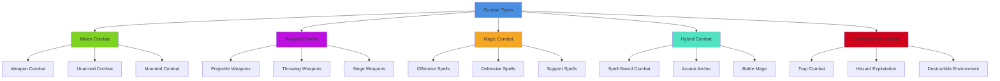

# Health & Combat System

## Overview
A comprehensive health and combat system providing dynamic damage calculation, status effects, healing mechanics, and tactical combat interactions. Implements armor systems, damage types, combat feedback, and integration with progression systems while maintaining balance and accessibility across different play styles.

## System Architecture

```mermaid
graph TB
    A[Combat Manager] --> B[Health Controller]
    A --> C[Damage System]
    A --> D[Status Effects]
    A --> E[Armor System]
    A --> F[Combat AI]
    
    B --> G[Health Points]
    B --> H[Regeneration]
    B --> I[Death States]
    B --> J[Healing Systems]
    
    C --> K[Damage Types]
    C --> L[Damage Calculation]
    C --> M[Critical Hits]
    C --> N[Damage Over Time]
    
    D --> O[Buffs]
    D --> P[Debuffs]
    D --> Q[Conditions]
    D --> R[Resistances]
    
    E --> S[Physical Armor]
    E --> T[Elemental Defense]
    E --> U[Armor Degradation]
    E --> V[Armor Types]
    
    F --> W[Combat Behavior]
    F --> X[Target Selection]
    F --> Y[Threat Assessment]
    
    style A fill:#4a90e2
    style B fill:#7ed321
    style C fill:#f5a623
    style D fill:#bd10e0
    style E fill:#50e3c2
    style F fill:#d0021b
```

## Component Breakdown

### Combat Manager Component
- **Purpose**: Central orchestration of combat systems and state management
- **Key Features**: Combat state tracking, participant management, rule enforcement
- **Performance**: Efficient combat processing with smart update cycles

### Health Controller Component
- **Purpose**: Manages character vitality, damage application, and healing
- **Key Features**: Multi-layered health systems, regeneration, death handling
- **Performance**: Optimized health calculations with minimal overhead

### Damage System Component
- **Purpose**: Handles damage calculation, type interactions, and combat feedback
- **Key Features**: Complex damage formulas, resistance calculations, critical systems
- **Performance**: Fast damage computation with cached resistance values

## Blueprint Patterns

### Combat Resolution Flow

### Status Effect Pattern
- **Effect Stacking**: Multiple effects can stack with diminishing returns
- **Duration Management**: Time-based effects with refresh and decay mechanics
- **Interaction Systems**: Effects can interact, cancel, or amplify each other

### Combat State Pattern
- **Combat Phases**: Initiative, action selection, resolution, aftermath
- **Turn Management**: Real-time or turn-based combat flow control
- **Interrupt Systems**: Special abilities that can interrupt normal flow

## Performance Optimization

### Damage Calculation Optimization
- **Formula Caching**: Pre-calculate common damage formula results
- **Batch Processing**: Process multiple damage instances efficiently
- **Early Termination**: Skip unnecessary calculations for defeated targets

### Combat Participant Management
- **Active Culling**: Only process combat for active participants
- **Priority Systems**: Important combats get more processing time
- **Distance Optimization**: Reduce combat detail for distant battles

### Effect Management
- **Effect Pooling**: Reuse status effect objects efficiently
- **Update Batching**: Process similar effects together
- **Lazy Evaluation**: Only calculate effect values when needed

## Integration Points

### Progression System Integration

### System Integrations
- **Animation System**: Combat animations synchronized with damage timing
- **Audio System**: Combat sounds, impact effects, and battle music
- **UI System**: Health bars, damage numbers, status effect indicators
- **Save System**: Persistent health states and combat statistics

### Gameplay Mechanics
- **Environmental Combat**: Terrain effects, destructible environments, hazards
- **Social Combat**: Team-based combat with coordination mechanics
- **Stealth Integration**: Stealth attacks with damage bonuses and detection risks
- **Exploration Hazards**: Environmental damage from traps and dangerous areas

## Configuration System

### Combat Rules Data Asset
- **Damage Formulas**: Mathematical formulas for damage calculation
- **Status Effect Rules**: Duration, stacking, and interaction rules
- **Combat Flow**: Turn order, action timing, interrupt conditions
- **Victory Conditions**: Criteria for combat resolution and outcomes

### Damage Types Data Asset
- **Physical Damage**: Slashing, piercing, bludgeoning, crushing
- **Elemental Damage**: Fire, ice, lightning, earth, wind, water
- **Magical Damage**: Arcane, divine, shadow, psychic, force
- **Special Damage**: Poison, disease, necrotic, radiant, sonic

### Armor Categories Data Asset
- **Light Armor**: High mobility, low protection, quick recovery
- **Medium Armor**: Balanced mobility and protection
- **Heavy Armor**: High protection, reduced mobility, slow recovery
- **Magical Armor**: Specialized protection against magical damage types

## Advanced Features

### Dynamic Combat System
- **Adaptive AI**: Combat AI that learns player tactics and adapts
- **Environmental Interaction**: Combat that utilizes environmental features
- **Physics Integration**: Realistic physics affecting combat outcomes
- **Tactical Positioning**: Cover systems, flanking bonuses, terrain advantages

### Advanced Status Systems
- **Condition Trees**: Complex status effects with branching consequences
- **Synergy Effects**: Status combinations that create new effects
- **Player Agency**: Player choices affecting status effect outcomes
- **Narrative Integration**: Status effects tied to story and character development

### Combat Accessibility
- **Difficulty Scaling**: Adjustable combat difficulty for different skill levels
- **Auto-Combat Options**: Automated combat for players who prefer story focus
- **Pause Systems**: Real-time combat with pause options for tactical planning
- **Visual Accessibility**: Clear indicators for colorblind and visually impaired players

## Combat Categories

### Combat Type System

### Damage Mechanics
- **Direct Damage**: Immediate health reduction from successful attacks
- **Damage Over Time**: Gradual health loss from poison, burning, bleeding
- **Area Damage**: Attacks affecting multiple targets in an area
- **Conditional Damage**: Damage that depends on specific circumstances

### Healing Systems
- **Instant Healing**: Immediate health restoration from potions or spells
- **Regeneration**: Gradual health recovery over time
- **Conditional Healing**: Healing that requires specific conditions or actions
- **Social Healing**: Healing provided by other players or NPCs

## Implementation Notes

### Blueprint Architecture
- **Modular Combat Components**: Flexible framework supporting diverse combat styles
- **Event-Driven Design**: Reactive combat system with efficient state management
- **Data-Driven Balance**: External configuration for easy balance adjustments

### Combat Balance
- **Mathematical Modeling**: Spreadsheet-based balance calculations
- **Playtesting Integration**: Systems for collecting and analyzing combat data
- **Iterative Tuning**: Continuous balance adjustments based on player feedback
- **Accessibility Balance**: Ensuring combat remains engaging across skill levels

### Performance Patterns
- **Smart Updates**: Only update active combat participants
- **Effect Optimization**: Efficient status effect processing and cleanup
- **Network Optimization**: Minimal network traffic for multiplayer combat

### User Experience
- **Clear Feedback**: Immediate visual and audio feedback for all combat actions
- **Strategic Depth**: Multiple viable combat strategies and tactical options
- **Learning Curve**: Progressive complexity that teaches players over time
- **Emotional Engagement**: Combat that creates tension and satisfaction

This health and combat system provides a comprehensive foundation for engaging combat gameplay while supporting diverse play styles and maintaining accessibility for players of all skill levels.
