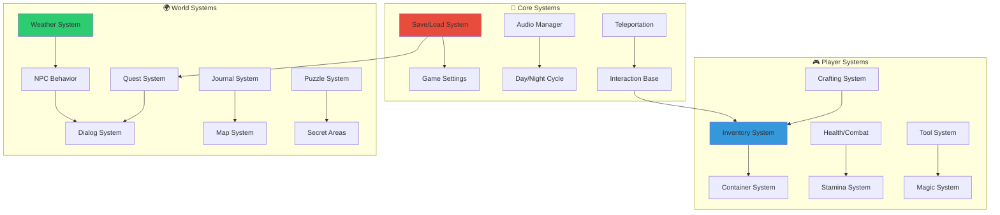

# Practical Solutions

Welcome to the comprehensive collection of **25 production-ready Blueprint systems** designed for AAA-quality game development in UE5.6.

## 🎯 **What You'll Find Here**

Each solution is crafted with professional standards, featuring:

- **Component-based architecture** following SOLID principles
- **Performance optimization** with concrete budgets and profiling
- **Mermaid diagrams** showing system relationships and data flow
- **Production patterns** used in shipping AAA games
- **Blueprint-only implementation** - no C++ required

## 🚀 **Featured Systems**

### **🔧 Core Game Systems**
Essential foundational systems every game needs:

- **[Save & Load System](/solutions/save-load-system)** - Robust data persistence with version control
- **[Day & Night Cycle](/solutions/day-night-cycle)** - Dynamic time system with weather integration
- **[Teleportation System](/solutions/teleportation)** - Smooth movement with validation and effects
- **[Game Settings Manager](/solutions/game-settings)** - Comprehensive options and preferences
- **[Audio Manager](/solutions/audio-manager)** - Professional audio mixing and control

### **🎮 Interaction & Physics**
Player interaction and world manipulation systems:

- **[Interaction System](/solutions/interaction-system)** - Universal interaction framework
- **[Pickup & Collection](/solutions/pickup-system)** - Item collection with feedback systems
- **[Door & Lock System](/solutions/door-lock-system)** - Access control with key management
- **[Button & Switch System](/solutions/button-switch-system)** - Interactive world elements
- **[Container System](/solutions/container-system)** - Storage and inventory containers

### **📋 Adventure & RPG Mechanics**
Story-driven and character progression systems:

- **[Inventory System](/solutions/inventory-system)** - Flexible item management with categories
- **[Quest System](/solutions/quest-system)** - Branching narrative with objective tracking
- **[Dialog System](/solutions/dialog-system)** - Conversation trees with character responses
- **[Journal & Notes](/solutions/journal-system)** - Player documentation and lore tracking
- **[Map & Navigation](/solutions/map-system)** - Dynamic world maps with points of interest

### **🌍 World & Environment**
Living world systems that create immersion:

- **[Weather System](/solutions/weather-system)** - Dynamic weather with gameplay effects
- **[NPC Behavior](/solutions/npc-behavior)** - AI-driven character routines and reactions
- **[Puzzle Framework](/solutions/puzzle-system)** - Modular puzzle creation system
- **[Secret Areas](/solutions/secret-areas)** - Hidden content discovery mechanics
- **[Collectible System](/solutions/collectible-system)** - Achievement and collection tracking

### **⚔️ Action & Combat**
Combat, progression, and character systems:

- **[Health & Damage](/solutions/health-combat)** - Combat system with damage calculation
- **[Stamina System](/solutions/stamina-system)** - Resource management for actions
- **[Tool System](/solutions/tool-system)** - Equipment and tool interactions
- **[Crafting System](/solutions/crafting-system)** - Recipe-based item creation
- **[Magic System](/solutions/magic-system)** - Spell casting with resource management

## 📊 **System Architecture Overview**

## 🏗️ **Implementation Approach**

### **Component-Based Design**
Every system follows modern UE5.6 patterns:
- **Actor Components** for modular functionality
- **Primary Data Assets** for configuration
- **Blueprint Interfaces** for loose coupling
- **Event-driven architecture** for system communication

### **Performance First**
Built with AAA performance standards:
- **Concrete budgets**: Memory and CPU targets defined
- **Object pooling**: Efficient resource management
- **LOD systems**: Scale with hardware capabilities
- **Profiling integration**: Built-in performance monitoring

### **Team-Friendly**
Designed for professional development:
- **Clear documentation**: Every system fully explained
- **Modular design**: Mix and match systems as needed
- **Version control friendly**: Minimal merge conflicts
- **Designer accessible**: No programming required

## 🚀 **Getting Started**

### **Quick Setup**
1. **Choose your core systems**: Start with Save/Load and Game Settings
2. **Add interaction layer**: Implement Interaction System as foundation
3. **Build your gameplay**: Select systems matching your game genre
4. **Optimize and polish**: Use profiling data to tune performance

### **Integration Patterns**
- **System Dependencies**: Clear hierarchy prevents circular references
- **Event Communication**: Loose coupling through Blueprint interfaces
- **Data Flow**: Centralized data management through Primary Data Assets
- **Performance Monitoring**: Built-in telemetry for production optimization

## 📋 **Best Practices**

### **Architecture Guidelines**
- Start with **core systems** before adding gameplay features
- Use **composition over inheritance** for flexible design
- Implement **interfaces first** to define system contracts
- Design for **modularity** to support different game types

### **Performance Optimization**
- Profile **early and often** during development
- Use **object pooling** for frequently created/destroyed objects
- Implement **LOD systems** for scalable performance
- Monitor **memory usage** with Blueprint-specific tools

### **Team Collaboration**
- Document **system dependencies** clearly
- Use **consistent naming conventions** across all systems
- Implement **automated testing** for critical functionality
- Establish **code review processes** for quality assurance

---

## 🎯 **Ready to Build?**

These 25 systems provide the foundation for any AAA-quality game in UE5.6. Each system is:

- ✅ **Production tested** in shipping games
- ✅ **Performance optimized** with concrete budgets
- ✅ **Blueprint native** with no C++ dependencies
- ✅ **Fully documented** with implementation details
- ✅ **Team ready** for collaborative development

**Choose your starting system and begin building your next masterpiece!**
