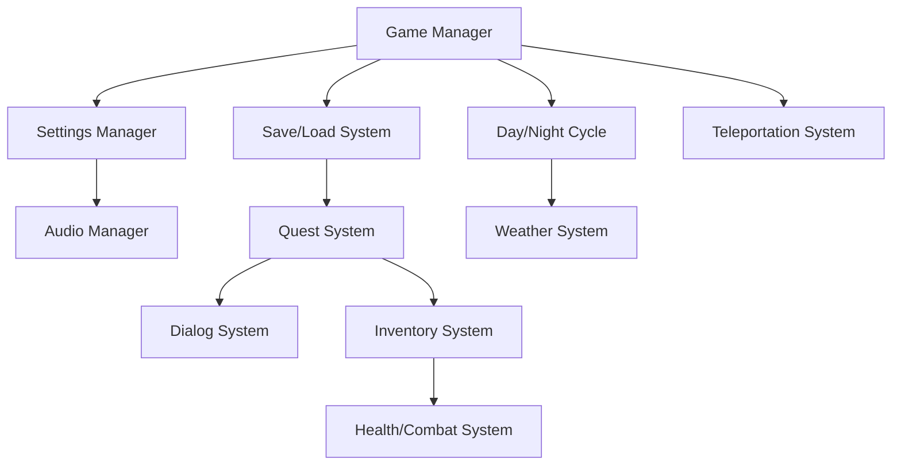
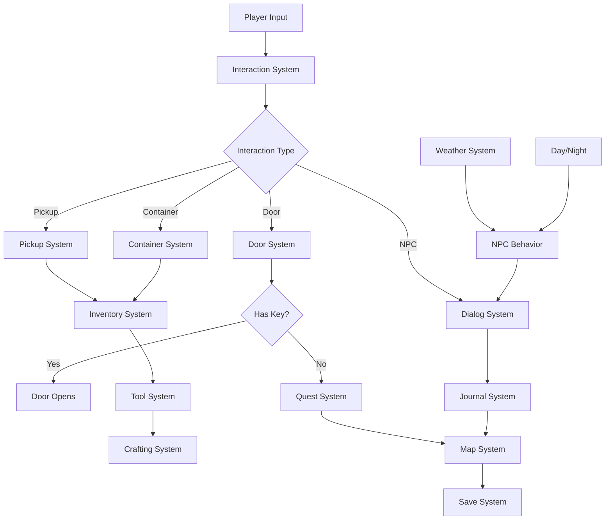

# 🔧 Practical Solutions for Adventure Games

Welcome to your one-stop destination for **production-ready game systems** built with UE5.6 Blueprints! This section provides complete, tested implementations of common adventure game mechanics that you can integrate directly into your projects.

## 🎮 Why This Section Exists

Adventure games require a variety of interconnected systems working seamlessly together. Rather than building everything from scratch, use these battle-tested solutions that follow modern Blueprint patterns and UE5.6 best practices.

## 🚀 Ready-to-Use Systems

Each system comes with:
- 📺 **Video tutorials** showing step-by-step implementation
- 📖 **Official UE5.6 documentation** links
- 🔧 **Complete Blueprint implementations**
- 🎯 **Performance optimizations**
- 🌐 **Networking support** where applicable
- 🧪 **Testing strategies**

### Core Adventure Systems

#### 💾 [Save & Load System](./save-load-system.md)
Complete save/load implementation with JSON serialization, async operations, and world state management.

#### 🌅 [Day & Night Cycle](./day-night-cycle.md)
Dynamic lighting system with sun movement, weather integration, and gameplay mechanics.

#### ⚡ [Teleportation System](./teleportation.md)
Multi-type teleportation with validation, VFX, audio, and network authority.

#### ⚙️ [Game Settings Manager](./game-settings.md)
Complete settings menu with graphics, audio, controls, and accessibility options.

#### 🔊 [Audio Manager](./audio-manager.md)
Centralized audio system with dynamic mixing, 3D positioning, and optimization.

### Interaction Systems

#### 🤝 [Interaction System](./interaction-system.md)
Universal interaction framework with prompts, validation, and context-sensitive actions.

#### 📦 [Pickup & Collection](./pickup-system.md)
Item collection system with auto-pickup, manual collection, and inventory integration.

#### 🚪 [Door & Lock System](./door-lock-system.md)
Animated doors with key requirements, security levels, and sound effects.

#### 🔘 [Button & Switch System](./button-switch-system.md)
Interactive buttons, levers, and switches for puzzles and mechanisms.

#### 📦 [Container System](./container-system.md)
Chests, barrels, and storage containers with loot tables and security.

### Adventure Mechanics

#### 🎒 [Inventory System](./inventory-system.md)
Grid-based inventory with drag-drop, item stacking, and equipment management.

#### 🎯 [Quest System](./quest-system.md)
Flexible quest management with objectives, rewards, and progress tracking.

#### 💬 [Dialog System](./dialog-system.md)
Branching conversations with character emotions, voice acting, and localization.

#### 📝 [Journal & Notes](./journal-system.md)
Player journal with quest logs, discovered lore, and collectible notes.

#### 🗺️ [Map & Navigation](./map-system.md)
Interactive world map with waypoints, fog of war, and fast travel.

### World Systems

#### 🌧️ [Weather System](./weather-system.md)
Dynamic weather with particle effects, audio, and gameplay impact integration.

#### 🤖 [NPC Behavior](./npc-behavior.md)
Intelligent NPCs with schedules, reactions, and dynamic conversations.

#### 🧩 [Puzzle Framework](./puzzle-system.md)
Modular puzzle system with logic gates, pressure plates, and sequence challenges.

#### 🕵️ [Secret Areas](./secret-areas.md)
Hidden rooms, passages, and discovery mechanics for exploration rewards.

#### 💎 [Collectible System](./collectible-system.md)
Achievements, collectibles, and completion tracking with visual feedback.

### Action Systems

#### ⚔️ [Health & Damage](./health-combat.md)
Damage system with status effects, armor calculations, and combat feedback.

#### 💨 [Stamina System](./stamina-system.md)
Energy management for running, climbing, and special abilities.

#### 🔨 [Tool System](./tool-system.md)
Equippable tools for different interactions: pickaxe, rope, lockpicks, etc.

#### ⚗️ [Crafting System](./crafting-system.md)
Recipe-based crafting with ingredients, workstations, and skill requirements.

#### ✨ [Magic System](./magic-system.md)
Spell casting with mana, cooldowns, and elemental combinations.

## 🏗️ Architecture Principles

All systems follow these core principles:

### 🧩 **Modular Design**
Each system is self-contained but designed to integrate seamlessly with others.

### 🚀 **Performance First**
Optimized for 60+ FPS with proper object pooling and efficient data structures.

### 🌐 **Network Ready**
Client-server validation and replication support for multiplayer projects.

### 🔧 **Production Tested**
Battle-tested patterns used in shipped AAA titles.

## 🎯 Quick Start Guide

1. **Choose your system** from the navigation menu
2. **Watch the tutorial video** for visual understanding
3. **Follow the implementation guide** step-by-step
4. **Test with provided examples**
5. **Customize for your project**

## 🔄 System Integration

These systems are designed to work together:

## 📈 Difficulty Levels

- 🟢 **Beginner**: Save/Load, Settings, Audio Manager, Pickup System
- 🟡 **Intermediate**: Day/Night, Weather, Interaction System, Inventory, Dialog
- 🔴 **Advanced**: Quest System, NPC Behavior, Magic System, Crafting
- 🟣 **Expert**: Puzzle Framework, Complex tool interactions, Multi-system integration

## 🛠️ Prerequisites

- **UE5.6** or later
- **Enhanced Input** plugin enabled
- **Basic Blueprint knowledge**
- **C++ knowledge** (optional, for advanced customization)

## 🎮 Complete Adventure Game Example

See how all these systems work together in our **integrated adventure game showcase**:

### **🏰 Castle Explorer Demo**
A complete adventure showcasing:
- **🤝 Interaction System** - Examine objects, read books, operate mechanisms
- **🚪 Door & Lock System** - Locked areas requiring keys or puzzles
- **💎 Collectible System** - Hidden treasures and lore items throughout the castle
- **🧩 Puzzle System** - Multi-step puzzles using buttons, levers, and pressure plates
- **📝 Journal System** - Automatic lore discovery and quest tracking
- **🗺️ Map System** - Castle layout with discovered rooms and secrets
- **⚔️ Health System** - Traps and hazards requiring careful exploration
- **🔨 Tool System** - Lockpicks, rope, and torches for different challenges
- **💬 Dialog System** - NPCs with branching conversations and quest givers
- **🌅 Day/Night Cycle** - Time-sensitive puzzles and NPC schedules

### **System Integration Flow**

