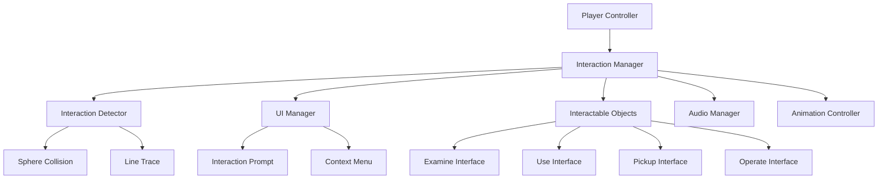

# 🤝 Interaction System - Universal Adventure Game Framework

Build a **comprehensive interaction system** that handles all player-world interactions in your adventure game. From examining objects to operating complex mechanisms, this system provides a unified framework for immersive gameplay.

## 🎯 What You'll Learn

- **Universal interaction interface** for consistent player experience
- **Context-sensitive prompts** with dynamic UI feedback
- **Range-based detection** with smooth transitions
- **Multi-type interactions** (examine, use, pickup, operate)
- **Animation integration** for realistic interactions
- **Audio-visual feedback** systems

## 📺 Video Tutorial

🎬 **[UE5 Interaction System - Adventure Game Complete Tutorial](https://www.youtube.com/watch?v=zV-hIhBaGdE)**
- **Channel**: Gorka Games
- **Duration**: ~40 minutes  
- **Topics**: Interface system, trace detection, UI prompts, multi-object interactions

## 📚 Official Documentation & Resources

### **Epic Games Official Documentation:**
- 📖 **[Finding Actors Tutorial](https://dev.epicgames.com/documentation/en-us/unreal-engine/finding-actors-in-unreal-engine)** - Actor detection and interaction
- 📖 **[Adding Components Tutorial](https://dev.epicgames.com/documentation/en-us/unreal-engine/adding-components-to-an-actor-in-unreal-engine)** - Component-based interactions
- 📖 **[OnHit Event Tutorial](https://dev.epicgames.com/documentation/en-us/unreal-engine/using-the-onhit-event)** - Collision-based interactions
- 📖 **[Blueprint Interfaces](https://dev.epicgames.com/documentation/en-us/unreal-engine/blueprint-interfaces-in-unreal-engine)** - Interface implementation guide

## 🏗️ System Architecture



## 🧩 Core Components

### 1. Interaction Interface
Blueprint interface defining all interaction types.

```blueprint
// BPI_Interactable (Blueprint Interface)

Functions:
- CanInteract(PlayerPawn: Pawn) -> Boolean
- GetInteractionType() -> Enum_InteractionType
- GetInteractionPrompt() -> String
- GetInteractionIcon() -> Texture2D
- OnInteractionStart(PlayerPawn: Pawn)
- OnInteractionEnd(PlayerPawn: Pawn) 
- OnInteractionComplete(PlayerPawn: Pawn)
- GetInteractionTime() -> Float
- GetInteractionRange() -> Float
```

### 2. Interaction Manager Component
Central system managing all player interactions.

```blueprint
// InteractionManagerComponent (Actor Component)

Variables:
- MaxInteractionRange: Float (Default: 200.0)
- InteractionKey: Input Action Reference
- CurrentInteractable: Object Reference
- InteractionInProgress: Boolean
- InteractionPromptWidget: Widget Reference
- InteractionChannel: Collision Channel
```

## 📝 Implementation Guide

### Step 1: Create Interaction Interface

1. **Create Blueprint Interface**:
   - Right-click → Blueprint → Blueprint Interface
   - Name: `BPI_Interactable`

2. **Add Interface Functions**:

```blueprint
// Function: CanInteract
Input: PlayerPawn (Pawn)
Output: Boolean
Description: "Check if player can interact with this object"

// Function: GetInteractionData  
Output: Struct_InteractionData
Description: "Return interaction information (type, prompt, icon, range)"

// Function: StartInteraction
Input: PlayerPawn (Pawn)
Description: "Begin interaction process"

// Function: CompleteInteraction
Input: PlayerPawn (Pawn)  
Description: "Finish interaction and execute effect"

// Function: CancelInteraction
Input: PlayerPawn (Pawn)
Description: "Cancel ongoing interaction"
```

3. **Create Interaction Data Structure**:

```blueprint
// Struct_InteractionData
InteractionType: Enum_InteractionType
PromptText: String
IconTexture: Texture2D  
InteractionRange: Float
InteractionTime: Float
RequiredItem: String (Optional)
CanInteractMultipleTimes: Boolean
InteractionSound: Sound Base
```

4. **Create Interaction Type Enum**:

```blueprint
// Enum_InteractionType
- Examine (Look at object closely)
- Pickup (Add to inventory)
- Use (Activate/operate)
- Talk (Start dialog)
- Open (Doors, containers)
- Read (Books, signs)
- Repair (Fix broken items)
- Craft (Use crafting station)
```

### Step 2: Create Interaction Manager

1. **Add to Player Pawn**:
   - Create `BP_InteractionManager` component
   - Attach to player pawn

2. **Setup Detection System**:

```blueprint
// Event Tick (Interaction Manager)
Function UpdateInteractionDetection():
    // Get player camera location and direction
    CameraLocation = PlayerPawn.GetCameraLocation()
    CameraDirection = PlayerPawn.GetCameraForwardVector()
    
    // Perform line trace for precise targeting
    TraceEnd = CameraLocation + (CameraDirection * MaxInteractionRange)
    
    TraceResult = Line Trace(
        Start: CameraLocation,
        End: TraceEnd,
        Channel: InteractionChannel,
        Ignore: PlayerPawn
    )
    
    NewInteractable = None
    
    If TraceResult.Hit:
        HitActor = TraceResult.GetActor()
        If HitActor Implements BPI_Interactable:
            If HitActor.CanInteract(PlayerPawn):
                NewInteractable = HitActor
    
    // Update current interactable
    If NewInteractable != CurrentInteractable:
        OnInteractableChanged(CurrentInteractable, NewInteractable)
        CurrentInteractable = NewInteractable
```

3. **Handle Interactable Changes**:

```blueprint
// Function: OnInteractableChanged
Input: OldInteractable (Object), NewInteractable (Object)

// Hide old prompt
If OldInteractable != None:
    HideInteractionPrompt()
    OldInteractable.OnInteractionEnd(PlayerPawn)

// Show new prompt  
If NewInteractable != None:
    InteractionData = NewInteractable.GetInteractionData()
    ShowInteractionPrompt(InteractionData)
    NewInteractable.OnInteractionStart(PlayerPawn)
```

### Step 3: Create Interaction Prompt UI

1. **Create Widget Blueprint**:
   - Parent Class: `User Widget`
   - Name: `WBP_InteractionPrompt`

2. **Widget Structure**:

```blueprint
// Widget Hierarchy
- Canvas Panel
  - Background (Border)
    - Horizontal Box
      - Icon (Image)
      - Prompt Text (Text Block)
      - Key Hint (Text Block)
```

3. **Widget Logic**:

```blueprint
// Function: SetInteractionData
Input: InteractionData (Struct_InteractionData)

// Update display elements
IconImage.SetBrushFromTexture(InteractionData.IconTexture)
PromptText.SetText(InteractionData.PromptText)
KeyHint.SetText(GetInteractionKeyText())

// Handle interaction time if needed
If InteractionData.InteractionTime > 0:
    ShowProgressBar(InteractionData.InteractionTime)
```

### Step 4: Implement Specific Interactions

#### Examine Interaction
```blueprint
// BP_ExaminableObject (implements BPI_Interactable)

Variables:
- ExamineText: String
- ExamineCamera: Scene Component  
- ExamineMesh: Static Mesh Component
- ZoomLevel: Float

Function CanInteract(PlayerPawn) -> Boolean:
    Return True

Function GetInteractionData() -> Struct_InteractionData:
    InteractionData.InteractionType = Examine
    InteractionData.PromptText = "Examine " + ObjectName
    InteractionData.IconTexture = ExamineIcon
    InteractionData.InteractionRange = 150.0
    Return InteractionData

Function StartInteraction(PlayerPawn):
    // Switch to examine camera
    PlayerController = PlayerPawn.GetPlayerController()
    ExamineCamera.SetActive(True)
    PlayerController.SetViewTarget(ExamineCamera)
    
    // Show examine UI
    ShowExamineUI(ExamineText)
    
    // Disable player movement
    PlayerPawn.DisableInput(PlayerController)

Function CompleteInteraction(PlayerPawn):
    // Return to player camera
    PlayerController = PlayerPawn.GetPlayerController()
    PlayerController.SetViewTarget(PlayerPawn)
    
    // Hide examine UI
    HideExamineUI()
    
    // Re-enable player movement
    PlayerPawn.EnableInput(PlayerController)
```

#### Pickup Interaction
```blueprint
// BP_PickupableItem (implements BPI_Interactable)

Variables:
- ItemData: Struct_ItemData
- PickupSound: Sound Base
- PickupParticles: Particle System

Function CanInteract(PlayerPawn) -> Boolean:
    InventoryComponent = PlayerPawn.GetInventoryComponent()
    Return InventoryComponent.CanAddItem(ItemData)

Function GetInteractionData() -> Struct_InteractionData:
    InteractionData.InteractionType = Pickup
    InteractionData.PromptText = "Pick up " + ItemData.ItemName
    InteractionData.IconTexture = ItemData.IconTexture
    InteractionData.InteractionRange = 100.0
    Return InteractionData

Function CompleteInteraction(PlayerPawn):
    // Add to inventory
    InventoryComponent = PlayerPawn.GetInventoryComponent()
    InventoryComponent.AddItem(ItemData)
    
    // Play feedback
    PlaySoundAtLocation(PickupSound, GetActorLocation())
    SpawnEmitterAtLocation(PickupParticles, GetActorLocation())
    
    // Destroy pickup
    DestroyActor()
```

#### Use/Operate Interaction
```blueprint
// BP_OperatableMachine (implements BPI_Interactable)

Variables:
- IsActive: Boolean
- OperationTime: Float
- RequiredPower: Integer
- OperationAnimation: Animation Sequence

Function CanInteract(PlayerPawn) -> Boolean:
    // Check if machine has power and isn't already operating
    Return HasPower() AND NOT IsOperating()

Function GetInteractionData() -> Struct_InteractionData:
    InteractionData.InteractionType = Use
    InteractionData.PromptText = If IsActive: "Turn Off" Else "Turn On"
    InteractionData.IconTexture = MachineIcon
    InteractionData.InteractionTime = OperationTime
    InteractionData.InteractionRange = 120.0
    Return InteractionData

Function StartInteraction(PlayerPawn):
    // Start operation animation on player
    PlayerPawn.PlayAnimMontage(OperationAnimation)
    
    // Show progress bar
    ShowProgressBar(OperationTime)

Function CompleteInteraction(PlayerPawn):
    // Toggle machine state
    IsActive = NOT IsActive
    
    // Play machine effects
    If IsActive:
        StartMachineEffects()
    Else:
        StopMachineEffects()
    
    // Execute machine function
    OnMachineStateChanged.Broadcast(IsActive)
```

## 🎮 Enhanced Features

### 1. Context-Sensitive Interactions
```blueprint
// Dynamic interaction based on player state
Function GetContextualInteraction(PlayerPawn) -> Struct_InteractionData:
    PlayerInventory = PlayerPawn.GetInventoryComponent()
    
    // Different interactions based on held item
    HeldItem = PlayerInventory.GetActiveItem()
    
    Switch HeldItem.ItemType:
        Case Key:
            If IsLockableObject():
                Return GetUnlockInteraction()
        Case Tool:
            If IsRepairable() AND IsBroken():
                Return GetRepairInteraction()
        Case Fuel:
            If RequiresFuel() AND IsEmpty():
                Return GetRefuelInteraction()
    
    // Default interaction
    Return GetDefaultInteraction()
```

### 2. Multi-Stage Interactions
```blueprint
// Complex interactions with multiple steps
Variables:
- InteractionStages: Array<Struct_InteractionStage>
- CurrentStageIndex: Integer

Function StartInteraction(PlayerPawn):
    CurrentStageIndex = 0
    ExecuteInteractionStage(CurrentStageIndex)

Function OnStageComplete():
    CurrentStageIndex++
    
    If CurrentStageIndex < InteractionStages.Length:
        ExecuteInteractionStage(CurrentStageIndex)
    Else:
        CompleteInteraction(PlayerPawn)

Function ExecuteInteractionStage(StageIndex: Integer):
    Stage = InteractionStages[StageIndex]
    
    // Update UI prompt
    UpdatePromptText(Stage.PromptText)
    
    // Execute stage logic
    Switch Stage.StageType:
        Case WaitForInput:
            WaitForPlayerInput(Stage.RequiredInput)
        Case PlayAnimation:
            PlayAnimationAndWait(Stage.Animation)
        Case WaitForTime:
            StartTimer(Stage.Duration)
```

### 3. Interaction Validation System
```blueprint
// Advanced validation with user feedback
Function ValidateInteraction(PlayerPawn) -> Struct_ValidationResult:
    ValidationResult.IsValid = True
    ValidationResult.FailureReason = ""
    
    // Check player state
    If PlayerPawn.IsInCombat():
        ValidationResult.IsValid = False
        ValidationResult.FailureReason = "Cannot interact during combat"
        Return ValidationResult
    
    // Check required items
    If RequiredItem != "":
        PlayerInventory = PlayerPawn.GetInventoryComponent()
        If NOT PlayerInventory.HasItem(RequiredItem):
            ValidationResult.IsValid = False
            ValidationResult.FailureReason = "Requires " + RequiredItem
            Return ValidationResult
    
    // Check cooldowns
    If HasInteractionCooldown():
        ValidationResult.IsValid = False
        ValidationResult.FailureReason = "Please wait before using again"
        Return ValidationResult
    
    Return ValidationResult
```

## 🔧 Performance Optimization

### 1. Efficient Detection System
```blueprint
// Optimize interaction detection for performance
Function OptimizedInteractionDetection():
    // Only check for interactions periodically
    If TimeSinceLastCheck < InteractionCheckInterval:
        Return
    
    TimeSinceLastCheck = 0.0
    
    // Use spatial partitioning for large worlds
    NearbyInteractables = GetInteractablesInRange(PlayerLocation, MaxRange)
    
    // Sort by distance and check closest first
    SortByDistance(NearbyInteractables, PlayerLocation)
    
    For Each Interactable in NearbyInteractables:
        If CanInteractWith(Interactable):
            SetCurrentInteractable(Interactable)
            Return
```

### 2. Interaction Pooling
```blueprint
// Pool commonly used interaction objects
Variables:
- InteractionPool: Array<Actor>
- PoolSize: Integer (Default: 50)

Function GetPooledInteractionObject(Class: Class) -> Actor:
    For Each PooledObject in InteractionPool:
        If PooledObject.GetClass() == Class AND NOT PooledObject.IsInUse():
            PooledObject.ResetForReuse()
            Return PooledObject
    
    // Create new if pool empty
    Return SpawnActor(Class)

Function ReturnToPool(InteractionObject: Actor):
    InteractionObject.SetInUse(False)
    InteractionObject.SetActorHiddenInGame(True)
    InteractionObject.SetActorLocation(PoolLocation)
```

## 🧪 Testing Framework

### Interaction Testing Suite
```blueprint
// Automated testing for interaction system
Function TestInteractionSystem():
    // Test basic detection
    TestInteractionDetection()
    
    // Test all interaction types  
    TestExamineInteractions()
    TestPickupInteractions()
    TestUseInteractions()
    
    // Test edge cases
    TestInteractionRanges()
    TestInteractionValidation()
    TestMultipleInteractables()

Function TestInteractionDetection():
    // Place test interactable
    TestObject = SpawnActor(BP_TestInteractable, TestLocation)
    
    // Move player to range
    PlayerPawn.SetActorLocation(TestLocation + Vector(100, 0, 0))
    
    // Verify detection
    Wait(0.1) // Allow detection to update
    Assert(InteractionManager.GetCurrentInteractable() == TestObject)
```

## 🎯 Production Considerations

### Accessibility Features
- **Colorblind-friendly** interaction icons
- **Audio cues** for interaction availability
- **Subtitle support** for interaction prompts
- **Customizable key bindings**

### Localization Support
- **Text localization** for all prompts
- **Icon localization** for different cultures
- **Voice localization** for audio prompts

### Performance Monitoring
- **Interaction frequency** tracking
- **Detection performance** metrics
- **UI update efficiency** monitoring

This interaction system provides the foundation for all player-world interactions in your adventure game, creating an intuitive and immersive experience that players will love exploring!

<style>
.video-container {
  position: relative;
  padding-bottom: 56.25%;
  height: 0;
  overflow: hidden;
  max-width: 100%;
  margin: 2rem 0;
}

.video-container iframe {
  position: absolute;
  top: 0;
  left: 0;
  width: 100%;
  height: 100%;
  border-radius: 10px;
}
</style>
