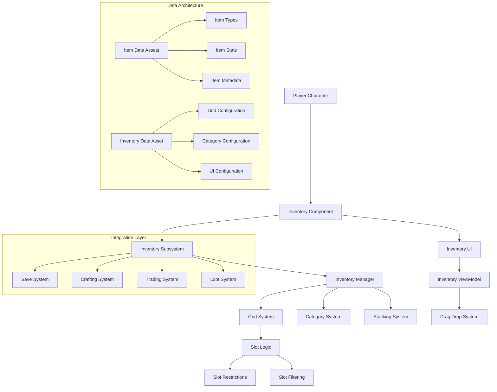

# Inventory System

Grid-based inventory management with category organization, item stacking, drag-and-drop functionality, and seamless integration with interaction and save systems. Built for scalability from simple adventure games to complex RPGs.

## Architecture Overview



## What & Why

Modern adventure games require sophisticated inventory management that feels intuitive to players while providing developers with flexible, extensible architecture. This system combines the spatial organization of grid-based storage with intelligent categorization, creating an inventory that scales from simple item collection to complex equipment management.

## Prerequisites

- **Enhanced Input System** for drag-and-drop interactions
- **UI MVVM Architecture** understanding for clean data binding
- **Data Asset** patterns for item and configuration management
- **Component Architecture** familiarity for modular design

## Component Architecture

### Core System Components

**AC_InventoryComponent** (Actor Component)
- Manages individual character's inventory state and operations
- Handles item addition, removal, and validation logic
- Integrates with save system for persistent storage
- Single responsibility: Character-specific inventory management

**InventorySubsystem** (World Subsystem)  
- Coordinates inventory operations across multiple characters
- Manages global inventory events and notifications
- Handles cross-character item transfers and trading
- Service pattern: Global inventory coordination

**InventoryManager** (Blueprint Class)
- Core logic for grid placement, stacking, and organization
- Implements spatial algorithms for optimal item placement
- Manages category-based filtering and sorting
- Algorithm encapsulation: Complex inventory logic centralized

### Data Management Strategy

**Item Data Architecture**
```
DA_ItemBase (Primary Data Asset):
- Core Properties: ID, Name, Description, Icon, Value
- Physical Properties: Stack Size, Grid Dimensions (Width x Height)
- Category: Equipment, Consumable, Material, Quest, Misc
- Restrictions: Usage Requirements, Level Locks, Class Locks

Item Instance Data:
- Unique Instance ID for save/load tracking
- Current Stack Count (if stackable item)
- Condition/Durability (for degradable items)
- Custom Properties (enchantments, modifications)
```

**Grid System Configuration**
- Dynamic grid sizing based on character progression
- Category-based auto-sorting with player override options
- Spatial optimization algorithms for automatic organization
- Visual feedback for valid/invalid placement zones

## Implementation Methodology

### Phase 1: Data Foundation

**1. Item Data Asset System**
- Create Item Base class: `DA_ItemBase` (Primary Data Asset)
- Define item categories with consistent property sets
- Setup item validation rules and usage constraints
- Create item database with efficient lookup systems

**2. Grid Architecture Setup**
- Design grid coordinate system (X, Y positioning)
- Implement spatial collision detection for item placement
- Create visual grid representation with UI binding
- Setup drag preview system with snap-to-grid functionality

**3. Inventory Component Creation**
- Build core inventory logic: Add, Remove, Move, Stack operations
- Implement capacity management with weight and slot limits
- Add category-based organization with filtering options
- Create event system for inventory change notifications

### Phase 2: UI Integration

**4. MVVM Implementation**  
- Create Inventory ViewModel with observable properties
- Bind inventory data to UI widgets reactively
- Implement drag-and-drop with visual feedback
- Add tooltip system with rich item information display

**5. Advanced UI Features**
- Quick-use slots with hotkey binding integration
- Search and filter functionality for large inventories
- Batch operations: multi-select, mass transfer, auto-sort
- Context menus with item-specific actions

### Phase 3: System Integration

**6. Cross-System Connectivity**
- Integrate with crafting system for material management
- Connect to trading system for multiplayer item exchange
- Link with loot system for automatic item acquisition
- Coordinate with save system for persistent inventory state

## Performance Optimization

### Spatial Algorithms
- **Efficient Placement**: Binary space partitioning for item positioning
- **Smart Stacking**: Automatic stack consolidation and optimization
- **Grid Optimization**: Lazy loading for large inventory spaces
- **Visual Culling**: Only render visible inventory sections

### Memory Management  
- **Item Instance Pooling**: Reuse item objects to prevent garbage collection
- **Lazy Loading**: Load item details only when needed for display
- **Soft References**: Heavy item assets (meshes, textures) loaded on-demand
- **Data Compression**: Efficient serialization for save operations

### UI Performance
- **Virtualized Lists**: Handle thousands of items without performance loss
- **Progressive Rendering**: Smooth scrolling with incremental item loading
- **Event Batching**: Group multiple inventory changes into single UI updates
- **Texture Streaming**: Dynamic icon loading based on inventory view

## Testing & Validation

### Functional Testing Matrix
- [ ] Item placement validation across all grid configurations
- [ ] Stacking behavior with various item types and limits
- [ ] Drag-and-drop accuracy with edge case positioning
- [ ] Category filtering and search functionality
- [ ] Save/load persistence across game sessions
- [ ] Integration testing with crafting and trading systems

### Performance Benchmarks
- **UI Responsiveness**: <16ms for all inventory operations
- **Memory Usage**: <5MB for 1000+ item inventories  
- **Search Performance**: <100ms for filtered results in large inventories
- **Save/Load Time**: <2 seconds for complete inventory serialization

### User Experience Validation
- **Intuitive Organization**: Players can organize items logically
- **Quick Access**: Frequently used items easily accessible
- **Visual Clarity**: Item information clearly displayed and readable
- **Error Prevention**: Invalid operations prevented with clear feedback

## AI Acceleration Prompts

**Grid Algorithm**: "Create an efficient spatial algorithm for automatically organizing inventory items in a grid-based system with category priorities"

**UI Implementation**: "Build a drag-and-drop inventory interface using MVVM patterns that handles item stacking and provides visual feedback for valid placements"

**Item System Design**: "Design a flexible item data asset system that supports various item types (equipment, consumables, materials) with extensible properties"

**Performance Optimization**: "Optimize inventory system performance for handling 1000+ items with smooth UI interactions and minimal memory usage"

**Integration Architecture**: "Create seamless integration between inventory, crafting, and trading systems while maintaining clean component boundaries"

**Save System Integration**: "Implement efficient inventory serialization that handles large item collections with version compatibility and corruption recovery"

This Inventory System demonstrates advanced Blueprint architecture that handles complex spatial algorithms and data management while providing the flexibility and performance required for professional adventure games.
