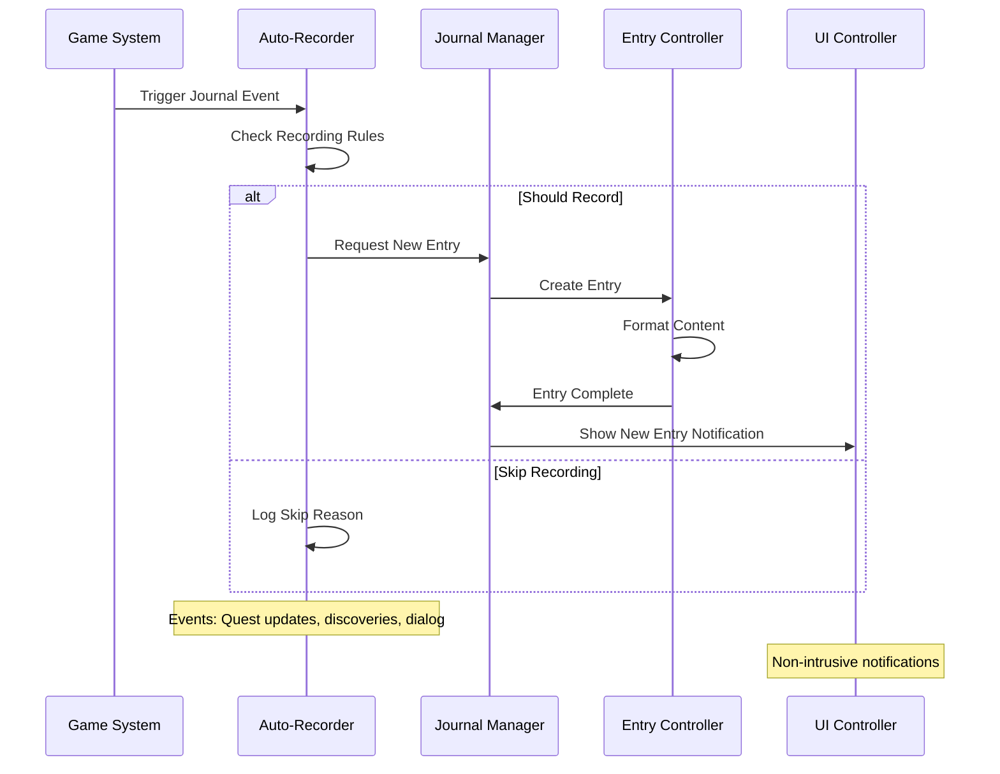
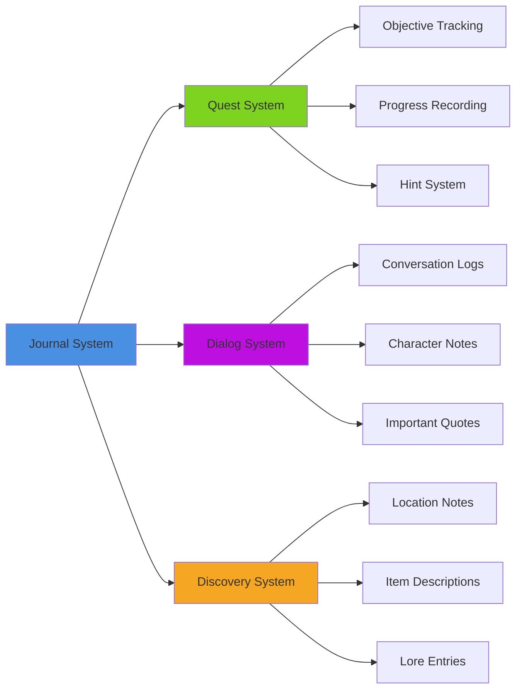
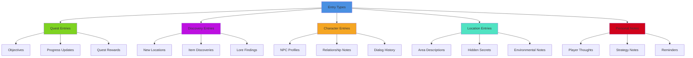

# Journal & Notes System

## Overview
A comprehensive journal and note-taking system that automatically records player discoveries, quest progress, and important information while allowing manual note creation and organization. Implements rich text formatting, multimedia attachments, search functionality, and cross-referencing for enhanced player immersion and information management.

## System Architecture

```mermaid
graph TB
    A[Journal Manager] --> B[Entry Controller]
    A --> C[Organization System]
    A --> D[Search Engine]
    A --> E[UI Controller]
    A --> F[Auto-Recording System]
    
    B --> G[Text Formatting]
    B --> H[Media Attachments]
    B --> I[Timestamp System]
    B --> J[Version Control]
    
    C --> K[Category System]
    C --> L[Tag Management]
    C --> M[Cross-References]
    C --> N[Priority Levels]
    
    D --> O[Full-Text Search]
    D --> P[Metadata Search]
    D --> Q[Smart Filters]
    D --> R[Suggestion Engine]
    
    E --> S[Reading Interface]
    E --> T[Writing Interface]
    E --> U[Organization Interface]
    
    F --> V[Quest Integration]
    F --> W[Discovery System]
    F --> X[Dialog Recording]
    
    style A fill:#4a90e2
    style D fill:#7ed321
    style F fill:#f5a623
    style C fill:#bd10e0
    style E fill:#50e3c2
```

## Component Breakdown

### Journal Manager Component
- **Purpose**: Central orchestration of all journal functionality and data management
- **Key Features**: Entry lifecycle, search coordination, sync management
- **Performance**: Efficient text indexing with smart caching and pagination

### Entry Controller Component
- **Purpose**: Manages individual journal entries with rich content support
- **Key Features**: Rich text editing, multimedia integration, formatting tools
- **Performance**: Lazy loading with incremental text rendering

### Organization System Component
- **Purpose**: Handles categorization, tagging, and hierarchical organization
- **Key Features**: Dynamic categories, smart tagging, relationship mapping
- **Performance**: Optimized tree structures with fast lookup algorithms

## Blueprint Patterns

### Auto-Recording Flow

### Search and Discovery Pattern
- **Smart Search**: Context-aware search with natural language processing
- **Auto-Suggestions**: Predictive text and topic suggestions while typing
- **Cross-Reference Discovery**: Automatic linking of related journal entries

### Categorization Pattern
- **Dynamic Categories**: Categories created automatically based on content
- **Hierarchical Organization**: Nested categories with inheritance
- **Smart Tagging**: AI-assisted tag suggestions and automatic tagging

## Performance Optimization

### Text Processing
- **Incremental Indexing**: Build search indices progressively as content is added
- **Lazy Rendering**: Only render visible journal content to save resources
- **Text Compression**: Compress stored journal text for memory efficiency

### Search Optimization
- **Inverted Index**: Fast full-text search with relevance ranking
- **Query Caching**: Cache frequent searches for instant results
- **Progressive Search**: Show results incrementally as user types

### UI Optimization
- **Virtual Scrolling**: Handle large journals efficiently in UI
- **Content Streaming**: Load journal sections on-demand
- **Responsive Layout**: Adapt interface to different screen sizes and orientations

## Integration Points

### Game System Integration

### System Integrations
- **Map System**: Location-based notes with coordinate integration
- **Inventory System**: Item descriptions and crafting notes
- **Character System**: NPC relationship tracking and personal notes
- **Save System**: Persistent journal data across game sessions

### Gameplay Mechanics
- **Investigation Gameplay**: Clue tracking and evidence organization
- **Learning Systems**: Skill progression notes and tutorial reminders
- **Social Systems**: Relationship notes and social interaction tracking

## Configuration System

### Entry Types Data Asset
- **Automatic Entries**: System-generated entries for quests, discoveries, dialog
- **Manual Entries**: Player-created notes with full editing capabilities
- **Template Entries**: Pre-formatted entry templates for common use cases
- **Imported Entries**: External content like screenshots, recordings, maps

### Recording Rules Data Asset
- **Quest Recording**: Automatic entry creation for quest events and updates
- **Discovery Recording**: Notes for new locations, items, characters encountered
- **Dialog Recording**: Important conversations and character interactions
- **Custom Triggers**: User-defined events that trigger journal entries

### Organization Templates Data Asset
- **Default Categories**: Standard organization scheme for common journal types
- **Custom Categories**: User-created organization systems
- **Smart Categories**: AI-suggested categories based on content analysis
- **Time-Based Organization**: Chronological organization with timeline view

## Advanced Features

### Rich Content System
- **Multimedia Integration**: Embed images, audio recordings, and videos
- **Interactive Maps**: Clickable location references with map integration
- **3D Object Viewer**: Embedded 3D models for items and discoveries
- **Timeline Visualization**: Visual timeline of events and discoveries

### Collaboration Features
- **Shared Journals**: Multiplayer journal sharing with permission controls
- **Annotation System**: Comments and highlights on shared entries
- **Version History**: Track changes and revisions to journal entries
- **Merge Conflicts**: Resolve conflicting edits in collaborative journals

### AI-Assisted Features
- **Content Summarization**: Automatic summary generation for long entries
- **Relationship Mapping**: AI-generated relationship diagrams between entries
- **Trend Analysis**: Identify patterns and trends in journal content
- **Smart Reminders**: Context-sensitive reminders based on journal content

## Content Categories

### Journal Entry Types

### Organization Methods
- **Chronological**: Time-based organization showing progression through game
- **Categorical**: Topic-based organization with nested subcategories
- **Geographical**: Location-based organization tied to game world map
- **Character-Based**: Organization around NPCs and relationships
- **Custom**: Player-defined organization systems with flexible hierarchies

### Visual Presentation
- **Reading Modes**: Different visual styles for reading vs editing
- **Typography Options**: Customizable fonts, sizes, and formatting
- **Color Coding**: Visual categorization with customizable color schemes
- **Layout Options**: Grid, list, timeline, and map-based layout modes

## Implementation Notes

### Blueprint Architecture
- **Modular Design**: Separate components for recording, organization, search, and display
- **Event-Driven Updates**: Reactive system responding to game events
- **Data-Driven Content**: External configuration for entry types and templates

### Text Processing
- **Rich Text Support**: Full HTML-like formatting with custom extensions
- **Search Indexing**: Real-time index updates for instant search results
- **Content Validation**: Sanitize and validate user input for security

### Performance Patterns
- **Pagination**: Handle large journals efficiently with page-based loading
- **Caching Strategy**: Multi-level caching for content, searches, and metadata
- **Async Operations**: Non-blocking journal operations for smooth gameplay

### User Experience
- **Intuitive Interface**: Familiar note-taking metaphors with game-specific enhancements
- **Quick Actions**: Fast entry creation and common operations
- **Accessibility Support**: Screen reader compatibility and keyboard navigation
- **Mobile Optimization**: Touch-friendly interface for mobile platforms

This journal and notes system provides a comprehensive information management solution that enhances player engagement through organized record-keeping while supporting both automatic documentation and creative player expression.
