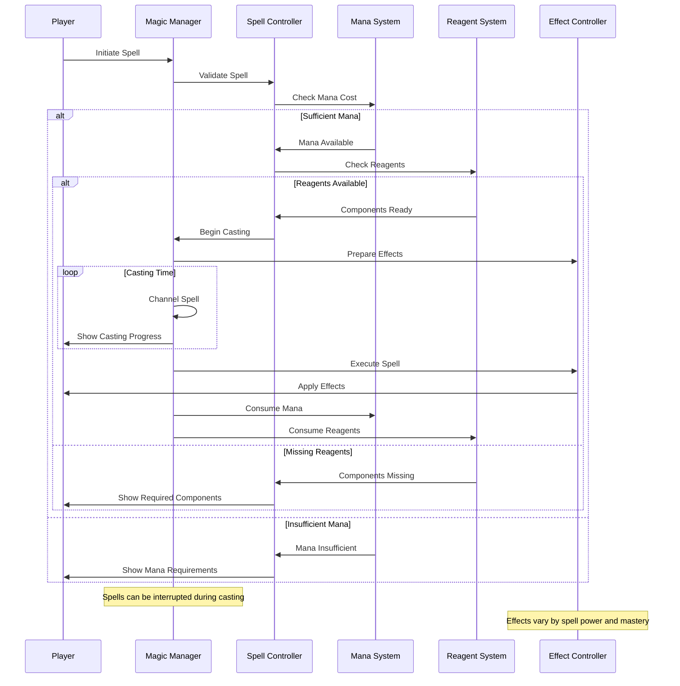
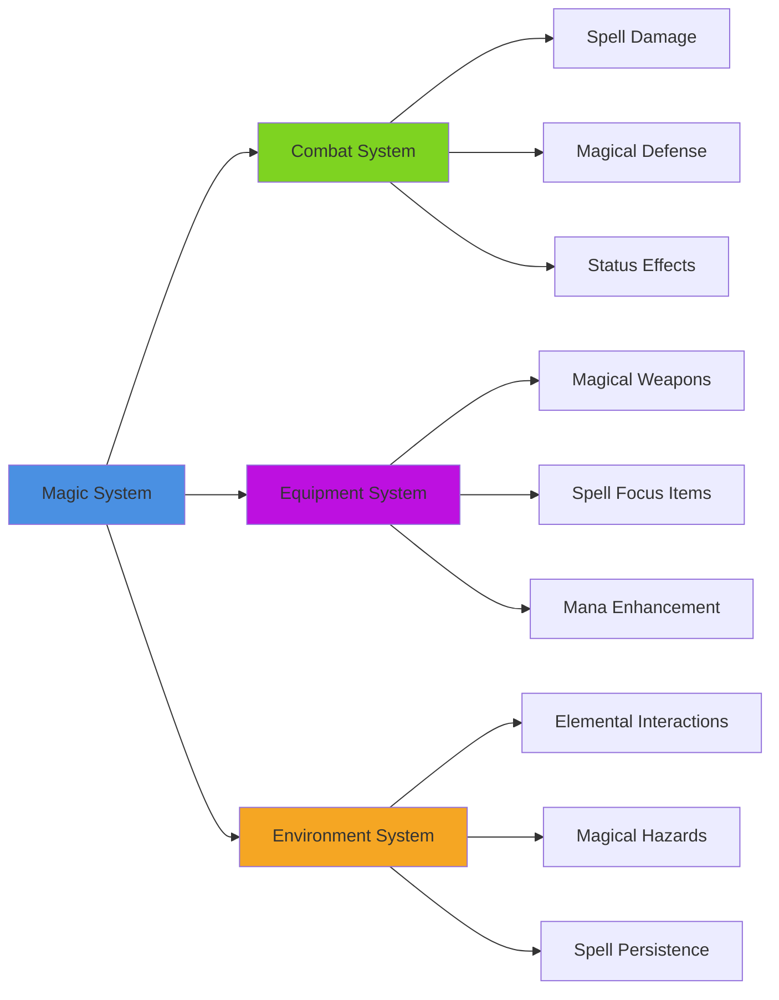
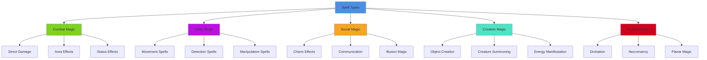

# Magic System

## Overview
A comprehensive magic system providing spellcasting mechanics, mana management, spell progression, and magical interactions. Implements diverse spell schools, reagent systems, magical effects, and integration with combat and world systems while supporting both traditional spellcasting and innovative magical mechanics.

## System Architecture

```mermaid
graph TB
    A[Magic Manager] --> B[Spell Controller]
    A --> C[Mana System]
    A --> D[School Manager]
    A --> E[Reagent System]
    A --> F[Effect Controller]
    
    B --> G[Spell Database]
    B --> H[Casting Mechanics]
    B --> I[Spell Combinations]
    B --> J[Interruption Handling]
    
    C --> K[Mana Pool]
    C --> L[Regeneration System]
    C --> M[Mana Types]
    C --> N[Exhaustion Mechanics]
    
    D --> O[Spell Schools]
    D --> P[Specialization]
    D --> Q[Cross-School Synergy]
    D --> R[Mastery Progression]
    
    E --> S[Component Requirements]
    E --> T[Reagent Consumption]
    E --> U[Substitution Rules]
    E --> V[Preparation Systems]
    
    F --> W[Visual Effects]
    F --> X[Audio Integration]
    F --> Y[Physics Interaction]
    F --> Z[Status Application]
    
    style A fill:#4a90e2
    style B fill:#7ed321
    style C fill:#f5a623
    style D fill:#bd10e0
    style E fill:#50e3c2
    style F fill:#d0021b
```

## Component Breakdown

### Magic Manager Component
- **Purpose**: Central orchestration of magical systems and spell coordination
- **Key Features**: System integration, magical law enforcement, power balancing
- **Performance**: Efficient magic processing with optimized spell resolution

### Spell Controller Component
- **Purpose**: Manages individual spell casting, targeting, and execution
- **Key Features**: Spell database, casting validation, effect application
- **Performance**: Fast spell lookup with intelligent caching and prediction

### Mana System Component
- **Purpose**: Handles magical energy management, regeneration, and exhaustion
- **Key Features**: Multi-pool mana, regeneration curves, magical fatigue
- **Performance**: Optimized energy calculations with minimal processing overhead

## Blueprint Patterns

### Spellcasting Flow

### Spell School Pattern
- **Elemental Magic**: Fire, ice, lightning, earth, air, water specializations
- **Utility Magic**: Teleportation, illumination, detection, communication
- **Combat Magic**: Damage, protection, enhancement, debuff spells
- **Mystical Magic**: Illusion, divination, necromancy, enchantment

### Mana Management Pattern
- **Regenerative Mana**: Slowly regenerating magical energy pool
- **Consumable Mana**: Finite mana requiring potions or rest to restore
- **Hybrid Systems**: Combination of regenerative and consumable elements

## Performance Optimization

### Spell Processing
- **Effect Batching**: Group similar magical effects for efficient processing
- **LOD Magic**: Reduce spell complexity for distant or non-critical effects
- **Predictive Casting**: Pre-calculate likely spell outcomes for smooth gameplay

### Visual Effect Management
- **Effect Pooling**: Reuse particle systems and visual effects efficiently
- **Quality Scaling**: Adjust magical effect quality based on hardware capability
- **Culling Systems**: Hide magical effects outside player view

### Audio Integration
- **Spatial Audio**: 3D positioned spell sounds with realistic propagation
- **Dynamic Mixing**: Magical audio adapts to spell intensity and environment
- **Priority Systems**: Important spell audio overrides less critical sounds

## Integration Points

### Combat System Integration

### System Integrations
- **Skill System**: Magical abilities improve through practice and study
- **Inventory System**: Reagents, spell books, and magical items management
- **Crafting System**: Creation of magical items, potions, and enchantments
- **Quest System**: Magic-based objectives and story progression

### World Mechanics
- **Environmental Magic**: Spells interact with weather, terrain, and objects
- **Magical Zones**: Areas with enhanced or restricted magical properties
- **Ley Lines**: Magical energy networks affecting spell power and availability
- **Anti-Magic**: Areas or effects that suppress or nullify magical abilities

## Configuration System

### Spell Categories Data Asset
- **Offensive Spells**: Damage-dealing magic with various elemental types
- **Defensive Spells**: Protection, healing, and damage mitigation magic
- **Utility Spells**: Non-combat magic for exploration and problem-solving
- **Summoning Spells**: Creature and object summoning with duration limits
- **Transformation Spells**: Shape-changing and transmutation magic

### Magic Schools Data Asset
- **Evocation**: Direct magical energy manipulation and elemental control
- **Conjuration**: Summoning and creation magic from other planes
- **Transmutation**: Alteration and transformation of matter and energy
- **Divination**: Information gathering and future prediction magic
- **Enchantment**: Mind influence and magical enhancement spells

### Reagent Rules Data Asset
- **Common Components**: Easily obtained materials for basic spells
- **Rare Components**: Special materials required for powerful magic
- **Substitution Rules**: Alternative components with modified effects
- **Preparation Requirements**: Time and skill needed to prepare components

## Advanced Features

### Dynamic Magic System
- **Spell Combination**: Mix different spells for unique effects
- **Environmental Synergy**: Magic adapts to environmental conditions
- **Emotional Casting**: Caster's emotional state affects spell outcomes
- **Collaborative Magic**: Multiple casters combining power for greater effects

### Magical Research
- **Spell Creation**: Players can develop entirely new spells
- **Magical Theory**: Research system for understanding magical principles
- **Experimentation**: Safe and dangerous magical experiments with consequences
- **Knowledge Sharing**: Teaching and learning magic between players

### Magical Consequences
- **Magical Fatigue**: Overuse of magic has temporary negative effects
- **Spell Failure**: Failed spells can have dangerous or amusing consequences
- **Magical Addiction**: Potential psychological dependence on magical power
- **Reality Distortion**: Powerful magic can have unintended side effects

## Magic Categories

### Spell Classification System

### Casting Methods
- **Verbal Casting**: Spoken incantations with interrupt vulnerability
- **Somatic Casting**: Hand gestures and body movements for spell activation
- **Material Casting**: Component-based magic requiring physical reagents
- **Mental Casting**: Pure willpower-based spellcasting for advanced mages

### Power Sources
- **Personal Mana**: Internal magical energy regenerated through rest
- **Environmental Energy**: Drawing power from surroundings and ley lines
- **Stored Power**: Pre-charged magical items and batteries
- **Borrowed Power**: Temporary power from allies, spirits, or deities

## Implementation Notes

### Blueprint Architecture
- **Modular Spell Components**: Flexible framework supporting diverse magical effects
- **Event-Driven Magic**: Reactive magical system with efficient state management
- **Data-Driven Spells**: External spell definitions for easy balance and expansion

### Balance Considerations
- **Power vs Cost**: More powerful spells require proportionally higher costs
- **Risk vs Reward**: Dangerous magic provides greater benefits but higher risks
- **Accessibility**: Multiple magic styles accommodate different play preferences
- **Progression Pacing**: Magical advancement feels rewarding without being overpowered

### Performance Patterns
- **Efficient Calculations**: Optimal spell algorithms with minimal computational cost
- **Smart Caching**: Cache frequently used spell data and effect calculations
- **Background Processing**: Complex magical effects processed without blocking gameplay

### User Experience
- **Intuitive Casting**: Spellcasting controls feel natural and responsive
- **Visual Spectacle**: Magical effects provide satisfying audio-visual feedback
- **Strategic Depth**: Magic system offers meaningful tactical choices
- **Creative Expression**: Players can develop unique magical approaches and combinations

This magic system provides a comprehensive framework for mystical gameplay that supports both traditional fantasy magic and innovative magical mechanics while maintaining balance and engagement across all platforms and play styles.
