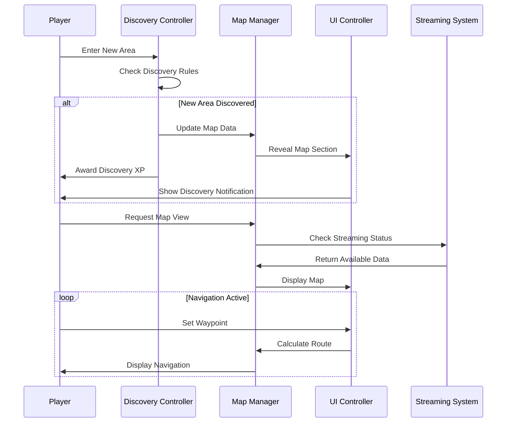
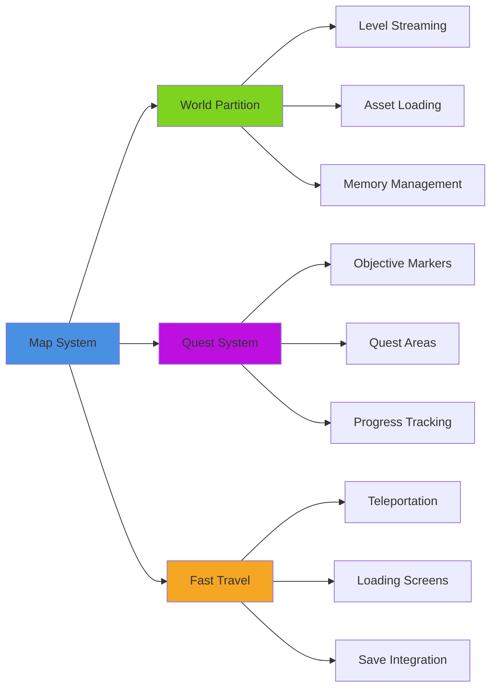
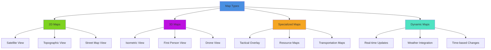

# Map & Navigation System

## Overview
A comprehensive mapping and navigation system providing interactive world maps, GPS-style navigation, waypoint management, and location discovery. Implements fog of war mechanics, custom markers, route planning, and seamless integration with world streaming while supporting both 2D and 3D map visualization modes.

## System Architecture

```mermaid
graph TB
    A[Map Manager] --> B[Discovery Controller]
    A --> C[Navigation Controller] 
    A --> D[Waypoint System]
    A --> E[UI Controller]
    A --> F[Streaming Integration]
    
    B --> G[Fog of War]
    B --> H[Location Detection]
    B --> I[Point of Interest]
    B --> J[Auto-Discovery]
    
    C --> K[Route Planning]
    C --> L[GPS Navigation]
    C --> M[Compass System]
    C --> N[Distance Calculation]
    
    D --> O[Custom Markers]
    D --> P[Waypoint Categories]
    D --> Q[Quick Navigation]
    D --> R[Shared Waypoints]
    
    E --> S[Map Visualization]
    E --> T[Minimap Integration]
    E --> U[3D Map Mode]
    E --> V[Search Interface]
    
    F --> W[Level Streaming]
    F --> X[World Partition]
    F --> Y[Async Loading]
    
    style A fill:#4a90e2
    style B fill:#7ed321
    style C fill:#f5a623
    style D fill:#bd10e0
    style E fill:#50e3c2
    style F fill:#d0021b
```

## Component Breakdown

### Map Manager Component
- **Purpose**: Central orchestration of mapping functionality and data coordination
- **Key Features**: Map data management, coordinate systems, multi-scale visualization
- **Performance**: Efficient map tile management with smart caching and LOD systems

### Discovery Controller Component
- **Purpose**: Manages exploration mechanics and fog of war revelation
- **Key Features**: Progressive discovery, exploration rewards, secret area detection
- **Performance**: Spatial partitioning for efficient visibility calculations

### Navigation Controller Component
- **Purpose**: Provides pathfinding, route planning, and GPS-style navigation
- **Key Features**: Multi-modal routing, obstacle avoidance, real-time recalculation
- **Performance**: Hierarchical pathfinding with cached route segments

## Blueprint Patterns

### Map Discovery Flow

### Waypoint Management Pattern
- **Hierarchical Categories**: Organized waypoint system with nested categories
- **Smart Suggestions**: AI-suggested waypoints based on player behavior
- **Proximity Alerts**: Automatic notifications when approaching waypoints

### Fog of War Pattern
- **Progressive Revelation**: Gradual map uncovering based on exploration
- **Persistence System**: Discovered areas remain revealed across sessions
- **Shared Discovery**: Multiplayer map sharing with permission controls

## Performance Optimization

### Map Rendering
- **Tile-Based System**: Efficient map rendering using tile-based approach
- **Level of Detail**: Dynamic detail scaling based on zoom level and performance
- **Culling System**: Only render visible map portions and UI elements

### Discovery Processing
- **Spatial Indexing**: Efficient spatial queries for discovery detection
- **Batch Processing**: Process multiple discoveries in single frame
- **Predictive Loading**: Pre-load likely discovery areas for smooth revelation

### Navigation Optimization
- **Hierarchical Pathfinding**: Multi-level pathfinding for long-distance routes
- **Route Caching**: Cache frequently used routes for instant retrieval
- **Async Calculation**: Background route calculation without UI blocking

## Integration Points

### World Systems Integration

### System Integrations
- **Save System**: Persistent map discovery and waypoint data
- **UI System**: Integrated minimap and full-screen map interfaces
- **Audio System**: Navigation audio cues and ambient map sounds
- **Input System**: Touch gestures, mouse controls, gamepad navigation

### Gameplay Mechanics
- **Exploration Rewards**: Discovery bonuses and achievement integration
- **Stealth Integration**: Map awareness affects stealth gameplay
- **Combat Integration**: Tactical map overlay for combat situations
- **Social Features**: Shared discoveries and collaborative mapping

## Configuration System

### Map Types Data Asset
- **World Map**: Complete game world overview with major landmarks
- **Region Maps**: Detailed area maps with local points of interest
- **Indoor Maps**: Building layouts and interior navigation
- **Tactical Maps**: Combat and stealth-focused overlays
- **Custom Maps**: Player-created and community-shared maps

### Discovery Rules Data Asset
- **Exploration Range**: Distance required for area discovery
- **Discovery Triggers**: Events that trigger map revelation
- **Visibility Rules**: Line of sight requirements for discovery
- **Secret Areas**: Hidden locations with special discovery requirements

### Navigation Settings Data Asset
- **Route Preferences**: Walking, driving, flying, teleportation options
- **Obstacle Avoidance**: Dynamic pathfinding around temporary obstacles
- **Multi-Modal Routing**: Combination of different travel methods
- **Accessibility Routes**: Alternative paths for accessibility needs

## Advanced Features

### 3D Map Visualization
- **Isometric View**: 3D perspective map with depth and elevation
- **Terrain Visualization**: Height maps and topographical information
- **Building Interiors**: Multi-level indoor map visualization
- **Dynamic Weather**: Weather effects on map visualization

### Smart Navigation
- **Traffic Awareness**: Dynamic routing based on NPC traffic patterns
- **Time-Based Routing**: Optimal routes considering time-of-day factors
- **Skill-Based Routes**: Paths that consider player abilities and limitations
- **Contextual Suggestions**: Navigation suggestions based on current objectives

### Collaborative Features
- **Shared Discoveries**: Team-based exploration with shared map progress
- **Custom Annotations**: Player-created map notes and warnings
- **Guide System**: Experienced players can create guided routes
- **Community Maps**: User-generated content and map modifications

## Map Categories

### Map Visualization Types

### Navigation Modes
- **Free Exploration**: No specific destination, discovery-focused navigation
- **Waypoint Navigation**: Direct route to specific marked locations
- **Quest Navigation**: Integrated navigation for quest objectives
- **Social Navigation**: Following other players or community routes

### Information Layers
- **Geographic**: Terrain, elevation, water bodies, natural landmarks
- **Infrastructure**: Roads, buildings, transportation networks
- **Points of Interest**: Shops, services, attractions, hidden areas
- **Dynamic Content**: Events, NPCs, weather, temporary obstacles

## Implementation Notes

### Blueprint Architecture  
- **Modular Map Components**: Separate systems for discovery, navigation, rendering
- **Event-Driven Updates**: Reactive map system responding to world changes
- **Data-Driven Configuration**: External map data and customization settings

### Streaming Integration
- **Seamless Loading**: Map data loads seamlessly with world streaming
- **Predictive Caching**: Pre-load map data for anticipated exploration areas
- **Memory Management**: Efficient memory usage for large world maps

### Performance Patterns
- **Tile-Based Rendering**: Efficient map display using tile-based approach
- **Hierarchical Detail**: Multiple detail levels for different zoom ranges
- **Async Operations**: Background processing for map calculations

### User Experience
- **Intuitive Controls**: Familiar map interaction patterns across all platforms
- **Accessibility Features**: Screen reader support and colorblind-friendly palettes
- **Customization Options**: User control over map display and navigation preferences
- **Help Integration**: Contextual help and tutorial integration for map features

This map and navigation system provides a comprehensive spatial awareness solution that enhances exploration gameplay while supporting both casual and hardcore navigation needs across all platforms and play styles.
