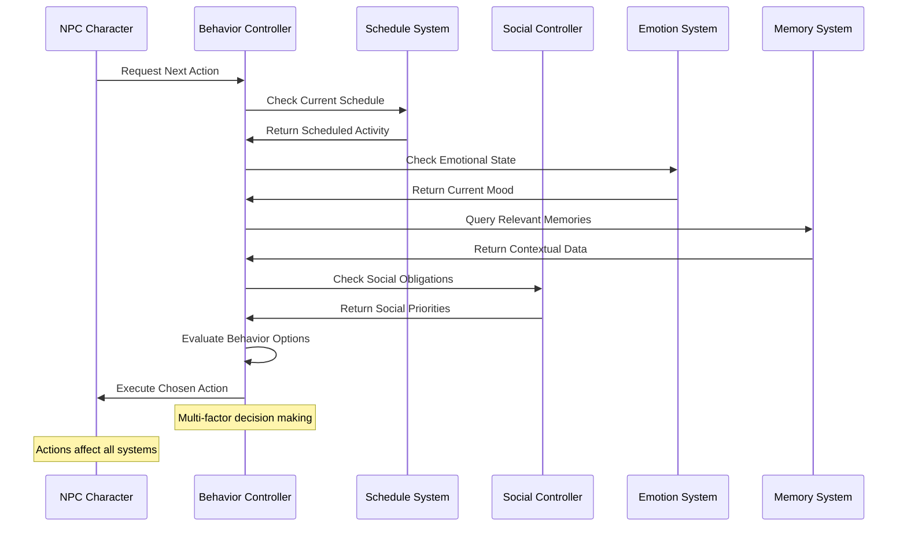
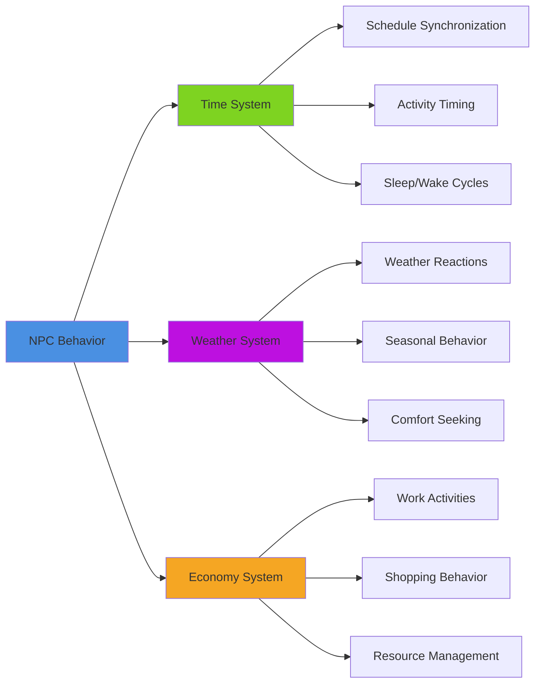

# NPC Behavior System

## Overview
An intelligent NPC behavior system providing realistic AI characters with daily routines, emotional responses, social interactions, and dynamic decision-making. Implements behavior trees, state machines, goal-oriented action planning, and social hierarchies while maintaining performance for large populations of NPCs.

## System Architecture

```mermaid
graph TB
    A[NPC Manager] --> B[Behavior Controller]
    A --> C[Schedule System]
    A --> D[Social Controller]
    A --> E[Emotion System]
    A --> F[Memory System]
    
    B --> G[Behavior Trees]
    B --> H[State Machines]
    B --> I[Goal Planning]
    B --> J[Action Execution]
    
    C --> K[Daily Routines]
    C --> L[Work Schedules]
    C --> M[Social Events]
    C --> N[Sleep Cycles]
    
    D --> O[Relationship Manager]
    D --> P[Conversation System]
    D --> Q[Group Dynamics]
    D --> R[Reputation System]
    
    E --> S[Mood Controller]
    E --> T[Reaction System]
    E --> U[Personality Traits]
    
    F --> V[Event Memory]
    F --> W[Relationship Memory]
    F --> X[Location Memory]
    F --> Y[Player Memory]
    
    style A fill:#4a90e2
    style B fill:#7ed321
    style C fill:#f5a623
    style D fill:#bd10e0
    style E fill:#50e3c2
    style F fill:#d0021b
```

## Component Breakdown

### NPC Manager Component
- **Purpose**: Central orchestration of NPC population and resource management
- **Key Features**: Population control, performance scaling, AI coordination
- **Performance**: Hierarchical updates with intelligent culling and LOD systems

### Behavior Controller Component
- **Purpose**: Manages individual NPC decision-making and action execution
- **Key Features**: Multi-layered AI with behavior trees and state machines
- **Performance**: Optimized behavior evaluation with smart caching

### Schedule System Component
- **Purpose**: Handles NPC daily routines, work schedules, and time-based activities
- **Key Features**: Dynamic scheduling, event prioritization, routine adaptation
- **Performance**: Efficient schedule processing with predictive calculation

## Blueprint Patterns

### NPC Decision Flow

### Social Interaction Pattern
- **Relationship Awareness**: NPCs track relationships with other characters and player
- **Context-Sensitive Dialog**: Conversations adapt to relationship status and recent events
- **Group Behavior**: NPCs coordinate activities and respond to group dynamics

### Memory Formation Pattern
- **Event Recording**: Significant events stored with emotional context
- **Memory Decay**: Older memories fade or become less accurate over time
- **Shared Information**: NPCs share information through social networks

## Performance Optimization

### AI Processing Optimization
- **Level of Detail**: Reduce AI complexity based on distance from player
- **Time Slicing**: Distribute AI processing across multiple frames
- **Priority Queuing**: Important NPCs get more processing time

### Crowd Management
- **Population Culling**: Deactivate distant NPCs with graceful reactivation
- **Group Processing**: Process similar NPCs in batches efficiently
- **Behavioral Instancing**: Share similar behaviors across multiple NPCs

### Memory Optimization
- **Memory Compression**: Efficient storage of NPC memories and relationships
- **Relevance Filtering**: Only store memories that affect future behavior
- **Garbage Collection**: Clean up outdated or irrelevant NPC data

## Integration Points

### World System Integration

### System Integrations
- **Dialog System**: Context-aware conversations with personality-driven responses
- **Quest System**: NPCs provide quests, information, and story progression
- **Combat System**: NPCs react to threat levels and combat situations
- **Audio System**: NPCs generate ambient chatter and environmental audio

### Gameplay Mechanics
- **Reputation System**: Player actions affect NPC attitudes and available interactions
- **Information Network**: NPCs share news, rumors, and player actions
- **Dynamic Events**: NPCs create and participate in emergent gameplay events

## Configuration System

### NPC Types Data Asset
- **Civilians**: Ordinary citizens with basic daily routines
- **Merchants**: Trade-focused NPCs with economic behaviors
- **Guards**: Security NPCs with patrol and response behaviors
- **Specialists**: Unique NPCs with specific roles and expertise
- **Dynamic NPCs**: Procedurally generated characters with randomized traits

### Personality Templates Data Asset
- **Trait Systems**: Combinations of personality traits affecting behavior
- **Emotional Profiles**: Different emotional responsiveness and stability
- **Social Preferences**: Introversion/extroversion and social comfort levels
- **Activity Preferences**: Work, leisure, and social activity preferences

### Behavior Rules Data Asset
- **Daily Routines**: Template schedules for different NPC types
- **Social Rules**: Guidelines for NPC interactions and relationships
- **Emergency Responses**: How NPCs react to dangerous or unusual situations
- **Seasonal Adaptations**: Behavior changes based on seasons and weather

## Advanced Features

### Dynamic Personality System
- **Trait Evolution**: Personality traits can change based on experiences
- **Stress Responses**: NPCs react to prolonged stress with behavioral changes
- **Learning Behaviors**: NPCs adapt behavior based on successful/failed actions
- **Cultural Influence**: Regional culture affects NPC personality development

### Advanced Social Dynamics
- **Faction Relationships**: NPCs belong to groups with complex inter-group dynamics
- **Rumor Networks**: Information spreads through NPC social networks
- **Leadership Hierarchies**: Some NPCs influence others' behavior and decisions
- **Social Events**: NPCs organize and participate in community events

### Emergent Storytelling
- **Relationship Drama**: NPCs develop complex relationships and conflicts
- **Economic Dynamics**: NPCs create supply/demand through their activities
- **Community Evolution**: NPC communities change and grow over time
- **Player Impact Stories**: Long-term consequences of player actions on NPC lives

## NPC Categories

### NPC Type System

```mermaid
graph TD
    A[NPC Types] --> B[Civilian NPCs]
    A --> C[Professional NPCs]
    A --> D[Service NPCs]
    A --> E[Authority NPCs]
    A --> F[Special NPCs]
    
    B --> G[Residents]
    B --> H[Visitors]
    B --> I[Children]
    B --> J[Elderly]
    
    C --> K[Merchants]
    C --> L[Craftspeople]
    C --> M[Laborers]
    C --> N[Entertainers]
    
    D --> O[Innkeepers]
    D --> P[Guides]
    D --> Q[Healers]
    D --> R[Teachers]
    
    E --> S[Guards]
    E --> T[Officials]
    E --> U[Leaders]
    E --> V[Investigators]
    
    F --> W[Quest Givers]
    F --> X[Unique Characters]
    F --> Y[Mysterious Figures]
    
    style A fill:#4a90e2
    style B fill:#7ed321
    style C fill:#bd10e0
    style D fill:#f5a623
    style E fill:#50e3c2
    style F fill:#d0021b
```

### Behavioral Categories
- **Routine-Driven**: NPCs with predictable daily schedules and activities
- **Reactive**: NPCs that primarily respond to player actions and world events
- **Proactive**: NPCs that initiate activities and create gameplay opportunities
- **Social**: NPCs focused on relationships and community interactions

### Activity Types
- **Work Activities**: Job-related tasks and professional responsibilities
- **Social Activities**: Interactions with other NPCs and community participation
- **Personal Activities**: Self-care, hobbies, and individual pursuits
- **Emergency Activities**: Responses to threats, disasters, and unusual events

## Implementation Notes

### Blueprint Architecture
- **Modular Behavior Components**: Flexible NPC components for different behavior types
- **Data-Driven Personalities**: External configuration for personality and behavior traits
- **Event-Driven Responses**: Efficient reaction system for world events

### AI Architecture
- **Hierarchical Decision Making**: Multiple layers of decision-making from reflexes to planning
- **Behavior Tree Integration**: Visual behavior design with runtime flexibility
- **Goal-Oriented Planning**: NPCs can plan complex multi-step activities

### Performance Patterns
- **Smart Culling**: Distance and relevance-based NPC activation
- **Behavior Pooling**: Share similar behavior instances across multiple NPCs
- **Async Processing**: Background processing for complex AI calculations

### User Experience
- **Believable Behavior**: NPCs act in ways that feel natural and consistent
- **Meaningful Interactions**: Player interactions with NPCs have lasting consequences
- **Emergent Stories**: NPCs create interesting stories through their interactions
- **Performance Transparency**: AI complexity scales seamlessly with hardware capability

This NPC behavior system provides a comprehensive foundation for creating believable, interactive characters that enhance immersion through realistic social dynamics and emergent storytelling opportunities.
