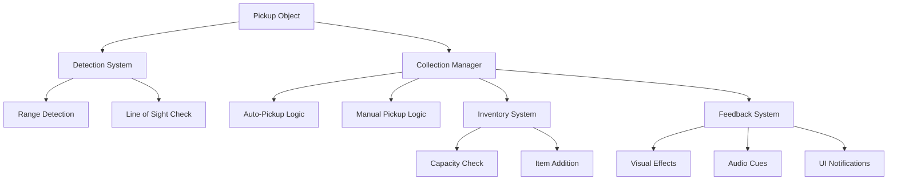

# 📦 Pickup & Collection System - Item Gathering Framework

Create a **comprehensive pickup system** that handles item collection, auto-pickup mechanics, and seamless inventory integration. Perfect for adventure games with extensive exploration and item gathering.

## 🎯 What You'll Learn

- **Smart pickup detection** with range-based auto-pickup
- **Manual collection** with interaction prompts
- **Inventory integration** with capacity management
- **Visual feedback** systems with animations and effects
- **Sound design** for different pickup types
- **Performance optimization** for hundreds of items

## 📺 Video Tutorial

🎬 **[UE5 Item Pickup System - Collection and Inventory Tutorial](https://www.youtube.com/watch?v=rHeUrGbqOPY)**
- **Channel**: CodeLikeMe
- **Duration**: ~38 minutes  
- **Topics**: Smart collection zones, rarity systems, inventory integration, auto-pickup

## 📚 Official Documentation & Resources

### **Epic Games Official Documentation:**
- 📖 **[Adding Components Tutorial](https://dev.epicgames.com/documentation/en-us/unreal-engine/adding-components-to-an-actor-in-unreal-engine)** - Pickup component setup
- 📖 **[Character Movement Tutorial](https://dev.epicgames.com/documentation/en-us/unreal-engine/setting-up-character-movement)** - Player interaction with pickups
- 📖 **[Creating User Interfaces](https://dev.epicgames.com/documentation/en-us/unreal-engine/creating-user-interfaces-with-umg-and-slate-in-unreal-engine)** - Inventory UI systems

## 🏗️ System Architecture



## 🧩 Core Components

### 1. Pickupable Item Base Class
Universal base for all collectible items.

```blueprint
// BP_PickupableItem (Actor)

Variables:
- ItemData: Struct_ItemData
- PickupType: Enum_PickupType
- AutoPickupRange: Float (Default: 150.0)
- ManualPickupRange: Float (Default: 200.0)
- CanAutoPickup: Boolean (Default: True)
- PickupValue: Integer
- RarityLevel: Enum_ItemRarity
```

### 2. Pickup Manager Component
Handles all pickup detection and collection logic.

```blueprint
// PickupManagerComponent (Actor Component)

Variables:
- NearbyPickups: Array<BP_PickupableItem>
- PickupDetectionRadius: Float (Default: 300.0)
- AutoPickupEnabled: Boolean (Default: True)
- PickupNotificationWidget: Widget Reference
```

## 📝 Implementation Guide

### Step 1: Create Item Data Structure

```blueprint
// Struct_ItemData
ItemID: String
ItemName: String
ItemDescription: String
IconTexture: Texture2D
ItemType: Enum_ItemType
Rarity: Enum_ItemRarity
StackSize: Integer
Weight: Float
Value: Integer
Consumable: Boolean
UseAnimation: Animation Sequence
```

### Step 2: Create Pickup Types

```blueprint
// Enum_PickupType
- Currency (Gold, gems, etc.)
- Consumable (Potions, food, etc.)  
- Material (Crafting materials)
- Equipment (Weapons, armor)
- Key_Item (Quest items, keys)
- Collectible (Achievement items)
- Ammo (Arrows, bullets)
- Document (Books, notes)

// Enum_ItemRarity  
- Common (Gray)
- Uncommon (Green)
- Rare (Blue)
- Epic (Purple)
- Legendary (Orange)
- Artifact (Red)
```

### Step 3: Implement Pickup Object

```blueprint
// BP_PickupableItem Implementation

// Event Begin Play
Function InitializePickup():
    // Setup collision
    CollisionSphere.SetSphereRadius(ManualPickupRange)
    CollisionSphere.SetCollisionEnabled(Collision Enabled)
    CollisionSphere.SetCollisionResponseToChannel(Pawn, Overlap)
    
    // Setup visual effects based on rarity
    SetupRarityEffects(ItemData.Rarity)
    
    // Register with pickup manager
    RegisterWithPickupManager()

// Collision Events
Event OnBeginOverlap(OtherActor):
    If OtherActor is PlayerPawn:
        PickupManager = PlayerPawn.GetPickupManager()
        PickupManager.OnPickupInRange(This)

Event OnEndOverlap(OtherActor):
    If OtherActor is PlayerPawn:
        PickupManager = PlayerPawn.GetPickupManager()
        PickupManager.OnPickupOutOfRange(This)

// Pickup Execution
Function ExecutePickup(PlayerPawn: Pawn) -> Boolean:
    InventoryComponent = PlayerPawn.GetInventoryComponent()
    
    // Check if can add to inventory
    If NOT InventoryComponent.CanAddItem(ItemData):
        ShowInventoryFullMessage()
        Return False
    
    // Add to inventory
    InventoryComponent.AddItem(ItemData, PickupValue)
    
    // Play pickup effects
    PlayPickupEffects()
    
    // Notify pickup manager
    OnItemPickedUp.Broadcast(ItemData, PickupValue)
    
    // Destroy pickup
    DestroyActor()
    Return True
```

### Step 4: Create Pickup Manager

```blueprint
// PickupManagerComponent Implementation

// Event Tick
Function UpdatePickupDetection():
    If NOT AutoPickupEnabled:
        Return
    
    PlayerLocation = GetOwner().GetActorLocation()
    
    // Check all nearby pickups for auto-pickup
    For Each Pickup in NearbyPickups:
        If IsValidPickup(Pickup):
            Distance = GetDistanceTo(Pickup)
            
            If Distance <= Pickup.AutoPickupRange AND Pickup.CanAutoPickup:
                If HasLineOfSight(Pickup):
                    AttemptPickup(Pickup)

Function OnPickupInRange(PickupItem: BP_PickupableItem):
    // Add to nearby list
    NearbyPickups.AddUnique(PickupItem)
    
    // Show pickup prompt if manual pickup
    If NOT PickupItem.CanAutoPickup:
        ShowPickupPrompt(PickupItem)

Function OnPickupOutOfRange(PickupItem: BP_PickupableItem):
    // Remove from nearby list
    NearbyPickups.Remove(PickupItem)
    
    // Hide pickup prompt
    HidePickupPrompt(PickupItem)

Function AttemptPickup(PickupItem: BP_PickupableItem) -> Boolean:
    // Validation checks
    If NOT IsValidPickup(PickupItem):
        Return False
    
    // Execute pickup
    Success = PickupItem.ExecutePickup(GetOwner())
    
    If Success:
        // Remove from tracking
        NearbyPickups.Remove(PickupItem)
        
        // Show pickup notification
        ShowPickupNotification(PickupItem.ItemData)
    
    Return Success
```

### Step 5: Visual Feedback System

```blueprint
// Pickup Visual Effects
Function SetupRarityEffects(Rarity: Enum_ItemRarity):
    Switch Rarity:
        Case Common:
            SetGlowColor(Gray)
            SetParticleSystem(CommonParticles)
        Case Uncommon:
            SetGlowColor(Green)
            SetParticleSystem(UncommonParticles)
        Case Rare:
            SetGlowColor(Blue)  
            SetParticleSystem(RareParticles)
        Case Epic:
            SetGlowColor(Purple)
            SetParticleSystem(EpicParticles)
        Case Legendary:
            SetGlowColor(Orange)
            SetParticleSystem(LegendaryParticles)
            SetupSpecialEffects()

Function PlayPickupEffects():
    // Spawn pickup particles
    SpawnEmitterAtLocation(PickupParticles, GetActorLocation())
    
    // Play pickup sound
    PlaySoundAtLocation(PickupSound, GetActorLocation())
    
    // Create floating text
    SpawnFloatingText("+" + String(PickupValue) + " " + ItemData.ItemName)
    
    // Screen flash for rare items
    If ItemData.Rarity >= Rare:
        PlayerController.ClientStartCameraShake(PickupCameraShake)

// Floating Text System
Function SpawnFloatingText(Text: String):
    FloatingTextActor = SpawnActor(BP_FloatingText, GetActorLocation())
    FloatingTextActor.SetText(Text)
    FloatingTextActor.SetColor(GetRarityColor(ItemData.Rarity))
    FloatingTextActor.PlayFloatingAnimation()
```

### Step 6: Advanced Pickup Types

#### Currency Pickup
```blueprint
// BP_CurrencyPickup (inherits from BP_PickupableItem)

Variables:
- CurrencyType: Enum_CurrencyType (Gold, Silver, Gems)
- CurrencyAmount: Integer

Function ExecutePickup(PlayerPawn) -> Boolean:
    CurrencyManager = PlayerPawn.GetCurrencyManager()
    CurrencyManager.AddCurrency(CurrencyType, CurrencyAmount)
    
    // Special currency pickup effects
    PlayCurrencyPickupEffects()
    
    Return Super.ExecutePickup(PlayerPawn)

Function PlayCurrencyPickupEffects():
    // Coin pickup sound with pitch variation
    RandomPitch = RandomFloatInRange(0.8, 1.2)
    PlaySoundAtLocation(CoinSound, GetActorLocation(), RandomPitch)
    
    // Golden particle effect
    SpawnEmitterAtLocation(CoinParticles, GetActorLocation())
```

#### Equipment Pickup  
```blueprint
// BP_EquipmentPickup (inherits from BP_PickupableItem)

Variables:
- EquipmentType: Enum_EquipmentType
- StatModifiers: Array<Struct_StatModifier>
- EnchantmentLevel: Integer

Function ExecutePickup(PlayerPawn) -> Boolean:
    EquipmentManager = PlayerPawn.GetEquipmentManager()
    
    // Check if better than current equipment
    CurrentEquipment = EquipmentManager.GetEquippedItem(EquipmentType)
    
    If IsUpgrade(CurrentEquipment):
        ShowUpgradeNotification()
    
    Return Super.ExecutePickup(PlayerPawn)

Function IsUpgrade(CurrentItem: Struct_ItemData) -> Boolean:
    If CurrentItem == None:
        Return True
    
    // Compare stats
    CurrentPower = CalculateItemPower(CurrentItem)
    NewPower = CalculateItemPower(ItemData)
    
    Return NewPower > CurrentPower
```

#### Quest Item Pickup
```blueprint
// BP_QuestItemPickup (inherits from BP_PickupableItem)

Variables:
- RequiredQuest: String
- QuestObjectiveID: String

Function CanPickup(PlayerPawn) -> Boolean:
    QuestManager = PlayerPawn.GetQuestManager()
    
    // Only allow pickup if quest is active
    Return QuestManager.IsQuestActive(RequiredQuest)

Function ExecutePickup(PlayerPawn) -> Boolean:
    QuestManager = PlayerPawn.GetQuestManager()
    
    // Update quest objective
    QuestManager.CompleteObjective(RequiredQuest, QuestObjectiveID)
    
    // Special quest item effects
    PlayQuestItemEffects()
    
    Return Super.ExecutePickup(PlayerPawn)
```

## 🎮 Advanced Features

### 1. Smart Pickup Filtering
```blueprint
// Allow players to configure what auto-picks up
Variables:
- PickupFilters: Map<Enum_PickupType, Boolean>
- RarityFilter: Enum_ItemRarity (Minimum rarity for auto-pickup)
- ValueThreshold: Integer (Minimum value for auto-pickup)

Function ShouldAutoPickup(PickupItem: BP_PickupableItem) -> Boolean:
    ItemData = PickupItem.GetItemData()
    
    // Check type filter
    If NOT PickupFilters[ItemData.ItemType]:
        Return False
    
    // Check rarity filter
    If ItemData.Rarity < RarityFilter:
        Return False
    
    // Check value threshold
    If ItemData.Value < ValueThreshold:
        Return False
    
    Return True
```

### 2. Pickup Magnetism
```blueprint
// Items are attracted to player when in range
Function UpdatePickupMagnetism():
    For Each Pickup in NearbyPickups:
        Distance = GetDistanceTo(Pickup)
        
        If Distance <= MagnetismRange:
            // Calculate attraction force
            Direction = (PlayerLocation - Pickup.GetActorLocation()).Normalized
            Force = Direction * MagnetismStrength
            
            // Apply physics force
            Pickup.AddActorWorldOffset(Force * DeltaTime)
            
            // Increase attraction over time
            Pickup.MagnetismMultiplier += DeltaTime * 2.0
```

### 3. Batch Pickup System
```blueprint
// Pick up multiple items at once
Function ExecuteBatchPickup(PickupItems: Array<BP_PickupableItem>):
    SuccessfulPickups: Array<Struct_ItemData>
    
    For Each Pickup in PickupItems:
        If AttemptPickup(Pickup):
            SuccessfulPickups.Add(Pickup.ItemData)
    
    // Show batch pickup notification
    If SuccessfulPickups.Length > 0:
        ShowBatchPickupNotification(SuccessfulPickups)
```

### 4. Pickup History System
```blueprint
// Track what items have been picked up
Variables:
- PickupHistory: Array<Struct_PickupHistoryEntry>
- SessionPickupCount: Map<String, Integer>

Function RecordPickup(ItemData: Struct_ItemData, Timestamp: DateTime):
    HistoryEntry = Create Struct_PickupHistoryEntry
    HistoryEntry.ItemID = ItemData.ItemID
    HistoryEntry.ItemName = ItemData.ItemName
    HistoryEntry.Timestamp = Timestamp
    HistoryEntry.Location = PlayerPawn.GetActorLocation()
    
    PickupHistory.Add(HistoryEntry)
    
    // Update session count
    SessionPickupCount[ItemData.ItemID] += 1
```

## 🔧 Performance Optimization

### 1. Spatial Partitioning
```blueprint
// Organize pickups by world regions for efficient detection
Variables:
- PickupGrid: Map<Vector2D, Array<BP_PickupableItem>>
- GridSize: Float (Default: 1000.0)

Function RegisterPickupToGrid(Pickup: BP_PickupableItem):
    GridCoord = WorldLocationToGrid(Pickup.GetActorLocation())
    PickupGrid[GridCoord].Add(Pickup)

Function GetNearbyPickupsOptimized(PlayerLocation: Vector) -> Array<BP_PickupableItem>:
    PlayerGridCoord = WorldLocationToGrid(PlayerLocation)
    NearbyPickups = Empty Array
    
    // Check player's grid cell and surrounding cells
    For X = -1 to 1:
        For Y = -1 to 1:
            CheckCoord = PlayerGridCoord + Vector2D(X, Y)
            If PickupGrid.Contains(CheckCoord):
                NearbyPickups.Append(PickupGrid[CheckCoord])
    
    Return NearbyPickups
```

### 2. Level-of-Detail System
```blueprint
// Reduce pickup complexity based on distance
Function UpdatePickupLOD(Pickup: BP_PickupableItem, Distance: Float):
    If Distance > FarLODDistance:
        // Disable particles, use simple mesh
        Pickup.SetLODLevel(Low)
        Pickup.ParticleSystem.SetActive(False)
    ElseIf Distance > MediumLODDistance:
        // Reduce particle density
        Pickup.SetLODLevel(Medium)  
        Pickup.ParticleSystem.SetSpawnRate(0.5)
    Else:
        // Full quality
        Pickup.SetLODLevel(High)
        Pickup.ParticleSystem.SetSpawnRate(1.0)
```

### 3. Pickup Pooling
```blueprint
// Reuse pickup objects to reduce garbage collection
Variables:
- PickupPool: Map<Class, Array<BP_PickupableItem>>

Function SpawnPickupOptimized(PickupClass: Class, Location: Vector, ItemData: Struct_ItemData) -> BP_PickupableItem:
    // Try to get from pool first
    If PickupPool[PickupClass].Length > 0:
        Pickup = PickupPool[PickupClass].Pop()
        Pickup.ReinitializePickup(Location, ItemData)
        Return Pickup
    
    // Create new if pool empty
    Return SpawnActor(PickupClass, Location)

Function ReturnPickupToPool(Pickup: BP_PickupableItem):
    Pickup.ResetForPooling()
    PickupPool[Pickup.GetClass()].Add(Pickup)
```

## 🧪 Testing & Analytics

### Pickup System Analytics
```blueprint
// Track pickup statistics for game balancing
Variables:
- PickupAnalytics: Map<String, Struct_PickupStats>

Function TrackPickupEvent(ItemData: Struct_ItemData, PlayerLocation: Vector):
    Stats = PickupAnalytics[ItemData.ItemID]
    Stats.TotalPickups++
    Stats.LastPickupTime = Now()
    Stats.PickupLocations.Add(PlayerLocation)
    
    // Send to analytics service
    SendAnalyticsEvent("item_picked_up", {
        "item_id": ItemData.ItemID,
        "item_rarity": ItemData.Rarity,
        "player_level": PlayerPawn.GetLevel()
    })
```

## 🎯 Production Tips

### User Experience
- **Clear visual hierarchy** for different item rarities
- **Consistent audio feedback** for pickup types  
- **Inventory full warnings** before attempting pickup
- **Undo recent pickup** functionality (within time limit)

### Performance Monitoring
- **Pickup detection frequency** optimization
- **Memory usage** tracking for pickup pools
- **Frame rate impact** of pickup effects

This pickup system provides a comprehensive foundation for item collection in your adventure game, ensuring smooth performance while delivering satisfying feedback for every collected treasure!

<style>
.video-container {
  position: relative;
  padding-bottom: 56.25%;
  height: 0;
  overflow: hidden;
  max-width: 100%;
  margin: 2rem 0;
}

.video-container iframe {
  position: absolute;
  top: 0;
  left: 0;
  width: 100%;
  height: 100%;
  border-radius: 10px;
}
</style>
