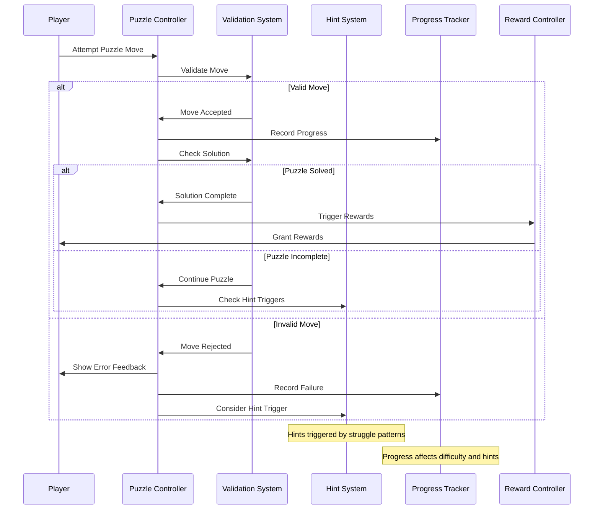
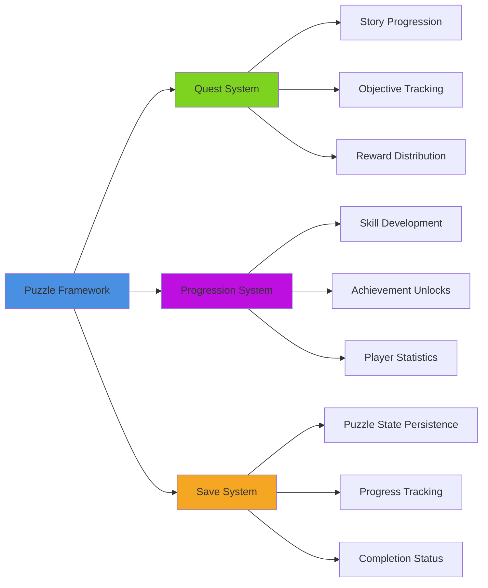

# Puzzle Framework System

## Overview
A flexible puzzle framework supporting various puzzle types, difficulty scaling, hint systems, and progress tracking. Implements logic puzzles, mechanical puzzles, pattern recognition, and sequence challenges while providing visual feedback, accessibility options, and integration with quest and progression systems.

## System Architecture

```mermaid
graph TB
    A[Puzzle Manager] --> B[Puzzle Controller]
    A --> C[Hint System]
    A --> D[Progress Tracker]
    A --> E[Validation System]
    A --> F[Reward Controller]
    
    B --> G[Logic Puzzles]
    B --> H[Mechanical Puzzles]
    B --> I[Pattern Puzzles]
    B --> J[Sequence Puzzles]
    B --> K[Spatial Puzzles]
    
    C --> L[Context Hints]
    C --> M[Progressive Hints]
    C --> N[Visual Indicators]
    C --> O[Audio Cues]
    
    D --> P[Attempt Tracking]
    D --> Q[Time Tracking]
    D --> R[Success Metrics]
    D --> S[Failure Analysis]
    
    E --> T[Solution Checker]
    E --> U[Partial Validation]
    E --> V[Error Detection]
    
    F --> W[Completion Rewards]
    F --> X[Bonus Objectives]
    F --> Y[Achievement Integration]
    
    style A fill:#4a90e2
    style B fill:#7ed321
    style C fill:#f5a623
    style D fill:#bd10e0
    style E fill:#50e3c2
    style F fill:#d0021b
```

## Component Breakdown

### Puzzle Manager Component
- **Purpose**: Central orchestration of puzzle systems and framework management
- **Key Features**: Puzzle type coordination, difficulty scaling, state persistence
- **Performance**: Efficient puzzle state management with minimal memory overhead

### Puzzle Controller Component
- **Purpose**: Handles individual puzzle logic and interaction mechanics
- **Key Features**: Type-specific puzzle behaviors, input processing, solution validation
- **Performance**: Optimized puzzle algorithms with early termination and caching

### Hint System Component
- **Purpose**: Provides progressive assistance to players struggling with puzzles
- **Key Features**: Context-sensitive hints, difficulty adaptation, spoiler prevention
- **Performance**: Smart hint calculation with cached suggestion generation

## Blueprint Patterns

### Puzzle Interaction Flow

### Difficulty Scaling Pattern
- **Adaptive Difficulty**: Puzzle complexity adjusts based on player performance
- **Progressive Complexity**: Later puzzles build on earlier concepts
- **Player Skill Assessment**: System learns player strengths and weaknesses

### Hint Progression Pattern
- **Subtle Guidance**: Initial hints provide gentle nudges without spoilers
- **Progressive Detail**: Subsequent hints become more specific and direct
- **Solution Prevention**: Final hints guide without giving away complete solution

## Performance Optimization

### Algorithm Optimization
- **Solution Caching**: Pre-calculate solutions for commonly encountered states
- **Early Termination**: Stop validation as soon as result is determined
- **Incremental Validation**: Only validate changed portions of puzzle state

### UI Performance
- **Lazy Rendering**: Only render visible puzzle elements and interactions
- **Animation Pooling**: Reuse animation components for similar puzzle effects
- **Event Batching**: Group similar puzzle events for efficient processing

### Memory Management
- **State Compression**: Efficient storage of puzzle states and progress
- **Asset Streaming**: Load puzzle assets on-demand based on proximity
- **History Pruning**: Limit stored puzzle history to relevant data points

## Integration Points

### Gameplay System Integration

### System Integrations
- **UI System**: Context-sensitive puzzle interfaces with accessibility support
- **Audio System**: Puzzle feedback sounds, ambient audio, success/failure audio
- **Visual Effects**: Particle systems, lighting effects, and animation feedback
- **Input System**: Multi-platform input support with gesture recognition

### World Mechanics
- **Environmental Puzzles**: Puzzles integrated with world geometry and physics
- **Narrative Integration**: Puzzles that advance story and reveal lore
- **Character Interaction**: NPCs that provide puzzle context and hints
- **Discovery Mechanics**: Hidden puzzles that reward exploration

## Configuration System

### Puzzle Types Data Asset
- **Logic Puzzles**: Sudoku, logic grids, boolean satisfiability problems
- **Mechanical Puzzles**: Sliding puzzles, rotating mechanisms, assembly challenges
- **Pattern Puzzles**: Color matching, symbol sequences, visual recognition
- **Sequence Puzzles**: Musical sequences, timing challenges, rhythm games
- **Spatial Puzzles**: 3D rotation, pathfinding, geometric arrangement

### Difficulty Parameters Data Asset
- **Complexity Scaling**: Number of elements, solution steps, time pressure
- **Cognitive Load**: Working memory requirements, attention switching
- **Motor Skills**: Precision requirements, timing sensitivity, coordination
- **Knowledge Requirements**: Required background knowledge or learned rules

### Accessibility Options Data Asset
- **Visual Accessibility**: Colorblind support, high contrast modes, text scaling
- **Motor Accessibility**: Alternative input methods, timing adjustments
- **Cognitive Accessibility**: Simplified interfaces, memory aids, clear instructions
- **Audio Accessibility**: Sound visualization, audio descriptions

## Advanced Features

### Procedural Puzzle Generation
- **Template-Based Generation**: Create variations of proven puzzle designs
- **Constraint Satisfaction**: Generate puzzles with guaranteed unique solutions
- **Difficulty Targeting**: Generate puzzles matching specific difficulty criteria
- **Theme Integration**: Puzzles that match current game context and aesthetics

### Advanced Hint System
- **Machine Learning Hints**: AI-driven hint generation based on player behavior
- **Contextual Clues**: Environmental hints integrated with puzzle mechanics
- **Social Hints**: Player-generated hints and community solutions
- **Adaptive Timing**: Hint delivery timing based on individual player needs

### Collaborative Puzzles
- **Multi-Player Cooperation**: Puzzles requiring multiple players working together
- **Asynchronous Collaboration**: Puzzles that players can work on over time
- **Competitive Elements**: Speed solving, accuracy competitions, leaderboards
- **Teaching Mechanics**: Experienced players can guide newcomers

## Puzzle Categories

### Puzzle Type System

```mermaid
graph TD
    A[Puzzle Types] --> B[Logic Puzzles]
    A --> C[Physical Puzzles]
    A --> D[Pattern Puzzles]
    A --> E[Sequence Puzzles]
    A --> F[Hybrid Puzzles]
    
    B --> G[Deduction Games]
    B --> H[Boolean Logic]
    B --> I[Mathematical Puzzles]
    
    C --> J[Mechanical Devices]
    C --> K[Assembly Challenges]
    C --> L[Physics Simulations]
    
    D --> M[Visual Patterns]
    D --> N[Color Matching]
    D --> O[Symbol Recognition]
    
    E --> P[Temporal Sequences]
    E --> Q[Musical Patterns]
    E --> R[Input Combinations]
    
    F --> S[Multi-Modal Puzzles]
    F --> T[Narrative Puzzles]
    F --> U[Environmental Integration]
    
    style A fill:#4a90e2
    style B fill:#7ed321
    style C fill:#bd10e0
    style D fill:#f5a623
    style E fill:#50e3c2
    style F fill:#d0021b
```

### Interaction Methods
- **Direct Manipulation**: Mouse/touch interaction with puzzle elements
- **Symbolic Input**: Keyboard/controller input of symbols or numbers
- **Gesture Recognition**: Motion-based puzzle solving for VR/mobile
- **Voice Commands**: Audio-based puzzle interaction for accessibility

### Feedback Systems
- **Visual Feedback**: Color coding, animation, particle effects for puzzle states
- **Audio Feedback**: Sound effects, musical tones, voice confirmation
- **Haptic Feedback**: Controller vibration for puzzle interactions
- **Progress Indicators**: Visual representation of puzzle completion status

## Implementation Notes

### Blueprint Architecture
- **Modular Puzzle Components**: Flexible framework supporting diverse puzzle types
- **Event-Driven Design**: Reactive puzzle system with efficient state management
- **Data-Driven Configuration**: External puzzle definitions and parameter tuning

### Algorithm Design
- **Efficient Validation**: Fast solution checking with minimal computational overhead
- **State Space Search**: Intelligent exploration of puzzle solution spaces
- **Heuristic Guidance**: Smart hint generation using puzzle-specific heuristics

### Performance Patterns
- **Lazy Evaluation**: Defer expensive calculations until actually needed
- **Result Caching**: Store solutions for repeated puzzle configurations
- **Background Processing**: Pre-compute hints and solutions during idle time

### User Experience
- **Progressive Difficulty**: Smooth learning curve with appropriate challenge progression
- **Clear Feedback**: Immediate, understandable response to player actions
- **Accessibility First**: Universal design principles ensuring broad accessibility
- **Frustration Management**: Systems to prevent and alleviate player frustration

This puzzle framework system provides a comprehensive foundation for engaging puzzle gameplay while supporting diverse puzzle types and ensuring accessibility for all players across all platforms.
