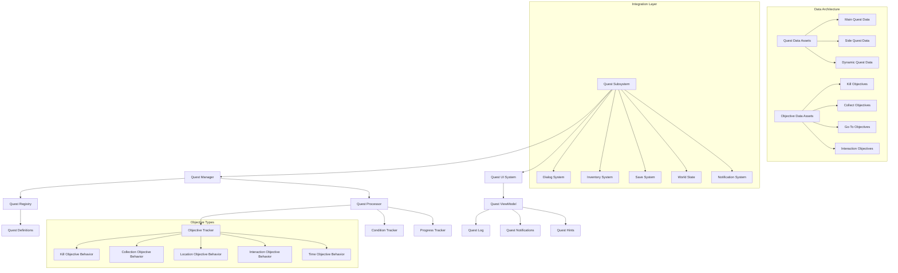

# Quest System

Dynamic quest management with branching objectives, progress tracking, and seamless integration with dialog, inventory, and world systems. Supports complex narrative structures from simple fetch quests to multi-stage epic storylines.

## Architecture Overview



## What & Why

Modern adventure games require sophisticated quest systems that can handle complex, interconnected storylines while providing players with clear guidance and meaningful progression feedback. This system balances narrative flexibility with technical robustness, supporting everything from simple collection tasks to intricate multi-branch epic quests with conditional objectives and dynamic content generation.

## Prerequisites

- **Dialog System** integration for quest initiation and completion
- **World State Management** for persistent quest-related changes
- **Event System** understanding for objective progress tracking
- **UI MVVM Architecture** for responsive quest interface management

## Component Architecture

### Core System Components

**QuestSubsystem** (Game Instance Subsystem)
- Manages global quest state across level transitions and save/load cycles
- Coordinates quest progression with world events and player actions
- Handles quest dependency resolution and unlocking conditions
- Service pattern: Persistent quest state management throughout game lifecycle

**AC_QuestGiver** (Actor Component)
- Handles NPC quest assignment and turn-in functionality
- Manages available quests based on player progression and world state
- Integrates with dialog system for natural quest conversation flow
- Component composition: NPCs can offer multiple quests with different requirements

**QuestManager** (Blueprint Class)
- Processes quest logic, objective evaluation, and progression tracking
- Handles complex quest branching with multiple possible outcomes
- Manages quest rewards and consequences distribution
- Algorithm encapsulation: Complex quest logic centralized and testable

### Data Management Strategy

**Quest Definition Structure**
```
DA_QuestDefinition (Primary Data Asset):
- Quest Metadata: ID, Title, Description, Category, Priority
- Prerequisites: Required quests, level, items, world state conditions
- Objectives: Ordered list with branching and optional objective support
- Rewards: Experience, items, currency, reputation, unlocks
- Failure Conditions: Time limits, conflicting choices, world state changes

Objective Properties:
- Objective Type: Kill, Collect, GoTo, Interact, Escort, Protect
- Target Specification: What/Who/Where with quantities and conditions
- Progress Tracking: Current/Required counts with partial completion support
- Optional Flag: Skip-able objectives that don't prevent quest completion
- Hidden Flag: Objectives revealed through gameplay rather than initially shown
```

**Dynamic Quest Generation**
- Template-based quest creation for procedural content
- Parameter substitution for locations, targets, and rewards
- Difficulty scaling based on player level and equipment
- Narrative coherence validation for generated quest content

## Implementation Methodology

### Phase 1: Foundation Systems

**1. Quest Data Architecture**
- Create quest definition asset: `DA_QuestDefinition`
- Define objective type system with extensible behavior patterns
- Setup quest categorization (Main, Side, Daily, Guild, etc.)
- Create quest validation system for content integrity checking

**2. Quest State Management**
- Build quest registry with efficient lookup and filtering
- Implement quest progression tracking with save/load persistence
- Create objective evaluation system with event-driven updates
- Add quest dependency resolution for unlocking and prerequisites

**3. Quest Giver Integration**
- Setup quest giver component for NPCs with dialog integration
- Implement quest availability filtering based on player state
- Create quest turn-in validation with reward distribution
- Add dynamic quest offering based on world events and player actions

### Phase 2: Objective System Development

**4. Objective Behavior Framework**
- Create objective base class with common tracking functionality
- Implement specific objective types (Kill, Collect, GoTo, Interact, etc.)
- Build objective progress monitoring with real-time updates
- Add objective completion validation with edge case handling

**5. Progress Tracking Integration**
- Connect to game events for automatic objective progress updates
- Implement location-based tracking with area triggers and proximity detection
- Create item tracking integration with inventory system changes
- Build NPC interaction tracking with dialog and combat systems

### Phase 3: UI and Polish

**6. Quest Journal Implementation**
- Create comprehensive quest log with categorization and filtering
- Build quest tracking overlay with waypoint and hint systems  
- Implement quest notification system with priority management
- Add quest sharing functionality for multiplayer environments

## Performance Optimization

### Event-Driven Architecture
- **Objective Monitoring**: Subscribe to relevant game events only when quests are active
- **Progress Caching**: Cache objective progress to avoid redundant calculations
- **Conditional Evaluation**: Lazy evaluation of quest conditions to minimize processing
- **Event Batching**: Group related quest updates to reduce notification spam

### Memory Management
- **Quest Streaming**: Load detailed quest data only when quests become active
- **Objective Pooling**: Reuse objective behavior objects to prevent garbage collection
- **Progress Compression**: Efficient serialization of quest state for save operations
- **Asset References**: Soft references to heavy quest assets (voice, cutscenes, rewards)

### UI Optimization
- **Lazy Loading**: Load quest journal content on-demand based on player navigation
- **Update Batching**: Group quest progress updates for smooth UI animations
- **Icon Streaming**: Dynamic loading of quest and objective icons
- **Text Caching**: Cache localized quest text with intelligent memory management

## Testing & Validation

### Quest Logic Validation
- [ ] All quest paths lead to valid completion or failure states
- [ ] Objective dependencies resolve correctly in all scenarios
- [ ] Quest prerequisite chains work across level transitions
- [ ] Reward distribution functions correctly for all quest types
- [ ] Save/load preserves quest state accurately across game sessions

### Integration Testing Matrix
- [ ] Dialog system quest initiation and completion flows
- [ ] Inventory system integration for collection and item reward quests
- [ ] Combat system integration for kill and protection objectives
- [ ] World state synchronization for persistent quest effects

### Performance Benchmarks
- **Quest Evaluation**: <1ms per frame for active quest processing
- **UI Updates**: <16ms for quest journal and notification updates
- **Save/Load**: <500ms for complete quest state serialization
- **Memory Usage**: <15MB for 100+ active quests with full objective tracking

## AI Acceleration Prompts

**Quest Design**: "Create a complex multi-stage quest with branching objectives that integrates with dialog, combat, and exploration systems"

**Objective Framework**: "Build a flexible objective system that can handle kill, collect, escort, and timed objectives with progress tracking and validation"

**Dynamic Generation**: "Design a procedural quest generation system that creates coherent fetch and delivery quests based on world state and player progression"

**Progress Tracking**: "Implement efficient quest progress monitoring that responds to game events without impacting performance"

**UI Implementation**: "Create comprehensive quest journal interface with filtering, categorization, and waypoint integration using MVVM patterns"

**Integration Architecture**: "Build seamless quest system integration with dialog, inventory, and save systems while maintaining clean component boundaries"

This Quest System demonstrates sophisticated Blueprint architecture that handles complex narrative requirements while maintaining the performance and flexibility needed for professional adventure games with extensive content and replayability.
