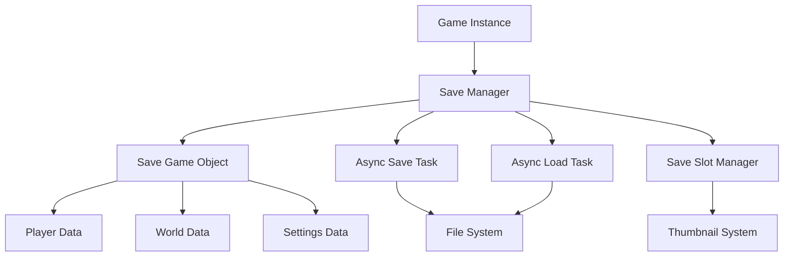

# 💾 Save & Load System - Complete Blueprint Implementation

Build a **production-ready save/load system** that handles complex game state, async operations, and provides a seamless player experience. This system supports everything from player progress to world state persistence.

## 🎯 What You'll Learn

- **JSON-based serialization** for flexible data storage
- **Async save/load operations** to prevent frame drops
- **World state management** including dynamic objects
- **Save slot management** with thumbnails and metadata
- **Error handling and validation** for corrupted saves
- **Performance optimization** for large world states

## 📺 Video Tutorial

🎬 **[UE5 Save Game System - Complete Implementation Tutorial](https://www.youtube.com/watch?v=2ufMSrXf-_A)**
- **Channel**: Smart Poly
- **Duration**: ~42 minutes  
- **Topics**: SaveGame objects, async saving, slot management, error handling

## 📚 Official Documentation & Resources

### **Epic Games Official Documentation:**
- 📖 **[Saving and Loading Your Game](https://dev.epicgames.com/documentation/en-us/unreal-engine/saving-and-loading-your-game-in-unreal-engine)** - Complete save/load implementation guide
- 📖 **[Blueprint API - SaveGame](https://dev.epicgames.com/documentation/en-us/unreal-engine/BlueprintAPI?application_version=5.6)** - Blueprint SaveGame functions
- 📖 **[Gameplay Tutorials](https://dev.epicgames.com/documentation/en-us/unreal-engine/gameplay-tutorials-for-unreal-engine)** - System implementation examples

## 🏗️ System Architecture



## 🧩 Core Components

### 1. Save Game Object
The main data container that holds all game state information.

```blueprint
// SaveGameData (Blueprint Class inheriting from SaveGame)

Variables:
- PlayerPosition: Vector
- PlayerRotation: Rotator
- PlayerLevel: Integer
- PlayerExperience: Float
- PlayerInventory: Array of Item Structures
- WorldObjects: Map<String, Object Data>
- QuestProgress: Map<String, Quest Data>
- GameSettings: Structure
- SaveTimestamp: DateTime
- SaveVersion: String
- PlayTime: Float
```

### 2. Save Manager Subsystem
Centralized system for handling all save/load operations.

```blueprint
// SaveManagerSubsystem (Blueprint Subsystem)

Functions:
- SaveGameAsync(SlotName: String)
- LoadGameAsync(SlotName: String) 
- DeleteSave(SlotName: String)
- GetSaveSlots(): Array<Save Slot Info>
- ValidateSave(SlotName: String): Boolean
- CreateThumbnail(SlotName: String)
```

## 📝 Implementation Guide

### Step 1: Create Save Game Object

1. **Create New Blueprint Class**:
   - Parent Class: `Save Game`
   - Name: `BP_SaveGameData`

2. **Add Core Variables**:

```blueprint
// Player Data
PlayerPosition: Vector
PlayerRotation: Rotator  
PlayerHealth: Float
PlayerMana: Float
PlayerLevel: Integer
PlayerExperience: Float
PlayerSkillPoints: Integer

// Inventory Data
PlayerInventory: Array<Struct_ItemData>
PlayerEquipment: Map<String, Struct_ItemData>
PlayerCurrency: Integer

// World Data  
WorldSeed: Integer
WorldObjects: Map<String, Struct_WorldObjectData>
CompletedQuests: Array<String>
ActiveQuests: Array<Struct_QuestData>
DiscoveredLocations: Array<String>

// Meta Data
SaveTimestamp: DateTime
SaveVersion: String (Default: "1.0")
PlayTimeSeconds: Float
SaveSlotName: String
ThumbnailTexture: Texture2D
```

3. **Create Helper Structures**:

```blueprint
// Struct_ItemData
ItemID: String
ItemName: String  
Quantity: Integer
Durability: Float
Enchantments: Array<String>

// Struct_WorldObjectData
ObjectID: String
Position: Vector
Rotation: Rotator
IsDestroyed: Boolean
CustomData: String

// Struct_QuestData
QuestID: String
QuestState: Enum_QuestState
ObjectiveProgress: Array<Integer>
QuestVariables: Map<String, String>
```

### Step 2: Create Save Manager Subsystem

1. **Create Blueprint Subsystem**:
   - Parent Class: `Game Instance Subsystem`
   - Name: `BP_SaveManagerSubsystem`

2. **Add Core Functions**:

#### Async Save Function
```blueprint
// Function: SaveGameAsync
Input: SlotName (String), OnComplete (Delegate)

// Create save game object
SaveData = Create Object (BP_SaveGameData)

// Gather player data
PlayerPawn = Get Player Pawn
SaveData.PlayerPosition = PlayerPawn.GetActorLocation()
SaveData.PlayerRotation = PlayerPawn.GetActorRotation()

// Get player component data
PlayerComponent = PlayerPawn.GetPlayerComponent()
SaveData.PlayerHealth = PlayerComponent.GetHealth()
SaveData.PlayerLevel = PlayerComponent.GetLevel()
SaveData.PlayerInventory = PlayerComponent.GetInventory()

// Gather world data
GameMode = Get Game Mode
SaveData.WorldObjects = GameMode.GetWorldObjectData()
SaveData.CompletedQuests = GameMode.GetCompletedQuests()

// Add metadata
SaveData.SaveTimestamp = Now()
SaveData.PlayTimeSeconds = GameMode.GetPlayTime()
SaveData.SaveSlotName = SlotName

// Save async
Async Save Game to Slot(SaveData, SlotName) -> OnComplete
```

#### Async Load Function
```blueprint
// Function: LoadGameAsync  
Input: SlotName (String), OnComplete (Delegate)

// Validate save exists
If NOT Does Save Game Exist(SlotName):
    OnComplete.Execute(False, "Save file not found")
    Return

// Load async
Async Load Game from Slot(SlotName) -> 
    On Success:
        SaveData = Cast to BP_SaveGameData(Loaded Game)
        
        // Validate save version
        If SaveData.SaveVersion != CurrentVersion:
            MigrateSaveData(SaveData)
        
        // Apply player data
        PlayerPawn = Get Player Pawn
        PlayerPawn.SetActorLocation(SaveData.PlayerPosition)
        PlayerPawn.SetActorRotation(SaveData.PlayerRotation)
        
        PlayerComponent = PlayerPawn.GetPlayerComponent()
        PlayerComponent.SetHealth(SaveData.PlayerHealth)
        PlayerComponent.SetLevel(SaveData.PlayerLevel)
        PlayerComponent.SetInventory(SaveData.PlayerInventory)
        
        // Apply world data
        GameMode = Get Game Mode
        GameMode.LoadWorldObjects(SaveData.WorldObjects)
        GameMode.LoadQuestProgress(SaveData.CompletedQuests)
        
        OnComplete.Execute(True, "Load successful")
        
    On Failure:
        OnComplete.Execute(False, "Failed to load save")
```

### Step 3: Save Slot Management

```blueprint
// Function: GetSaveSlots
Returns: Array<Struct_SaveSlotInfo>

SaveSlots = Empty Array

// Find all save files (Platform specific)
For Each Save File in Game Directory:
    If File Extension == ".sav":
        SlotInfo = Create Struct_SaveSlotInfo
        SlotInfo.SlotName = File Name
        SlotInfo.SaveDate = File Date
        
        // Load save data for preview
        SaveData = Load Game from Slot(SlotInfo.SlotName)
        SlotInfo.PlayerLevel = SaveData.PlayerLevel
        SlotInfo.PlayTime = SaveData.PlayTimeSeconds
        SlotInfo.ThumbnailTexture = SaveData.ThumbnailTexture
        
        SaveSlots.Add(SlotInfo)

Return SaveSlots
```

### Step 4: Screenshot System

```blueprint
// Function: CreateSaveThumbnail
Input: SlotName (String)

// Capture screenshot
SceneCapture = Create Scene Capture Component
SceneCapture.CaptureSource = Final Color (LDR) in RGB
SceneCapture.TextureTarget = Create Render Target 2D (256x256)

// Position camera
PlayerPawn = Get Player Pawn
CameraLocation = PlayerPawn.GetActorLocation() + Vector(0,0,200)
SceneCapture.SetWorldLocation(CameraLocation)
SceneCapture.SetWorldRotation(Look At Player)

// Capture and save
SceneCapture.CaptureScene()
ThumbnailTexture = Convert Render Target to Texture2D
SaveThumbnailToSlot(ThumbnailTexture, SlotName)
```

## 🎮 Usage Examples

### Quick Save/Load
```blueprint
// Quick Save (F5 key)
On Input Quick Save:
    SaveManager = Get Save Manager Subsystem
    SaveManager.SaveGameAsync("QuickSave") -> 
        On Complete: Show HUD Message("Game Saved")

// Quick Load (F9 key)  
On Input Quick Load:
    SaveManager = Get Save Manager Subsystem
    SaveManager.LoadGameAsync("QuickSave") ->
        On Complete: Show HUD Message("Game Loaded")
```

### Save Menu Integration
```blueprint
// Save Menu Widget
On Save Button Clicked:
    SlotName = Get Selected Save Slot()
    
    // Confirm overwrite if exists
    If Save Exists(SlotName):
        Show Confirmation Dialog("Overwrite save?") ->
            On Confirm: PerformSave(SlotName)
    Else:
        PerformSave(SlotName)

Function PerformSave(SlotName):
    Show Loading Widget
    SaveManager.SaveGameAsync(SlotName) ->
        On Complete:
            Hide Loading Widget
            Refresh Save List
            Show Success Message
```

## 🚀 Advanced Features

### 1. Auto-Save System
```blueprint
// Auto-save on important events
On Level Complete:
    SaveManager.SaveGameAsync("AutoSave_" + LevelName)

On Achievement Unlocked:  
    SaveManager.SaveGameAsync("AutoSave_Achievement")

// Periodic auto-save
Every 5 Minutes:
    If Player Is Playing:
        SaveManager.SaveGameAsync("AutoSave_Periodic")
```

### 2. Cloud Save Integration
```blueprint
// Upload to cloud after local save
On Save Complete:
    If Platform Supports Cloud Saves:
        CloudService = Get Cloud Save Service
        CloudService.UploadSave(SlotName, SaveData)
```

### 3. Save Data Encryption
```blueprint
// Encrypt sensitive data before save
Function EncryptSaveData(SaveData):
    EncryptedData = AES Encrypt(SaveData, PlayerUniqueID)
    Return EncryptedData

Function DecryptSaveData(EncryptedData):  
    SaveData = AES Decrypt(EncryptedData, PlayerUniqueID)
    Return SaveData
```

## 🔧 Performance Optimization

### 1. Streaming Save/Load
```blueprint
// Large world streaming
Function SaveWorldDataStreaming():
    For Each World Streaming Level:
        If Level Is Loaded:
            LevelData = Gather Level Data(Level)
            Save Level Data Async(Level.Name, LevelData)
```

### 2. Delta Compression
```blueprint
// Only save changed data
Function CreateDeltaSave(PreviousSave, CurrentSave):
    DeltaData = Compare Save Data(PreviousSave, CurrentSave)
    Return Compressed Delta(DeltaData)
```

### 3. Background Saving
```blueprint
// Save on separate thread
Function BackgroundSave(SaveData, SlotName):
    SaveTask = Create Async Task(SaveGameData)
    SaveTask.Execute(SaveData, SlotName)
    
    On Task Complete:
        Show Save Complete Notification
```

## 🧪 Testing & Validation

### Save System Tests
```blueprint
// Test save/load consistency
Test Function ValidateSaveLoad():
    // Create test data
    TestData = Create Random Game State
    
    // Save and load
    SaveGameData(TestData, "TestSlot")
    LoadedData = LoadGameData("TestSlot")
    
    // Validate
    Assert(TestData Equals LoadedData)
```

## 🎯 Production Considerations

### Error Handling
- **Corrupted save detection** and recovery
- **Disk space validation** before saving
- **Platform-specific limitations** handling
- **Network connectivity** for cloud saves

### User Experience
- **Progress indicators** for long operations
- **Multiple save slots** with clear organization
- **Save preview** with screenshots and metadata
- **Auto-save notifications** that don't interrupt gameplay

### Security
- **Save tampering prevention** 
- **Achievement validation**
- **Anti-cheat integration**

This save/load system provides a solid foundation for any adventure game, handling everything from simple progress saves to complex world state persistence. The async operations ensure smooth gameplay while comprehensive error handling provides a reliable player experience.

<style>
.video-container {
  position: relative;
  padding-bottom: 56.25%;
  height: 0;
  overflow: hidden;
  max-width: 100%;
  margin: 2rem 0;
}

.video-container iframe {
  position: absolute;
  top: 0;
  left: 0;
  width: 100%;
  height: 100%;
  border-radius: 10px;
}
</style>
