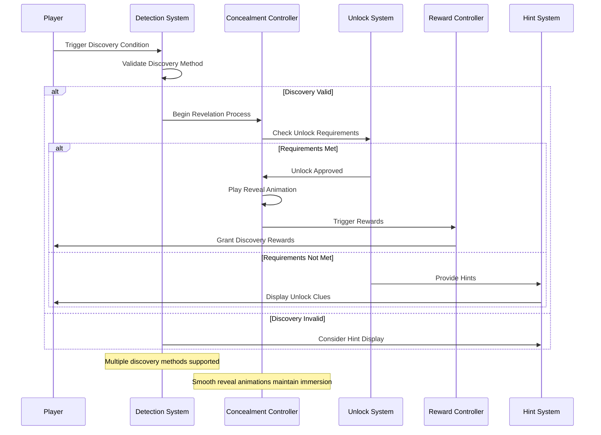
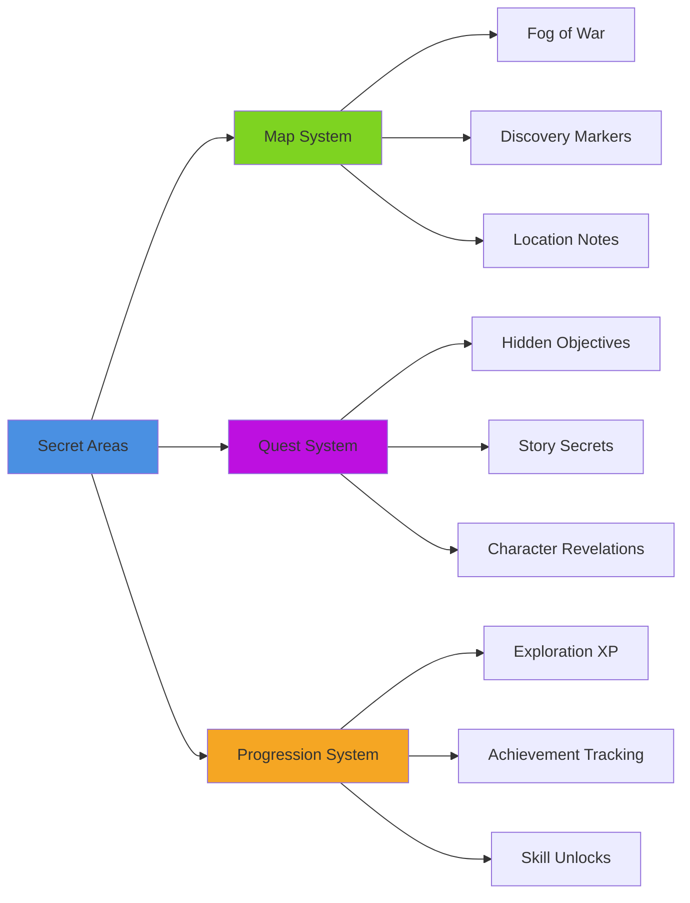

# Secret Areas System

## Overview
A comprehensive secret area discovery system providing hidden locations, concealed passages, and reward-based exploration mechanics. Implements detection systems, unlocking mechanisms, progressive revelation, and integration with exploration rewards while maintaining the mystery and excitement of discovery.

## System Architecture

```mermaid
graph TB
    A[Secret Manager] --> B[Detection System]
    A --> C[Concealment Controller]
    A --> D[Unlock System]
    A --> E[Reward Controller]
    A --> F[Hint System]
    
    B --> G[Proximity Detection]
    B --> H[Interaction Detection]
    B --> I[Condition Detection]
    B --> J[Sequence Detection]
    
    C --> K[Visual Concealment]
    C --> L[Physical Barriers]
    C --> M[Illusion Systems]
    C --> N[Camouflage Effects]
    
    D --> O[Key Requirements]
    D --> P[Puzzle Solutions]
    D --> Q[Sequence Actions]
    D --> R[Conditional Unlocks]
    
    E --> S[Treasure Rewards]
    E --> T[Experience Rewards]
    E --> U[Story Revelations]
    E --> V[Achievement Unlocks]
    
    F --> W[Environmental Clues]
    F --> X[Audio Hints]
    F --> Y[Visual Anomalies]
    
    style A fill:#4a90e2
    style B fill:#7ed321
    style C fill:#f5a623
    style D fill:#bd10e0
    style E fill:#50e3c2
    style F fill:#d0021b
```

## Component Breakdown

### Secret Manager Component
- **Purpose**: Central orchestration of all secret area functionality and discovery tracking
- **Key Features**: Secret area registration, discovery state management, reward coordination
- **Performance**: Efficient spatial queries with smart activation based on player proximity

### Detection System Component
- **Purpose**: Handles various methods of secret area discovery and activation
- **Key Features**: Multi-modal detection, condition checking, sequence recognition
- **Performance**: Optimized detection algorithms with minimal performance overhead

### Concealment Controller Component
- **Purpose**: Manages visual and physical hiding mechanisms for secret areas
- **Key Features**: Dynamic concealment, illusion effects, reveal animations
- **Performance**: LOD-based concealment with distance culling

## Blueprint Patterns

### Secret Discovery Flow

### Progressive Revelation Pattern
- **Staged Discovery**: Secrets revealed in multiple phases for complex areas
- **Dependency Chains**: Some secrets unlock others in logical sequences
- **Context Sensitivity**: Discovery methods that fit the environment and story

### Hint Delivery Pattern
- **Subtle Integration**: Environmental clues that don't break immersion
- **Escalating Obviousness**: Hints become more direct if player struggles
- **Player Agency**: Players can choose to ignore or seek additional hints

## Performance Optimization

### Detection Optimization
- **Spatial Partitioning**: Efficient proximity detection using spatial data structures
- **Condition Caching**: Cache expensive condition evaluations
- **Event-Driven Updates**: Only check conditions when relevant events occur

### Concealment Optimization
- **LOD Concealment**: Reduce concealment complexity for distant secret areas
- **Culling System**: Only process concealment for player-visible areas  
- **Animation Pooling**: Reuse reveal animations and effects efficiently

### Memory Management
- **Asset Streaming**: Load secret area content on-demand
- **State Compression**: Efficient storage of discovery states
- **History Pruning**: Clean up old discovery data that's no longer relevant

## Integration Points

### Exploration System Integration

### System Integrations
- **Inventory System**: Special keys, tools, and items required for secret access
- **Character Progression**: Skills and abilities that enable secret discovery
- **Audio System**: Ambient audio cues and discovery sound effects
- **Save System**: Persistent secret discovery states across game sessions

### Gameplay Mechanics
- **Puzzle Integration**: Secrets that require puzzle solving to access
- **Combat Rewards**: Secrets accessible only after defeating challenging enemies
- **Social Discovery**: Secrets revealed through NPC interactions and information gathering
- **Time-Based Secrets**: Areas only accessible at specific times or conditions

## Configuration System

### Secret Types Data Asset
- **Hidden Passages**: Concealed doorways and tunnels behind false walls
- **Treasure Chambers**: Reward rooms with valuable items and resources
- **Story Vaults**: Areas containing lore, documents, and narrative content
- **Skill Challenges**: Areas requiring specific abilities or equipment to access
- **Easter Eggs**: Developer secrets and references for dedicated explorers

### Discovery Methods Data Asset
- **Proximity Discovery**: Secrets revealed by approaching specific locations
- **Interaction Discovery**: Secrets found by interacting with specific objects
- **Sequence Discovery**: Secrets unlocked by performing specific action sequences
- **Conditional Discovery**: Secrets requiring specific game states or items
- **Knowledge Discovery**: Secrets unlocked by possessing specific information

### Concealment Techniques Data Asset
- **Visual Camouflage**: Textures and colors that blend with surroundings
- **Architectural Hiding**: False walls, hidden panels, disguised entrances
- **Magical Concealment**: Illusion spells and magical barriers
- **Environmental Integration**: Secrets hidden within natural features
- **Mechanical Concealment**: Moving parts and rotating mechanisms

## Advanced Features

### Dynamic Secret Generation
- **Procedural Placement**: Algorithmically placed secrets based on level design
- **Context-Sensitive Secrets**: Secrets that adapt to player progress and interests
- **Community Secrets**: Player-created secret areas with validation systems
- **Seasonal Secrets**: Time-limited secret areas that appear during special events

### Collaborative Discovery
- **Team Secrets**: Areas requiring multiple players working together
- **Information Sharing**: Secrets revealed through community knowledge sharing
- **Guild Discoveries**: Large-scale secrets requiring organized group efforts
- **Competitive Discovery**: Race-to-discover mechanics for limited-time secrets

### Meta-Game Integration
- **Achievement Networks**: Secrets that unlock when specific achievement combinations are met
- **Cross-Game Secrets**: Secrets unlocked by progress in other games (same universe)
- **Real-World Integration**: Secrets triggered by real-world events or dates
- **Social Media Secrets**: Discoveries that integrate with external social platforms

## Secret Categories

### Secret Area Types

```mermaid
graph TD
    A[Secret Types] --> B[Treasure Secrets]
    A --> C[Story Secrets]
    A --> D[Mechanical Secrets]
    A --> E[Challenge Secrets]
    A --> F[Easter Egg Secrets]
    
    B --> G[Treasure Hoards]
    B --> H[Rare Item Caches]
    B --> I[Currency Vaults]
    
    C --> J[Lore Libraries]
    C --> K[Character Histories]
    C --> L[Plot Revelations]
    
    D --> M[Hidden Passages]
    D --> N[Secret Mechanisms]
    D --> O[Concealed Doors]
    
    E --> P[Skill Tests]
    E --> Q[Combat Challenges]
    E --> R[Puzzle Chambers]
    
    F --> S[Developer Messages]
    F --> T[Pop Culture References]
    F --> U[Hidden Mini-Games]
    
    style A fill:#4a90e2
    style B fill:#7ed321
    style C fill:#bd10e0
    style D fill:#f5a623
    style E fill:#50e3c2
    style F fill:#d0021b
```

### Discovery Difficulty Levels
- **Obvious Secrets**: Easily spotted with minimal exploration effort
- **Hidden Secrets**: Require careful observation and environmental awareness
- **Challenging Secrets**: Need specific skills, items, or knowledge to discover
- **Master Secrets**: Extremely well-hidden requiring dedicated exploration
- **Legendary Secrets**: Community-level challenges requiring collaborative effort

### Reward Categories
- **Material Rewards**: Currency, items, equipment, and consumables
- **Character Rewards**: Experience points, skill unlocks, stat bonuses
- **Knowledge Rewards**: Lore, story information, world-building content
- **Access Rewards**: New areas, shortcuts, or gameplay options unlocked
- **Social Rewards**: Achievements, titles, and recognition systems

## Implementation Notes

### Blueprint Architecture
- **Modular Secret Components**: Flexible framework for different secret types
- **Event-Driven Discovery**: Efficient reaction system for discovery events
- **Data-Driven Configuration**: External secret definitions for easy level design

### Discovery Design Principles
- **Fair but Challenging**: Secrets are hidden but discoverable through logical means
- **Multiple Solutions**: Different approaches to finding the same secrets
- **Respect Player Time**: Discovery effort matches reward value
- **Progressive Complexity**: Later secrets build on earlier discovery skills

### Performance Patterns
- **Smart Activation**: Only process secrets near player location
- **Efficient State Tracking**: Minimal memory usage for discovery states
- **Async Processing**: Background processing for complex secret conditions

### User Experience
- **Satisfying Discovery**: Moment of revelation provides genuine excitement
- **Clear Feedback**: Players understand when they've found something special
- **Respectful Hints**: Guidance available without spoiling the discovery experience
- **Accessibility Support**: Multiple discovery methods accommodate different player abilities

This secret areas system provides a comprehensive framework for hidden content discovery that rewards thorough exploration while maintaining the excitement and mystery that makes secrets compelling.
