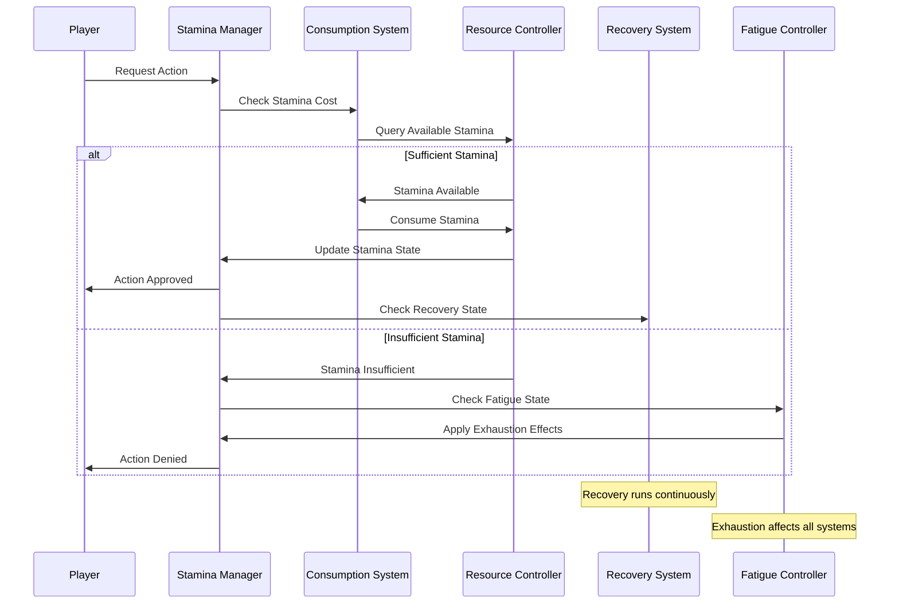
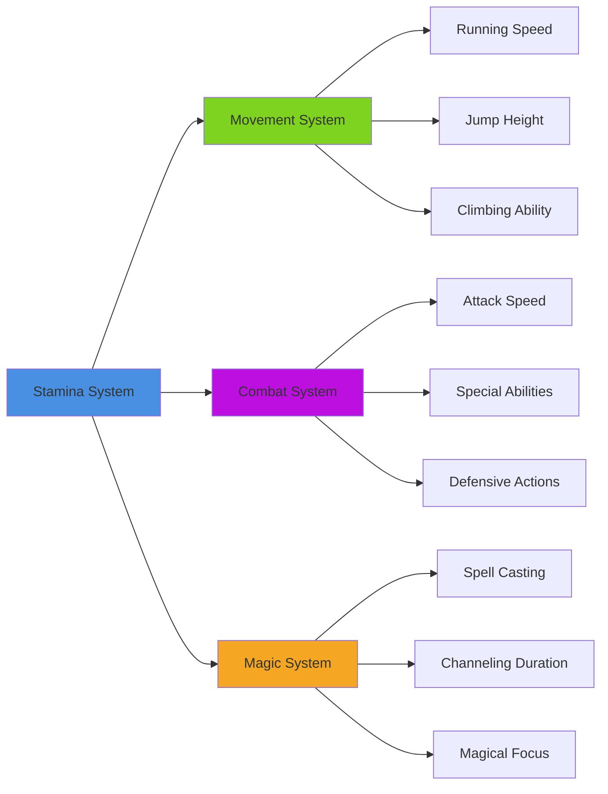

# Stamina System

## Overview
A dynamic stamina management system providing resource-based gameplay mechanics, fatigue systems, and recovery management. Implements stamina consumption for actions, regeneration mechanics, exhaustion penalties, and integration with combat, exploration, and ability systems while maintaining engaging resource management gameplay.

## System Architecture

```mermaid
graph TB
    A[Stamina Manager] --> B[Resource Controller]
    A --> C[Consumption System]
    A --> D[Recovery System]
    A --> E[Fatigue Controller]
    A --> F[Buff Integration]
    
    B --> G[Current Stamina]
    B --> H[Maximum Stamina]
    B --> I[Stamina Segments]
    B --> J[Resource Pooling]
    
    C --> K[Action Costs]
    C --> L[Environmental Drain]
    C --> M[Combat Consumption]
    C --> N[Ability Usage]
    
    D --> O[Passive Recovery]
    D --> P[Active Recovery]
    D --> Q[Rest Systems]
    D --> R[Recovery Items]
    
    E --> S[Exhaustion States]
    E --> T[Penalty Application]
    E --> U[Recovery Blocking]
    
    F --> V[Stamina Buffs]
    F --> W[Recovery Boosts]
    F --> X[Efficiency Modifiers]
    
    style A fill:#4a90e2
    style B fill:#7ed321
    style C fill:#f5a623
    style D fill:#bd10e0
    style E fill:#50e3c2
    style F fill:#d0021b
```

## Component Breakdown

### Stamina Manager Component
- **Purpose**: Central orchestration of stamina systems and resource management
- **Key Features**: Resource tracking, system coordination, state management
- **Performance**: Efficient stamina calculations with minimal processing overhead

### Resource Controller Component
- **Purpose**: Manages stamina pools, maximum values, and resource distribution
- **Key Features**: Multi-pool systems, capacity management, resource allocation
- **Performance**: Optimized resource queries with cached calculations

### Consumption System Component
- **Purpose**: Handles stamina depletion from various actions and activities
- **Key Features**: Action-based consumption, environmental factors, scaling costs
- **Performance**: Fast consumption calculations with predictive modeling

## Blueprint Patterns

### Stamina Usage Flow

### Recovery Pattern
- **Passive Recovery**: Automatic stamina regeneration during normal activity
- **Active Recovery**: Enhanced recovery during rest or specific activities
- **Segmented Recovery**: Different recovery rates for different stamina segments

### Exhaustion Pattern
- **Progressive Penalties**: Increasing penalties as stamina becomes depleted
- **Recovery Blocking**: Exhaustion can prevent or slow stamina recovery
- **System Integration**: Exhaustion affects combat, movement, and abilities

## Performance Optimization

### Calculation Optimization
- **Update Frequency Scaling**: Adjust update rate based on stamina change rate
- **Batch Processing**: Process multiple stamina changes efficiently
- **Prediction Systems**: Predict stamina needs for smooth gameplay

### State Management
- **Minimal State Updates**: Only update when stamina values change significantly
- **Cached Calculations**: Store frequently used stamina calculations
- **Event-Driven Updates**: Update dependent systems only when necessary

### UI Integration
- **Smooth Interpolation**: Smooth visual stamina bar updates
- **Prediction Display**: Show predicted stamina costs before actions
- **Efficient Rendering**: Minimize UI update frequency for stamina displays

## Integration Points

### Gameplay System Integration

### System Integrations
- **Health System**: Low stamina affects health recovery and vulnerability
- **Equipment System**: Gear affects stamina consumption and recovery rates
- **Weather System**: Environmental conditions impact stamina usage
- **Time System**: Circadian rhythms affect stamina recovery patterns

### Environmental Factors
- **Terrain Impact**: Different terrains affect stamina consumption rates
- **Temperature Effects**: Hot and cold environments increase stamina drain
- **Altitude Simulation**: High altitude reduces stamina efficiency
- **Load Management**: Carrying capacity affects stamina consumption

## Configuration System

### Consumption Rules Data Asset
- **Action Costs**: Stamina costs for different actions and abilities
- **Environmental Modifiers**: How environment affects stamina usage
- **Equipment Effects**: How gear changes stamina consumption
- **Character Modifiers**: Personal traits affecting stamina efficiency

### Recovery Parameters Data Asset
- **Base Recovery Rate**: Standard stamina regeneration speed
- **Recovery Multipliers**: Factors that increase or decrease recovery
- **Rest Benefits**: Enhanced recovery during sleep or meditation
- **Item Effects**: Consumables and equipment affecting recovery

### Exhaustion Rules Data Asset
- **Fatigue Thresholds**: Stamina levels that trigger exhaustion states
- **Penalty Scaling**: How exhaustion affects character performance
- **Recovery Requirements**: Conditions needed to recover from exhaustion
- **Duration Settings**: How long exhaustion effects persist

## Advanced Features

### Dynamic Stamina System
- **Adaptive Costs**: Stamina costs adapt to player skill and equipment
- **Contextual Consumption**: Different activities consume stamina at variable rates
- **Learning Effects**: Character becomes more efficient with practice
- **Emotional Impact**: Stress and excitement affect stamina management

### Multi-Pool Systems
- **Segmented Stamina**: Different stamina pools for different activity types
- **Priority Systems**: Critical actions can override normal stamina limits
- **Resource Trading**: Convert between different types of stamina or energy
- **Emergency Reserves**: Last-resort stamina for critical situations

### Social Features
- **Team Buffs**: Group activities that enhance stamina efficiency
- **Sharing Systems**: Players can share stamina or recovery boosts
- **Competitive Elements**: Stamina management challenges and competitions
- **Teaching Mechanics**: Experienced players help newcomers with stamina strategies

## Stamina Categories

### Stamina Pool Types

```mermaid
graph TD
    A[Stamina Types] --> B[Physical Stamina]
    A --> C[Mental Stamina]
    A --> D[Magical Stamina]
    A --> E[Environmental Stamina]
    A --> F[Social Stamina]
    
    B --> G[Movement Actions]
    B --> H[Combat Actions]
    B --> I[Physical Labor]
    
    C --> J[Concentration Tasks]
    C --> K[Problem Solving]
    C --> L[Skill Usage]
    
    D --> M[Spell Casting]
    D --> N[Enchanting]
    D --> O[Magical Channeling]
    
    E --> P[Weather Resistance]
    E --> Q[Terrain Adaptation]
    E --> R[Environmental Hazards]
    
    F --> S[Social Interactions]
    F --> T[Leadership Actions]
    F --> U[Performance Activities]
    
    style A fill:#4a90e2
    style B fill:#7ed321
    style C fill:#bd10e0
    style D fill:#f5a623
    style E fill:#50e3c2
    style F fill:#d0021b
```

### Recovery Methods
- **Passive Recovery**: Automatic regeneration during low-activity periods
- **Rest Recovery**: Enhanced regeneration during sleep or meditation
- **Item Recovery**: Consumables that restore stamina immediately or over time
- **Activity Recovery**: Specific activities that boost recovery rates

### Consumption Activities
- **Movement**: Running, jumping, climbing, swimming consume stamina
- **Combat**: Attacks, blocks, dodges, and special abilities drain stamina
- **Magic**: Spell casting and magical abilities require stamina
- **Skills**: Complex skill usage consumes mental or physical stamina

## Implementation Notes

### Blueprint Architecture
- **Modular Stamina Components**: Flexible framework supporting different stamina types
- **Event-Driven Updates**: Efficient response system for stamina changes
- **Data-Driven Configuration**: External stamina rules for easy balance adjustments

### Balance Considerations
- **Risk vs Reward**: High stamina costs balanced by powerful effects
- **Player Agency**: Multiple strategies for stamina management
- **Learning Curve**: Progressive complexity that teaches stamina management
- **Accessibility Options**: Settings for players who struggle with resource management

### Performance Patterns
- **Efficient Updates**: Minimize processing for stamina calculations
- **Smart Caching**: Cache frequently used stamina values and calculations
- **Predictive Systems**: Anticipate stamina needs for smooth gameplay

### User Experience
- **Clear Feedback**: Visual and audio cues for stamina states
- **Intuitive Management**: Stamina system easy to understand and manage
- **Meaningful Choices**: Stamina creates interesting tactical decisions
- **Customization Options**: Player control over stamina display and behavior

This stamina system provides a comprehensive resource management foundation that adds strategic depth to gameplay while remaining accessible and engaging for players of all skill levels across all platforms.
