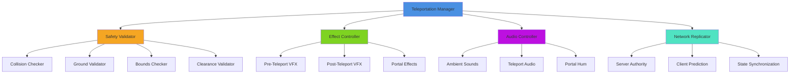
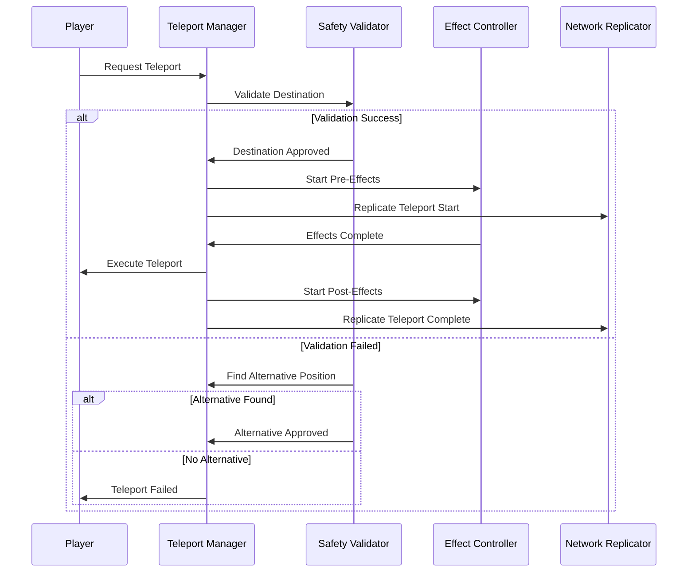
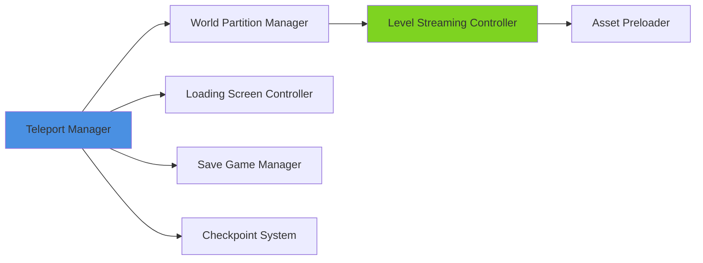
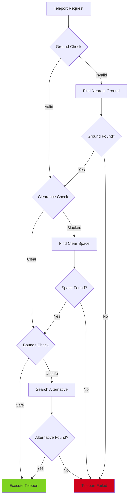

# Teleportation System

## Overview
A comprehensive teleportation system supporting instant travel, portal mechanics, and seamless world transitions. Implements safety checks, visual effects, and network synchronization for multiplayer environments while maintaining immersion through smooth transitions and audio-visual feedback.

## System Architecture

## Component Breakdown

### Teleportation Manager Component
- **Purpose**: Orchestrates all teleportation operations and state management
- **Key Features**: Multi-type teleport support, queue management, cooldown handling
- **Performance**: Pooled effect instances with smart preloading

### Safety Validator Component
- **Purpose**: Ensures safe teleportation destinations with comprehensive checks
- **Key Features**: Multi-layer validation, alternative position finding, obstacle avoidance
- **Performance**: Asynchronous validation with early exit optimization

### Effect Controller Component
- **Purpose**: Manages visual and particle effects for teleportation events
- **Key Features**: Customizable effect libraries, timing synchronization, quality scaling
- **Performance**: LOD-based effect detail with distance culling

## Blueprint Patterns

### Teleportation Flow Pattern

### Portal System Pattern
- **Bidirectional Linking**: Two-way portal connections with synchronized states
- **Dynamic Creation**: Runtime portal spawning with automatic cleanup
- **Visual Feedback**: Real-time destination preview through portal surface

### Safety Check Pattern
- **Layered Validation**: Multiple validation passes with increasing complexity
- **Fallback Positioning**: Smart alternative position finding algorithms
- **Predictive Checking**: Pre-validate commonly used destinations

## Performance Optimization

### Validation Optimization
- **Spatial Partitioning**: Grid-based quick rejection for invalid areas
- **Cached Results**: Store validation results for frequently used locations
- **Async Processing**: Non-blocking validation with callback completion

### Effect Management
- **Object Pooling**: Reuse particle systems and audio components
- **LOD Scaling**: Distance-based effect quality reduction
- **Batch Processing**: Group multiple teleport effects for efficiency

### Network Optimization
- **Client Prediction**: Smooth teleportation with server reconciliation
- **Delta Compression**: Minimize teleport state data transmission
- **Priority Queuing**: Critical teleports processed before cosmetic updates

## Integration Points

### Level Streaming Integration

### Gameplay Systems
- **Quest Integration**: Story-driven teleportation unlocks and restrictions
- **Inventory System**: Teleport stones, scrolls, and magical items
- **Combat System**: Emergency teleportation and tactical repositioning
- **Exploration System**: Discovery-based fast travel unlocking

### World Systems
- **Weather Integration**: Weather effects don't reset after teleportation
- **Time System**: Maintain time consistency across teleportations
- **NPC Systems**: Update NPC awareness of player position changes

## Configuration System

### Teleport Types Data Asset
- **Instant Teleport**: Immediate position changes with effects
- **Portal System**: Persistent gateways between locations
- **Fast Travel**: Map-based world teleportation
- **Magic Teleport**: Spell-based teleportation with mana costs

### Safety Parameters Data Asset
- **Ground Clearance**: Minimum space required above destination
- **Collision Padding**: Safety margin around player bounds
- **Slope Tolerance**: Maximum ground angle for valid destinations
- **Water Detection**: Shallow water vs deep water teleportation rules

### Visual Effects Library
- **Pre-Teleport**: Charging, wind-up, and preparation effects
- **Transit Effects**: Particle trails, distortion, and transition visuals
- **Post-Teleport**: Arrival impact, dissipation, and stabilization effects
- **Portal Effects**: Gateway visuals, surface shimmers, and ambient particles

## Advanced Features

### World Partition Integration
- **Seamless Transitions**: Load target areas before teleportation
- **Memory Management**: Unload previous areas after safe transition
- **Streaming Coordination**: Synchronize with UE5.6 World Partition system

### Multi-Level Teleportation
- **Cross-Level Travel**: Teleport between different map files
- **Persistent Data**: Maintain player state across level transitions
- **Loading Optimization**: Minimize loading times with asset streaming

### Networked Teleportation
- **Authority Validation**: Server-side destination approval
- **Lag Compensation**: Smooth teleportation despite network delays
- **Spectator Handling**: Proper camera updates for observing players

## Safety Systems

### Collision Prevention

### Emergency Protocols
- **Stuck Detection**: Automatic teleport when player becomes trapped
- **Failsafe Positions**: Pre-defined safe locations for emergency use
- **Recovery System**: Return to last known safe position if needed

### Validation Layers
- **Physics Simulation**: Test destination with temporary physics proxy
- **Raycast Verification**: Multi-directional collision detection
- **Volume Checking**: Ensure adequate space for player movement

## Implementation Notes

### Blueprint Excellence
- **Component-Based**: Modular design for maximum flexibility
- **Event-Driven**: Minimal tick dependencies with reactive architecture  
- **Data-Driven**: Configuration through Data Assets for easy customization

### Performance Considerations
- **Async Operations**: Non-blocking validation and effect processing
- **Memory Pooling**: Reuse expensive objects like particle systems
- **Spatial Optimization**: Efficient spatial queries for destination validation

### User Experience
- **Clear Feedback**: Visual and audio cues for teleportation states
- **Smooth Transitions**: Minimize jarring movements and camera snaps
- **Accessibility**: Options for players sensitive to motion effects

This teleportation system provides a robust foundation for player movement while maintaining immersion and ensuring safe, performant teleportation in any UE5.6 project.
