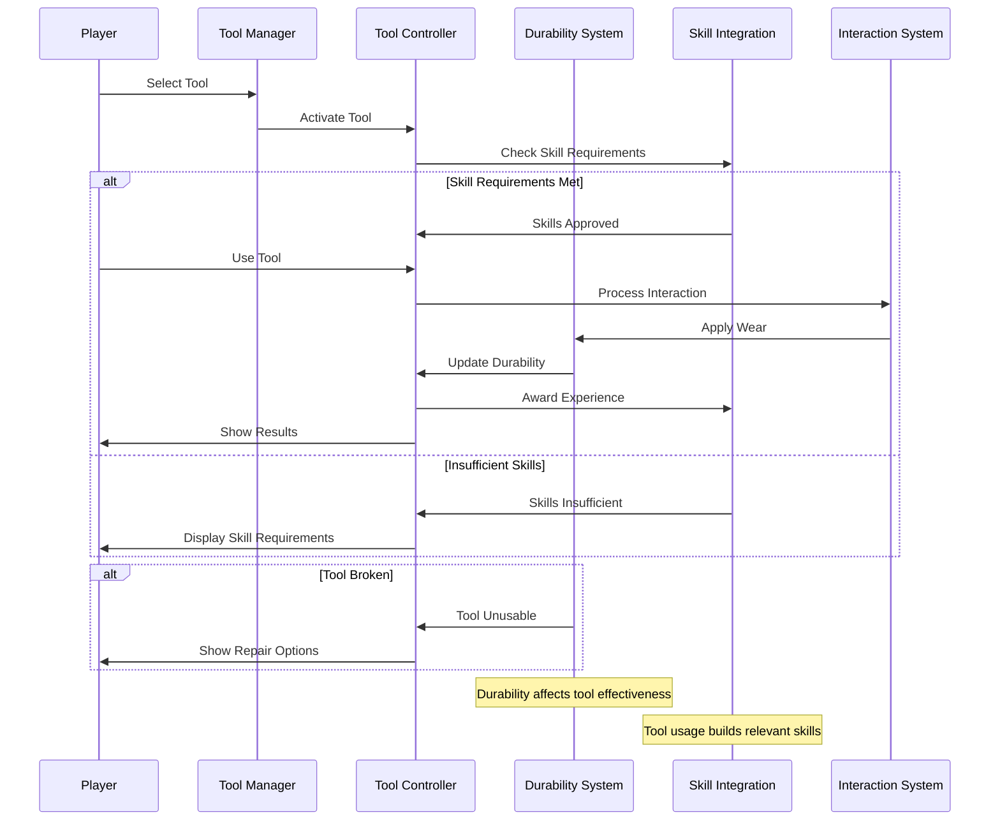
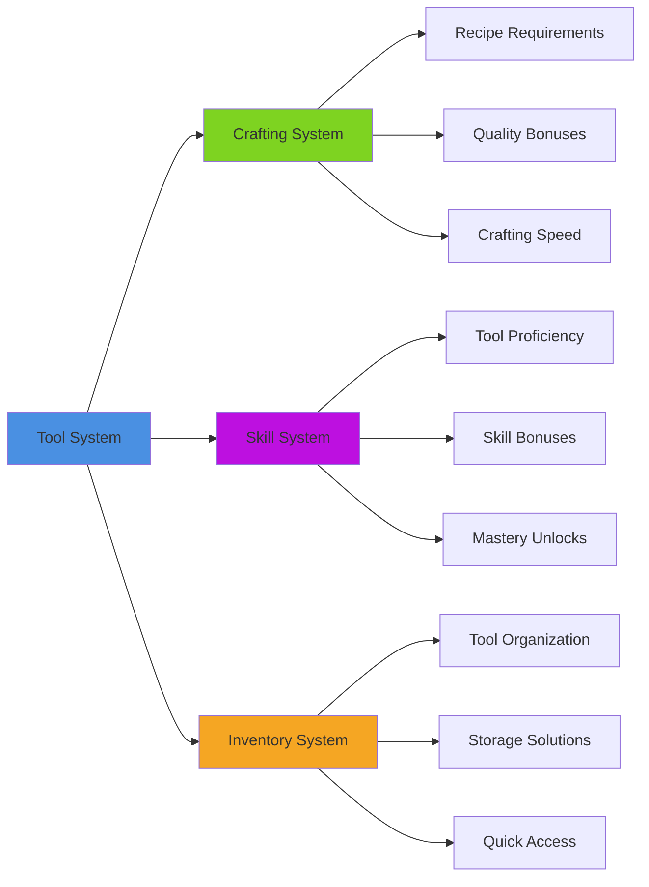

# Tool System

## Overview
A comprehensive tool management system providing equipment-based gameplay mechanics, tool durability, skill interactions, and crafting integration. Implements various tool types, upgrade systems, specialization mechanics, and tool-based puzzle solving while maintaining inventory organization and user-friendly tool switching.

## System Architecture

```mermaid
graph TB
    A[Tool Manager] --> B[Tool Controller]
    A --> C[Durability System]
    A --> D[Upgrade System]
    A --> E[Skill Integration]
    A --> F[Interaction System]
    
    B --> G[Tool Categories]
    B --> H[Active Tools]
    B --> I[Tool Switching]
    B --> J[Tool Storage]
    
    C --> K[Wear Calculation]
    C --> L[Repair Systems]
    C --> M[Breakage Handling]
    C --> N[Durability Display]
    
    D --> O[Enhancement Slots]
    D --> P[Material Upgrades]
    D --> Q[Skill Bonuses]
    D --> R[Enchantments]
    
    E --> S[Skill Requirements]
    E --> T[Proficiency Bonuses]
    E --> U[Experience Gain]
    E --> V[Mastery Effects]
    
    F --> W[Environmental Interaction]
    F --> X[Crafting Integration]
    F --> Y[Puzzle Mechanics]
    
    style A fill:#4a90e2
    style B fill:#7ed321
    style C fill:#f5a623
    style D fill:#bd10e0
    style E fill:#50e3c2
    style F fill:#d0021b
```

## Component Breakdown

### Tool Manager Component
- **Purpose**: Central orchestration of tool systems and equipment management
- **Key Features**: Tool registration, category management, system integration
- **Performance**: Efficient tool database with smart caching and quick lookup

### Tool Controller Component
- **Purpose**: Manages individual tool behaviors, interactions, and functionality
- **Key Features**: Tool-specific logic, interaction handling, effect application
- **Performance**: Optimized tool processing with context-aware activation

### Durability System Component
- **Purpose**: Handles tool wear, damage, repair, and replacement mechanics
- **Key Features**: Realistic wear simulation, repair options, replacement management
- **Performance**: Efficient durability tracking with minimal computational overhead

## Blueprint Patterns

### Tool Usage Flow

### Tool Switching Pattern
- **Quick Selection**: Rapid tool switching for efficient gameplay
- **Context Awareness**: Automatic tool suggestions based on interaction context
- **Hotkey Integration**: Customizable keyboard/controller shortcuts for tools

### Upgrade Progression Pattern
- **Material Integration**: Better materials create superior tools
- **Skill Scaling**: Player skills unlock advanced tool capabilities
- **Enhancement Systems**: Socketed upgrades and enchantments for customization

## Performance Optimization

### Tool Processing
- **Context Activation**: Only process tools relevant to current context
- **Update Batching**: Group similar tool updates for efficiency
- **Lazy Evaluation**: Calculate tool effects only when needed

### Durability Management
- **Incremental Updates**: Update durability in response to usage events
- **Wear Prediction**: Predict tool lifespan for player planning
- **Efficient Storage**: Compact durability representation in save data

### Interaction Optimization
- **Spatial Queries**: Efficient detection of tool-interactive objects
- **Context Caching**: Cache interaction contexts for repeated use
- **Result Pooling**: Reuse interaction result objects efficiently

## Integration Points

### Crafting System Integration

### System Integrations
- **Economy System**: Tool buying, selling, and trading mechanics
- **Quest System**: Tool-specific objectives and requirements
- **Puzzle System**: Tools required for environmental puzzle solving
- **Combat System**: Tools as weapons or combat aids

### Environmental Mechanics
- **Resource Gathering**: Tools for mining, logging, farming, fishing
- **Construction**: Building and crafting tools for player construction
- **Exploration**: Specialized tools for accessing hidden or dangerous areas
- **Maintenance**: Tools for repairing and maintaining equipment and structures

## Configuration System

### Tool Categories Data Asset
- **Gathering Tools**: Pickaxes, axes, sickles, fishing rods, nets
- **Crafting Tools**: Hammers, needles, looms, anvils, workbenches
- **Exploration Tools**: Ropes, grappling hooks, torches, compasses, maps
- **Combat Tools**: Weapons that double as tools, shields, armor
- **Specialized Tools**: Lockpicks, medical kits, magical implements

### Durability Rules Data Asset
- **Wear Rates**: How quickly different tools degrade with use
- **Material Properties**: How tool materials affect durability and performance
- **Repair Methods**: Available repair options and their effectiveness
- **Replacement Costs**: Economic factors in tool maintenance vs replacement

### Skill Requirements Data Asset
- **Basic Proficiency**: Minimum skills required to use tools effectively
- **Advanced Techniques**: Higher skill levels unlock additional capabilities
- **Mastery Benefits**: Expert-level bonuses for highly skilled tool users
- **Cross-Training**: How skills with one tool affect others

## Advanced Features

### Dynamic Tool System
- **Contextual Tools**: Tools that adapt behavior based on usage context
- **Combination Tools**: Multi-function tools with switchable modes
- **Improvised Tools**: Creating temporary tools from available materials
- **Living Tools**: Organic or magical tools that grow and evolve

### Master Crafting Integration
- **Custom Tools**: Player-created tools with unique properties
- **Legendary Tools**: Rare tools with special abilities and histories
- **Tool Personalization**: Customization options for appearance and functionality
- **Inheritance Systems**: Tools passed down through generations or guilds

### Social Tool Features
- **Tool Sharing**: Lending tools to other players temporarily
- **Collaborative Tools**: Large tools requiring multiple players to operate
- **Teaching Systems**: Experienced players demonstrate tool techniques
- **Tool Guilds**: Organizations focused on specific tool mastery

## Tool Categories

### Tool Type System

```mermaid
graph TD
    A[Tool Types] --> B[Hand Tools]
    A --> C[Power Tools]
    A --> D[Precision Tools]
    A --> E[Specialized Tools]
    A --> F[Magical Tools]
    
    B --> G[Hammers & Axes]
    B --> H[Knives & Blades]
    B --> I[Basic Implements]
    
    C --> J[Mechanical Devices]
    C --> K[Steam-Powered Tools]
    C --> L[Magical Automation]
    
    D --> M[Measuring Instruments]
    D --> N[Fine Manipulation]
    D --> O[Surgical Tools]
    
    E --> P[Professional Equipment]
    E --> Q[Trade-Specific Tools]
    E --> R[Unique Implements]
    
    F --> S[Enchanted Tools]
    F --> T[Ritual Implements]
    F --> U[Arcane Devices]
    
    style A fill:#4a90e2
    style B fill:#7ed321
    style C fill:#bd10e0
    style D fill:#f5a623
    style E fill:#50e3c2
    style F fill:#d0021b
```

### Usage Mechanics
- **Direct Use**: Tools used directly on target objects or materials
- **Preparation Use**: Tools used to prepare for other activities
- **Maintenance Use**: Tools for repairing and maintaining other equipment
- **Creative Use**: Tools for artistic and creative expression

### Quality Systems
- **Material Quality**: Better materials create more effective tools
- **Craftsmanship**: Skill of creator affects tool quality and durability
- **Age and Wear**: Tools develop character and sometimes improved performance
- **Enhancement**: Upgrades and modifications that improve tool capabilities

## Implementation Notes

### Blueprint Architecture
- **Modular Tool Components**: Flexible framework supporting diverse tool types
- **Event-Driven Design**: Reactive tool system with efficient state management
- **Data-Driven Configuration**: External tool definitions for easy content creation

### Interaction Design
- **Intuitive Controls**: Tool usage follows expected real-world metaphors
- **Visual Feedback**: Clear indication of tool effectiveness and state
- **Progressive Complexity**: Simple tools teach concepts for advanced tools
- **Context Sensitivity**: Tools behave appropriately in different situations

### Performance Patterns
- **Smart Activation**: Only active tools consume processing resources
- **Efficient Queries**: Fast lookup of tool capabilities and interactions
- **Memory Management**: Optimal storage of tool states and properties

### User Experience
- **Tool Discovery**: Exciting moments when acquiring new tools
- **Mastery Progression**: Satisfying advancement in tool proficiency
- **Problem Solving**: Tools enable creative solutions to challenges
- **Customization**: Player expression through tool choice and modification

This tool system provides a comprehensive framework for equipment-based gameplay that enhances player agency through creative tool use while supporting skill progression and problem-solving across all platforms and play styles.
