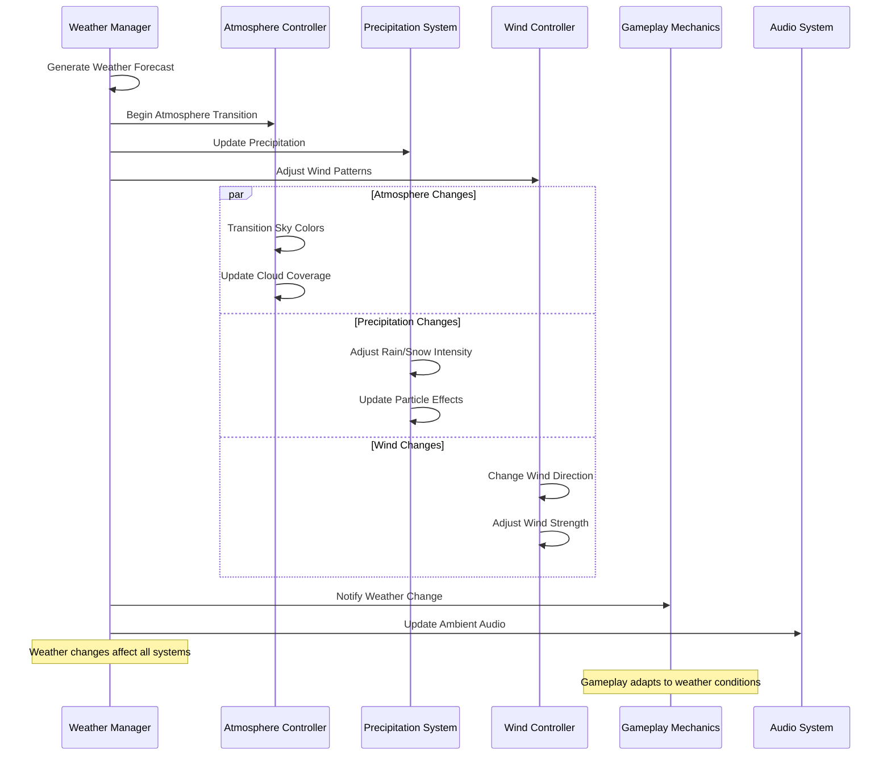
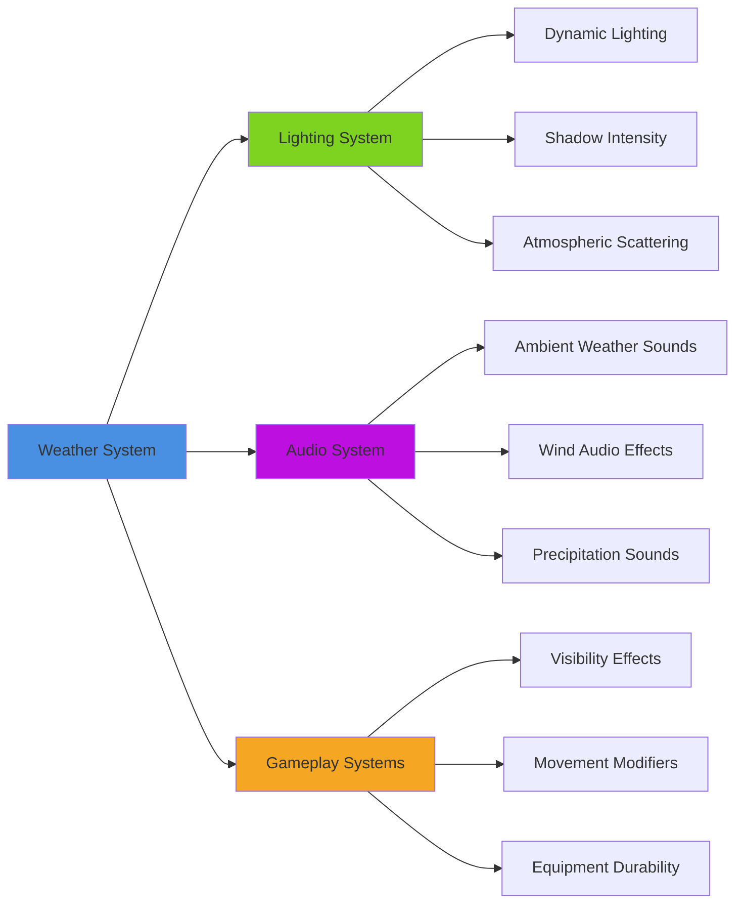
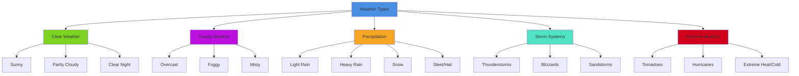

# Weather System

## Overview
A dynamic weather system providing realistic atmospheric conditions, seasonal changes, and weather-based gameplay mechanics. Implements precipitation, wind, temperature, atmospheric pressure, and storm systems while affecting visibility, NPC behavior, and environmental interactions with seamless transitions and performance optimization.

## System Architecture

```mermaid
graph TB
    A[Weather Manager] --> B[Atmosphere Controller]
    A --> C[Precipitation System]
    A --> D[Wind Controller]
    A --> E[Temperature System]
    A --> F[Seasonal Manager]
    
    B --> G[Sky Atmosphere]
    B --> H[Cloud System]
    B --> I[Fog Controller]
    B --> J[Visibility Manager]
    
    C --> K[Rain System]
    C --> L[Snow System]
    C --> M[Hail System]
    C --> N[Storm Effects]
    
    D --> O[Wind Direction]
    D --> P[Wind Strength]
    D --> Q[Gust System]
    D --> R[Wind Effects]
    
    E --> S[Temperature Zones]
    E --> T[Heat/Cold Effects]
    E --> U[Thermal Dynamics]
    
    F --> V[Season Transitions]
    F --> W[Daylight Changes]
    F --> X[Seasonal Weather]
    
    style A fill:#4a90e2
    style B fill:#7ed321
    style C fill:#f5a623
    style D fill:#bd10e0
    style E fill:#50e3c2
    style F fill:#d0021b
```

## Component Breakdown

### Weather Manager Component
- **Purpose**: Central orchestration of all weather systems and transitions
- **Key Features**: Weather pattern generation, system coordination, event dispatching
- **Performance**: Efficient state management with predictive weather calculation

### Atmosphere Controller Component
- **Purpose**: Manages sky, clouds, and atmospheric visual effects
- **Key Features**: Dynamic sky colors, cloud movement, atmospheric scattering
- **Performance**: LOD-based atmospheric effects with distance culling

### Precipitation System Component
- **Purpose**: Handles rain, snow, and other precipitation effects
- **Key Features**: Particle-based precipitation, surface interaction, accumulation
- **Performance**: Adaptive particle density with performance scaling

## Blueprint Patterns

### Weather Transition Flow

### Weather Prediction Pattern
- **Forecast Generation**: Procedural weather pattern generation with realistic progression
- **Seasonal Influence**: Weather patterns influenced by seasonal cycles
- **Regional Variation**: Different weather patterns for different world regions

### Environmental Impact Pattern
- **Surface Interaction**: Weather affects ground surfaces, puddles, snow accumulation
- **Visibility Changes**: Fog, rain, and snow reduce visibility dynamically
- **Temperature Effects**: Hot and cold weather affect player and NPC behavior

## Performance Optimization

### Particle System Optimization
- **Adaptive Density**: Adjust precipitation particle count based on performance
- **Culling System**: Only render weather effects in visible areas
- **LOD Scaling**: Reduce weather effect complexity with distance

### Audio Optimization
- **3D Weather Audio**: Spatial audio for rain, wind, and storm effects
- **Priority System**: Important weather audio gets processing priority
- **Dynamic Range**: Adjust weather audio based on current conditions

### Visual Effect Optimization
- **Weather Occlusion**: Indoor areas automatically reduce weather effects
- **Performance Scaling**: Automatic quality adjustment based on hardware capability
- **Temporal Scaling**: Adjust update frequency based on weather intensity

## Integration Points

### Environmental System Integration

### System Integrations
- **Day/Night Cycle**: Weather patterns influenced by time of day
- **NPC Behavior**: AI characters react to weather conditions
- **Plant Growth**: Weather affects vegetation and crop systems
- **Combat System**: Weather impacts combat effectiveness and strategy

### Gameplay Mechanics
- **Stealth Integration**: Rain and storms provide acoustic cover
- **Survival Elements**: Weather affects player health and stamina
- **Agriculture**: Crop growth dependent on seasonal weather patterns
- **Transportation**: Weather affects vehicle performance and visibility

## Configuration System

### Weather Types Data Asset
- **Clear Weather**: Sunny skies with minimal cloud cover
- **Overcast**: Heavy cloud cover with reduced lighting
- **Precipitation**: Rain, snow, sleet, and hail systems
- **Storm Systems**: Thunderstorms, blizzards, sandstorms
- **Extreme Weather**: Tornadoes, hurricanes, extreme temperature events

### Seasonal Parameters Data Asset
- **Spring Settings**: Mild temperatures, frequent rain, growing season
- **Summer Settings**: High temperatures, occasional storms, dry periods
- **Autumn Settings**: Cooling temperatures, changing foliage, harvest weather
- **Winter Settings**: Cold temperatures, snow, reduced daylight hours

### Regional Climate Data Asset
- **Temperate Zones**: Moderate weather with four distinct seasons
- **Tropical Zones**: Warm, humid weather with wet/dry seasons
- **Arid Zones**: Hot, dry conditions with minimal precipitation
- **Arctic Zones**: Cold temperatures with ice and snow year-round

## Advanced Features

### Dynamic Weather Systems
- **Pressure Systems**: High and low pressure areas affecting weather patterns
- **Weather Fronts**: Moving weather systems with realistic transitions
- **Microclimate**: Localized weather variations within larger regions
- **Altitude Effects**: Weather changes with elevation and topography

### Extreme Weather Events
- **Storm Tracking**: Major storms move across the world realistically
- **Warning Systems**: Advanced notice of dangerous weather conditions
- **Disaster Response**: Environmental damage and recovery from severe weather
- **Climate Events**: Long-term climate patterns like droughts or ice ages

### Interactive Weather
- **Player Influence**: Magic or technology that can affect weather patterns
- **Ritual Weather**: Weather summoning through spells or ceremonies
- **Weather Tools**: Items and equipment that interact with weather
- **Shelter Systems**: Building and environmental protection from weather

## Weather Categories

### Weather Type System

### Seasonal Patterns
- **Spring Weather**: Mild temperatures, rain showers, wind, growing season
- **Summer Weather**: High temperatures, thunderstorms, dry spells, long days
- **Autumn Weather**: Cooling temperatures, fog, harvest conditions, shorter days
- **Winter Weather**: Cold temperatures, snow, ice, storms, short days

### Environmental Effects
- **Visibility Impact**: Fog, rain, and snow reduce sight distances
- **Movement Effects**: Mud, ice, and snow affect character movement
- **Audio Masking**: Weather sounds mask other audio cues
- **Equipment Impact**: Weather affects durability and effectiveness

## Implementation Notes

### Blueprint Architecture
- **Component-Based Weather**: Modular weather systems for maximum flexibility
- **Event-Driven Updates**: Efficient weather change notifications
- **Data-Driven Configuration**: External weather pattern and seasonal data

### Performance Considerations
- **Scalable Effects**: Weather effects scale with hardware capability
- **Intelligent Culling**: Weather effects only active in relevant areas
- **Memory Management**: Efficient particle system and audio management

### User Experience
- **Gradual Transitions**: Smooth weather changes that feel natural
- **Predictable Patterns**: Weather follows logical patterns players can learn
- **Visual Feedback**: Clear indication of weather conditions and changes
- **Accessibility Options**: Weather effects that don't interfere with accessibility needs

This weather system provides a comprehensive atmospheric foundation that enhances immersion through realistic weather patterns while supporting diverse gameplay mechanics and maintaining optimal performance across all platforms.
